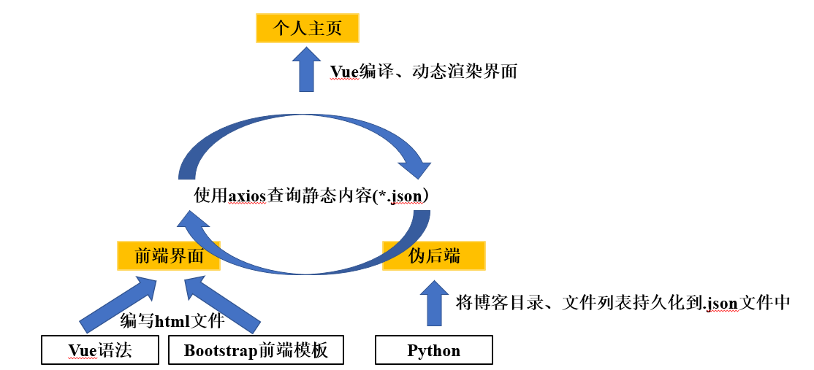

# 环境

`Windows11`

# 用到的技术

`Bootstrap5`, `Vue3`

[Bootstrap v5 中文文档 · Bootstrap 是全球最受欢迎的 HTML、CSS 和 JS 前端工具库。 | Bootstrap 中文网 (bootcss.com)](https://v5.bootcss.com/)

[快速上手 | Vue.js (vuejs.org)](https://cn.vuejs.org/guide/quick-start.html)

# 项目结构

    ├──index.html
    ├──index.css
    ├──update_blog.bat  // 日常更新博客的脚本
    ├──assets  // 项目中用到的js库、css样式表、静态资源等（ALL from 第三方）& README.md用到的图片
    ├──blogs
    	└──blog_category  // 某个知识范围的博客目录
    		└──*.md   // md格式的blog
    		├──list.json  // 目录下的md文件信息，由../genlist.py生成
    	├──index.html  // 用于展示博客内容
    	├──genlist.py   // 根据../custom/menu.json中指定的目录，收集目录下的md文件信息，并生成静态文件
    ├──custom  // 自定义的资源
    	└──config.js  // html中用到的常量
    	├──menu.json  // 博客目录配置文件

