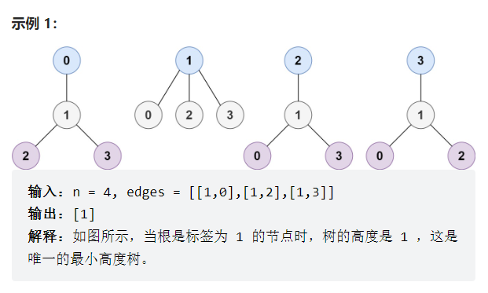

# 备注

没有做出这道题目，参考题解进行学习

# 题目

树是一个无向图，其中任何两个顶点只通过一条路径连接。 换句话说，一个任何没有简单环路的连通图都是一棵树。

给你一棵包含 n 个节点的树，标记为 0 到 n - 1 。给定数字 n 和一个有 n - 1 条无向边的 edges 列表（每一个边都是一对标签），其中 edges[i] = [ai, bi] 表示树中节点 ai 和 bi 之间存在一条无向边。

可选择树中任何一个节点作为根。当选择节点 x 作为根节点时，设结果树的高度为 h 。在所有可能的树中，具有最小高度的树（即，min(h)）被称为 最小高度树 。

请你找到所有的 最小高度树 并按 任意顺序 返回它们的根节点标签列表。

树的 高度 是指根节点和叶子节点之间最长向下路径上边的数量。

来源：力扣（LeetCode）
链接：https://leetcode.cn/problems/minimum-height-trees
著作权归领扣网络所有。商业转载请联系官方授权，非商业转载请注明出处。

# 解题思路（深度搜索和广度搜索）

## 一些必备知识

题目中给定的含有 n 个节点的树，可以推出含有以下特征：

- 任意两个节点之间有且仅有一条路径；
- 树中的共有 n-1 条不同的边；
- 叶子节点的度为 1，非叶子节点的度至少为 2；
- 树的高度由根节点到叶子节点的最大距离决定。

设 $dist[x][y]$表示从节点 $x$到节点 $y$的距离，假设树中距离最长的两个节点为$(x,y)$，它们之间的距离为$maxdist=dist[x][y]$，则可以推出以任意节点构成的树最小高度一定为$minheight=\frac{maxdist}{2}$，且最小高度的树根节点一定在 节点 $x$ 到节点$y$的路径上。

## 解题

了解了这些之后，我们的目标就是找到x，y。

> 因此我们只需要求出路径最长的两个叶子节点即可，并求出其路径的最中间的节点即为最小高度树的根节点。可以利用以下算法找到图中距离最远的两个节点与它们之间的路径：
>
> 以任意节点 p 出现，利用广度优先搜索或者深度优先搜索找到以 p 为起点的最长路径的终点 x；
>
> 以节点 x 出发，找到以 x 为起点的最长路径的终点 y；
>
> x 到 y 之间的路径即为图中的最长路径，找到路径的中间节点即为根节点。

首先找到距离节点 0 的最远节点 x，然后找到距离节点 x 的最远节点 y，然后找到节点 x与节点 y 的路径，然后找到根节点。

为什么可以以 0 （任意节点）作为开始？

我们已经证明了x y是最长路径的话，所满足的结论，由于输入的图是无向连通的，在任意一个节点，我们都必定能去往一个离它最远的叶子节点，这个节点一定是 x, y 中的一个（x y不唯一，最长路径可能有多条）。相当于以任意一个节点做为根节点的深度，最底层的节点一定是最长路径的端点。