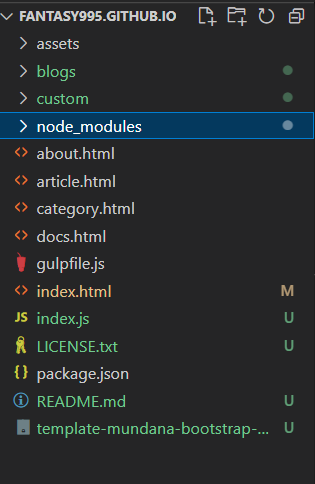

网上提到使用vue-resource进行http访问本地json文件，但发现会出现以下错误：

```
Uncaught TypeError: window.Vue.use is not a function
```

继续研究发现vue-resource只支持vue1 和vue2，

> 原因
> Vue3将原本提供数据对象侦测的API由Object.defineProperties更换为了Proxy
> 而vue-resource中，就使用到了Object.defineProperties，运行后自然会报错
>
> 理由
> proxy是真正的在对象层面做了proxy不会去改变对象的结构，Object.defineProperty需要转化数据对象属性为getter、setter 这是比较昂贵的操作
> ————————————————
> 版权声明：本文为CSDN博主「Kirito丨」的原创文章，遵循CC 4.0 BY-SA版权协议，转载请附上原文出处链接及本声明。
> 原文链接：https://blog.csdn.net/qq_35022980/article/details/115983399

解决方案：

使用axios进行http请求。


<script src="./node_modules/axios/dist/axios.js" type="text/javascript"></script>

```
axios.get("./custom/menu.json").then((res) => {
		console.log(res.data);
	});
```

网上说资源路径需要在public或static等情况，应该一个前后端项目，只能写那些能访问的静态资源项目，但在本人的工作中，只有前端，没有后端，所有资源都可访问。

