[TOC]

# 块级作用域

`var`  声明的变量是全局作用域；

## 问题

### 变量提升

- var 命令会发生变量提升，即先使用后定义：

{
    console.log(p1);
}
var p1 = 2;


输出： `undefined`

- let，const：

{
    console.log(p1);
}
let p1 = 2;


输出：`Cannot access 'p1' before initialization`

## ES5

只有函数作用域和全局作用域，导致内层变量覆盖外层变量：

var name = 'wjl';
var demo = () => {
    console.log(name); // undefined
    var name = 'test'; 
    console.log(name); // test
}
demo();


由于变量提升，函数内部name覆盖了外层name, 而name后定义.

## ES6

```javascript
 {
   // 块级作用域
	var p1 = 1;
	let p2 = 2;
	const p3 = 3;
}
console.log(p1);
// console.log(p2);
console.log(p3);
```

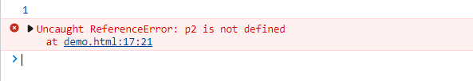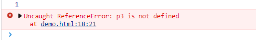

p2, p3在全局作用域不能访问。

# 解构赋值

- 数组形式声明变量

```javascript
  let [a, [b, [c]]] = [1, [2, [3]], 4];
  console.log(a); //1
  console.log(b); //2
  console.log(c); //3
  let [a, [, [c]]] = [1, [2, [3]], 4];
  console.log(a); //1
  console.log(c); //3

  let [a, [, b, [c]]] = [1, [2, [3]], 4];
  console.log(a); //Uncaught TypeError: undefined is not iterable (cannot read property Symbol(Symbol.iterator))
  console.log(c); 

  // 默认值
  let [a=3] = [1];
	console.log(a);  //1

  let [a] = [];
	console.log(a);  //undefined
```

- 对象形式声明变量

```javascript
let {foo, bar} = {foo: '123', bar: '456'};
console.log(foo);  //123
console.log(bar);  //456
  
let {foo, bar} = {a: '123', n: '456'};
console.log(foo);  //undefined
console.log(bar);  //undefined
 
// 从对象中取值
let user = {name: 'wjl', age: 23};
let {name: a} = user;
console.log(a);  // wjl
```

1-1对应，

- 函数结构赋值

  - 方便交换变量

    ```html
    let x=1; let y=2;
    [x, y] = [y, x];
    ```
    
  - 提取json数据

    ```html
    let json_data = {
        name: 'wjl',
        age: 20,
        data: [123, 456]
    };
      // 属性名和变量名一致可以省去 key_name: p_name 
    let {name, age, data: num} = json_data;
    console.log(name, age, num);  // wjl 20 [123, 456]
    ```

# for循环

  `in`拿下标，`of`拿元素

```html
let p = ['12', '32'];
for(i in p){
    console.log(i); // 0, 1
}

for(i of p){
    console.log(i); // 12, 32
}
```

# 字符串

## 模板字符串

```html
let name = 'wjl';
let str = `i'm ${wjl}`;
```

## 新增方法

`trim`：去除首位空白, `trimStart`, `trimEnd`, `startsWith`, `endsWith`, `padEnd`, `padStart`, `padEnd`

# 数组扩展

## 展开运算符

`...`

```javascript
let arr1 = [1, 2, 3, 4];
let arr2 = [5, 6, 7, 8];
console.log(...arr1);  // 1 2 3 4

console.log([...arr1, ...arr2]);  // [1, 2, 3, 4, 5, 6, 7, 8]

function plus (...params) {
    console.log(params);
}
plus(1, 2, 3, 4, 5, 6);  //[1, 2, 3, 4, 5, 6]
```

##　将类似数组对象和可迭代对象转换成数组

数组的key是下标

```javascript
// 可迭代对象
var arr1 = [4,3, 2, 1];
let a = arr1.keys();  // iterator
let b = arr1.values();  // iterator
let c = arr1.entries();  // iterator
console.log(c);
let arr2 = Array.from(c);
console.log(arr2);
```

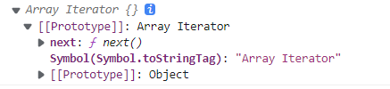

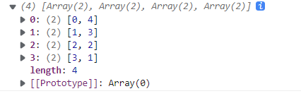

```javascript
function plus(){
  console.log(arguments);
  let d = Array.from(arguments);
  console.log(d);
}
plus(1, 2, 3);
```

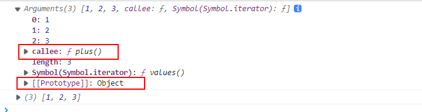

## 创建数组

```javascript
let arr1 = new Array();
console.log(arr1);
let arr2 = new Array(5);  //单个内容有歧异
console.log(arr2); // [empty * 5]
let arr21 = Array.of(5); 
console.log(arr21); // [5]
let arr3 = new Array(1,2,3);
console.log(arr3);
```

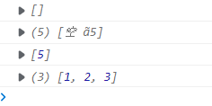

- 深拷贝

  ```javascript
  let name = 'wjl';
  let a = {
      name: 'wjl',
  };
  let arr = Array.of(name, a);
  console.log(arr);
  let arr_b = JSON.parse(JSON.stringify(arr));
  console.log(arr_b);
  ```

  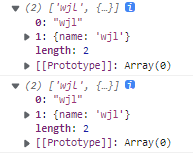

```javascript
let name = 'wjl';
let a = {
    name: 'wjl',
};
let arr = Array.of(name, a);
console.log(arr);
let arr_b = JSON.parse(JSON.stringify(arr));
console.log(arr_b);
arr[0] = 1;
console.log(arr_b);
```

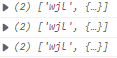

```javascript
let name = 'wjl';
let a = {
    name: 'wjl',
};
let arr = Array.of(name, a);
console.log(arr);

let arr1 = arr;
arr1[0] = 1;
console.log(arr);
```


## copyWithin()

原地替换

```javascript
let arr = [1, 2];
arr.copyWithin(0,1);
console.log(arr);  // [2, 2]
```

## find(), findIndex()

查找第一个满足条件的元素

```javascript
let arr = [1, 2, 3];
console.log(arr.find((n) => {
    return n > 2;
}));  // 3
console.log(arr.findIndex((n) => {
    return n > 2;
}));  // 2
```

# 对象扩展

## 相等判断

- ES5只有`==`和`===`，前者会自动转换数据类型，后者是严格相等。
- ES6添加Object.is()；非原型方法，与`===`行为级别一致，对于两个对象，一定不相等，因为地址不相等。

```javascript
console.log(0===-0);  //t
console.log(NaN===NaN); //f
console.log(Object.is(0, -0)); //f
console.log(Object.is(NaN, NaN)); //t
console.log(typeof(NaN));  //number object
```

# Set 对象

```javascript
var set = new Set();
//添加属性
set[0] = '123';
//添加值
set.add('456');
set.add('789');
console.log(set);
```

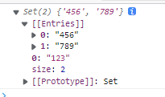

```javascript
Array.from(set)
```


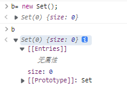

# 类继承

es5和es6继承的区别是：es5是先**创建子类**，**实例化父类**并添加到子类this中实现继承；而es6是先创建父类，实例化子类中通过调用super方法访问父类后，通过修改this实现继承。

ES5的继承实质上是先创建子类的实例对象，然后再将父类的方法添加到this上（`Parent.apply(this)`）.

ES6的继承机制完全不同，实质上是先创建父类的实例对象this（所以必须先调用父类的super()方法），然后再用子类的构造函数修改this。

ES5的继承时**通过原型或构造函数机制来实现**。

ES6通过class关键字定义类，里面有构造方法，类之间通过extends关键字实现继承。子类必须在constructor方法中调用super方法，否则新建实例报错。因为子类没有自己的this对象，而是继承了父类的this对象，然后对其进行加工。如果不调用super方法，子类得不到this对象。

## ES5

- 只继承属性

```javascript
function Father(name,age){// Father构造函数是父类
    this.name = name;
    this.age = age;
    this.say = function(){
        console.log('好好学习');
    }
}
//构造函数继承的方式，子类继承不到父类原型上的属性和方法
Father.prototype.getName=function(){console.log('原型上的方法')}

function Son(name,age,sourse){// Son构造函数是子类
    // 执行父类构造方法并绑定子类的this, 使得父类中的属性能够赋到子类的this上
    Father.call(this,name,age);// 子类继承父类的属性
    this.sourse = sourse;// 子类可以拥有自己的特有属性
}
var f1 = new Father('张三',45);
var s1 = new Son('李四',18,60);
console.log(f1);
console.log(s1);
f1.getName();
s1.say();
// s1.getName();//报错，原因是继承不到父类的原型上的属性。
```

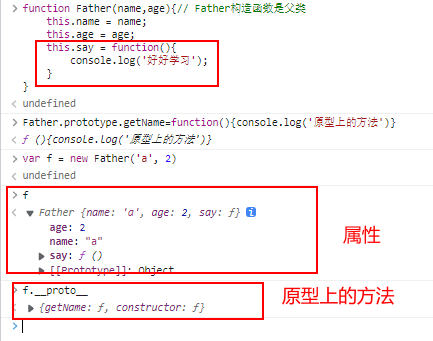

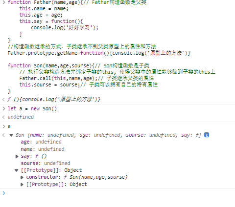

**原型是Son**

- 继承原型

```javascript
function Father(name,age){// Father构造函数是父类
    this.name = name;
    this.age = age;
    this.say = function(){
        console.log('好好学习');
    }
}
Father.prototype.getName=function(){console.log('原型上的方法')}
function Son(name,age,sourse){// Son构造函数是子类
    // 执行父类构造方法并绑定子类的this, 使得父类中的属性能够赋到子类的this上
    Father.call(this,name,age);// 子类继承父类的属性
    Father.call(this, [name,age]);// 子类可以拥有自己的特有属性
  Son.prototype.__proto__ = Father.prototype;
}
```

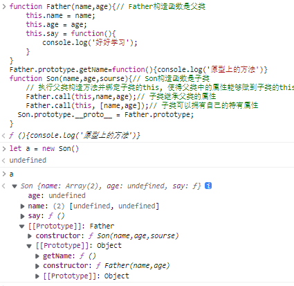

原型是Father

## ES6

```javascript
class Person{
    constructor(name, age){
        this.name = name;
        this.age = age;
    }
    run(){
        console.log("i'm running");
    }
}
class Player extends Person{
    constructor(name, age, job){
        super(name, age);
        this.job = job;
    }
    do(){
        console.log(`i can play ${this.job}`);
    }
}

```

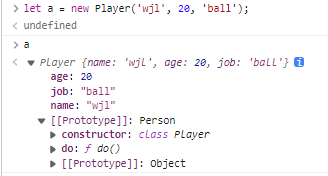

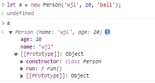

- 父类添加原型函数

```javascript
class Person{
    constructor(name, age){
        this.name = name;
        this.age = age;
    }
    run(){
        console.log("i'm running");
    }
}
Person.prototype.say('我是父类的原型函数');
class Player extends Person{
    constructor(name, age, job){
        super(name, age);
        this.job = job;
    }
    do(){
        console.log(`i can play ${this.job}`);
    }
}
```

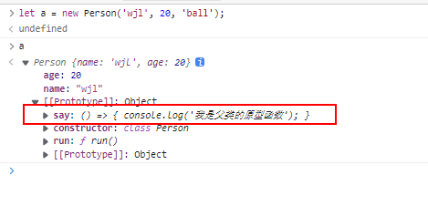

# 模块化编程

模块化编程就是,程序中都是模块先分类组织方法,再按需引入并使用模块中的方法.

模块编程是为了

-便于按业务划分逻辑和维护程序结构

-便于团队分工协作

## 原始的模块化编程

使用js文件实现

```javascript
//users.js文件
var uname="..."
function signin(){....}
```

但不同js导入后,由于名称冲突等,导致变量的值发生改变.

## 使用面向对象实现

```javascript
//users.js
var users={
    属性:值
    }
```

优点:一定程度上减少了全局污染

问题:将整个对象,暴露在其他程序中,易被篡改

## 使用匿名函数自调用实现, 闭包

```javascript
var users=(function(){
    let _count=1//保存当前在线人数
    function signin(){
        console.log("登录...")
    }
    function signup(){
        console.log('注册...')
    }
    function getById(){
        console.log("按id查找用户")
    }
    function getCount(){
        console.log("在线人数:"+_count)
    }
   return {
    signin,signup,getCount,getById
   }
})();
```

通过返回闭包内函数,实现访问内部变量.

进步:外部程序中,只能获得返回的对象中的函数,而未包含在返回对象中的变量或函数,则被封装在形成的闭包中,不会被篡改.

问题: 对外部全局变量依赖大,比如window和jquery

不能用它来组织和拆分代码,因此产生了模块化规范.

## 已有规范

模块定义后也得暴露;

`commonJS`  `AMD` `CMD` `ES6`

### COMMONJS
**服务器端模块规范**

(便于划分noodejs中各种服务器端功能,比如文件读写,网络通信,HTTP支持等) 需要node.js环境

**服务端目录结构:**

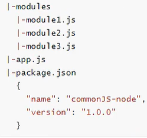

**规定:**

-一个单独的js文件就是一个模块,js文件中,module对象,代表当前模块本身

-加载模块使用require方法.require方法读取一个js文件并执行,最后返回文件内部的module对象的exports对象的属性的内容

-require方法使用单例模式创建该模块

#### 暴露模块

```javascript
// 方法1
var arr = [];
module.exports = {
  setArr: function(param){
    arr = param;
  }
} // 暴露对象
module.exports = function(){
  console.log();
} // 暴露函数

// 方法2  在一个文件暴露多个模块
module.exports.xxx = value
```

#### 引入模块

```javascript
var md1 = require(xx)  //本地模块 必须写路径, 同级加./
```

#### node.js -> 浏览器环境

使用`browserify`工具.

### AMD (异步模块加载)

**浏览器端规范**

**优点**

既能异步加载多个js文件,减少网页加载的等待

又能设置某两个js文件前后顺序加载,管理模块间的依赖性

**步骤**

第一步:定义子模块

```javascript
define("模块名", ['其它模块名',...], function (参数,...){
  //成员: 变量/方法
  return {
     要抛出的成员
  }
}); //其中，参数指代前面数组中引入的模块
```

第二步:在主js文件中引入子模块

```javascript
require(["子模块",...], function(参数, ...){
  //参数指代子模块对象
  //这里可以调用子模块中的成员了
})
```

第三步:在HTML中,先引入require.js,并引入主js文件

1.普通引入

```html
<script src="require.js" data-main="3_js/main"></script>
```

2.优化require.js本身的异步加载速度

```html
<script src="require.js" defer async="true" data-main="3_js/main"></script>
```

原理:define()和require()中写的依赖子模块js,也是使用<script>加载,只不过,不是所有script都在开始时创建好的,而是根据依赖关系,按需动态创建script

### CMD(按需加载模块对象)

1.定义子模块

```javascript
define(function(require, exports, module) {
  require()//用法同CommenJS中的require()
  exports别名//用法同CommenJS中的exports别名用法
  module对象//用法同CommenJS中的module对象用法
});
```

2.定义子模块,在主模块中,按需加载子模块使用

```javascript
//定义主模块
define(function(require, exports, module){
  if(Math.random()<0.5){
    var {signin,signout,signup}=require("users");
    ... ...
  }else alert(“没用到users模块...”); 
  … …
});
seajs.config({
  base:"./4_js/modules"
});
seajs.use(["./4_js/main"],function(main){})
```

3.在自定义脚本中引入主模块

```html
<script src="sea.js"></script>
<script src="4_js/main.js"></script>
```

4.require.async()

require.async()代替require()实现按需加载

```javascript
require.async("子模块",function(模块对象){
   ... 后续要执行的代码 ...
})
```

require() vs require.async()

-加载方式不同:

require()提前加载完,但暂不执行,等待按需执行

require.async()异步加载,后续代码放在回调函数中按需执行

-加载阶段不同

require()在代码分析阶段就加载多有模块js,没起到优化带宽的作用

require.async()在执行阶段,真正按需加载,按需执行

## ES6模块化


# 闭包

闭包就是能够读取其他函数内部变量的函数。例如在javascript中，只有函数内部的子函数才能读取[局部变量](https://baike.baidu.com/item/局部变量/9844788)，所以闭包可以理解成“定义在一个[函数](https://baike.baidu.com/item/函数/301912)内部的函数“。在本质上，闭包是将函数内部和函数外部连接起来的桥梁。

闭包内的变量内被闭包内的函数访问,通过返回闭包内的函数对象,实现对闭包内部的修改.

## 概念

闭包: 是一个函数
