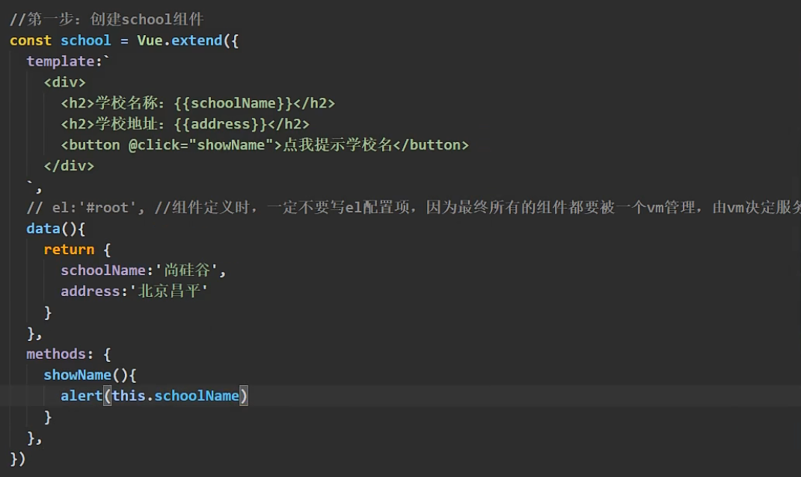
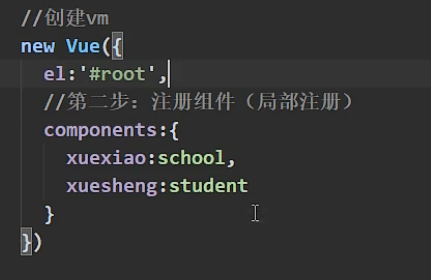
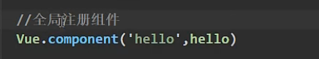
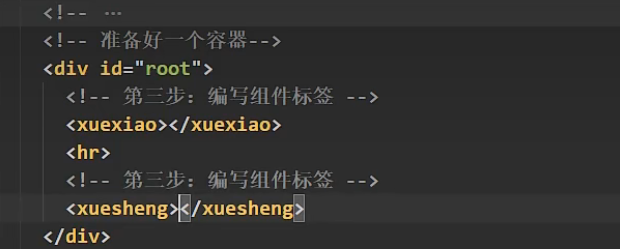
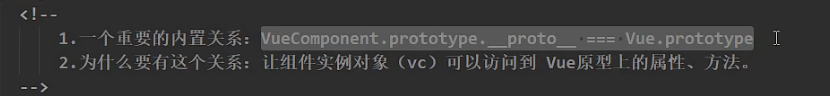
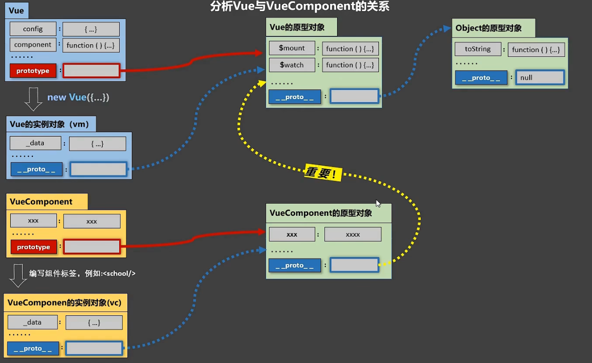
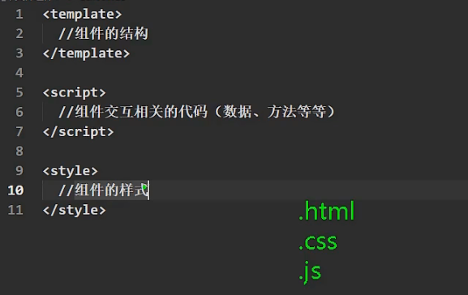
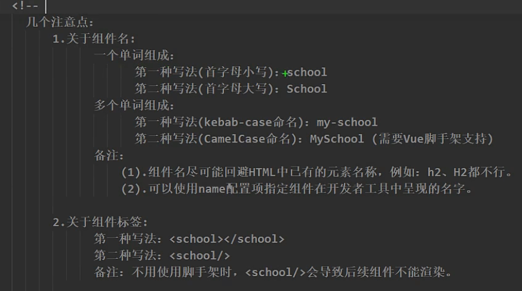
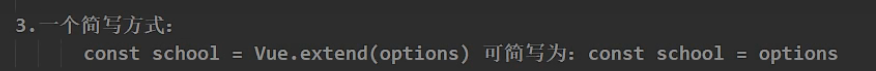

# 非单文件组件(.html)

[(71条消息) Vue-非单文件组件_@栗栗子的博客-CSDN博客](https://blog.csdn.net/qq_62022086/article/details/124360604)

## 概念

一个文件中包含有多个组件(a.html)

## 步骤

1. 创建组件



2. 注册组件





3. 使用组件



自闭合`<xuesheng/>`

    <!-- 
        关于VueComponent：
            1.school组件本质是一个名为VueComponent的构造函数，且不是程序员定义的，是Vue.extend生成的。
    
            2.我们只需要写<school/>或<school></school>，Vue解析时会帮我们创建school组件的实例对象，
              即Vue帮我们执行的：new VueComponent(options)。
            
            3.特别注意：每次调用Vue.extend，返回的都是一个全新的VueCompoment!!!!
    
            4.关于this指向：
                (1).组件配置中：
                    data函数、methods中的函数、watch中的函数、computed中的函数 它们的this均是【VueComponent实例对象】。
                (2). new Vue(options)配置中：
                    data函数、methods中的函数、watch中的函数、computed中的函数 它们的this均是【Vue实例对象】。
                
            5.VueComponent的实例对象，以后简称vc（也可称之为：组件实例对象）。
              Vue的实例对象，以后简称vm
     -->

## VueComponent与Vue的内置关系



`VueComponent`是Vue2.extend生成的构造函数



**保证Vue原型更新时，VueComponent也能更新。**


# 单文件组件(.vue) -- 生产

# 概念

一个文件中只包含一个组件(a.vue)

## 编写.Vue组件文件



```vue
<template>
  <!-- 组件的结构 -->
  <div>
    <h2>学校名称:{{ name }}</h2>
    <h2>学校地址:{{ address }}</h2>
    <button $click="showName">点我提示名称</button>
  </div>
</template>

<script>
// es6默认暴露  常用(只需要暴露一个)
// import *** from ***
// 组件的交互
export default {
  name: "School",
  data() {
    return {
      name: "hnu",
      address: "css",
    };
  },
  methods: {
    showName() {
      alert(this.name);
    },
  },
};

// 统一暴露
// import {} from ***
// const School = {
//   data() {
//     return {
//       name: "hnu",
//       address: "css",
//     };
//   },
//   methods: {
//     showName() {
//       alert(this.name);
//     },
//   },
// };
// export { School };
</script>

<style>
/* 组件的样式 */
h2 {
  background: rgb(189, 25, 210);
  text-align: center;
  border: 5px;
}
</style>
```


# Vue推荐组件命名

Vue会将组件名转换成首字母大写（脚手架环境）；

单单词组成的组件名如`school`，Vue推荐全小写或首字母大写；

多单词组成的组件名如`my school`，Vue推荐：1、全小写，单词间用`-`连接：`my-school`, Vue会转换成`MySchool`；2、首字母大写，驼峰命令：`MySchool`，与Vue转换格式呼应（非脚手架环境Vue不能处理）。




