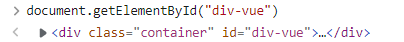
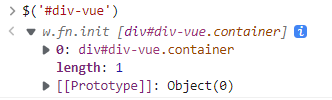
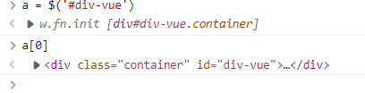
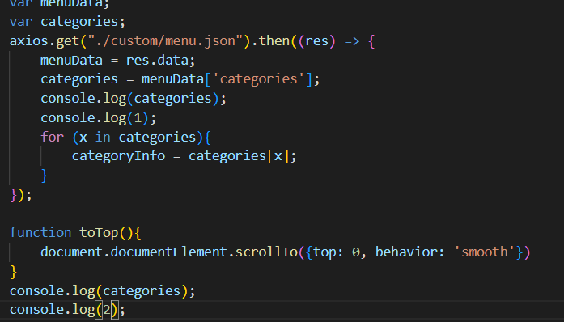
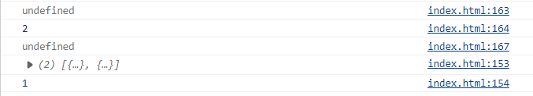
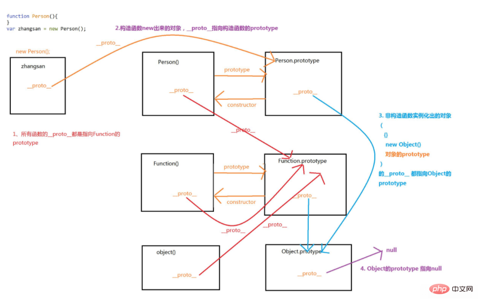
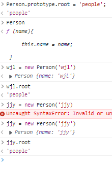

# 返回顶部

浏览器内置对象：

window， document

Window 对象表示一个浏览器窗口或一个框架。在客户端 JavaScript 中，Window 对象是全局对象，所有的[表达式](https://so.csdn.net/so/search?q=表达式&spm=1001.2101.3001.7020)都在当前的环境中计算。也就是说，要引用当前窗口根本不需要特殊的语法，可以把那个窗口的属性作为全局变量来使用。例如，可以只写 document，而不必写 window.document。

```javascript
$(document).scrollTop(0);
```

document.Element是DOM element，

不同于jQuery的对象。





通过DOM element我们可以调用scrollTo方法，这种方式可以实现类似手动滚动的效果。

```javascript
document.documentElement.scrollTo({top: 0, behavior: 'smooth'})
```

而使用jQuery，则没有这种动画

$(document).scrollTop(0);

# 模拟滚动到指定位置

使用DOM Element对象的scrollIntoView方法，使用方法：[(70条消息) 详细介绍scrollIntoView（）方法属性_永远的新手的博客-CSDN博客_scrollintoview](https://blog.csdn.net/learn8more/article/details/108047794)，

通过jQuery获取element

```
$('#'+id)[0]
```

在[jQuery对象](#js对象 jQuery对象 DOM对象)中我们提到jQuery对象是一个数组，[0]则是第一个element。



# js对象 jQuery对象 DOM对象

引用：[(70条消息) DOM对象和js对象以及jQuery对象的区别_weixin_30498921的博客-CSDN博客](https://blog.csdn.net/weixin_30498921/article/details/96031524?spm=1001.2101.3001.6661.1&depth_1-utm_relevant_index=1)

## 一、DOM对象

文档对象模型简称DOM，是W3C组织推荐的处理可扩展置标语言的标准编程接口。

1. DOM实际上是以面向对象方式描述的文档模型。DOM定义了表示和修改文档所需的对象、这些对象的行为和属性以及这些对象之间的关系。
2. 通过DOM，可以访问所有的 HTML 元素，连同它们所包含的文本和属性。可以对其中的内容进行修改和删除，同时也可以创建新的元素。 HTML
3. DOM 独立于平台和编程语言。它可被任何编程语言诸如 Java、JavaScript 和 VBScript 使用。
4. DOM对象，即是我们用传统的方法(javascript)获得的对象。
5. DOM准确说是对文档对象的一种规范标准(文档对象模型),标准只定义了属性和方法行为。

## 二、JavaScript 对象

1. JavaScript 提供多个内建对象，比如 String、Date、Array 等等。
2. 对象只是带有属性和方法的特殊数据类型。
3. 通过js获取的DOM对象就是js对象
4. 当浏览器支持js的dom接口(api)时，这里狭义的dom对象是以js对象的形式出现的，也就是一个js对象

## 三、jQuery对象

1. [jQuery](http://lib.csdn.net/base/jquery)对象其实是一个[JavaScript](http://lib.csdn.net/base/javascript)的数组,这个数组对象包含125个方法和4个属性 
   4个属性分别是

   - jquery 当前的jquery框架版本号
   - length 指示该数组对象的元素个数 .
   - context 一般情况下都是指向HtmlDocument对象 .
   - selector 传递进来的选择器内容

   [jquery](http://lib.csdn.net/base/jquery)对象就是通过jQuery包装DOM对象后产生的对象。jQuery对象是jQuery独有的，其可以使用jQuery里的方法，但是不能使用DOM的方法;反过来Dom对象也不能使用jquery的方法

2. jQuery对象和js对象区别：
   1.jQuery对象属于js的数组；
   2.jQuery对象是通过jQuery包装的DOM对象后产生的;
   3.jQuery对象不能使用DOM对象的方法和属性
   4.DOM对象不能使用jQuery对象的方法和属性

3. jQuery对象和js对象之间的相互转换

​           1） js转jQuery对象：

​               $(js对象)

​           2)jQuery对象转js对象

​            示例：

​            var doc2=$("#idDoc2")[0];

​            //转换jQuery对象为DOM对象

​            doc2.innerHTML="这是jQuery的第一个DOM对象"

​            //使用jQuery对象本身提供的get函数来返回指定集合位置的DOM对象

​            var doc2=$("#idDoc2").get(0);

​            doc2.innerHTML="这是jQuery的第二个DOM对象" 

# var和let

var是函数作用域，let是块作用域。

在函数中声明了var，整个函数内都是有效的，比如说在for循环内定义的一个var变量，实际上其在for循环以外也是可以访问的。

而let由于是块作用域，所以如果在块作用域内定义的变量，比如说在for循环内，在其外面是不可被访问的，所以for循环推荐用let。

var定义的变量会进行预解析（可以先使用后定义，写的时候）。

# 执行顺序





- 最简单的办法,将后续执行的代码放到axios的回调函数内部.

# 页面跳转和传参

- 接受路径参数

[js页面跳转并传值的常用方法 - ZJTL - 博客园 (cnblogs.com)](https://www.cnblogs.com/ZJTL/p/12161707.html)

- 借助浏览器保存参数

[(70条消息) js携带参数实现页面跳转_颖儿♡＾▽＾♡的博客-CSDN博客_js跳转页面传递参数](https://blog.csdn.net/qq_52126119/article/details/125154677)

# 原型__proto__

## js的原型和原型链是

- JavaScript是一门基于原型的语言，在软件设计模式中，有一种模式叫做原型模式，JavaScript正是利用这种模式而被创建出来
- 原型模式是用于创建重复的对象，同时又能保证性能，这种类型的设计模式属于创建型模式，它提供了一种创建对象的最佳方式。这种模式是实现了一个**原型接口**，该接口用于创建当前对象的克隆。原型模式的目的是用原型实例指定创建对象的种类，并且通过拷贝这些原型创建新的对象，也就是说利用已有的一个原型对象，可以快速地生成和原型对象一样的新对象实例
- **原型**：一个可以被复制（或者叫克隆）的一个类，通过复制原型可以创建一个一模一样的新对象，也可以说原型就是一个模板，在设计语言中更准确的说是一个对象模板

1）原型是定义了一些公用的属性和方法，利用原型创建出来的新对象实例会共享原型的所有属性和方法

```javascript
// 创建原型

 var Person = function(name){

     this.name = name;

 };

 // 原型的方法

Person.prototype.sayHello = function(){

    console.log(this.name+",hello");

};

// 实例化创建新的原型对象，新的原型对象会共享原型的属性和方法
var person1 = new Person("zhangsan");
var person2 = new Person("lisi");
// zhangsan,hello
person1.sayHello();
// lisi,hello
person2.sayHello();
```

2）严格模式下，原型的属性和方法还是会被原型实例所共享的

```javascript
// 开启严格模式，原型的属性和方法还是会被原型实例所共享的
"use strict"``;
 ``// 创建原型
 ``var` `Person = ``function``(name){
   ``this.name = name;
 ``};
 ``// 原型的方法
Person.prototype.sayHello = ``function``(){
  ``console.log(this.name+``",hello"``);
};
// 实例化创建新的原型对象，新的原型对象会共享原型的属性和方法
var` `person1 = ``new` `Person(``"zhangsan"``);
var` `person2 = ``new` `Person(``"lisi"``);
// zhangsan,hello
person1.sayHello();
// lisi,hello
person2.sayHello();
```

3）通过原型创建的新对象实例是相互独立的，为新对象实例添加的方法只有该实例拥有这个方法，其它实例是没有这个方法的

```
// 创建原型
 ``var` `Person = ``function``(name){
   ``this.name = name;
 ``};
 ``// 原型的方法
Person.prototype.sayHello = ``function``(){
  ``console.log(this.name+``",hello"``);
};
// 实例化创建新的原型对象，新的原型对象会共享原型的属性和方法
var` `person1 = ``new` `Person(``"zhangsan"``);
var` `person2 = ``new` `Person(``"lisi"``);
// zhangsan,hello
person1.sayHello();
// lisi,hello
person2.sayHello();

// 为新对象实例添加方法
// 通过原型创建的新对象实例是相互独立的
person1.getName = ``function``(){
  ``console.log(this.name);
}
// zhangsan
person1.getName();
// Uncaught TypeError: person2.getName is not a function
person2.getName();
```

 

4）原型的总结：

- 所有引用类型都有一个`__proto__`(隐式原型)属性，属性值是一个普通的对象
- 所有函数都有一个prototype(原型)属性，属性值是一个普通的对象
- 所有引用类型的`__proto__`属性指向它构造函数的prototype

5）函数的原型prototype：函数才有prototype，prototype是一个对象，指向了当前构造函数的引用地址

6）函数的原型对象__proto__：所有对象都有__proto__属性， 当用构造函数实例化（new）一个对象时，会将新对象的__proto__属性指向 构造函数的prototype

7）原型对象和函数的原型的关系



说明：

- 所有函数的`__proto__`都是指向Function的prototype
- 构造函数new出来的对象`__proto__`指向构造函数的prototype
- 非构造函数实例化出的对象或者对象的prototype的`__proto__`指向Object的prototype
- Object的prototype指向null

8）所有的原型对象都会自动获得一个 constructor（构造函数）属性，这个属性（是一个指针）指向 prototype 属性所在的函数（Person）

9）实例的构造函数属性（constructor）指向构造函数 ：`person1.constructor == Person`

10）原型对象（Person.prototype）是 构造函数（Person）的一个实例

11）原型的分类：

- 隐式原型（_proto_）：上面说的这个原型是JavaScript中的内置属性[[prototype]]，此属性继承自object对象，在脚本中没有标准的方式访问[[prototype]]，但Firefox、Safari和Chrome在每个对象上都支持一个属性_proto_，隐式原型的作用是用来构成原型链，实现基于原型的继承
- 显示原型（prototype）：每一个函数在创建之后，便会拥有一个`prototype`属性，这个属性指向函数的原型对象，显示原型的作用是用来实现基于原型的继承与属性的共享

12）原型的使用方式：

通过给Calculator对象的prototype属性赋值对象字面量来设定Calculator对象的原型

在赋值原型prototype的时候使用function立即执行的表达式来赋值，可以封装私有的function，通过return的形式暴露出简单的使用名称，以达到public/private的效果

## 原型链

1）原型链：原型链是原型对象创建过程的历史记录，当访问一个对象的某个属性时，会先在这个对象本身属性上查找，如果没有找到，则会去它的__proto__隐式原型上查找，即它的构造函数的prototype，如果还没有找到就会再在构造函数的prototype的`__proto__`中查找，这样一层一层向上查找就会形成一个链式结构

2）原型设计的问题：当查找一个对象的属性时，JavaScript 会根据原型链向上遍历对象的原型，直到找到给定名称的属性为止，直到到达原型链的顶部仍然没有找到指定的属性，就会返回 undefined

也可以理解为原型链继承时查找属性的过程是先查找自身属性，当自身属性不存在时，会在原型链中逐级查找

3）hasOwnProperty 函数：可以用来检查对象自身是否含有某个属性，返回值是布尔值，当属性不存在时**不会向上查找对象原型链**，hasOwnProperty是 JavaScript 中唯一一个处理属性但是不查找原型链的函数

4）getOwnPropertyNames 函数：可以获取对象所有的自身属性，返回值是由对象自身属性名称组成的数组，同样**不会向上查找对象原型链**

5）原型链的小结：

- 一直往上层查找，直到到null还没有找到，则返回undefined
- `Object.prototype.__proto__ === null`
- 所有从原型或更高级原型中的得到、执行的方法，其中的this在执行时，指向当前这个触发事件执行的对象

6）JavaScript的原型是为了实现对象间的联系，解决构造函数无法数据共享而引入的一个属性，而原型链是一个实现对象间联系即**继承**的主要方法

属性共享:



[js的原型和原型链是什么-js教程-PHP中文网](https://m.php.cn/article/462738.html)