[TOC]

# 代理模式

> 定义：当不方便直接访问一个对象或者不满足需要的时候，提供一个对象来控制堆这个对象的访问。

代理模式分为很多类，常用的有：保护模式、虚拟代理、缓存代理。
下面以虚拟代理实现图片预加载为例，理解代理模式的特点。

图片预加载：当请求图片较大时，首先使用一张 loading 占位，通过异步的方式加载图片资源，等到图片资源加载完成后，再替换 loading 占位图片链接。

实现代码

```javascript
// 图片展示类
class ImgShower {
	constructor(src){
		this.init(src);
	}
	// 创建图片结点
	init(src){
		console.log("创建结点")
		this.imgNode = new Image();
		document.body.appendChild(this.imgNode);
		this.imgNode.src = src;
	}
	// 设置图片链接
	setSrc(src){
		this.imgNode.src = src;
	}
}

// 图片代理类
class proxyImg {
	constructor(src,img){
		this.proxyImg = new Image();
		this.proxyImg.src = src;
		//页面加载完成后，改变图片链接
		this.proxyImg.onload = ()=>{
			this.setSrc(img)
		}
	}
	setSrc(img){	
		setTimeout(()=>img.setSrc(this.proxyImg.src),1000);//模拟1秒后才加载完成图片
	}
}
			
let img = new ImgShower('./imgs/fish.png');
let proxyImgs = new proxyImg('./imgs/car.jpg',img);

```

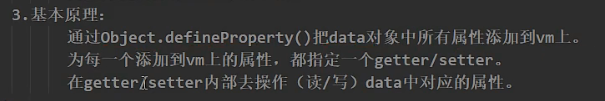

通过`Object.definePropety()`方法，实现对数据的更新监听：

```javascript
var o = {};//创建一个对象
//使用数据描述符来为对象添加属性
Object.defineProperty(o,'a',{
	value: 37,
	writable: true,
	enumerable: true,
	configurable: true
});
//属性a被设置到对象o上，并且值为37

//使用访问器描述符来为对象添加属性
var bValue = 38;
Object.defineProperty(o,'b',{
	get:function(){console.log('get value'); return bValue;},
	set:function(newValue){bValue = newValue; console.log('update b')},
	enumerable: true,
	configurable: true
});

```

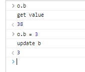

数据代理显示：

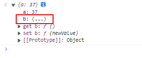

`响应式`：为了实现在数据修改时修改页面，vue还需要做其他操作，见[响应式原理](#响应式原理)；

[(70条消息) Object.definePropety() 方法详解_魂断楼兰的博客-CSDN博客_object.defined](https://blog.csdn.net/ziwutong88/article/details/82894903)

# 生命周期

[生命周期选项 | Vue.js (vuejs.org)](https://cn.vuejs.org/api/options-lifecycle.html)


# 响应式原理

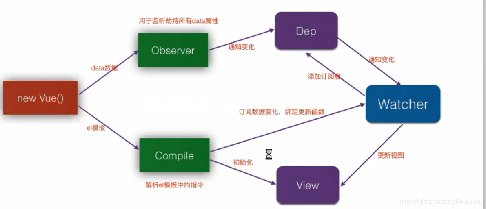

> Vue 最独特的特性之一，是其非侵入性的响应式系统。数据模型仅仅是普通的 JavaScript 对象。而当你修改它们时，视图会进行更新。这使得状态管理非常简单直接，不过理解其工作原理同样重要，这样你可以避开一些常见的问题。在这个章节，我们将研究一下 Vue 响应式系统的底层的细节。

Vue的数据双向绑定，响应式原理，其实就是通过Object.defineProperty()结合发布者订阅者模式来实现的。

```javascript
const obj = {
  message:'hhhh',
  name: 'why',
}

Object.keys(obj).forEach(key => {
  let value = obj[key];

  Object.defineProperty(obj, key, {
    set(newValue){
      console.log('监听' + key + '改变 ')
      value = newValue;
    },
    get(){
      console.log('获取' + key + '对应的值')
      return value
    }
  })
})

```

**Object.defineProperty()监听对象属性的改变**
**发布者订阅者模式通知需要改变的地方**

Vue 的响应式原理是核心是通过 ES5 的保护对象的 `Object.defindeProperty `中的访问器属性中的 `get `和 `set` 方法，data 中声明的属性都被添加了访问器属性，当读取 data 中的数据时自动调用 get 方法，当修改 data 中的数据时，自动调用 set 方法，检测到数据的变化，会通知观察者 Wacher，观察者 Wacher自动触发重新render 当前组件（子组件不会重新渲染）,生成新的虚拟 DOM 树，Vue 框架会遍历并对比新虚拟 DOM 树和旧虚拟 DOM 树中每个节点的差别，并记录下来，最后，加载操作，将所有记录的不同点，局部修改到真实 DOM 树上。

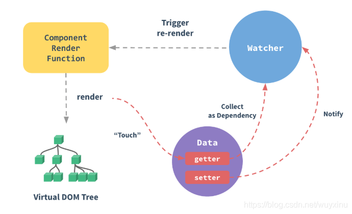

```javascript
//发布者
class Dep {
    constructor () {
        /* 用来存放Watcher对象的数组 */
        this.subs = [];
    }
    /* 在subs中添加一个Watcher对象 */
    addSub (sub) {
        this.subs.push(sub);
    }
    /* 通知所有Watcher对象更新视图 */
    notify () {
        this.subs.forEach((sub) => {
            sub.update();
        })
    }
}

//订阅者
class Watcher {
  constructor(name) {
  	this.name = name
  }
  update() {
    // 获得新值
   console.log(this.name + '发生update');
  }
}

const dep = new Dep();

const w1 = new Watcher('张三');
dep.addSub(w1)

const w2 = new Watcher('李四);
dep.addSub(w2)

const w3 = new Watcher('王五');
dep.addSub(w3)

dep.notify()

```

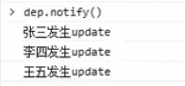

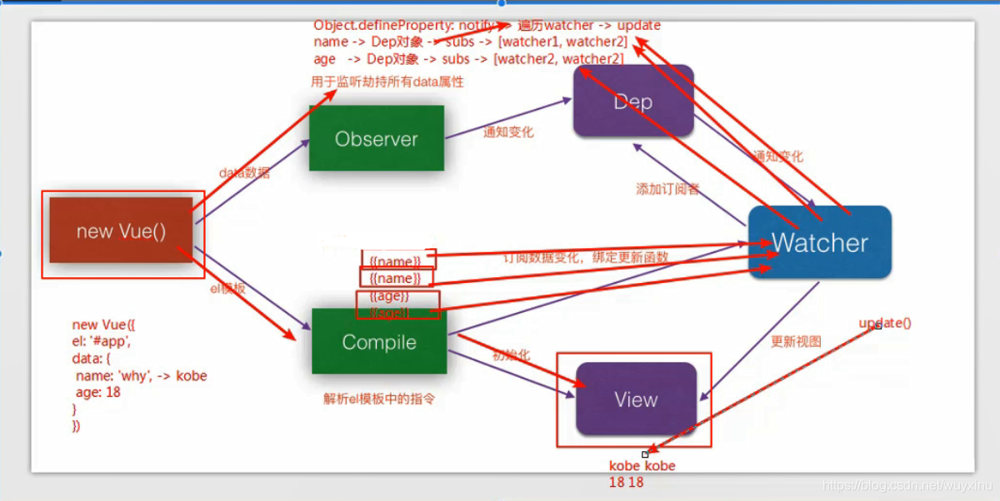

在 Observer阶段，会为每个 key 都创建一个 dep 实例。并且，如果该 key 被某个 watcher 实例 get, **把该 watcher 实例加入 dep 实例的队列里**。如果该 key 被 set, 则通知该 key 对应的 dep 实例， 然后 dep 实例会将依次通知队列里的 watcher 实例, 让它们去执行自身的回调方法

**dep 实例是收集该 key 所有 watcher 实例的地方.**

watcher 实例用来监听某个 key ，如果该 key 产生变化，便会执行 watcher 实例自身的回调
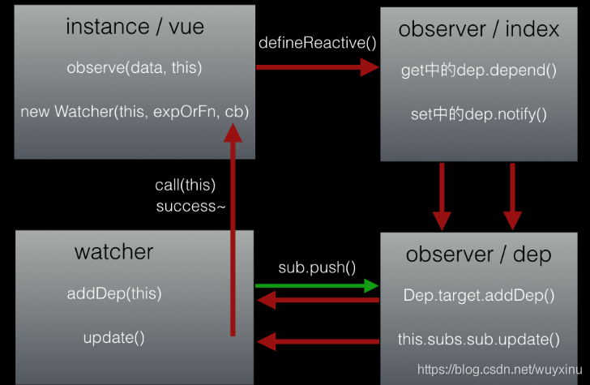

[(70条消息) Vue响应式原理_wuyxinu的博客-CSDN博客_vue响应式原理](https://blog.csdn.net/wuyxinu/article/details/103565014/)

# 事件

## 事件修饰符

`@****.prevent`;

阻止a标签的跳转；

```javascript
<a href="www.baidu.com" @click.prevent="showInfo"></a>
```

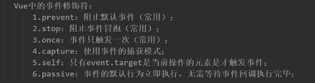

- 冒泡

div有点击事件，div内按钮有点击事件。

对按钮添加stop，div不会触发点击事件。

事件捕获：由外往内

事件冒泡：由内往外

# 计算属性与监视属性

## 计算属性

`computed`

> **组件模板应该只包含简单的表达式，复杂的表达式则应该重构为计算属性或方法。**
>
> 复杂表达式会让你的模板变得不那么声明式。我们应该尽量描述应该出现的*是什么*，而非*如何*计算那个值。而且计算属性和方法使得代码可以重用。

`ps`：但vue的数据发生变化，就会重新解析模板，比对区别，更新DOM树，因此就算某个地方使用方法返回进行插值， {{function()}}，如果修改的数据影响到了方法的返回值，页面也会更新。

```javascript
export default {
  data() {
    return { a: 1 }
  },
  computed: {
    // 只读
    aDouble() {
      return this.a * 2
    },
    // 可写
    aPlus: {
      get() {
        return this.a + 1
      },
      set(v) {
        this.a = v - 1
      }
    }
  },
  created() {
    console.log(this.aDouble) // => 2
    console.log(this.aPlus) // => 2

    this.aPlus = 3
    console.log(this.a) // => 2
    console.log(this.aDouble) // => 4
  }
}
```

计算属性相比方法，计算属性会缓存，重复调用只会执行一次。

## 监视属性

```javascript
interface ComponentOptions {
  watch?: {
    [key: string]: WatchOptionItem | WatchOptionItem[]
  }
}

type WatchOptionItem = string | WatchCallback | ObjectWatchOptionItem

type WatchCallback<T> = (
  value: T,
  oldValue: T,
  onCleanup: (cleanupFn: () => void) => void
) => void

type ObjectWatchOptionItem = {
  handler: WatchCallback | string
  immediate?: boolean // default: false
  deep?: boolean // default: false
  flush?: 'pre' | 'post' | 'sync' // default: 'pre'
  onTrack?: (event: DebuggerEvent) => void
  onTrigger?: (event: DebuggerEvent) => void
}

export default {
  data() {
    return {
      a: 1,
      b: 2,
      c: {
        d: 4
      },
      e: 5,
      f: 6
    }
  },
  watch: {
    // 侦听根级属性
    a(val, oldVal) {
      console.log(`new: ${val}, old: ${oldVal}`)
    },
    // 字符串方法名称
    b: 'someMethod',
    // 该回调将会在被侦听的对象的属性改变时调动，无论其被嵌套多深
    c: {
      handler(val, oldVal) {
        console.log('c changed')
      },
      deep: true
    },
    // 侦听单个嵌套属性：
    'c.d': function (val, oldVal) {
      // do something
    },
    // 该回调将会在侦听开始之后立即调用
    e: {
      handler(val, oldVal) {
        console.log('e changed')
      },
      immediate: true
    },
    // 你可以传入回调数组，它们将会被逐一调用
    f: [
      'handle1',
      function handle2(val, oldVal) {
        console.log('handle2 triggered')
      },
      {
        handler: function handle3(val, oldVal) {
          console.log('handle3 triggered')
        }
        /* ... */
      }
    ]
  },
  methods: {
    someMethod() {
      console.log('b changed')
    },
    handle1() {
      console.log('handle 1 triggered')
    }
  },
  created() {
    this.a = 3 // => new: 3, old: 1
  }
}
```

**计算属性内部不能开启异步计算**，依靠返回值。

**箭头函数没有this，会往外找。**

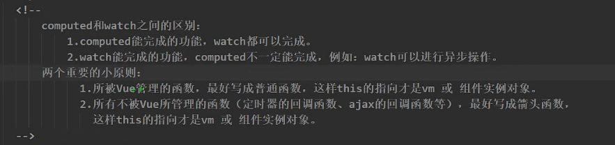

# 样式绑定

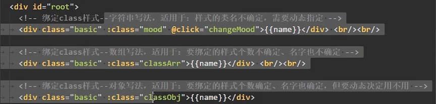

# 技巧

## 监听窗口变化

[vue监听窗口大小发生变化，实现自适应_Abenazhan的博客-CSDN博客_vue监听窗口大小变化 自动缩放](https://blog.csdn.net/Abenazhan/article/details/121411973)
