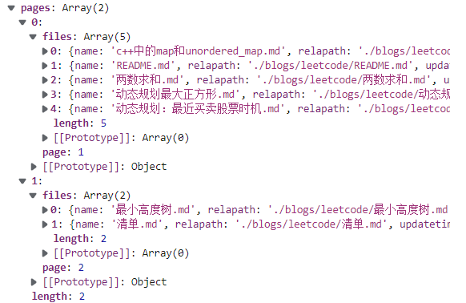
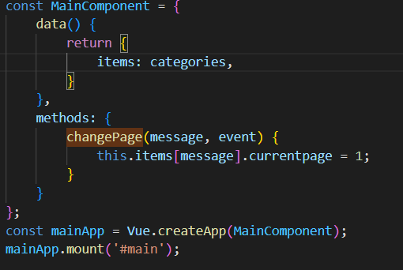
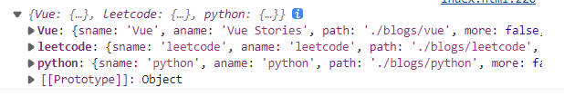

# 动态改变DOM

首先我有一个两页的数据，希望在点击下一页按钮时不重新加载页面实现内容更新；



第一页：


- Vue实体



items包含多个目录，每个目录下有多个页面。

- items:



- 页面信息


- 事件函数

```javascript
methods: {
						changePage(categoryName, event) {
							this.items[categoryName].currentpage = 1;
						}
					}
```

Vue会监听items这个对象，因此，我们不能替换items，即不能这样更新：

```javascript
categorys[categoryName].currentpage = 1;
this.items = categorys;
```

我们需要直接对items原对象进行更新：

```
this.items[message].currentpage = 1;
```

# 监听窗口变化

[vue监听窗口大小发生变化，实现自适应_Abenazhan的博客-CSDN博客_vue监听窗口大小变化 自动缩放](https://blog.csdn.net/Abenazhan/article/details/121411973)