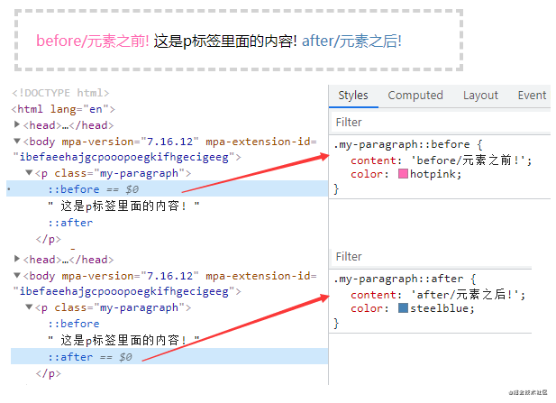

# 伪元素产生的原因

在CSS2.1中，根据元素在DOM中的位置可以为其设置样式。大部分情况这种模式是有效的，但是有些情况就无法实现。例如，HTML4中，没有指向段落第一行的元素，也就没有相应的CSS[选择器](https://so.csdn.net/so/search?q=选择器&spm=1001.2101.3001.7020)使用。

CSS引入[伪元素](https://so.csdn.net/so/search?q=伪元素&spm=1001.2101.3001.7020)和伪类的概念允许格式化文档树以外的信息。

伪元素可以创建一些文档语言无法创建的虚拟元素。比如：文档语言没有一种机制可以描述元素内容的第一个字母或第一行，但伪元素可以做到(`::first-letter、::first-line`)。同时，伪元素还可以创建源文档不存在的内容，比如使用`::before 或 ::after`。

伪元素和伪类都不能出现在文档源或文档树中。

例如：

伪类可以用在选择器的任何地方，而伪元素只能附加在最后一个简单选择器之后。

# 参考资料

[(71条消息) 深入了解::before 和 ::after 伪元素_前端瓶子君的博客-CSDN博客](https://blog.csdn.net/lunahaijiao/article/details/119283897?spm=1001.2101.3001.6650.5&depth_1-utm_relevant_index=6)

[(71条消息) 为什么会有伪类 伪元素_牟童的博客-CSDN博客_为什么用伪类](https://blog.csdn.net/c9316/article/details/103962624)