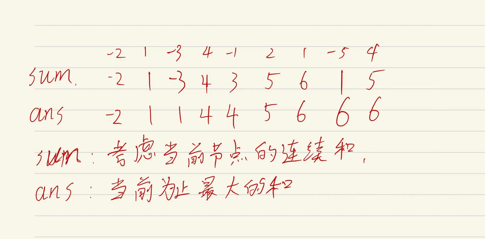

# 题目

[53. 最大子数组和 - 力扣（LeetCode）](https://leetcode.cn/problems/maximum-subarray/submissions/)

> 给你一个整数数组 `nums` ，请你找出一个具有最大和的连续子数组（子数组最少包含一个元素），返回其最大和。
>
> **子数组** 是数组中的一个连续部分。
>
> ```
> 输入：nums = [-2,1,-3,4,-1,2,1,-5,4]
> 输出：6
> 解释：连续子数组 [4,-1,2,1] 的和最大，为 6 。
> ```

# 解题

动态规划的思想，在节点`i`，我们计算包含当前节点的最大连续和。



1. 在`num[1]=1`位置，初始化sum和ans为 nums[0]，之后遍历数组；

2. 在`num[1]=1`位置， $nums[i]+sum=-1$，因为-1 小于该节点本身的值，因此将sum置为 $num[1]$，即以该节点为连续子数组的开始位置，同时遍历完每个节点，更新最大值$ans=max(ans,sum)$；

3. 在`num[2]=-3`位置，$nums[i]+sum=-2$，由于和小于0，则这一段一定是要舍弃的，以该节点为子数组开始位置向后遍历；

状态转移方程:

$$
sum = \begin{cases} 
nums[i], & \mbox{nums[i]+sum<0}, \\
nums[i], & \mbox{nums[i]+sum<nums[i]},\\
nums[i]+sum<nums[i], & \mbox{else}
\end{cases}
$$
每更新完$sum$，计算$ans$。

# 代码

```c++
# define max(a, b) a > b ? a:b
class Solution {
public:
    int maxSubArray(vector<int>& nums) {
        int n = nums.size();
        int ans = nums[0];
        int sum = nums[0];
        for(int i=1; i<n; i++){
            int tmp = sum + nums[i];
            if (nums[i] > tmp || tmp < 0){
                sum = nums[i];
            }else{
                sum = tmp;
            }
            
            ans = max(ans, sum);
        }
        return ans;
    }
};
```


