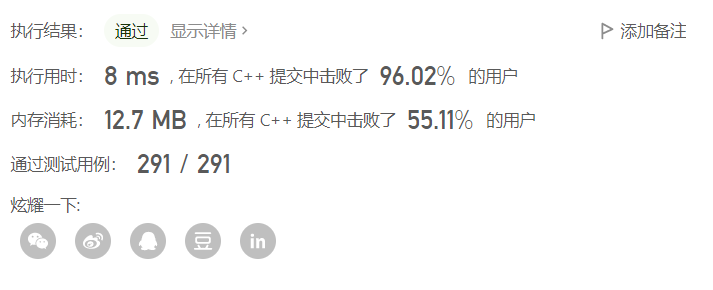

# 题目

[18. 四数之和 - 力扣（LeetCode）](https://leetcode.cn/problems/4sum/)

> 给你一个由 n 个整数组成的数组 nums ，和一个目标值 target 。请你找出并返回满足下述全部条件且不重复的四元组 [nums[a], nums[b], nums[c], nums[d]] （若两个四元组元素一一对应，则认为两个四元组重复）：
>
> 0 <= a, b, c, d < n
> a、b、c 和 d 互不相同
> nums[a] + nums[b] + nums[c] + nums[d] == target
> 你可以按 任意顺序 返回答案 。
>
> 来源：力扣（LeetCode）
> 链接：https://leetcode.cn/problems/4sum
> 著作权归领扣网络所有。商业转载请联系官方授权，非商业转载请注明出处。

示例 1：

```
输入：nums = [1,0,-1,0,-2,2], target = 0
输出：[[-2,-1,1,2],[-2,0,0,2],[-1,0,0,1]]
```

示例 2：

```
输入：nums = [2,2,2,2,2], target = 8
输出：[[2,2,2,2]]
```


# 解题思路

记四元组为$(a,b,c,d)$;

根据之前三数和的题目（[Loading Question... - 力扣（LeetCode）](https://leetcode.cn/problems/3sum/)）的思路；

同时，为了有顺序地遍历数组，`a`,`b`,`c`,`d`应该是有序的，因此很容易地写出四重循环算法：

其中需要注意的是判断溢出。

## 四重循环解法

```c++

class Solution {
public:
    vector<vector<int>> fourSum(vector<int>& nums, int target) {
        sort(nums.begin(), nums.end());
        vector<vector<int>> ans;
        int n = nums.size();
        if (n <4){
            return ans;
        }
        if (target <= 0 && nums[0] > 0){
            return ans;
        }
        if (target > 0 && nums[0] > target){
            return ans;
        }
        long long temp = 0;
        for(int i=0; i<4;i++){
            long long lNum = (long long)nums[i];
            temp += lNum;
        } 
        if (temp > target){
            return ans;
        }
        for(int a=0; a<n; a++){
            if (a > 0 && nums[a] == nums[a-1]) continue;
            for(int b=a+1; b<n; b++){
                if (b > a+1 && nums[b] == nums[b-1]) continue;
                for(int c=b+1; c<n; c++){
                    if (c > b+1 && nums[c] == nums[c-1]) continue;
                    for(int d=c+1; d<n; d++){
                        if (d > c+1 && nums[d] == nums[d-1]) continue;
                        long long sum = (long long)nums[a] + (long long)nums[b] + (long long)nums[c] + (long long)nums[d];
                        if (sum == target){
                            ans.push_back({nums[a], nums[b], nums[c], nums[d]});
                        }
                        if (sum >= target){
                            break;
                        }
                    }
                }
            }
        }
        return ans;
    }
};

```

### 运行结果


几乎要超时。

## 三重循环

注意到**数组已经被排序**，因此可以使用**双指针的方法**去掉一重循环。

根据和与target的大小关系，决定`c`和`d`谁移动。

```c++

class Solution {
public:
    vector<vector<int>> fourSum(vector<int>& nums, int target) {
        vector<vector<int>> quadruplets;
        if (nums.size() < 4) {
            return quadruplets;
        }
        sort(nums.begin(), nums.end());
        int length = nums.size();
        for (int i = 0; i < length - 3; i++) {
            if (i > 0 && nums[i] == nums[i - 1]) {
                continue;
            }
            if ((long) nums[i] + nums[i + 1] + nums[i + 2] + nums[i + 3] > target) {
                break;
            }
            if ((long) nums[i] + nums[length - 3] + nums[length - 2] + nums[length - 1] < target) {
                continue;
            }
            for (int j = i + 1; j < length - 2; j++) {
                if (j > i + 1 && nums[j] == nums[j - 1]) {
                    continue;
                }
                if ((long) nums[i] + nums[j] + nums[j + 1] + nums[j + 2] > target) {
                    break;
                }
                if ((long) nums[i] + nums[j] + nums[length - 2] + nums[length - 1] < target) {
                    continue;
                }
                int left = j + 1, right = length - 1;
                while (left < right) {
                    int sum = nums[i] + nums[j] + nums[left] + nums[right];
                    if (sum == target) {
                        quadruplets.push_back({nums[i], nums[j], nums[left], nums[right]});
                        while (left < right && nums[left] == nums[left + 1]) {
                            left++;
                        }
                        left++;
                        while (left < right && nums[right] == nums[right - 1]) {
                            right--;
                        }
                        right--;
                    } else if (sum < target) {
                        left++;
                    } else {
                        right--;
                    }
                }
            }
        }
        return quadruplets;
    }
};


```

### 运行结果


