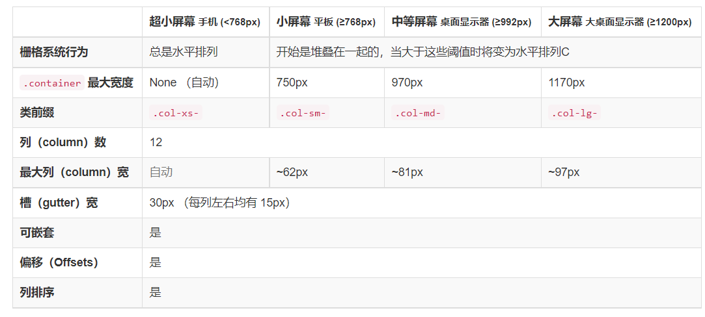

# v5.x

css文件

```html
<link href="https://cdn.jsdelivr.net/npm/bootstrap@5.1.3/dist/css/bootstrap.min.css" rel="stylesheet" integrity="sha384-rTTiRUKnSWaDu2FjhzWFl8/JuUZMlplyWE/djenb2LoKqkgLGfEGfSrL7XDLoB1M" crossorigin="anonymous">
```

js文件

```html
<script src="https://cdn.jsdelivr.net/npm/bootstrap@5.1.3/dist/js/bootstrap.bundle.min.js" integrity="sha384-Nj1D6pu2WnJojj+67GiU9ZFNwbl7bUWX5Kj5MS22C8bGjllemM9pvQyvj14zJb58" crossorigin="anonymous"></script>
```

## 屏幕分级



## 添加小手

<a>标签在添加链接后，鼠标移动上去没有小手，可添加属性：

## 元素隐藏与显示

v5.x与v3.x的类有所不同

- v5.x

为了更快地采用移动设备优先的方式进行开发，请使用支持响应式布局的 display 工具类来针对设备显示和隐藏页面元素。避免为同一个网站创建多个完全不同的版本，而是应该根据屏幕尺寸隐藏某些页面元素。

如需隐藏某个页面元素，只需使用 `.d-none` 类即可，还可以使用支持响应式布局的 `.d-{sm,md,lg,xl,xxl}-none` 类。

**只有中等屏幕以上才显示：**

```
.d-none .d-md-block
```

**在小于 lg 尺寸的屏幕上隐藏：**

```html
<div class="d-lg-none">在 lg 及更大尺寸的屏幕上隐藏</div>
<div class="d-none d-lg-block">在小于 lg 尺寸的屏幕上隐藏</div>
```

## 分页