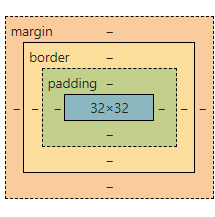

# padding margin

margin是外边距，即盒子与盒子之间的距离；而padding是内边距，是盒子的边（border）与盒子内部元素的距离。margin是用来隔开元素与元素的间距；padding是用来隔开元素与内容的间隔。margin使元素与元素互不相干；padding让内容（文字）与（包裹）元素之间有一段“呼吸距离”。



# 鼠标悬停

- 悬停变小手

```
.class {
		cursor: pointer;
	}
```

