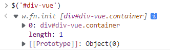

# 返回顶部

浏览器内置对象：

window， document

Window 对象表示一个浏览器窗口或一个框架。在客户端 JavaScript 中，Window 对象是全局对象，所有的[表达式](https://so.csdn.net/so/search?q=表达式&spm=1001.2101.3001.7020)都在当前的环境中计算。也就是说，要引用当前窗口根本不需要特殊的语法，可以把那个窗口的属性作为全局变量来使用。例如，可以只写 document，而不必写 window.document。

```javascript
$(document).scrollTop(0);
```

document.Element是DOM element，

不同于jQuery的对象。




通过DOM element我们可以调用scrollTo方法，这种方式可以实现类似手动滚动的效果。

```javascript
document.documentElement.scrollTo({top: 0, behavior: 'smooth'})
```

而使用jQuery，则没有这种动画

$(document).scrollTop(0);

# 模拟滚动到指定位置

使用DOM Element对象的scrollIntoView方法，使用方法：[(70条消息) 详细介绍scrollIntoView（）方法属性_永远的新手的博客-CSDN博客_scrollintoview](https://blog.csdn.net/learn8more/article/details/108047794)，

通过jQuery获取element

```
$('#'+id)[0]
```

在[jQuery对象](#js对象 jQuery对象 DOM对象)中我们提到jQuery对象是一个数组，[0]则是第一个element。


# js对象 jQuery对象 DOM对象

引用：[(70条消息) DOM对象和js对象以及jQuery对象的区别_weixin_30498921的博客-CSDN博客](https://blog.csdn.net/weixin_30498921/article/details/96031524?spm=1001.2101.3001.6661.1&depth_1-utm_relevant_index=1)

## 一、DOM对象

文档对象模型简称DOM，是W3C组织推荐的处理可扩展置标语言的标准编程接口。

1. DOM实际上是以面向对象方式描述的文档模型。DOM定义了表示和修改文档所需的对象、这些对象的行为和属性以及这些对象之间的关系。
2. 通过DOM，可以访问所有的 HTML 元素，连同它们所包含的文本和属性。可以对其中的内容进行修改和删除，同时也可以创建新的元素。 HTML
3. DOM 独立于平台和编程语言。它可被任何编程语言诸如 Java、JavaScript 和 VBScript 使用。
4. DOM对象，即是我们用传统的方法(javascript)获得的对象。
5. DOM准确说是对文档对象的一种规范标准(文档对象模型),标准只定义了属性和方法行为。

## 二、JavaScript 对象

1. JavaScript 提供多个内建对象，比如 String、Date、Array 等等。
2. 对象只是带有属性和方法的特殊数据类型。
3. 通过js获取的DOM对象就是js对象
4. 当浏览器支持js的dom接口(api)时，这里狭义的dom对象是以js对象的形式出现的，也就是一个js对象

## 三、jQuery对象

1. [jQuery](http://lib.csdn.net/base/jquery)对象其实是一个[JavaScript](http://lib.csdn.net/base/javascript)的数组,这个数组对象包含125个方法和4个属性 
   4个属性分别是

   - jquery 当前的jquery框架版本号
   - length 指示该数组对象的元素个数 .
   - context 一般情况下都是指向HtmlDocument对象 .
   - selector 传递进来的选择器内容

   [jquery](http://lib.csdn.net/base/jquery)对象就是通过jQuery包装DOM对象后产生的对象。jQuery对象是jQuery独有的，其可以使用jQuery里的方法，但是不能使用DOM的方法;反过来Dom对象也不能使用jquery的方法

2. jQuery对象和js对象区别：
   1.jQuery对象属于js的数组；
   2.jQuery对象是通过jQuery包装的DOM对象后产生的;
   3.jQuery对象不能使用DOM对象的方法和属性
   4.DOM对象不能使用jQuery对象的方法和属性

3. jQuery对象和js对象之间的相互转换

​           1） js转jQuery对象：

​               $(js对象)

​           2)jQuery对象转js对象

​            示例：

​            var doc2=$("#idDoc2")[0];

​            //转换jQuery对象为DOM对象

​            doc2.innerHTML="这是jQuery的第一个DOM对象"

​            //使用jQuery对象本身提供的get函数来返回指定集合位置的DOM对象

​            var doc2=$("#idDoc2").get(0);

​            doc2.innerHTML="这是jQuery的第二个DOM对象" 

# var和let

var是函数作用域，let是块作用域。

在函数中声明了var，整个函数内都是有效的，比如说在for循环内定义的一个var变量，实际上其在for循环以外也是可以访问的。

而let由于是块作用域，所以如果在块作用域内定义的变量，比如说在for循环内，在其外面是不可被访问的，所以for循环推荐用let。

var定义的变量会进行预解析（可以先使用后定义，写的时候）。

# 执行顺序


- 最简单的办法,将后续执行的代码放到axios的回调函数内部.

# 页面跳转和传参

- 接受路径参数

[js页面跳转并传值的常用方法 - ZJTL - 博客园 (cnblogs.com)](https://www.cnblogs.com/ZJTL/p/12161707.html)

- 借助浏览器保存参数

[(70条消息) js携带参数实现页面跳转_颖儿♡＾▽＾♡的博客-CSDN博客_js跳转页面传递参数](https://blog.csdn.net/qq_52126119/article/details/125154677)