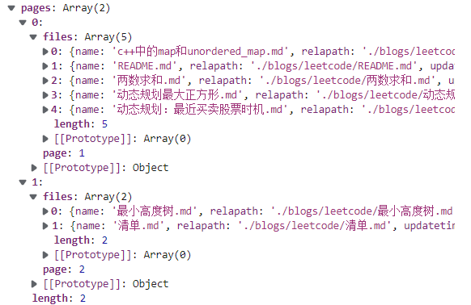

# 模板语法

1. 选择一个容器


## 插值语法

<script type="text/javascript">
    const RootComponent = { 
        data() {
            return {personName: 'WeiJL',}
        }
    }
    const app = Vue.createApp(RootComponent)
    app.mount('#top')
</script>

## 指令语法

### v-bind

- 一些指令能够接收一个“参数”，在指令名称之后以冒号表示。例如，`v-bind` 指令可以用于响应式地更新 HTML attribute：

```html
<a v-bind:href="url"> ... </a>
```

在这里 `href` 是参数，告知 `v-bind` 指令将该元素的 `href` attribute 与表达式 `url` 的值绑定。

另一个例子是 `v-on` 指令，它用于监听 DOM 事件：

```html
<a v-on:click="doSomething"> ... </a>
```

在这里参数是监听的事件名。


- 动态参数

也可以在指令参数中使用 JavaScript 表达式，方法是用方括号括起来：

```html
<a v-bind:[attributeName]="url"> ... </a>
```

这里的 `attributeName` 会被作为一个 JavaScript 表达式进行动态求值，求得的值将会作为最终的参数来使用。例如，如果你的组件实例有一个 data property `attributeName`，其值为 `"href"`，那么这个绑定将等价于 `v-bind:href`。

同样地，可以使用动态参数为一个动态的事件名绑定处理函数：

```html
<a v-on:[eventName]="doSomething"> ... </a>
```

在这个示例中，当 `eventName` 的值为 `"focus"` 时，`v-on:[eventName]` 将等价于 `v-on:focus`

- 参数拼接

```
v-bind:id="['div-'+item.sname]"
```


### v-html

# 元素位置

## 居中

1. 子元素在父元素中水平居中

```
.centerFlexParent {
		display:flex;
		justify-content:center
	}
```

# vue事件

## 传参

```javascript
const MainComponent = {
					data() {
						return {
							items: categories,
						}
					},
					methods: {
						changePage(message, event) {
							console.log(message);
							console.log(event.target);
						}
					}
				};
				const mainApp = Vue.createApp(MainComponent);
				mainApp.mount('#main');
```

```html
<h5 class="pl-3"><a class="btn" v-on:click="(event) => changePage(item.sname,event)">View ALL</a></h5>

```

# 动态改变DOM

首先我有一个两页的数据，希望在点击下一页按钮时不重新加载页面实现内容更新；



第一页：


- Vue实体


items包含多个目录，每个目录下有多个页面。

- items:


- 页面信息


- 事件函数

```javascript
methods: {
						changePage(categoryName, event) {
							this.items[categoryName].currentpage = 1;
						}
					}
```

Vue会监听items这个对象，因此，我们不能替换items，即不能这样更新：

```javascript
categorys[categoryName].currentpage = 1;
this.items = categorys;
```

我们需要直接对items原对象进行更新：

```
this.items[message].currentpage = 1;
```

