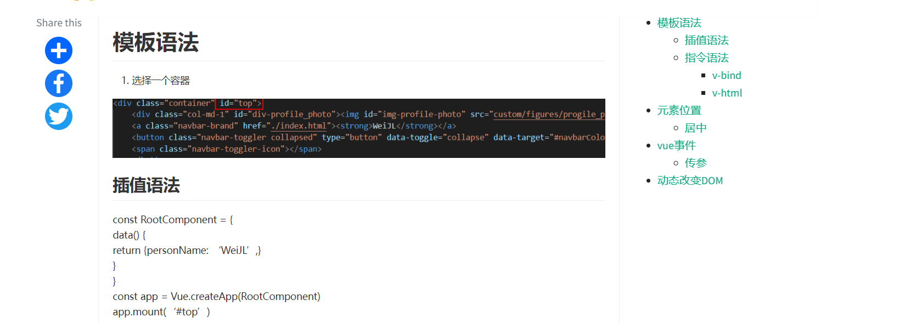

# Editor.md

[Editor.md - 开源在线 Markdown 编辑器 (ipandao.com)](http://editor.md.ipandao.com/)

<script src="https://cdnjs.cloudflare.com/ajax/libs/editor.js/2.25.0/editor.js" integrity="sha512-/AJgfBm8OoQDj/qExmADUPdUBANzP85BsBQt96q4/8jO1cZ425Sb6ZNYU/XxbT4znk42oIVZH+vD4CqH0TI+AA==" crossorigin="anonymous" referrerpolicy="no-referrer"></script>

[(70条消息) 使用editor.md渲染markdown并自定义目录_前端corner的博客-CSDN博客_editor目录](https://blog.csdn.net/laplacepoisson/article/details/124416320)

目前效果最好的，集成度最高;

在bootsrap模板下，我们在右边生成目录：



栅栏结构：


但是这个目录不是固定的，为了方便浏览，这个目录最后固定位置，但直接对`article-toc`添加`position:fixed`属性的话，目录在页面中的位置会改变；

- 解决方案：

editor.md会在这个div下面生成新的div内容放置目录：


目录生成后，我们将子div的属性添加上`position:fixed`。

```javascript
$(document.querySelector('.editormd-markdown-toc')).addClass('toc')
```

- 问题

仍然没有适配手机

# showdown.js

<script src="./node_modules/showdown/dist/showdown.js" type="text/javascript"></script>

# marked.js

```javascript
<script src="https://cdn.bootcdn.net/ajax/libs/marked/4.0.18/marked.min.js"></script>
<!--------------------------------------
code highlight
--------------------------------------->
    <link href="https://cdn.bootcss.com/highlight.js/8.0/styles/monokai_sublime.min.css" rel="stylesheet">
    <script src="https://cdn.bootcss.com/highlight.js/8.0/highlight.min.js"></script>
    <script>hljs.initHighlightingOnLoad();</script>

// 配置
var rendererMD = new marked.Renderer();
        marked.setOptions({
            renderer: rendererMD,
            gfm: true,
            tables: true,
            breaks: false,
            pedantic: false,
            sanitize: false,
            smartLists: true,
            smartypants: false
        });//基本设置
        marked.setOptions({
            highlight: function (code) {
                return hljs.highlightAuto(code).value;
            }
        });
// res是md文件请求
let mdcontent = res.data;

// 解析生成html
html = marked.parse(mdcontent);
```

# 内联公式解析

```javascript
<!-- math parser -->
    <script src="//cdn.bootcss.com/mathjax/2.7.0/MathJax.js?config=TeX-AMS-MML_HTMLorMML"></script>
// 配合 MathJax 显示行内公式
MathJax.Hub.Config({
	tex2jax: {
		inlineMath: [['$', '$'], ["\(", "\)"]],
		displayMath: [['$$', '$$'], ["\[", "\]"]]
	}
});
// 指定生效的element
MathJax.Hub.Queue(["Typeset", MathJax.Hub, el]);

```

