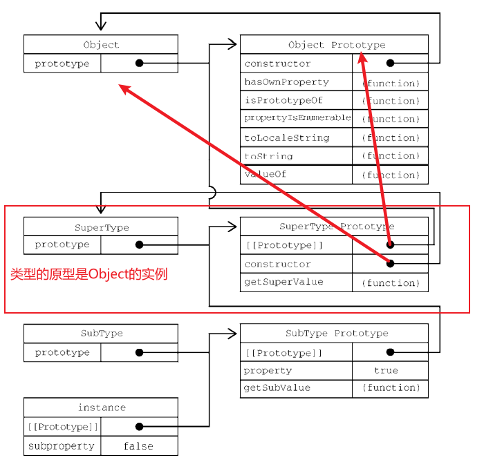

# Cap 8对象、类和面向对象编程

## 8.3 继承

很多面向对象语言都支持两种继承：接口继承和实现继承。 **前者只继承方法签名**，后者继承实际的方法。接口继承在 ECMAScript 中是不可能的，因为函数没有签名。实现继承是 ECMAScript 唯一支持的继承方式，而这主要是通过原型链实现的。

### 8.3.1 原型链

ECMA-262 把原型链定义为 ECMAScript 的主要继承方式。其基本思想就是通过原型继承多个引用 类型的属性和方法。重温一下构造函数、原型和实例的关系：每个构造函数都有一个原型对象，原型有 一个属性指回构造函数，而实例有一个内部指针指向原型。**如果原型是另一个类型的实例呢**？那就意味 着这个原型本身有一个内部指针指向另一个原型，相应地另一个原型也有一个指针指向另一个构造函 数。

如果原型是另一个类的实例，那么它的[[prototype]]指向这个类的构造函数原型。

1. 默认原型

   

2. 原型与继承关系

   原型与实例的关系可以通过两种方式来确定。第一种方式是使用 instanceof 操作符，如果**一个实例的原型链中出现过相应的构造函数**，则 instanceof 返回 true。

   第二种方法，调用原型上的`isPrototypeOf()`方法，该方法接收一个实例对象，如果原型在这个实例对象的原型链上，返回true。

3. 子类增加或重写方法

   子类有时候需要覆盖父类的方法，或者增加父类没有的方法。为此，这些方法必须在**原型赋值之后 再添加到原型上**。

   因为原型是父类的实例（而这个实例的原型是父类构造函数的原型，因此继承了父类原型上的方法），所以在原型上增加的方法不会影响原有的原型

4. 原型链的问题

   - 由于子类构造**函数的原型**是父类的实例，因此父类中的属性也在这个原型上，一般来说我们希望原型上只有方法，因为属性被所以实例所共享。
   - 子类型在实例化时不能给父类传参。子类和父类的联系是通过原型建立的（子类构造函数原型=父类实例），而子类的原型绑定在构造函数上，因此如果我们想给父类构造函数传参，只能在进行原型绑定时进行，这样会影响所有该子类的对象。

### 8.3.2 盗用构造函数

为了继承时导致的属性共享的问题，出现了“盗用构造函数”（constructor stealing）的技术（这种技术有时也称作“对象伪装”或“经典继承”）。

思路：在子类构造函数中，调用父类构造函数。

```
function SuperType() { 
 this.colors = ["red", "blue", "green"]; 
} 
function SubType() { 
 // 继承 SuperType 
 SuperType.call(this);   // look here
} 
```

这相当于新的 **子类**对象上运行了父类构造函数函数中的所有初始化代码。结果就是每个实例都会有自己的 colors 属性。

这种模式下我们可以自定义对父类参数的初始化，但是我们也只能继承构造函数中的方法。

**问题：**

- 函数不能重用，因为必须在构造函数中定义方法。子类也不能访问父类原型上定义的方法，因此所有类型只能使用构造函数模 式。因此盗用构造函数模式不能单独使用。

> 引用[js中call()和apply()方法的区别和用法详解 - 简书 (jianshu.com)](https://www.jianshu.com/p/625c35d84a80)

`call`和`apply`可以用来**重新定义函数的执行环境**，也就是`this`的指向；`call`和`apply`都是为了改变某个函数运行时的`context`，即上下文而存在的，换句话说，就是为了改变函数体内部`this`的指向。

`call()`调用一个对象的方法，**用另一个对象替换当前对象**，可以继承另外一个对象的属性，它的语法是：

```
Function.call(obj, param1, param2, ..., paramn);
```

- `obj`：这个对象将代替`Function`类里`this`对象
- `params`：一串参数列表

**说明**：`call`方法可以用来代替另一个对象调用一个方法，`call`方法可以将一个函数的对象上下文从初始的上下文改变为`obj`指定的新对象，如果没有提供`obj`参数，那么Global对象被用于`obj`。

#### 不同点

`apply()`和`call()`方法一样，只是参数列表不同。

从定义中也可以看出来，`call()`和`apply()`的不同点就是**接收参数的方式不同**。

- **apply()方法**接收两个参数，一个是函数运行的作用域（`this`），另一个是**参数数组**。
- **call()方法**不一定接受两个参数，第一个参数也是函数运行的作用域（`this`），但是传递给函数的参数必须列举出来。

### 8.3.3 组合继承

也称为**经典伪继承**，本质是 盗用构造函数+原型链继承。

通过盗用构造函数，在子类上添加了父类的属性，之后再进行原型继承，将子类构造函数的原型设置为父类实例。但是由于在实例化子类对象时，父类属性会被添加在子类上，覆盖原型上的属性，因此这些属性也不会在所有子类实例上共享。

### 8.3.4 原型继承

用于对象之间共享属性。

```
function object(o) { 
 function F() {} 
 F.prototype = o; 
 return new F(); 
} 
```

将对象`o`上面的属性都浅复制给一个新的对象并返回，

ECMAScript 5 通过增加 Object.create()方法将原型式继承的概念规范化了。

```
let person = { 
 name: "Nicholas", 
 friends: ["Shelby", "Court", "Van"] 
}; 
let anotherPerson = Object.create(person); 
anotherPerson.name = "Greg"; 
anotherPerson.friends.push("Rob"); 
let yetAnotherPerson = Object.create(person); 
yetAnotherPerson.name = "Linda"; 
yetAnotherPerson.friends.push("Barbie"); 
console.log(person.friends); // "Shelby,Court,Van,Rob,Barbie" 
```

原型式继承非常适合不需要单独创建构造函数，但仍然需要在**对象间共享信息**的场合。

属性中包含的引用值始终会在相关对象间共享，跟使用原型模式是一样的。

### 8.3.5 寄生式继承

与**原型式继承**比较接近的一种继承方式是**寄生式继承**（parasitic inheritance），

```
function createAnother(original){ 
 let clone = object(original); // 通过调用函数创建一个新对象， 原型继承
 clone.sayHi = function() { // 以某种方式增强这个对象
 console.log("hi"); 
 }; 
 return clone; // 返回这个对象
}
```

通过寄生式继承给对象添加函数会导致函数难以重用，与构造函数模式类似。

没新建一个对象，就要重复执行一次这段代码给对象添加方法。

### 8.3.6 寄生式组合继承

传统组合继承：

- 构造函数内执行父类构造函数，将父类属性添加到子类实例上；
- 将构造函数的原型设为父类实例。

如上所述，父类构造函数被执行了两次。


**实例化子类对象**：


父类的属性有两组。

为什么有这个问题？

子类的原型是父类的实例，拥有：1.构造函数内定义的属性和方法；2.原型上的属性和方法。

子类的构造函数执行了父类构造函数，拥有：父类构造函数内定义的属性和方法。

问题出在原型，我们只需要原型上的属性和方法。

寄生式组合继承通过 **盗用构造函数原型** 解决这个问题。

```
function inheritPrototype(subType, superType) { 
 let prototype = object(superType.prototype); // 创建对象
 prototype.constructor = subType; // 增强对象 
 subType.prototype = prototype; // 赋值对象
} 
```

这样在重定义子类的原型时，就摆脱了父类构造函数。

寄生式组合继承可以算是**引用类型继承**的**最佳模式**。

## 8.4 类

前几节的内容：何只使用 ECMAScript 5 的特性来模拟类的行为（继承）。

各种策略都有自己的问题，也有相应的妥协。正因为如此，实现继承的代码也显得非常冗长和混乱。

为解决这些问题，ECMAScript 6 新引入的 class 关键字具有正式定义类的能力。类（class）是 ECMAScript 中新的**基础性语法糖结构**，因此刚开始接触时可能会不太习惯。虽然 ECMAScript 6 类表面 上看起来可以支持正式的面向对象编程，**但实际上它背后使用的仍然是原型和构造函数的概念**。

### 8.4.1 类定义

`class`关键字

```
// 类声明
class Person {} 
// 类表达式
const Animal = class {}; 
```

函数声明受函数作用域限制，类的定义受块作用域限制

### 8.4.2类的构造函数

如果构造函数返回对象，则`new`操作得到的是构造函数的返回值，反则返回`new`操作符创建的新对象。（一旦使用`new`，就会在内存中创建一个新对象，构造函数内的`this`就是它的引用）。

ECMAScript 中没有正式的类这个类型。从各方面来看，ECMAScript 类就是一种特殊函数。声明一 个类之后，通过 typeof 操作符检测类标识符，表明它是一个函数：

```
class Person {} 
console.log(Person); // class Person {} 
console.log(typeof Person); // function
```

```
class Person{} 
console.log(Person.prototype); // { constructor: f() } 
console.log(Person === Person.prototype.constructor); // true
```

### 8.4.3 实例、原型和类成员

**普通类方法**

类中的方法（不是构造函数内的方法）会添加到函数原型上，被所有对象共享。

属性应该是属于每个实例的，因此不允许在类中定义属性。

**静态类方法**

普通方法定义来类原型上，静态方法定义在类本生上（类是函数，函数是对象，对象上面可以有属性和方法，原型就是函数上的一个属性）。
