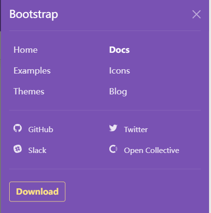

# 导航栏的隐藏和展开

以Bootstrap官网顶部的横向导航栏为例：


在大屏幕设备上，显示这么多内容，并保证他们的正常大小是没有问题的。可是如果在手机这种小屏幕设备上，就不好以这种方式显示，常见的我们可以将他们隐藏起来，用一个按钮将这些栏目向下展开，或者其他方式：




这里点击展开按钮后弹了一个新的窗口。

## 实现方式

关键：**媒体查询**

`collapse`和`xx-collapse`配合使用。

collapse类的声明如下：

:not(.show)表示匹配任何不是`.show`类的元素

```css
.collapse:not(.show) {
  display: none;
}
```

xx-collapse类的声明如下：

```css
@media (min-width: 768px) {
.navbar-expand-md .navbar-collapse {
    display: flex !important;
    flex-basis: auto;
  }
 }
```

也就是说如果不加`xx-collapse`类的化，所有拥有`collapse`类的元素的都不会显示，但是`xx-collapse`通过媒体查询，在窗口的最小宽度大于768px时，将这些元素的`display`属性改变了，并且用`!important`声明，拥有最高优先级。因此在大屏幕上这些元素会显示。

附上Bootstrap预定义的窗口尺度：

