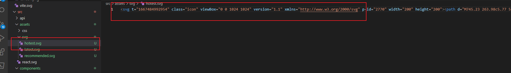
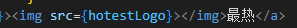
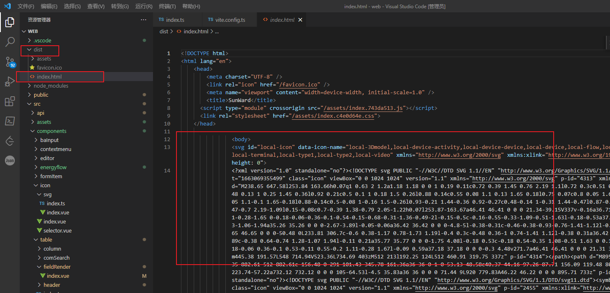

为什么要封装svg?

主要是针对使用本地svg的场景。

这里我们需要知道`svg`的引入方式，一种是将其保存到文件中，已``的方式引入，但这种方法失去了使用`svg`的自由，限制了功能。（例如我们不能动态改变`svg`的颜色）。





而使用`svg`标签的话，我们需要将`<path>`写在用的位置，比较麻烦。

**目标**

我们希望将`svg`保存在文件中，用一个组件加载这个文件的内容，并使用`svg`进行渲染。


## BuildAdmin的做法

在BuildAdmin框架下，我们将svg文件放在一个指定文件夹下（`./src/assets/icons/'`），其编写了一个插件，在打包时会执行这个插件，将svg以`symbol`的形式插入到html中。

https://developer.mozilla.org/zh-CN/docs/Web/SVG/Element/symbol



相当于，把本地图标转换成静态的dom元素了。

### 实现方式

- 编写插件`svgBuilder`

```ts
import { readFileSync, readdirSync } from 'fs'

let idPerfix = ''
let iconNames: string[] = []
const svgTitle = /<svg([^>+].*?)>/
const clearHeightWidth = /(width|height)="([^>+].*?)"/g
const hasViewBox = /(viewBox="[^>+].*?")/g
const clearReturn = /(\r)|(\n)/g
// 清理 svg 的 fill
const clearFill = /(fill="[^>+].*?")/g

function findSvgFile(dir: string): string[] {
    const svgRes = []
    const dirents = readdirSync(dir, {
        withFileTypes: true,
    })
    for (const dirent of dirents) {
        iconNames.push(`${idPerfix}-${dirent.name.replace('.svg', '')}`)
        if (dirent.isDirectory()) {
            svgRes.push(...findSvgFile(dir + dirent.name + '/'))
        } else {
            const svg = readFileSync(dir + dirent.name)
                .toString()
                .replace(clearReturn, '')
                .replace(clearFill, 'fill=""')
                .replace(svgTitle, ($1, $2) => {
                    let width = 0
                    let height = 0
                    let content = $2.replace(clearHeightWidth, (s1: string, s2: string, s3: number) => {
                        if (s2 === 'width') {
                            width = s3
                        } else if (s2 === 'height') {
                            height = s3
                        }
                        return ''
                    })
                    if (!hasViewBox.test($2)) {
                        content += `viewBox="0 0 ${width} ${height}"`
                    }
                    return `<symbol id="${idPerfix}-${dirent.name.replace('.svg', '')}" ${content}>`
                })
                .replace('</svg>', '</symbol>')
            svgRes.push(svg)
        }
    }
    return svgRes
}

// path是存放svg文件的路径
export const svgBuilder = (path: string, perfix: string = 'local') => {
    if (path === '') return
    idPerfix = perfix
    const res = findSvgFile(path)
    return {
        name: 'svg-transform',
        transformIndexHtml(html: string) {
            return html.replace(
                '<body>',
                `
                <body>
                <svg id="local-icon" data-icon-name="${iconNames.join(
                    ','
                )}" xmlns="http://www.w3.org/2000/svg" xmlns:xlink="http://www.w3.org/1999/xlink" style="position: absolute; width: 0; height: 0">
                ${res.join('')}
                </svg>
                `
            )
        },
    }
}

```

- 在vite.config.ts文件中使用插件

```ts
const viteConfig = ({ mode }: ConfigEnv): UserConfig => {
    
    return {
        plugins: [vue(), svgBuilder('./src/assets/icons/')],
    }
}
```

