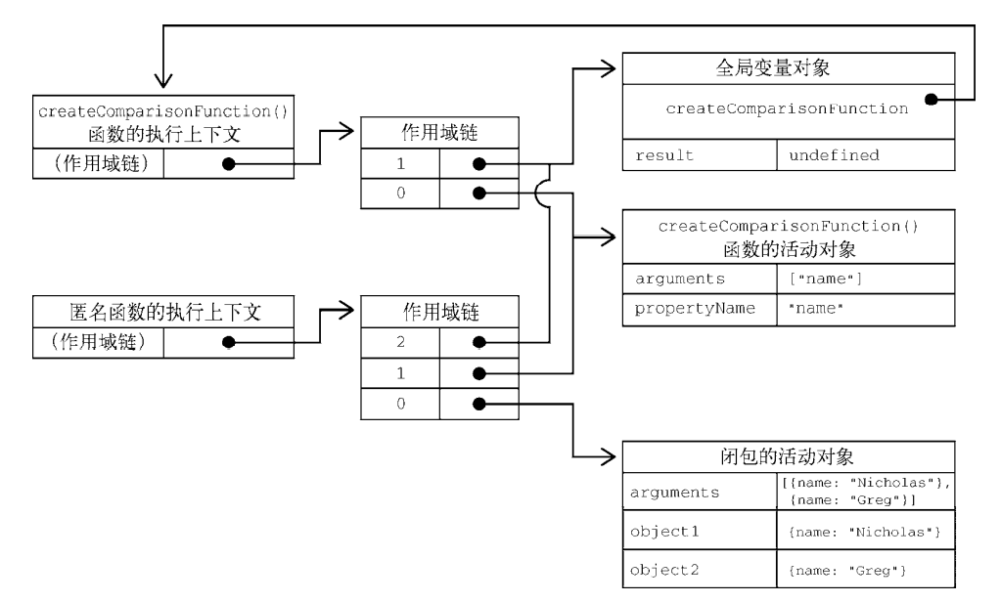
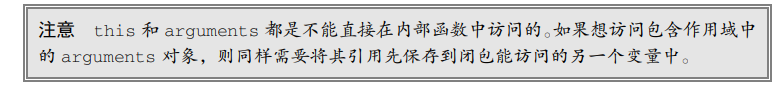
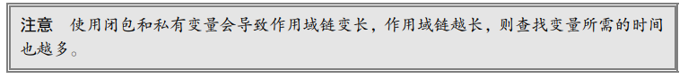

# Cap.10 函数

每个函数都是Function 类型的实例，而 Function 也有属性和方法。因为函数是对象，所以函数名就是指向函数对象的指针，而且**不一定**与函数本身紧密绑定。

四种定义函数的方式：

```
function sum (num1, num2) { 
 return num1 + num2; 
}  // 注意没有分号，意味着不能加分号

let sum = function(num1, num2) { 
 return num1 + num2; 
}; 

let sum = (num1, num2) => { 
 return num1 + num2; 
};

let sum = new Function("num1", "num2", "return num1 + num2"); // 不推荐
```

## 10.1 箭头函数

箭头函数不能使用 arguments、super 和 new.target，也不能用作构造函数。此外，箭头函数也没有 prototype 属性。

但箭头函数也是`Function`对象的实例。

## 10.2 函数名

ECMAScript 6 的所有函数对象都会暴露一个只读的 name 属性，其中包含关于函数的信息。多数情 况下，这个属性中保存的就是一个函数标识符，或者说是一个字符串化的变量名。即使函数没有名称， 也会如实显示成空字符串。如果它是使用 Function 构造函数创建的，则会标识成"anonymous"：

```
const myFunc1 = () => {console.log('fun 1')}
const myFunc1Cp = myFunc1
console.log(myFunc1Cp.name)

function foo() {} 
let bar = function() {}; 
let baz = () => {}; 
console.log(foo.name); // foo 
console.log(bar.name); // bar 
console.log(baz.name); // baz 
console.log((() => {}).name); //（空字符串）
console.log((new Function()).name); // anonymous 
```

## 10.3 理解参数

ECMAScript 函数既不关心传入的**参数个数**，也不 关心这些参数的**数据类型**。

是因为 ECMAScript 函数的参数在内部表现为一个数组。函数被调用时总会接收一个数组，但函数并不关心这个数组中包含什么。

与其他语言不同，在 ECMAScript 中的命名参数不会创建让之后的调用必须匹配的函数签名。这是因为**根本不存在验证命名参数的机制**。

### 10.3.1 箭头函数中的参数

如果函数是使用箭头语法定义的，那么传给函数的参数将不能使用 arguments 关键字访问，而只 能通过定义的命名参数访问。

## 10.4 没有重载

一个函数不能重复定义，因为ECMAScript的函数没有函数签名。

## 10.5 默认参数值

在 ECMAScript5.1 及以前，实现默认参数的一种常用方式就是检测某个参数是否等于 undefined， 如果是则意味着没有传这个参数，那就给它赋一个值：

```
function makeKing(name) { 
 name = (typeof name !== 'undefined') ? name : 'Henry'; 
 return `King ${name} VIII`; 
}
```

ECMAScript 6 之后就不用这么麻烦了，因为它支持显式定义默认参数了。下面就是与前面代码等价 的 ES6 写法，只要在函数定义中的参数后面用=就可以为参数赋一个默认值：

```
function makeKing(name = 'Henry') { 
 return `King ${name} VIII`; 
} 
console.log(makeKing('Louis')); // 'King Louis VIII' 
console.log(makeKing()); // 'King Henry VIII' 
```

arguments 对象的值不反映参数的默认值，只反映传给函数的参数。这也之前描述的一样，arguments 对象中是所有我们传递的参数。

### 10.5.1 默认参数作用域与暂时性死区

默认参数可以是求值表达式：

```
let makeKing = (name = 'Henry') => `King ${name}`; 
```

因为在**求值默认参数时**可以定义对象，也可以**动态调用函数**，所以函数参数肯定是在某个作用域中求值的。

求默认参数时，默认参数按照顺序进行初始化：

```
function makeKing(name = 'Henry', numerals = 'VIII') { 
 return `King ${name} ${numerals}`; 
} 

// 求默认参数的过程等价于
function makeKing() { 
 let name = 'Henry'; 
 let numerals = 'VIII'; 
 return `King ${name} ${numerals}`; 
}
```

因为参数是按顺序初始化的，所以后定义默认值的参数可以引用先定义的参数：

```
function makeKing(name = 'Henry', numerals = name) {  // look at numerals
 return `King ${name} ${numerals}`; 
} 
```

## 10.6 函数扩展与收集

### 10.6.1 扩展参数

如果函数希望接收的是一个一个的参数，而不是参数数组（求和时），使用`...`扩展运算符。

### 10.6.2 收集参数

收集参数是只，在函数的定义中，将所有传入的参数，收集到一个集合中：

```
function getSum(...values) { 
 // 顺序累加 values 中的所有值
 // 初始值的总和为 0 
 return values.reduce((x, y) => x + y, 0); 
} 
```

收集参数的前面如果还有命名参数，则只会收集其余的参数；因为收集参数的结果可变，所以只能把**它作为最后一个参数**。

箭头函数虽然不支持 arguments 对象，但支持收集参数的定义方式，因此也可以实现与使用 arguments 一样的逻辑：

```
let getSum = (...values) => { 
 return values.reduce((x, y) => x + y, 0); 
} 
```

## 10.7 函数声明与函数表达式

函数声明存在变量提升，可以先使用，后定义。

函数表达式不行，及时使用`var`关键字进行变量提升，引擎也只将其当成变量而不是函数。

## 10.8 函数作为值

函数名在ECMAScript就是变量，因此函数可以用于任何使用变量的地方。

## 10.9 函数内部

ES5: 函数内部存在两个特殊的对象：arguments 和 this。

ECMAScript 6 又新增 了 new.target 属性。

### 10.9.1 arguments

arguments 对象前面讨论过多次了，它是一个类数组对象，包含调用函数时传入的所有参数。arguments 对象其实还有一个 callee 属性，是一个指向 arguments 对象所在函数的 指针，在函数内部，可以使用它来代替函数名，实现函数逻辑与函数名解耦的目的：

```
function factorial(num) { 
 if (num <= 1) { 
 return 1; 
 } else { 
 return num * arguments.callee(num - 1);   // look 
 } 
} 
```

## 10.9.2 this

在标准函数中，this 引用的是把函数当成方法**调用**的上下文对象，这时候通常称其为 this 值（在 网页的全局上下文中调用函数时，this 指向 windows）。

在箭头函数中，this引用的是**定义**箭头函数的上下文。

调用的上下文和定义的上下文。

调用的上文文可能难以确定，定义时的上下文很容易确定。

在**事件回调**或**定时回调中**调用某个函数时，this 值指向的并非想要的对象。此时将 回调函数写成箭头函数就可以解决问题。这是因为箭头函数中的 this 会保留定义该函数时的上下文：

```
function King() { 
 this.royaltyName = 'Henry'; 
 // this 引用 King 的实例
 setTimeout(() => console.log(this.royaltyName), 1000); 
}
```

### 10.9.3 caller

该属性引用的是**调用当前函数**的函数：

```
function outer() { 
 inner(); 
} 
function inner() { 
 console.log(inner.caller);  //打印outer
} 
outer();  
```

### 10.9.4 new.target

如果函数正常调用（没有通过new），该属性是undefined。

## 10.10 函数属性与方法

原型、call、apply

## 10.11 函数表达式

函数声明存在函数声明提升，可以先使用后定义；

函数表达式看起来就像一个普通的变量定义和赋值，即创建一个函数再把它赋值给一个变量 functionName。这样创建的函数叫作匿名函数（anonymous funtion），因为 function 关键字后面没有 标识符。（匿名函数有也时候也被称为兰姆达函数）。**未赋值给其他变量**的匿名函数的 name 属性是空 符串：

```
let functionName = function(arg0, arg1, arg2) { 
 // 函数体 
}; 
```

## 10.12 递归

## 10.13 尾调用优化

ECMAScript 6 规范新增了一项内存管理优化机制，让 JavaScript 引擎在满足条件时可以重用栈帧。 具体来说，这项优化非常适合“尾调用”，即**外部函数的返回值**是一个**内部函数的返回值**：

```
function outerFunction() {   //外部函数
 return innerFunction(); // 尾调用  内部函数的返回值
} 
```

 ES6 **优化之前**，执行这个例子会在内存中发生如下操作：

 (1) 执行到 outerFunction 函数体，第**一个栈帧**被推到栈上。

(2) 执行 outerFunction 函数体，到 return 语句。计算返回值必须先计算 innerFunction。

 (3) 执行到 innerFunction 函数体，第**二个栈帧**被推到栈上。

 (4) 执行 innerFunction 函数体，计算其返回值。

 (5) 将返回值传回 outerFunction，然后 outerFunction 再返回值。 

(6) 将栈帧弹出栈外。

 ES6 **优化之后**，执行这个例子会在内存中发生如下操作：

(1) 执行到 outerFunction 函数体，**第一个栈帧被推到栈上**。

 (2) 执行 outerFunction 函数体，到达 return 语句。为求值返回语句，必须先求值 innerFunction。

上述过程一致。

 (3) 引擎发现**把第一个栈帧弹出栈外**也没问题，因为 innerFunction 的返回值也是 outerFunction 的返回值。

(4) 弹出 outerFunction 的栈帧。

 (5) 执行到 innerFunction 函数体，栈帧被推到栈上。

 (6) 执行 innerFunction 函数体，计算其返回值。

 (7) 将 innerFunction 的栈帧弹出栈外。

第一种情况下每多调用一次嵌套函数，就会多增加一个栈帧。而第二种情况下无论调用多 少次嵌套函数，都只有一个栈帧。

### 10.13.1 尾调用优化条件

代码在严格模式下执行；

外部函数的返回值是对尾调用函数的调用（return function()的形式）；

尾调用函数返回后不需要执行额外的逻辑；

尾调用函数**不是引用外部函数作用域**中**自由变量**的闭包。

```
// 无优化：尾调用是一个闭包
function outerFunction() { 
 let foo = 'bar'; 
 function innerFunction() { return foo; } 
 return innerFunction(); 
} 
```

## 10.14 闭包

**闭包指的是**那些**引用了另一个函数作用域中变量**的函数，通常是在嵌套函数中实现的。

函数执行时，每个执行上下文中都会有一个包含其中变量的对象。**全局上下文中的叫变量对象**，它 会在代码执行期间始终存在。而**函数局部上下文中的叫活动对象**，只在函数执行期间存在。

```
function createComparisonFunction(propertyName) { 
 return function(object1, object2) { 
 let value1 = object1[propertyName]; 
 let value2 = object2[propertyName]; 
 if (value1 < value2) { 
 return -1; 
 } else if (value1 > value2) { 
 return 1; 
 } else { 
 return 0; 
 } 
 }; 
} 
```



在以前，为了解决JS全局变量互相影响的问题，在定义模块时，使用闭包是一个策略，在外层函数，我们定义模块内部要使用的对象和函数，在内部函数，使用这些值，根据作用域链的搜索顺序，防止了全局变量的影响。

### 10.14.1 this对象

在闭包中使用 this 会让代码变复杂。如果**内部函数**没有使用箭头函数定义，则 this 对象会在运行时绑定到执行函数的上下文。如

```
window.identity = 'The Window'; 
let object = { 
 identity: 'My Object', 
 getIdentityFunc() { 
   return function() { 
   	return this.identity; 
   }; 
 } 
}; 
console.log(object.getIdentityFunc()()); // 'The Window' 
```

为什么匿名函数没有访问其包含作用域（getIdentityFunc()）的this对象呢？

前面介绍过，每个函数在被调用时都会自动创建两个特殊变量：this 和 arguments。**内部函数永远不可能直接访问外部函数**的这两个变量。但是，如果把 this 保存到闭包可以访问的另一个变量中， 则是行得通的。比如：

```
window.identity = 'The Window'; 
let object = { 
 identity: 'My Object', 
 getIdentityFunc() { 
   let that = this; 
   return function() { 
   	return that.identity; 
 	}; 
 } 
}; 
console.log(object.getIdentityFunc()()); // 'My Object'
```



### 10.14.2 内存泄漏

## 10.15 立即调用的函数表达式

立即调用的匿名函数又被称作立即调用的函数表达式（IIFE，Immediately Invoked Function  Expression）。

它类似于函数声明，但由于被包含在括号中，所以会被解释为函数表达式：

```
(function() { 
 // 块级作用域 
})(); 
```

第一个括号得到了一个函数，第二个括号立即执行这个函数。

在 ECMAScript 5.1 及以前，为了防止变量定义外泄，IIFE 是个非常有效的方式。 这样也不会导致闭包相关的内存问题，**因为不存在对这个匿名函数的引用**。因为以前没有块级作用域的概念，块级作用域内定义的变量可以在外部修改。

块级作用域出现后，IIFE的必要性就降低了。

说明 IIFE 用途的一个实际的例子，就是可以用**它锁定参数值**。比如：

```
let divs = document.querySelectorAll('div'); 
// 达不到目的！ 
for (var i = 0; i < divs.length; ++i) { 
 divs[i].addEventListener('click', function() { 
 console.log(i); 
 }); 
} 
```

var声明了变量`i`，事件内部引用了`i`，但是`i`并不属于事件的作用域；`i`是事件外部的，在外部循环中，一直被更改。因此每个`div`被点击都会打印总数。

**以前**，为了实现点击第几个就显示相应的索引值，需要借助 IIFE 来执行一个函数表达式，传 入每次循环的当前索引，从而“锁定”点击时应该显示的索引值：

```
let divs = document.querySelectorAll('div'); 
for (var i = 0; i < divs.length; ++i) { 
 divs[i].addEventListener('click', (function(frozenCounter) {
 return function() { 
 	console.log(frozenCounter); 
 }; 
 })(i)); 
} 
```

通过立即执行，让返回函数关联了内部变量`i`。

而使用 ECMAScript 块级作用域变量，就不用这么大动干戈了：

```
let divs = document.querySelectorAll('div'); 
for (let i = 0; i < divs.length; ++i) { 
 divs[i].addEventListener('click', function() { 
		console.log(i); 
 }); 
} 
```

在 ECMAScript 6 中，如果**对 for 循环使用块级作用域变量关键字**，在这里 就是 let，那么循环就会**为每个循环创建独立的变量**，从而让每个单击处理程序都能引用特定的索引。

`var`创建的都是全局作用域变量，即使在块级作用域内。

## 10.16 私有变量

在构造函数内，如果我们使用`this`为对象添加属性，那么这些属性是可以被访问的。

但是如果我们只使用`let`关键字创建变量，并添加方法维持对这些变量的引用，就可以实现私有变量的功能。

```
function Person(name) { 
 this.getName = function() { 
 return name; 
 }; 
 this.setName = function (value) { 
 name = value; 
 }; 
} 
```

这里，Person类并没有`name`属性，但是`getName`和`setName`方法都引用了`name`。

### 10.16.1 静态私有变量

```
(function() { 
 // 私有变量和私有函数
 let privateVariable = 10; 
 function privateFunction() { 
 return false; 
 } 
 // 构造函数
 MyObject = function() {}; 
 // 公有和特权方法
 MyObject.prototype.publicMethod = function() { 
   privateVariable++; 
 	return privateFunction(); 
 }; 
})(); 
```

这里**声明 MyObject 并没有使 用任何关键字**。因为不使用关键字声明的变量会创建在全局作用域中，所以 MyObject 变成了全局变量， 可以在这个私有作用域外部被访问。注意在严格模式下给未声明的变量赋值会导致错误。

这种模式下，私有变量和私有函数被所有实例共享，因为他们与原型关联。因为特权方法定义在原型上，所以同样是由实例共享的。特权方法作为一个闭包，始终引用着包含它的作用域。来看下面 的例子：

```
(function() { 
 let name = ''; 
 Person = function(value) { 
 name = value; 
 }; 
 Person.prototype.getName = function() { 
 return name; 
 }; 
 Person.prototype.setName = function(value) { 
 name = value; 
 }; 
})(); 
let person1 = new Person('Nicholas'); 
console.log(person1.getName()); // 'Nicholas' 
person1.setName('Matt'); 
console.log(person1.getName()); // 'Matt' 
let person2 = new Person('Michael'); 
console.log(person1.getName()); // 'Michael' 
console.log(person2.getName()); // 'Michael' 
```



### 10.16.2 模块模式

模块模式是指：在单例对象上实现隔离和封装，因为是单例模式，所以不存在实例共享属性和方法的问题。

```
let singleton = function() { 
 // 私有变量和私有函数
 let privateVariable = 10; 
 function privateFunction() { 
 return false; 
 } 
 // 特权/公有方法和属性
 return { 
   publicProperty: true, 
   publicMethod() { 
     privateVariable++; 
     return privateFunction(); 
   } 
 }; 
}(); 
```

### 10.16.3 模块增强模式

普通模块模块使用对象字面量的方式得到单例对象，另一个利用模块模式的做法是在返回对象之前先对其进行增强。**这适合单例对象需要是某个特定类 型的实例**，但又必须给它添加额外属性或方法的场景。来看下面的例子：

```
let singleton = function() { 
 // 私有变量和私有函数
 let privateVariable = 10; 
 function privateFunction() { 
 return false; 
 } 
 // 创建对象
 let object = new CustomType(); 
 // 添加特权/公有属性和方法
 object.publicProperty = true; 
 object.publicMethod = function() { 
   privateVariable++; 
   return privateFunction(); 
 }; 
 // 返回对象
 return object; 
}(); 
```

## 10.17 小结

 函数表达式与函数声明是不一样的。函数声明要求写出函数名称，而函数表达式并不需要。没有名称的函数表达式也被称为匿名函数。

 ES6 新增了类似于函数表达式的箭头函数语法，但两者也有一些重要区别。 

 JavaScript 中函数定义与调用时的参数极其灵活。arguments 对象，以及 ES6 新增的扩展操作符， 可以实现函数定义和调用的完全动态化（动态变量个数）。 

 函数内部也暴露了很多对象和引用，涵盖了函数被谁调用（caller）、使用什么调用（this.target），以及调用时传入了 什么参数（arguments）等信息。 

 JavaScript 引擎可以优化符合尾调用条件的函数，以节省栈空间。 

 闭包的作用域链中包含自己的一个**变量对象**（活动对象），然后是包含函数的变量对象，直到全局上下文的 变量对象。 

 通常，函数作用域及其中的所有变量在函数执行完毕后都会被销毁。 

 闭包在被函数返回之后，其作用域会一直保存在内存中，直到闭包被销毁。闭包是指返回的内部函数，这个内部函数维持了对外部函数的作用域内变量的引用。

 函数可以在创建之后立即调用，执行其中代码之后却不留下对函数的引用。 

 立即调用的函数表达式如果不在包含作用域中将返回值赋给一个变量（全局变量，或用返回值传递给变量），则其包含的所有变量都 会被销毁。 

 虽然 JavaScript 没有私有对象属性的概念，但可以使用闭包实现公共方法，访问位于包含作用域 中定义的变量。  可以访问私有变量的公共方法叫作特权方法。 

 特权方法可以使用**构造函数**或**原型模式通过自定义类型中实现**，也可以使**用模块模式**或模块增 强模式在**单例对象**上实现。

# Cap.11 期约与异步函数

**ECMAScript 6 及之后**的几个版本逐步加大了对异步编程机制的支持，提供了令人眼前一亮的新特 性。ECMAScript 6 新增了正式的 Promise（期约）引用类型，支持优雅地定义和组织异步逻辑。**接下 来几个版本增加了使用 async 和 await 关键字**定义异步函数的机制。

## 11.1 异步编程

早期的异步函数只能使用`setTimeout`实现，单异步返回值存在嵌套时，很容易产生”回调地狱“。

## 11.2 期约

期约的状态不能被JS读取，如果可以读取的话，很容易使用while循环实现同步的目的。

### **幂等性是什么？**

幂等操作的特点是其任意多次执行所产生的影响均与一次执行的影响相同。幂等函数，或幂等方法，是指可以使用相同参数重复执行，并能获得相同结果的函数。这些函数不会影响系统状态，也不用担心重复执行会对系统造成改变。


`Promise.resolve()`方法返回一个`Promise`，这个方法是幂等的，意味着，传入一个期约，返回的是相同的期约（完全相同）。

`Promise.reject()`并不是幂等的。

### 状态改变后的处理程序执行顺序

期约`resolve`或`reject`后，相关处理程序不会立即执行，而是**排期**。

跟在添加处理程序后的同步代码会先执行，这意味着即使期约立即完成，也是同步代码先执行。

即使期约一开始就是与附加处理程序关联的状态，执行顺序也是这样的。这个特性由 JavaScript 运行时保证，被称为**“非重入”（non-reentrancy） 特性**。下面的例子演示了这个特性：

```
// 创建解决的期约
let p = Promise.resolve(); 
// 添加解决处理程序
// 直觉上，这个处理程序会等期约一解决就执行
p.then(() => console.log('onResolved handler')); 
// 同步输出，证明 then()已经返回
console.log('then() returns'); 
// 实际的输出：
// then() returns 
// onResolved handler
```

在一个解决期约上调用 then()会把 onResolved 处理程序推进消息队列。但这个处理程序在**当前线程上的同步代码**执行完成前不会执行，注意是线程：

```
let p = Promise.resolve('ok');
p.then(()=>{console.log("on resolved handler")});
console.log(1);
console.log(2);
console.log(3);

//1
//2
//3
//on resolved handler
```

期约内的代码是异步执行的，但是期约状态改变后的执行程序，不会立即执行：

```
let synchronousResolve; 
// 创建一个期约并将解决函数保存在一个局部变量中
let p = new Promise((resolve) => { 
 synchronousResolve = function() { 
 console.log('1: invoking resolve()'); 
 resolve(); 
 console.log('2: resolve() returns'); 
 }; 
}); 
p.then(() => console.log('4: then() handler executes')); 
synchronousResolve(); 
console.log('3: synchronousResolve() returns'); 
// 实际的输出：
// 1: invoking resolve() 
// 2: resolve() returns   
// 3: synchronousResolve() returns 
// 4: then() handler executes 
```

1，2是期约内的代码，立即执行；3按顺序执行；4作为onResolve处理程序，最后执行。

### 传递解决值和拒绝理由

`onResolve`和`onReject`接收一个参数，该参数由`resolve()`和 ``函数传递。

除了使用`reject()`，还可以直接抛出错误。

### 拒绝期约的细节

期约可以以任何理由拒绝，包括 undefined，**但最好统一使用错误对**象。这样做主要是因为**创建 错误对象可以让浏览器捕获错误对象中的栈追踪信息，而这些信息对调试是非常关键的**。

### 11.2.4 期约连锁与期约合成

**期约连锁：**

在`then`中定义新的期约，解决回调地狱问题。

**期约合成：** `Promise.all()和 Promise.race()`

Promise 类提供两个将**多个期约实例**组合成**一个期约**的静态方法：Promise.all()和 Promise.race()。 而合成后期约的行为取决于内部期约的行为。

`Promise.all()`:

`Promise.all()`静态方法创建的期约会在一组期约**全部解决之后**再解决。这个静态方法接收一个 可迭代对象，返回一个新期约：

```
let p1 = Promise.all([ 
 Promise.resolve(), 
 Promise.resolve() 
]); 
// 可迭代对象中的元素会通过 Promise.resolve()转换为期约
let p2 = Promise.all([3, 4]); 
// 空的可迭代对象等价于 Promise.resolve() 
let p3 = Promise.all([]); 
// 无效的语法
let p4 = Promise.all(); 
// TypeError: cannot read Symbol.iterator of undefined
```

由于幂等性，可迭代对象内可以存在期约。

合成的期约只会在每个包含的期约都解决之后才解决：

```
let p = Promise.all([ 
 Promise.resolve(), 
 new Promise((resolve, reject) => setTimeout(resolve, 1000)) 
]); 
setTimeout(console.log, 0, p); // Promise <pending> 
p.then(() => setTimeout(console.log, 0, 'all() resolved!')); 
// all() resolved!（大约 1 秒后）
```

如果至少有一个包含的期约待定，则合成的期约也会待定。如果**有一个包含的期约拒绝**，则**合成的 期约也会拒绝**：

```
let p1 = Promise.all([new Promise(() => {})]); 
setTimeout(console.log, 0, p1); // Promise <pending> 
// 一次拒绝会导致最终期约拒绝
let p2 = Promise.all([ 
 Promise.resolve(), 
 Promise.reject(), 
 Promise.resolve() 
]); 
setTimeout(console.log, 0, p2); // Promise <rejected> 
// Uncaught (in promise) undefined
```

如果所有期约解决，合成期约的解决值是这些期约解决值组成的数组。

如果有期约拒绝，则第一个拒绝的期约会将自己的理由作为合成期约的拒绝理由。

### 11.2.5 期约扩展

**期约取消**

:zap:**期约进度通知**

```
class TrackablePromise extends Promise {
    constructor(executor) {
        const notifyHandlers = [];
        // 相当于 
        // new Promise((resolve, reject) => {
        //     return executor(resolve, reject, (status) => {
        //         notifyHandlers.map((handler) => handler(status));
        //     });
        // });

        // excutor是外部传入的函数，除了普通Promise的resolve, reject处理程序，还有一个额外的处理程序，用于追踪执行
        super((resolve, reject) => {
            return executor(resolve, reject, (status) => {
                notifyHandlers.map((handler) => handler(status));
            });
        });
        this.notifyHandlers = notifyHandlers;
    }
    // notify传入事件处理程序，类似于then和catch
    notify(notifyHandler) {
        this.notifyHandlers.push(notifyHandler);
        return this;
    }
}

let p = new TrackablePromise((resolve, reject, notify) => {
    function countdown(x) {
        console.log(x)
        if (x > 0) {
            notify(`${20 * x}% remaining`);  // 传入status
            setTimeout(() => countdown(x - 1), 1000);
        } else {
            resolve();
        }
    }
    countdown(5);
});
// executor
// 异步函数主体
// x > 0时调用notify处理程序
// x = 0时，进入兑现状态
// let executor = (resolve, reject, notify) => {
//     function countdown(x) {
//         if (x > 0) {
//             notify(`${20 * x}% remaining`);
//             setTimeout(() => countdown(x - 1), 1000);
//         } else {
//             resolve();
//         }
//     }
//     countdown(5);
// }

// 传入事件处理程序，x是期约进度
// notify的handler
p.notify((status) => {  
    return setTimeout(console.log, 0, 'progress:', status)  // console.log('progress: ${x}')
}
);
p.then(() => setTimeout(console.log, 0, 'completed'));
```

## 11.3 异步函数

ES8 的 async/await 旨在解决利用异步结构**组织代码的问题**。为此，ECMAScript 对函数进行了扩展， 为其增加了两个新关键字：async 和 await。

### async

async 关键字用于声明异步函数。这个关键字可以用在**函数声明**、**函数表达式**、**箭头函数**和**方法**（除了使用Function创建函数外）上：

```
async function foo() {} 
let bar = async function() {}; 
let baz = async () => {}; 
class Qux { 
 async qux() {} 
}
```

- 异步函数如果返回了值，这个值会被`Promise.resolve()`包装成期约。

- 异步函数的拒绝不会被`.catch`捕获

  ```
  async function foo() { 
   console.log(1); 
   Promise.reject(3); 
  } 
  // Attach a rejected handler to the returned promise 
  foo().catch(console.log); 
  console.log(2); 
  // 1 
  // 2 
  // Uncaught (in promise): 3 
  ```

### await

async关键字定义了异步函数，但是这些函数并没有暂停执行的能力，使用 await 关键字可以暂停异步函数代码的执行，等待期约解决：

```
async function foo() { 
 let p = new Promise((resolve, reject) => setTimeout(resolve, 1000, 3)); 
 console.log(await p); 
} 
```

注意，await 关键字会**暂停**执行异步函数后面的代码，让出 JavaScript 运行时的执行线程。这个行 为与生成器函数中的 yield 关键字是一样的。await 关键字同样是**尝试“解包”对象的值**，然后将这 个值传给表达式，再异步恢复异步函数的执行。

这意味着我们可以用await关键字拿到期约兑现函数传递的值。

```

async function demo(){
    const a = await new Promise((resolve)=>{
        setTimeout(()=>{
            resolve('hello world')
        }, 3000)
    })
    console.log(a)  // hello world
}
demo()
```

### 11.3.2 停止和恢复执行

**async/await 中真正起作用的是 await**。async 关键字，无论从哪方面来看，都不过是一个标识符。 毕竟，异步函数如果不包含 await 关键字，其执行基本上跟普通函数没有什么区别。

```
async function foo() { 
 console.log(2); 
 await null; 
 console.log(4); 
} 
console.log(1); 
foo(); 
console.log(3); 
// 1 
// 2 
// 3 
// 4 
```

执行过程：

(1) 打印 1；

(2) 调用异步函数 foo()； 

(3)（在 foo()中）打印 2； 

(4)（在 foo()中）await 关键字暂停执行，**为立即可用的值 null 向消息队列中添加一个任务**； 

**(5) foo()退出；**

(6) 打印 3； 

(7) 同步线程的代码执行完毕； 

(8) JavaScript 运行时从消息队列中取出任务，恢复异步函数执行； 

(9)（在 foo()中）恢复执行，await 取得 null 值（这里并没有使用）； 

(10)（在 foo()中）打印 4； (11) foo()返回。

**实际开发中，对于并行的异步操作我们通常更关注结果，而不依赖执行顺序。**

**平行执行：**

如果存在多个连续的`await`，那么后面的`await`一定会等到之前的执行完成后才执行：

```
async function randomDelay(id) { 
 // 延迟 0~1000 毫秒
 const delay = Math.random() * 1000; 
 return new Promise((resolve) => setTimeout(() => { 
 console.log(`${id} finished`); 
 resolve(); 
 }, delay)); 
} 
async function foo() { 
 const t0 = Date.now(); 
 await randomDelay(0); 
 await randomDelay(1); 
 await randomDelay(2); 
 await randomDelay(3); 
 await randomDelay(4); 
 console.log(`${Date.now() - t0}ms elapsed`); 
} 
foo(); 
// 0 finished 
// 1 finished 
// 2 finished 
// 3 finished 
// 4 finished 
// 877ms elapsed
```

上一个期约结束后，才执行下一个期约，但是一般来说，多个异步任务之前不需要保证顺序性：

```
async function foo1() {
    const t0 = Date.now();
    const promises = Array(5).fill(null).map((_, i) => randomDelay(i));
    for (const p of promises) {
        await p;
    }
    console.log(`${Date.now() - t0}ms elapsed`);
}
foo1(); 	

//1 finished: 113.66059140976259
//4 finished: 146.1377473420258
//3 finished: 232.2071188614374
//2 finished: 347.12717425115744
//0 finished: 561.5053623165725
//567ms elapsed  只暂停了最长期约的时间
```

即不要以同步的方式顺序写多个await，将他们放在循环里。