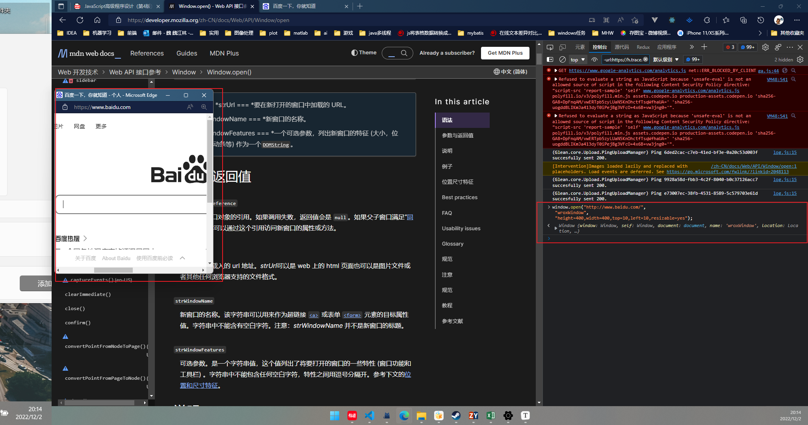

# Cap.12 BOM

ECMAScript 把浏览器对象模型（BOM，Browser Object Model）描述为 JavaScript 的核心，但实际上 **BOM 是使用 JavaScript 开发 Web 应用程序的核心**。BOM并不是JS的核心，只有在开发Web应用时，才是核心。

浏览器实现之间**共通的部分**成为了事实标准，为 Web 开发 提供了浏览器间互操作的基础。HTML5 规范中有一部分涵盖了 BOM 的主要内容，因为 W3C 希望将 JavaScript 在浏览器中最基础的部分标准化。

## 12.1 window对象

### 12.1.1 Global作用域

window对象被复用为Global对象，所有var声明的所有全局变量和函数都会变成window的属性和方法。

### 12.1.2 窗口关系

```
window.top === window // true
window.parent === window.top // 处于最上层
window.self === window // true 为了与top parent保持一致
```

### 12.1.3 窗口位置和像素比

```
window.screenTop // 浏览器窗口距离屏幕顶部的距离
```

**像素比：**

在Web开发中，我们使用的是[CSS 像素 - 术语表 | MDN (mozilla.org)](https://developer.mozilla.org/zh-CN/docs/Glossary/CSS_pixel)，一个 CSS 像素应当看起来是在距离观察者一臂之遥且像素密度为 96 DPI 的屏幕中的一个物理像素。如果屏 幕距离人眼是一臂长，则以这个角度计算的 CSS 像素大小约为 1/96 英寸。这样定义像素大小是为了在 不同设备上统一标准。比如，低分辨率平板设备上 12 像素（CSS 像素）的文字应该与高清 4K 屏幕下 12 像素（CSS 像素）的文字具有相同大小。（相同的css像素，在所有设备上的大小一致）。

### 12.1.4 窗口大小

- window.outerHeight, window.outerWidth 获取浏览器窗口的大小
- window.innerWidth，window.innerHeight 获取**页面视口**的大小，在移动设备上，window.innerWidth 和 window.innerHeight 返回视口的大小，也就是屏幕上 页面可视区域的大小。Mobile Internet Explorer 支持这些属性，但在 document.documentElement.  clientWidth 和 document.documentElement.clientHeight 中提供了相同的信息。在放大或缩小 页面时，这些值也会相应变化。
- document.documentElement.clientWidth 和 document.documentElement.clientHeight 返回**页面视口**的大小 。

在**其他移动浏览器中**，document.documentElement.clientWidth 和 document.documentElement.  clientHeight 返回的布局视口的大小，即渲染页面的实际大小。布局视口是相对于可见视口的概念， 可见视口只能显示整个页面的一小部分。Mobile Internet Explorer 把布局视口的信息保存在 document.body.clientWidth 和 document.body.clientHeight 中。在放大或缩小页面时，这些 值也会相应变化。

**因为桌面浏览器的差异，所以需要先确定用户是不是在使用移动设备，然后再决定使用哪个属性。**

### 12.1.5 视口位置

[视口概念 - CSS（层叠样式表） | MDN (mozilla.org)](https://developer.mozilla.org/zh-CN/docs/Web/CSS/Viewport_concepts)

视口代表当前可见的计算机图形区域。在 Web 浏览器术语中，通常与浏览器窗口相同，但不包括浏览器的 UI，菜单栏等——即指你正在浏览的文档的那一部分。

文档，可能会非常长。你的视口就是你现在所能见到的所有事物。

**浏览器窗口尺寸**通常无法满足完整显示整个页面，为此用户可以通过**滚动**在有限的视口中查看文档。度量**文档**相对于视口滚动距离的属性有两对，返回相等的值：window.pageXoffset/window.  scrollX 和 window.pageYoffset/window.scrollY

`scrollBy`, `scrollTo`

### 12.1.6 导航与打开新窗口

[Window.open() - Web API 接口参考 | MDN (mozilla.org)](https://developer.mozilla.org/zh-CN/docs/Web/API/Window/open)

window 对象有一个属性 opener，指向打开它的窗口。这个属性只在弹出窗口的最 上层 window 对象（top）有定义，是指向调用 window.open()打开它的窗口或窗格的指针。



### 12.1.7 定时器

最时机应用中，最好不要使用setInterval，因为上一次结束和下一次执行经历的时机是不确定。

### 12.1.8 系统对话框

系统提供的都是同步的模态对话框[弹框系统总结](./弹框系统总结.md)。

[window.alert - Web API 接口参考 | MDN (mozilla.org)](https://developer.mozilla.org/zh-CN/docs/Web/API/Window/alert)

[Window.confirm() - Web API 接口参考 | MDN (mozilla.org)](https://developer.mozilla.org/zh-CN/docs/Web/API/Window/confirm)	**`Window.confirm()`** 方法显示一个具有一个可选消息和两个按钮 (确定和取消) 的模态对话框。

[window.prompt - Web API 接口参考 | MDN (mozilla.org)](https://developer.mozilla.org/zh-CN/docs/Web/API/Window/prompt)显示一个对话框，对话框中包含一条文字信息，用来提示用户输入文字。

## 12.2 location对象

这个对象独特的地方在于，它既是 window 的属性，也是 document 的属性。也就是说， window.location 和 document.location 指向同一个对象。location 对象不仅保存着**当前加载文 档的信**息，也保存着把 **URL 解析为离散片段**后能够通过属性访问的信息（host，hostName，origin，search等）。

### 12.2.1 查询字符串

location.search 返回了从问号开始直到 URL 末尾的所有内容，但没有经过解析

```js
let getQueryStringArgs = function () {
    // 取得没有开头问号的查询字符串
    let qs = (location.search.length > 0 ? location.search.substring(1) : ""),
        // 保存数据的对象
        args = {};
    // 把每个参数添加到 args 对象
    for (let item of qs.split("&").map(kv => kv.split("="))) {
        let name = decodeURIComponent(item[0]),
            value = decodeURIComponent(item[1]);
        if (name.length) {
            args[name] = value;
        }
    } 
    return args;
} 
```

**URLSearchParams**提供了标准API：

```js
let qs = "?q=javascript&num=10";
let searchParams = new URLSearchParams(qs);
alert(searchParams.toString()); // " q=javascript&num=10" 
searchParams.has("num"); // true 
searchParams.get("num"); // 10 
searchParams.set("page", "3");
alert(searchParams.toString()); // " q=javascript&num=10&page=3" 
searchParams.delete("q");
alert(searchParams.toString()); // " num=10&page=3" 
```

### 12.2.2 操作地址

[window.location - Web API 接口参考 | MDN (mozilla.org)](https://developer.mozilla.org/zh-CN/docs/Web/API/Window/location)

## 12.3 navigator对象

[window.navigator - Web API 接口参考 | MDN (mozilla.org)](https://developer.mozilla.org/zh-CN/docs/Web/API/Window/navigator)

只读属性 **`Window.navigator`** 会返回一个 [`Navigator`](https://developer.mozilla.org/zh-CN/docs/Web/API/Navigator) 对象的引用，可以用于请求**运行当前代码**的应用程序的相关信息。

### 12.3.1 检查插件

`window.navigator.plugins`

### 12.3.2 注册处理程序

[Navigator.registerProtocolHandler() - Web API 接口参考 | MDN (mozilla.org)](https://developer.mozilla.org/zh-CN/docs/Web/API/Navigator/registerProtocolHandler)

## 12.4 screen对象

保存的是客户端显示器的信息。

## 12.5 history对象

[Window.history - Web API 接口参考 | MDN (mozilla.org)](https://developer.mozilla.org/zh-CN/docs/Web/API/Window/history)

### 12.5.1 导航

`go`, `back`, 'forward'.

### 12.5.2 历史状态管理

现代Web程序，用户每次点击都会触发页面更新的时代已经过去（动态渲染界面，不用重新请求页面）。

`hashchange`事件。

# Cap.13 客户端检测

## 13.2 用户代理

用户代理字符串：确定用户使用的是什么浏览器。

渲染引擎：Gecko-firefox, WebKir-safari

## 13.3 软件与硬件检测

### 13.3.2 浏览器元数据

