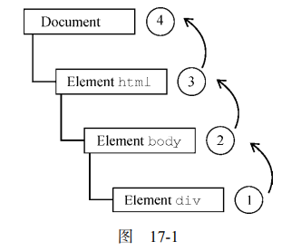
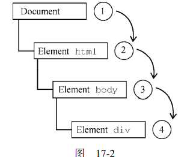
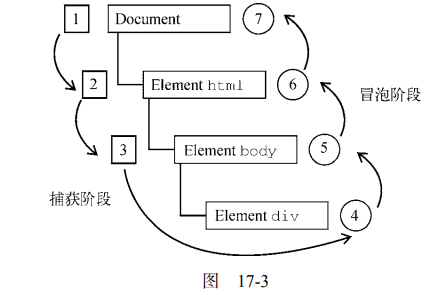

JavaScript 与 HTML 的交互是通过事件实现的，事件代表文档或浏览器窗口中某个有意义的时刻。

# 事件流

在第四代 Web 浏览器（IE4 和 Netscape Communicator 4）开始开发时，开发团队碰到了一个有意思 的问题：**页面哪个部分拥有特定的事件呢**？要理解这个问题，可以在一张纸上画几个同心圆。把手指放 到圆心上，则手指不仅是在一个圆圈里，而且是在所有的圆圈里。两家浏览器的开发团队都是以同样的 方式看待浏览器事件的。**当你点击一个按钮时，实际上不光点击了这个按钮，还点击了它的容器以及整 个页面。**

事件流描述了**页面接收事件的顺序**。

## 事件冒泡与事件捕获

事件冒泡从最底层（触发事件）的元素开始，一致向上传播，直到没有具体的元素。

```
<!DOCTYPE html> 
<html> 
<head> 
 <title>Event Bubbling Example</title> 
</head> 
<body> 
 <div id="myDiv">Click Me</div> 
</body> 
</html>
```

事件冒泡：



事件捕获：



事件捕获是越不具体的节点越先接收到事件，目的是防止事件的向下传播（例如对一个父div，禁用其下级Element的事件）。

由于旧版本浏览器不支持，因此实际当中几乎不会使用事件捕获。**通常建议使用事件冒泡，特殊情 况下可以使用事件捕获。**

## DOM事件流

DOM2 Events 规范规定事件流分为 3 个阶段：**事件捕获**、**到达目标**和**事件冒泡**。



注意上图的捕获阶段到body就结束了，捕获阶段的目的是为拦截事件提供可能。

下一阶段是在目标元素`div`上触发事件的“到达目标”阶段。

大多数支持 DOM 事件流的浏览器实现了一个小小的拓展。虽然 DOM2 Events 规范明确捕获阶段 命中事件目标，但现代浏览器都会**在捕获阶段**在**事件目标上触发事件**。最终结果是在事件目标上有**两个机会**来处理事件。

# 事件处理程序

## HTML事件处理程序

### DOM0 

DOM0支持使用通过指向onclick属性的方式定义事件处理程序，这个属性的值会被包装成函数，并且有一个特殊的参数`event`。

在动态创建的包装函数中，通过作用域链扩展，我们可以方便地使用document和事件目标上的属性：

```
function() { 
 with(document) { 
 with(this) { 
 // 属性值
 } 
 } 
} 
```

```
<input type="button" value="Echo Username" 
 onclick="console.log(username.value)"> 
```

```
btn.onclick = function() { 
 console.log(this.id); // "myBtn" 
};
```

### DOM2事件处理程序

DOM2为事件处理程序的赋值和移出添加了两个方法：addEventListener和removeEventListener。

# 事件对象

preventDefault()方法用于阻止特定事件的默认动作。比如，链接的默认行为就是在被单击时导 航到 href 属性指定的 URL。

任何可以通过 preventDefault()取消默认行为的事件，其事件对象（event）的 cancelable 属性都会设 置为 true。

# 内存与性能

在 JavaScript 中，页面中事件处理程序的数量与页面整体性能直接相关。原 因有很多。

首先，**每个函数都是对象**，都占用内存空间，对象越多，性能越差。

其次，为指定事件处理 程序所需访问 DOM 的次数会**先期造成整个页面交互**的延迟。（添加事件到指定的元素上需要时间）。

## 事件委托

只要可行，就应该考虑只给 document 添加一个事件处理程序，通过它处理页面中所有某种类型的 事件。

## 删除事件处理程序

如果元素被删除，但是元素绑定了事件处理程序，会导致元素无法被垃圾回收机制回收。

同时，元素被卸载后，如果事件处理程序不被清理，它们仍会残存在内存中。

# 事件模拟

道可以通过 JavaScript 在任何时候触发任意事件，而这些事件会被当成浏览器创建 的事件。这意味着同样会有事件冒泡，因而也会触发相应的事件处理程序。DOM3 规范指明了模拟特定类型事件的方式。

## DOM事件模拟

主要用于模拟事件触发

使用默认值模拟鼠标单击事件：

```
let btn = document.getElementById("myBtn"); 
// 创建 event 对象
let event = document.createEvent("MouseEvents"); 
// 初始化 event 对象
event.initMouseEvent("click", true, true, document.defaultView, 
 0, 0, 0, 0, 0, false, false, false, false, 0, null); 
// 触发事件
btn.dispatchEvent(event);
```

## 自定义DOM事件

自定义的事件需要通过DOM事件模拟触发。

例如:

```
let div = document.getElementById("myDiv"),
    event;
    
div.addEventListener("myevent", (event) => {
    console.log("DIV: " + event.detail);
});

document.addEventListener("myevent", (event) => {
    console.log("DOCUMENT: " + event.detail);
});
if (document.implementation.hasFeature("CustomEvents", "3.0")) {
    event = document.createEvent("CustomEvent");
    event.initCustomEvent("myevent", true, false, "Hello world!");
    div.dispatchEvent(event);
} 
```

添加了`myevent`事件箭头，通过js代码触发该事件的处理程序。

类似vue中的自定义事件，例如在子组件中点击了某个按钮，或做了某种操作，触发父组件的事件处理程序。

