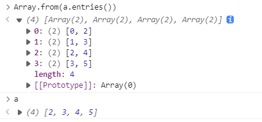
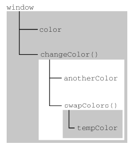
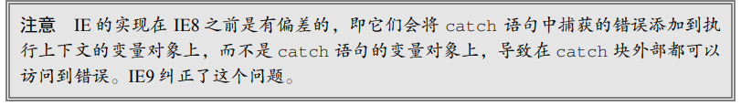
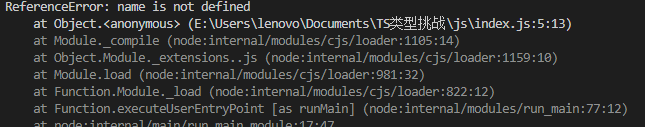
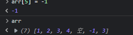
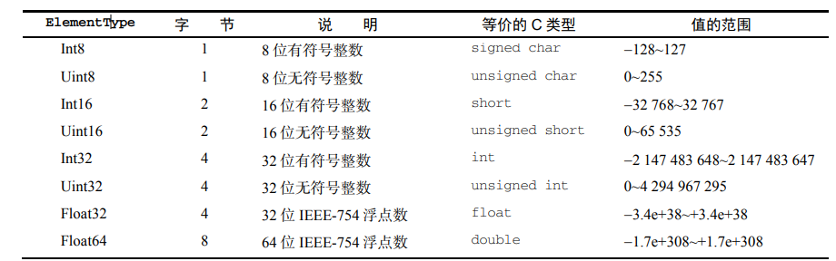

# 符号

Symbol 是原始值（基础数据类型），且 Symbol 实例是唯一、不可变的。它的产生是因为要用来唯一的标记，进而用作**非字符串形式**的**对象属性**，是确保对象属性使用唯一标识符，不会发生属性冲突的危险。

## 全局符号

```javascript
let fooGlobalSymbol = Symbol.for("foo"); // 创建新符号
let otherFooGlobalSymbol = Symbol.for("foo"); // 重用已有符号
console.log(fooGlobalSymbol === otherFooGlobalSymbol); // true
```

## 符号作为属性

```
let s1 = Symbol('foo');
let o = {
	[s1]: 'foo val'
};
```

# 函数

## *函数

function * name（） 这种函数命名方式会定义一个生成器函数 (generator function)，它返回一个 Generator 对象。
调用一个生成器函数并不会马上执行它里面的语句，而是返回一个这个生成器的 迭代器 （ iterator ）对象。当这个迭代器的 next() 方法被首次（后续）调用时，其内的语句会执行到第一个（后续）出现yield的位置为止，yield 后紧跟迭代器要返回的值。或者如果用的是 yield*（多了个星号），则表示将执行权移交给另一个生成器函数（当前生成器暂停执行）。
next()方法返回一个对象，这个对象包含两个属性：value 和 done，value 属性表示本次 yield 表达式的返回值，done 属性为布尔类型，表示生成器后续是否还有 yield 语句，即生成器函数是否已经执行完毕并返回。

**普通迭代器**

```javascript
class Emitter {
	constructor (max){
		this.max = max;
		this.idx = 0;
		
	}
	* [Symbol.iterator](){
		while(this.idx < this.max){
			yield this.idx++;
		}
	}
}

let emitter = new Emitter(5);
for(const x of emitter){
	console.log(x);
}
```

# 语言基础

## 数据类型

### Null类型

Null 类型同样只有一个值，即特殊值 null。逻辑上讲，**null 值表示一个空对象指针**，这也是给 typeof 传一个 null 会返回"object"的原因。

### Number类型

Number 类型使用 **IEEE 754 格式**表示整 数和浮点值（在某些语言中也叫双精度值）。不同的**数值类型**相应地也有不同的**数值字面量格式**。

字面量格式：

- 整数

```
let intNum = 55; // 整数
```

- 八进制和十六进制

整数也可以用八进制（以 8 为基数）或十六进制（以 16 为基数）字面量表示。对于八进制字面量， 第一个数字必须是零（0），然后是相应的八进制数字（数值 0~7）。如果字面量中包含的数字超出了应 有的范围，就会忽略前缀的零，后面的数字序列会被当成十进制数，如下所示：

```
let octalNum1 = 070; // 八进制的 56 
let octalNum2 = 079; // 无效的八进制值，当成 79 处理
let octalNum3 = 08; // 无效的八进制值，当成 8 处理
```

ECMAScript 2015 或 ES6 中的八进制值通过前缀 0o 来表示；严格模式下，前缀 0 会被视为语法错误，如果要表示 八进制值，应该使用前缀 0o。——译者注

```
let hexNum1 = 0xA; // 十六进制 10 
let hexNum2 = 0x1f; // 十六进制 31
```

使用八进制和十六进制格式创建的数值在所有数学操作中都被视为十进制数值。

- 浮点值

要定义浮点值，数值中**必须包含小数点**，而且**小数点后面必须至少有一个数字**。虽然小数点前面**不是必须有整数**，但推荐加上。

## 数值转换

### 字符串

- 如果字符串包含数值字符，包括数值字符前面带加、减号的情况，则转换为一个十进制数值。 因此，Number("1")返回 1，Number("123")返回 123，Number("011")返回 11（忽略前面 的零）
- 如果字符串包含有效的浮点值格式如"1.1"，则会转换为相应的浮点值（同样，忽略前面的零）。
- 如果字符串包含有效的十六进制格式如"0xf"，则会转换为与该十六进制值对应的十进制整 数值。
- 如果是空字符串（不包含字符），则返回 0。
- 如果字符串包含除上述情况之外的其他字符，则返回 NaN。

### 对象

对象，调用 valueOf()方法，并按照上述规则转换返回的值。如果转换结果是 NaN，则调用 toString()方法，再按照转换字符串的规则转换。

# 循环

## for-in 和 for-of

`for-in`遍历对象所有**属性**，`for-of`遍历对象所有**可迭代元素**；

因此，对于一个Array对象，`for-in`会输出下标，因为会将Array进行转换：




# Cap.4 变量、作用域与内存

## 原始值与引用值

ECMAScript 变量可以包含两种不同类型的数据：原始值和引用值。原始值（primitive value）就是 最简单的数据，引用值（reference value）则是由多个值构成的对象。

原始值数据类型：Undefined、Null、Boolean、Number、String 和 Symbol（7中数据类型中的6个，只要Object不是原始值类型）。与其他语义不同，字符串不是用对象表示的。因此在JS中，我们不能对原始字符串进行修改，只能创建新的字符串。

只有引用值可以动态添加**后面可以使用的属性**，即添加时不会报错，但之后无法使用。

### 参数传递

JS中所有函数的参数都是按值传递，但函数参数是一个对象时，这个对象的引用被复制到另一个变量，因此在函数内部我们能够改变原始对象的值。如果我们将参数重新赋值时，不会影响保存对象引用的原始变量。

```
function setName(obj) { 
 obj.name = "Nicholas"; 
 obj = new Object(); 
 obj.name = "Greg"; 
} 
let person = new Object(); 
setName(person); 
console.log(person.name);  // "Nicholas" 
```

### 确定类型

`typeof`适合用来判断变量是否是原始类型，更确切地说，它是判断一 个变量是否为字符串、数值、布尔值或 undefined 的最好方式。**不包括null**

如果值是null或对象，typeof返回`object`。

如果值是对象，ECMAScript 提供了 instanceof 操作符：

```
console.log(person instanceof Object); // 变量 person 是 Object 吗？
console.log(colors instanceof Array); // 变量 colors 是 Array 吗？
console.log(pattern instanceof RegExp); // 变量 pattern 是 RegExp 吗？
```

按照定义，所有引用值都是 Object 的实例，**因此通过 instanceof 操作符检测任何引用值和 Object 构造函数都会返回 true**。类似地，如果用 instanceof 检测原始值，则始终会返回 false， 因为原始值不是对象。


## 执行上下文与作用域

执行上下文简称上下文，每个上下文都有一个关联的**变量对象**，而这个上下文中定义的**所有变量和函数**都存在于这个对象上。虽然**无法通过代码**访问变量对象，但后台 处理数据会用到它。

全局上下文是最外层的上下文，在浏览器中全局上下文是window对象；

每个函数都有自己的上下文，其**活动对象**用作变量对象，活动对象最初只有 一个定义变量：arguments。（**活动对象**：在JavaScript 中 ，**当一个 函数 被调用 的 时候，就会产生一个特殊 的对象** ： 活动对象 。 这个 对象中 包含了参数列表和arguments 对象 等属性。 由于 活动对象 是 变量对象的 特例，因此它包含 变量对象 所有 的 属性，如 变量 定义， 函数 定义等。）

```
var color = "blue"; 
function changeColor() { 
 let anotherColor = "red"; 
 function swapColors() { 
 let tempColor = anotherColor; 
 anotherColor = color; 
 color = tempColor; 
 // 这里可以访问 color、anotherColor 和 tempColor 
 } 
 // 这里可以访问 color 和 anotherColor，但访问不到 tempColor 
 swapColors(); 
} 
// 这里只能访问 color 
changeColor(); 
```



### 作用域链增强

执行上下文主要有**全局上下文**和**函数上下文**两种（eval()调用内部存在第三种上下文），但有 其他方式来增强作用域链。某些语句会导致在作用**域链**前端临时添加一个上下文，这个上下文在代码执 行后会被删除：

- try/catch
- with

对 with 语句来说，会向作用域链前端添加**指定的对象**；对 catch 语句而言，则会创建一个新的变量对象，这个变量对象会包含要抛出的错误 对象的声明：

```
function buildUrl() { 
 	let qs = "?debug=true"; 
 with(location){ 
 	let url = href + qs; 
 } 
 return url; 
} 
```

location是一个对象，例如react-router中的location。

这里，with 语句将 location 对象作为上下文，因此 location 会被添加到作用域链前端。 buildUrl()函数中定义了一个变量 qs。当 with 语句中的代码引用变量 href 时，实际上引用的是 location.href，也就是自己变量对象的属性。在引用 qs 时，引用的则是定义在 buildUrl()中的那 个变量，它定义在函数上下文的变量对象上。而在 with 语句中使用 var 声明的变量 url 会成为函数 上下文的一部分，可以作为函数的值被返回；但像这里使用 let 声明的变量 url，因为被限制在**块级作 用域**（稍后介绍），所以在 with 块之外没有定义。



### 变量声明

使用var声明变量，**变量会添加到最接近的上下文**。

```
{
    var name = '123'
}
console.log(name) // 123
```

以上说明普通的块并不会产生一个上下文，name被添加到全局上下文中。

```
{
    let name = '123'
}
console.log(name)
```



全局上下文没有定义name。而let声明的变量只在当前作用域内可以访问，不会添加到上下文。

## 垃圾回收

JavaScript 是使用垃圾回收的语言，也就是说**执行环境**（浏览器，V8引擎）负责在代码执行时管理内存。

在浏览器的发展史上，用到过两种主要的标记策略：标记清理和引用计数；**标记清理**是一种标记策略，通过标记清理标记应该销毁的变量。

### 标记清理

- 垃圾回收执行时，给所有在内存中的变量加上标记；
- 将所有在上下文中的变量，以及这些变量引用的变量去掉标记；
- 回收仍然被标记的变量。

### 引用计数

```js
function problem() { 
 let objectA = new Object(); 
 let objectB = new Object(); 
 objectA.someOtherObject = objectB; 
 objectB.anotherObject = objectA; 
} 
problem()
```

假设problem定义在全局上下文中，当problem执行结束后返回全局上下文时，执行垃圾回收，这是objectA，objectB都在内存中，而全局上下文以及全局上下文中不包含对objectA和objectB的引用，所有他们会被回收。

而在引用计数下，由于发生互相引用，因此不会被清理。

### 内存管理

- 隐藏类和删除操作

运行期间，V8 会将创建的对象与隐藏类关联起来，以**跟踪它们的属性特征**。

[javascript - V8中的隐藏类（Hidden Classes）和内联缓存（Inline Caching）_个人文章 - SegmentFault 思否](https://segmentfault.com/a/1190000039247203?sort=newest)

因为JavaScript是动态的，可以在程序运行中增加或删除属性。

而我们需要一个结构来储存类的属性，在Java中这是静态的，类的属性一经定义不能增加或删除。这样带来的好处就是，属性的值（或是属性的指针）可以彼此间间隔固定的偏移量储存在一段连续的内存空间中。通过属性的类型可以轻松确定它的偏移量，但是由于Javascript中在运行时可以动态地改变属性类型，所以在Javascript中是这种方法是不可能实现的。

因此在js中使用相同的方法会导致更高的性能消耗，鉴于字典表这种查找属性内存位置的方式如此低效，V8使用了一种截然不同的方法进行改进，隐藏类。其实，抛开隐藏类作用在运行时的区别不谈，它和Java中的固定对象结构十分相似。在阅读下面的内容之前，请明确两个重点，第一，V8会为**每个对象关联一个隐藏类**，第二，隐藏类的目的是**优化属性的访问速度**。

- 内存泄漏

JavaScript 中的内存泄漏大部分是由不合理的 引用导致的。

1、在函数中意外声明全局变量

```
function setName() { 
 name = 'Jake'; 
} 
```

2、闭包

```
let outer = function() { 
 let name = 'Jake'; 
 return function() { 
 return name; 
 }; 
}; 
```

调用 outer()会导致分配给 name 的内存被泄漏。以上代码执行后创建了一个**内部闭包**，只要返回 的函数存在就不能清理 name，因为闭包一直在引用着它。假如 name 的内容很大（不止是一个小字符 串），那可能就是个大问题了。

## 小结

JavaScript 变量可以保存两种类型的值：原始值和引用值。原始值可能是以下 6 种原始数据类型之 一：Undefined、Null、Boolean、Number、String 和 Symbol。原始值和引用值有以下特点：

- 原始值大小固定，因此保存在栈内存上。
- 引用值是对象，存储在堆内存上。
- 包含引用值的变量实际上只包含指向相应对象的一个指针，而不是对象本身。
- typeof 操作符可以确定值的**原始类型**，而 instanceof 操作符用于确保值的引用类。

任何变量（不管包含的是原始值还是引用值）都存在于某个执行上下文中（也称为作用域）。这个 上下文（作用域）决定了变量的生命周期，以及它们可以访问代码的哪些部分。执行上下文可以总结 如下：

- 执行上下文分全局上下文、函数上下文和块级上下文。
- 变量的执行上下文用于确定什么时候释放内存。

JavaScript 是使用垃圾回收的编程语言，开发者不需要操心内存分配和回收。JavaScript 的垃圾回收 程序可以总结如下：

- 离开作用域的值会被自动标记为可回收，然后在垃圾回收期间被删除。
- 主流的垃圾回收算法是标记清理，即先给当前不使用的值加上标记，再回来回收它们的内存。
- 解除变量的引用不仅可以消除循环引用（=null），而且对垃圾回收也有帮助。为促进内存回收，全局对 象、全局对象的属性和循环引用都应该在不需要时解除引用

# Cap.5 基本引用类型

## 5.３原始值包装类型

- 字符串

字符串是原始值，但是我们仍然可以调用其方法：

```
let s1 = "some text"; 
let s2 = s1.substring(2); 
```

原始值本身不是对象，因此逻辑上不应该有方法。这是因为后台进行了很多处理，从而实现了上述操作。具体来说，当 第二行访问 s1 时，是以**读模式**访问的，也就是要从内存中读取变量保存的值。在以读模式访问字符串 值的任何时候，后台都会执行以下 3 步：

(1) 创建一个 String 类型的实例；

(2) 调用实例上的特定方法； 

(3) 销毁实例。

可以把这 3 步想象成执行了如下 3 行 ECMAScript 代码：

```
let s1 = new String("some text"); 
let s2 = s1.substring(2); 
s1 = null; 
```

这种行为可以让原始值拥有对象的行为。对布尔值和数值而言，以上 3 步也会在后台发生，只不过 使用的是 **Boolean** 和 **Number** 包装类型而已。

引用类型和原始值包装类型的声明周期不同，自动创建的原始值包装对象则只存在于访问它的那行代码执行期间。这意味着不能在运行时给原始值添加属性和方法。比如下面的例子：

```
let s1 = "some text"; 
s1.color = "red"; 
console.log(s1.color); // undefined
```

这里的第二行代码尝试给字符串 s1 添加了一个 color 属性。可是，第三行代码访问 color 属性时， 它却不见了。原因就是第**二行代码运行时会临时创建一个 String 对象**，而当第三行代码执行时，这个对 象已经被销毁了。实际上，第三行代码在这里创建了自己的 String 对象，但这个对象没有 color 属性。

使用 new 调用原始值包装类型的构造函数，与调用同名的转型函数并不一样。例如：

```
let value = "25"; 
let number = Number(value); // 转型函数
console.log(typeof number); // "number" 
let obj = new Number(value); // 构造函数
console.log(typeof obj); // "object" 
```

在这个例子中，变量 number 中保存的是一个值为 25 的原始数值，而变量 obj 中保存的是一个 Number 的实例。Number只是将字符串转成了数字，而new 操作创建的是Numbe实例。

### 字符串

- substring，substr，和slice方法异同

对 slice()和 substring()而言，第二个参数是提取结 束的位置（即该位置之前的字符会被提取出来）。对 substr()而言，第二个参数表示返回的子字符串数量。 任何情况下，省略第二个参数都意味着提取到字符串末尾。

##　5.4单例内置对象

ECMA-262 对内置对象的定义是“任何由 **ECMAScript 实现**（Nodejs，V8）提供、与宿主环境无关，并在 ECMAScript 程序开始执行时就存在的对象”。包括 Object、Array 和 String。本节介绍 ECMA-262 定义的另外两个单例内置对象：Global 和 Math。

### 5.4.1Global

isNaN()、isFinite()、parseInt()和 parseFloat()，实际上都是 Global 对象的方法。除 了这些，Global 对象上还有另外一些方法。

- URL编码
- eval()方法

这个方法就是一个完 整的 ECMAScript 解释器，它接收一个参数，即一个要执行的 ECMAScript（JavaScript）字符串。来看 一个例子：

```
eval("console.log('hi')"); 
```

上面这行代码的功能与下一行等价：

```
console.log("hi");
```

## 5.5小结

JavaScript 中的对象称为引用值，几种内置的引用类型可用于创建特定类型的对象。

JavaScript 比较独特的一点是，函数实际上是 Function 类型的实例，也就是说函数也是对象。因 为函数也是对象，所以**函数也有方法**，可以用于增强其能力。

# Cap.6 集合引用类型

## 6.1Object

创建对象的两种方式：new操作符和对象字面量：

```
let person = new Object(); 
person.name = "Nicholas"; 
person.age = 29; 

let person = { 
 name: "Nicholas", 
 age: 29 
}; 
```

这里`={}`会产生一个表达式上下文。

 在使用对象字面量表示法定义对象时，**并不会实际调用** Object 构造函数。

**参数传递**

这种模式非常适合函数有大量可选参数的情况。一般来说，命名参数更直观，但在 可选参数过多的时候就显得笨拙了。**最好的方式是**对必选参数使用命名参数，再通过一个对象字面量来封装多个可选参数。

## 6.2Array

### 6.2.1创建数组

与对象一样，在使用数组字面量表示法创建数组不会调用 Array 构造函数。

**两个 ES6 新增的**用于创建数组的静态方法：from()和 of()。from()用于将 **类数组结构**转换为**数组实例**，而 of()用于将**一组参数**转换为**数组实例**。

### 6.2.2数组空位

使用数组字面量初始化数组时，可以使用一串逗号来创建空位（hole）。ECMAScript 会将逗号之间 相应索引位置的值当成空位，**ES6 规范重新定义了该如何处理这些空位**。

可以像下面这样创建一个空位数组：

```
const options = [,,,,,]; // 创建包含 5 个元素的数组
console.log(options.length); // 5 
console.log(options); // [,,,,,] 
```

ES6 新增的方法和迭代器与早期 ECMAScript 版本中存在的方法行为不同。ES6 新增方法普遍将这 些空位当成存在的元素，只不过值为 undefined：

```
const options = [1,,,,5]; 
for (const option of options) { 
 console.log(option === undefined); 
} 
// false 
// true 
// true 
// true 
// false 

const a = Array.from([,,,]); // 使用 ES6 的 Array.from()创建的包含 3 个空位的数组
for (const val of a) { 
 alert(val === undefined); 
} 
// true 
// true 
// true 
alert(Array.of(...[,,,])); // [undefined, undefined, undefined] 
for (const [index, value] of options.entries()) { 
 alert(value); 
} 
// 1 
// undefined 
// undefined 
// undefined 
// 5
```

ES6 之前的方法则会忽略这个空位，但具体的行为也会因方法而异：

```
const options = [1,,,,5]; 
// map()会跳过空位置
console.log(options.map(() => 6)); // [6, undefined, undefined, undefined, 6] 
// join()视空位置为空字符串
console.log(options.join('-')); // "1----5" 
```

ES6之前的方法会跳过空位，而ES6之后会仍然遍历该位置。

### 6.2.3数组索引

数组的length可以被修改，通过修改，可以对数组增加或删除元素。删除元素好理解；增加长度时，会将新元素设为undefined。

```
const options = [1,,,,5]; 
// map()会跳过空位置
console.log(options.map(() => 6)); // [6, undefined, undefined, undefined, 6] 
// join()视空位置为空字符串
console.log(options.join('-')); // "1----5" 
```




### 6.2.4 检测数组

使用 instanceof 的问题是假定只有一个全局执行上下文。如果网页里有多个框架，则可能涉及两 个不同的全局执行上下文，因此就会有两个不同版本的 Array 构造函数。

为解决这个问题，ECMAScript 提供了 Array.isArray()方法。这个方法的目的就是确定一个值是 否为数组，而不用管它是在哪个全局执行上下文中创建的。来

### 6.2.5迭代器方法

在 ES6 中，Array 的原型上暴露了 3 个用于检索数组内容的方法：keys()、values()和 entries()。keys()返回数组索引的迭代器，values()返回数组元素的迭代器，而 entries()返回 **索引/值对**的迭代器。

### 6.2.11 操作方法

- concat

isConcatSpreadable符号控制数组能否被打平。

- slice
- splice 非常强大，可以实现指定位置删除和插入。

### 6.2.13 迭代方法

- every：对数组每一项都运行传入的函数，如果对**每一项函数都返回 true，则这个方法返回 true**。
- filter：对数组每一项都运行传入的函数，函数返回 true 的项会**组成数组之后返回**。
- forEach：对数组每一项都运行传入的函数，没有返回值。
- map：对数组每一项都运行传入的函数，**返回由每次函数调用的结果构成的数组**。
- some：对数组每一项都运行传入的函数，如果有一项函数返回 true，则这个方法返回 true。

### 6.2.14 归并方法

- reduce

## 6.3 定型数组

数组中元素的类型是指定的。产生的原因是JavaScript默认的双精度数值表示形式在与其他语言程序交互时，需要进行类型转换，花费了许多额外的时间。
### 6.3.2  ArrayBuffer

Float32Array 实际上是一种“视图”，可以允许 JavaScript 运行时访问一块名为 ArrayBuffer 的 预分配内存。**ArrayBuffer 是所有定型数组及视图引用的基本单位**.

ArrayBuffer()是一个普通的 JavaScript 构造函数，可用于在内存中分配特定数量的字节空间。

ArrayBuffer 一经创建就不能再调整大小。不过，可以使用 slice()复制其全部或部分到一个新 实例中：

```
const buf1 = new ArrayBuffer(16); 
const buf2 = buf1.slice(4, 12); 
alert(buf2.byteLength); // 8 
```

ArrayBuffer 某种程度上类似于 C++的 malloc()，但也有几个明显的区别。

- malloc()在分配失败时会返回一个 null 指针。ArrayBuffer 在分配失败时会抛出错误。
- malloc()可以利用虚拟内存，因此最大可分配尺寸**只受可寻址系统内存限制**。ArrayBuffer 分配的内存不能超过 Number.MAX_SAFE_INTEGER（2^53 - 1）字节。
- malloc()调用成功**不会初始化实际的地址**。声明 ArrayBuffer 则会将所有二进制位初始化 为 0。
- 通过 malloc()分配的堆内存除非调用 free()或程序退出，否则系统不能再使用。而**通过声明 ArrayBuffer 分配的堆内存可以被当成垃圾回收，不用手动释放**。

不能仅通过对 ArrayBuffer 的引用就读取或写入其内容。要读取或写入 ArrayBuffer，就必须 通过视图。视图有不同的类型，但引用的都是 ArrayBuffer 中存储的二进制数据。

### 6.3.3 DataView

```
// 创建一个16字节的buf
const buf = new ArrayBuffer(16); 

// DataView 默认使用整个 ArrayBuffer 
const fullDataView = new DataView(buf); 
alert(fullDataView.byteOffset); // 0 
alert(fullDataView.byteLength); // 16 
alert(fullDataView.buffer === buf); // true 

// 构造函数接收一个可选的字节偏移量和字节长度
// byteOffset=0 表示视图从缓冲起点开始
// byteLength=8 可以使用8个字节
const firstHalfDataView = new DataView(buf, 0, 8); 
alert(firstHalfDataView.byteOffset); // 0 
alert(firstHalfDataView.byteLength); // 8 
alert(firstHalfDataView.buffer === buf); // true 

// 如果不指定，则 DataView 会使用剩余的缓冲
// byteOffset=8 表示视图从缓冲的第 9 个字节开始
// byteLength 未指定，默认为剩余缓冲
const secondHalfDataView = new DataView(buf, 8); 
alert(secondHalfDataView.byteOffset); // 8
alert(secondHalfDataView.byteLength); // 8 
alert(secondHalfDataView.buffer === buf); // true 
```

要通过 DataView 读取缓冲，还需要几个组件：

- 首先是要读或写的**字节偏移量**。可以看成 DataView 中的某种“地址”。
- DataView 应该使用 ElementType 来实现 JavaScript 的 Number 类型到缓冲内二进制格式的转 换。
- 最后是内存中值的字节序。默认为大端字节序。



DataView 为上表中的每种类型都暴露了 get 和 set 方法，这些方法使用 byteOffset（字节偏移 量）定位要读取或写入值的位置。类型是可以互换使用的，如下例所示：

```
// 在内存中分配两个字节并声明一个 DataView 
const buf = new ArrayBuffer(2); 
const view = new DataView(buf); 

// 说明整个缓冲确实所有二进制位都是 0 
// 检查第一个和第二个字符
alert(view.getInt8(0)); // 0 
alert(view.getInt8(1)); // 0 
// 检查整个缓冲
alert(view.getInt16(0)); // 0 
// 将整个缓冲都设置为 1 
// 255 的二进制表示是 11111111（2^8 - 1）
view.setUint8(0, 255); 
// DataView 会自动将数据转换为特定的 ElementType 
// 255 的十六进制表示是 0xFF 
view.setUint8(1, 0xFF); 
// 现在，缓冲里都是 1 了
// 如果把它当成二补数的有符号整数，则应该是-1 
alert(view.getInt16(0)); // -1 

```

**字节序**

大端字节序：最高位在第一个字节（最左边），默认为大端字节序。

### 6.3.4 定性数组

定型数组是另一种形式的 ArrayBuffer 视图。虽然概念上与 DataView 接近，但定型数组的区别 在于，它**特定于一种 ElementType** 且遵循系统**原生的字节序**。相应地，定型数组提供了适用面更广的 API 和更高的性能。设计定型数组的目的就是提高与 WebGL 等原生库交换二进制数据的效率。由于定 型数组的二进制表示对操作系统而言是一种容易使用的格式，JavaScript 引擎可以重度优化算术运算、 按位运算和其他对定型数组的常见操作，因此使用它们速度极快。

**上溢和下溢**

上溢的位不会影响相邻索引：

```
// 长度为 2 的有符号整数数组
// 每个索引保存一个二补数形式的有符号整数
// 范围是-128（-1 * 2^7）~127（2^7 - 1），只有8位
const ints = new Int8Array(2); 
// 长度为 2 的无符号整数数组
// 每个索引保存一个无符号整数
// 范围是 0~255（2^7 - 1）
const unsignedInts = new Uint8Array(2); 

// 索引只取最低有效位上的 8 位
unsignedInts[1] = 256; // 0x100 
// 1被舍弃
console.log(unsignedInts); // [0, 0] 
unsignedInts[1] = 511; // 0x1FF 
// 1被舍弃
console.log(unsignedInts); // [0, 255] 
```

下溢的位会被转换为其无符号的等价值：

```
// 0xFF 是以二补数形式表示的-1（截取到 8 位）, 
// 但 255 是一个无符号整数
unsignedInts[1] = -1 // 0xFF (truncated to 8 bits) 
console.log(unsignedInts); // [0, 255] 
// 上溢自动变成二补数形式
// 0x80 是无符号整数的 128，是二补数形式的-128 
ints[1] = 128; // 0x80 
console.log(ints); // [0, -128] 
// 下溢自动变成二补数形式
// 0xFF 是无符号整数的 255，是二补数形式的-1 
ints[1] = 255; // 0xFF 
console.log(ints); // [0, -1] 
```

原理是：api将内存中指定的位置为我们设定的值，而如何解析这个值，由对象决定。

`ints[1] = 128;`将内存中的二进制位设置为`0x80 `，因为是有符号数，这个二进制数对应的值是-128.

## Map

