# Proxy

[Proxy - JavaScript | MDN (mozilla.org)](https://developer.mozilla.org/en-US/docs/Web/JavaScript/Reference/Global_Objects/Proxy)

```javascript
let o = {name: 'wjl', age: 13, walk: ()=>{console.log('慢慢走')}}

const proxy_o = new Proxy(o, {
    get(taget, prop, receiver){
        console.log(`获取${prop}`)
        console.log(arguments)  // target prop
        return Reflect.get(...arguments)
    }
})

console.log(proxy_o.name)
```

`Proxy`对象和他的名称一样，作为一个对象的代理存在。我们通过一个`Proxy`实例代理`o`，之后我们对`o`的操作也需要通过`proxy_o`，非则代理就失去了意义。

代理让我们能够监控对对象的操作，`Vue3`使用`Proxy`实现对象监听。

## normal objects和exotic objecs

`js`中的对象默认有`[[Get]]`等方法，定义了默认操作，我们访问对象属性时，例如：`obj.x`，会执行：

- The `x` property is searched up the [prototype chain](https://developer.mozilla.org/en-US/docs/Web/JavaScript/Inheritance_and_the_prototype_chain) until it is found.
- If `x` is a data property, the property descriptor's `value` attribute is returned.
- If `x` is an accessor property, the getter is invoked, and the return value of the getter is returned.

在该语言中，这个过程没有任何特别之处——这只是因为普通对象在默认情况下有一个[[Get]]内部方法，该方法是用这种行为定义的。obj。x属性访问语法简单地调用对象上的[[Get]]方法，对象使用自己的内部方法实现来确定返回什么。

`array`不是普通对象，因为它有`length`属性（普通对象没有），以及`[[DefineOwnProperty]]`方法，自动更改`length`的值。

其内部方法的实现与普通对象不同的称为`exotic objec`。代理使开发人员能够完全定义自己的`exotic`对象。

# Reflect

`Reflect`通常伴随`Proxy`出现，

1，将object对象一些内部的方法，放到Reflect对象上。比如：object.defineProperty

说明：现阶段这些方法存在于object和Reflect对象上，未来只存在于Reflect对象上。

**意义：也就是说，从`Reflect`对象上可以拿到语言内部的方法。**

- **从`Reflect`对象上可以拿到语言内部的方法。**
- **操作对象出现报错时返回false**
- **让操作对象都变为函数式编程**
- **保持和proxy对象的方法一一对象**

# 面试题

## Proxy

如果我们想要监视某个对象中的属性读写，我们可以使用ES5中提供的`Object.defineProperty`这样的方法来去为我们的对象添加属性，这样的话我们就可以捕获到我们对象中属性的读写过程。

这种方法实际上运用的非常广泛，在`Vue3.0`**以前的版本**就是使用这样的一个方法来去实现的数据响应，从而完成双向数据绑定。

在ES2015当中全新设计了一个叫做Proxy类型，他就是专门为对象设置访问代理器的，那如果你不理解什么是代理可以想象成门卫，也就是说不管你进去那东西还是往里放东西都必须要经过这样一个代理。

通过Proxy就可以轻松监视到对象的读写过程，相比于defineProperty，Proxy他的功能要更为强大甚至使用起来也更为方便，那下面我们具体来看如何去使用Proxy。

这里我们定义一个person对象，我们通过new Proxy的方式来去为我们的person来创建一个代理对象。

Proxy构造函数的第一个参数就是我们需要代理的对象，这里是person，第二个参数也是一个对象，我们可以把这个对象称之为代理的处理对象，这个对象中可以通过get方法来去监视属性的访问，通过set方法来去介绍对象当中设置属性这样的一个过程。

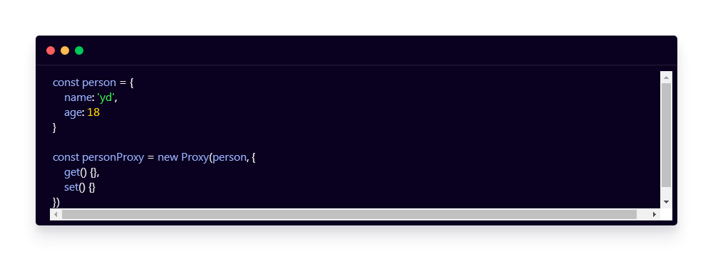

我们先来看get方法，这个方法最简单可以接收两个参数，第一个就是所代理的目标对象，第二个就是外部所访问的这个属性的属性名。这个方法的返回值将会作为外部去访问这个属性得到的结果。

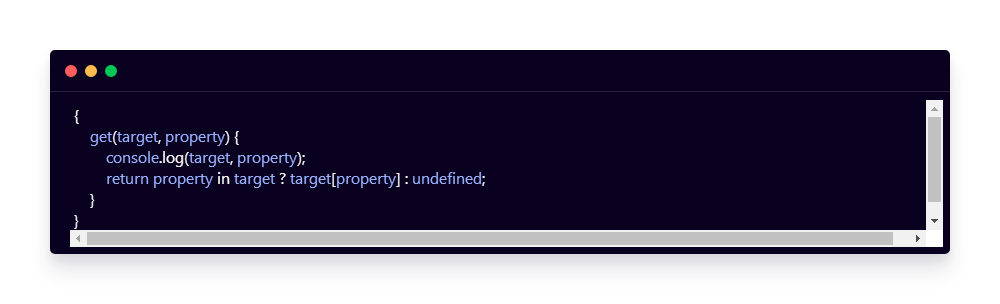

我们再来看下set方法，这个方法默认接收三个参数, 分别是代理目标对象，以及我们要写入的属性名称还有最后我们要写入的属性值。

我们可以做一些校验，比如说如果设置的是age，他的值就必须是整数，否则就抛错。

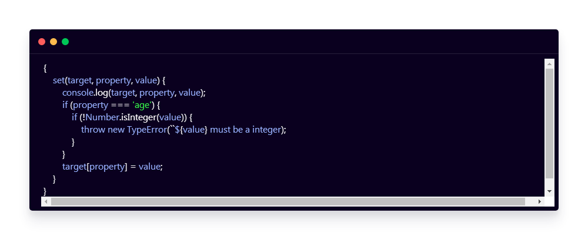

以上就是Proxy的一些基本用法，在以后Proxy会用的越来越多，Vue3.0开始就开始使用Proxy去实现内部的数据响应了。

## Proxy 对比 `defineProperty`

了解了Proxy的基本用法过后接下来我们再深入探讨一下相比于`Object.defineProperty`, Proxy到底有哪些优势。

首先最明显的优势就是在于Proxy要更为强大一些，那这个强大具体体现在`Object.defineProperty`**只能监听到对象属性的读取或者是写入**，而Proxy除读写外还可以监听对象中**属性的删除**，对对象当中**方法的调用**等等。

这里我们为person对象定义一个Proxy对象，在Proxy对象的处理对象中的外的添加一个deleteProperty的代理方法，这个方法会在外部对当前这个代理对象进行delete操作时会自动执行。

这个方法同样接收两个参数，分别是代理目标对象和所要删除的这个属性的名称。

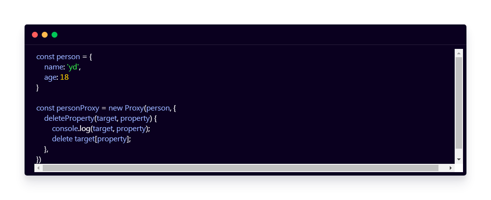

这是Object.defineProperty无法做到的, 除了delete以外, 还有很多其他的对象操作都能够被监视到，列举如下。

get: 读取某个属性
set: 写入某个属性
has: in 操作符调用
deleteProperty: delete操作符调用
getProperty: Object.getPropertypeOf()
setProperty: Object.setProtoTypeOf()
isExtensible: Object.isExtensible()
preventExtensions: Object.preventExtensions()
getOwnPropertyDescriptor: Object.getOwnPropertyDescriptor()
defineProperty: Object.defineProperty()
ownKeys: Object.keys(), Object.getOwnPropertyNames(), Object.getOwnPropertSymbols()
apply: 调用一个函数
construct: 用new调用一个函数。

接下来我们来看第二点优势就是对于数组对象进行监视，

通常我们想要监视数组的变化，基本要依靠重写数组方法，这也是Vue的实现方式，proxy可以直接监视数组的变化。以往我们想要通过Object.defineProperty去监视数组的操作最常见的方式是重写数组的操作方法，这也是Vue.js中所使用的方式，大体的方式就是通过自定义的方法去覆盖掉数组原型对象上的push，shift之类的方法，以此来劫持对应的方法调用的过程。

我们这里来看如何直接使用Proxy对象来对数组进行监视。这里我们定义一个list数组，然后对这个list数组进行Proxy监视。

在这个Proxy对象的处理对象上我们去添加一个set方法，用于监视数据的写入，在这个方法的内部我们打印参数的值，然后再target对象上设置传入的值，最后返回一个true表示写入成功。

这样我们再外部对数组的写入都会被监视到，例如我们这里通过push向数组中添加值。

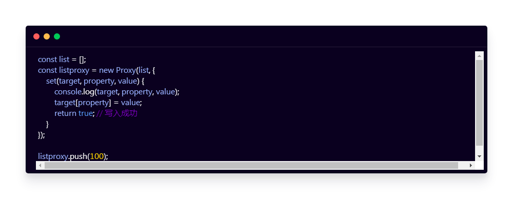

Proxy内部会自动根据push操作推断出来他所处的下标，每次添加或者设置都会定位到对应的下标property。

数组其他的也谢操作方式都是类似的，我们这里就不再演示了。这就是Proxy对数组的一个监视。他的功能还是非常强大的，这一点如果我们放在Object.defineProperty上要想去实现的话就会特别的麻烦。

最后相比于Object.defineProperty还有一点优势就是，Proxy是以非入侵的方式监管了对象的读写，那也就是说一个已经定义好的对象我们不需要对对象本身去做任何的操作，就可以监视到他内部成员的读写，而defineProperty的方式就要求我们必须按特定的方式单独去定义对象当中那些被监视的属性。

对于一个已经存在的对象我们要想去监视他的属性我们需要做很多额外的操作。这个优势实际上需要有大量的使用然后在这个过程当中去慢慢的体会。

## Reflect

Reflect是ECMAScript2015中提供的一个全新的内置对象，如果按照java或者c#这类语言的说法，Reflect属于一个静态类，也就是说他不能通过new的方式去构建一个实例对象。只能够去调用这个静态类中的静态方法。

这一点应该并不陌生，因为在javascript中的Math对象也是相同的，Reflect内部封装了一系列对对象的底层操作，具体一共提供了14个静态方法，其中有1个已经被废弃掉了，那还剩下13个，仔细去查看Reflect的文档你会发现这13个方法的方法名与Proxy的处理对象里面的方法成员是完全一致的。

其实这些方法就是Proxy处理对象那些方法内部的默认实现，你可能觉得这句话不是很好理解，我们这里来用代码说明一下。

这里我们定义一个proxy对象。只是proxy处理对象中什么也没有写，通过前面的介绍我们可以知道，我们可以在这个proxy处理对象中去添加不同的方法成员来去监听对象所对应的操作。

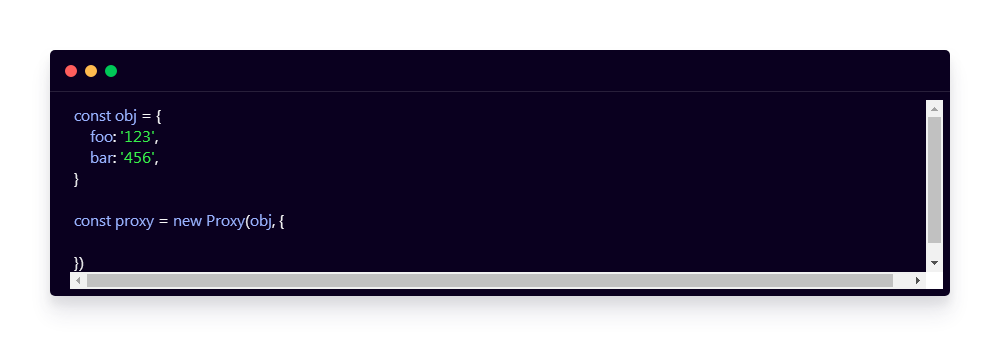

如果说我们没有添加具体的处理方法例如get或者set，那他内部这些get或者set是怎样执行的呢？其实proxy处理对象内部默认实现的逻辑就是调用了Reflect对象当中所对应的方法。

那也就是说，我们没有定义get方法就等同于是定义了一个get方法，在内部将参数原封不动的交给Reflect的get方法，结果是一样的。

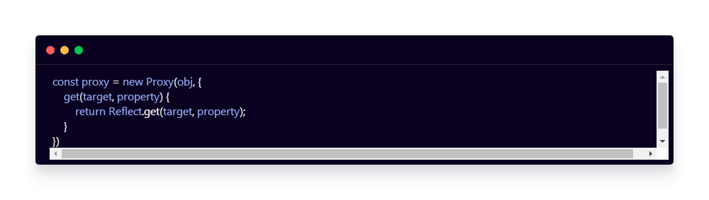

那这也就表明我们在实现自定义的get或者set这样的逻辑时更标准的做法是，先去实现自己所需要的监视逻辑，最后再去返回通过Reflect中对应的方法的一个调用结果。

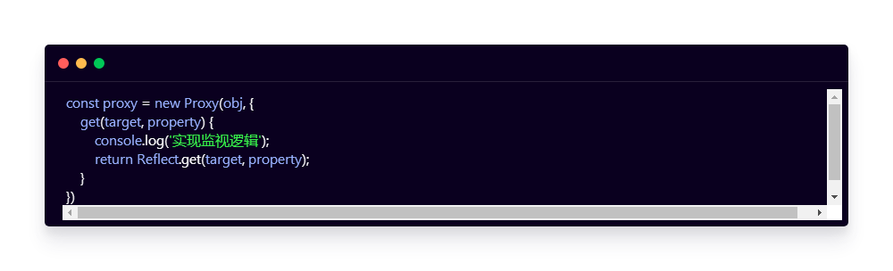

Reflect对象的用法其实很简单，mdn上实际上已经有了非常清晰的介绍，但是大多数人接触到这个对象的第一个感觉就是为什么要有Reflect这样一个对象。也就是说他的价值具体体现在什么地方。

个人认为Reflect对象最大的意义就是**他提供了一套统一操作Object的API**，因为在这之前我们去操作对象时有可能使用Object对象上的方法，也有可能使用像delete或者是in这样的操作符，这些对于新手来说实在是太乱了，并没有什么规律。

Reflect对象就很好的解决了这样一个问题，他统一了对象的操作方式，我们可以通过几个简单的例子来看一下。

这里我们先定义一个obj对象，然后在对象当中定义name和age。按照传统的方式如果我们需要判断这个对象中是否存在某个属性，我们需要使用in这个语句，用到in操作符，删除name属性我们需要使用到delete语句。而如果说我们需要获取对象中所有的属性名，那有需要去使用Object.keys这样的方法。

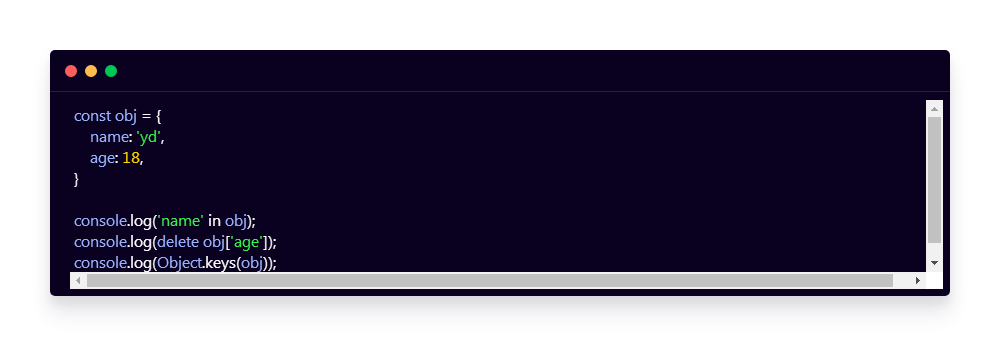

那也就是说我们同样都是去操作这个对象，但是我们一会需要用操作符的方式，一会又需要用到某一个对象当中的方法。

换做现在Reflect对象就提供了一个统一的方式，那我们去判断这个对象当中是否存在某一个属性我们可以使用Reflect.has方法。

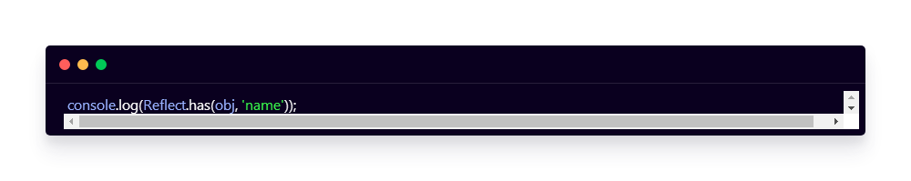

删除一个属性我们可以使用deleteProperty方法。

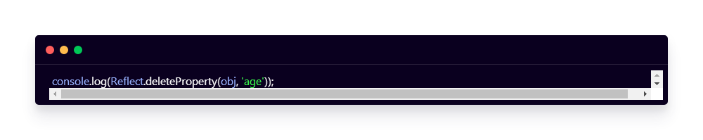

对于想要获取对象中所有的属性名我们可以使用ownKeys方法，那这样的一种体验也会更为合理一点，当然这只是个人的一个感悟，这个还是需要个人多多体会。

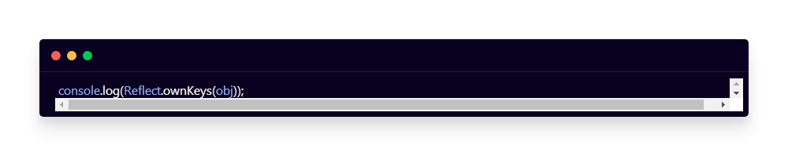

需要注意的一点是，目前以前的那些对象的操作方式还是可以使用的，但是ECMAScript他希望经过一段时间的过渡过后以后的标准中就会把之前的那些方法把他给废弃掉。

所以我觉得我们现在就应该去了解这13个方法以及他们各自取代的用法。这些内容在mdn上都有完整的描述，我们这里就不重复了。

## vue2 数组监听

[列表渲染 — Vue.js (vuejs.org)](https://v2.cn.vuejs.org/v2/guide/list.html#数组更新检测)

数组内部的变化，包括使用我们常用的数组函数，push，pop等。都不能被setter函数检测到，只有当整个数组被换掉才会被检测到。

Vue2为了解决这个问题采用的方式是提供一组新的数组变异函数。换掉Array的原型用新的变异函数，在自定义的变异函数里做更新视图的操作。

1. 以原来的Array原型为模板，创建新模板对象

   ```
   const oldArrayProto = Array.prototype;
   const newArrProto = Object.create(oldArrayProto);
   ```

2. 重写新模板的push pop 等数组变异函数

   ```
       ['push'， 'pop'].forEach(methodName => {
         newArrProto[methodName] = function () {
   
           console.log("更新视图")
           oldArrayProto[methodName].call(this， ...arguments)
         }
   });
   ```

3. 在扫描中替换data中Array对象的原型

   ```
   if (Array.isArray(data)) {
       data.__proto__ = newArrProto
     }
   ```

**Note:** Vue 不能检测以下数组的变动：

1. 当你利用索引直接设置一个数组项时，例如：vm.items[indexOfItem] = newValue
2. 当你修改数组的长度时，例如：vm.items.length = newLength

仍存在的问题
用 Object.defineProperty这种方法去监听数据和视图的改变，**当遇到复杂对象的时候需要对所有的对象进行深度遍历来给属性设置上getter和setter函数**，这会导致首屏加载速度很慢。针对这个问题 Vue3 将响应式的实现由
Object.defineProperty换成了Proxy。实现在数据要用的时候再添加响应式提高了首屏加载速度。

## vue2动态添加响应式属性

[深入响应式原理 — Vue.js (vuejs.org)](https://v2.cn.vuejs.org/v2/guide/reactivity.html#检测变化的注意事项)

对于已经创建的实例，Vue 不允许动态添加根级别的响应式 property。但是，可以使用 `Vue.set(object, propertyName, value)` 方法向嵌套对象添加响应式 property。例如，对于：

```
Vue.set(vm.someObject, 'b', 2)
```

您还可以使用 `vm.$set` 实例方法，这也是全局 `Vue.set` 方法的别名：

```
this.$set(this.someObject,'b',2)
```

有时你可能需要为已有对象赋值**多个新 property**，比如使用 `Object.assign()` 或 `_.extend()`。但是，这样添加到对象上的新 property **不会触发更新**。在这种情况下，你应该用原对象与要混合进去的对象的 property 一起创建一个新的对象。

```
// 代替 `Object.assign(this.someObject, { a: 1, b: 2 })`
this.someObject = Object.assign({}, this.someObject, { a: 1, b: 2 })
```