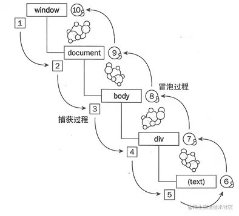

[React17事件机制 - 掘金 (juejin.cn)](https://juejin.cn/post/7164583106920316941)



## 三种事件绑定方式

- 行内HTML事件绑定

  - ```HTML
    <div onclick="handleClick()">
        test
    </div>
    <script>
        let handleClick = function(){
            // 一些处理代码..
        }
        // 移除事件
        handleClick = function(){}
    </script>
    复制代码
    ```

  -  缺点：js和html代码耦合了

- 事件处理器属性(DOM0)

  - ```HTML
    <div id="test">
        test
    </div>
    <script>
        let target = document.getElementById('test')
        // 绑定事件
        target.onclick = function(){
            // 一些处理代码..
        }
        target.onclick = function(){
            // 另外一些处理代码...会覆盖上面的
        }
        // 移除事件
        target.onclick = null
    </script>
    复制代码
    ```

  -  缺点：作为属性使用，一次只能绑定一个事件，多次赋值会覆盖，**只能处理冒泡阶段**

- addEventListener(DOM2)

  - ```HTML
    <div id="test">
        test
    </div>
    <script>
        let target = document.getElementById('test')
        // 绑定事件
        let funcA = function(){
            // 一些处理代码..
        }
        let funcB = function(){
            // 一些处理代码..
        }
        // 添加冒泡阶段监听器
        target.addEventListener('click',funcA,false)
        // 添加捕获阶段监听器
        target.addEventListener('click',funcB,true)
        // 移除监听器
        target.removeEventListener('click', funcA)
    </script>
    复制代码
    ```

  -  就是为了绑定事件而生的api，拓展性最强，现在开发者一般都用addEventListener绑定事件监听器

## 事件传播，事件冒泡

[事件传播(事件捕获与事件冒泡) - gitByLegend - 博客园 (cnblogs.com)](https://www.cnblogs.com/gitByLegend/p/10492553.html)

[DOM事件传播机制 - 简书 (jianshu.com)](https://www.jianshu.com/p/1eb41968c8e3)

当一个事件发生以后，它会在不同的DOM节点之间传播（propagation）。这种传播分为三个阶段：


- 第一阶段：从window对象传导到目标节点，称为“捕获阶段”(capture phase)。
- 第二阶段：在目标节点上触发，称为“目标阶段”(target phase)。
- 第三阶段：从目标节点传导回window对象，称为“冒泡阶段”(bubbling phase)。
   这种三阶段的传播模型，会使得一个事件在多个节点上触发。
   比如：

事件传播是一个过程，事件捕获、事件冒泡是其中的特定阶段。

> 作者：左冬的博客
> 链接：https://www.jianshu.com/p/1eb41968c8e3
> 来源：简书
> 著作权归作者所有。商业转载请联系作者获得授权，非商业转载请注明出处。


## 事件代理（委托）

当节点的数量较多时，如果给每个节点都进行事件绑定的话，内存消耗大，可将事件绑定到其父节点上统一处理，减少事件绑定的数量。

- 将事件都代理到了根节点上，减少了事件监听器的创建，节省了内存

- 磨平浏览器差异，开发者无需兼容多种浏览器写法。如想阻止事件传播时需要编写`event.stopPropagation()` 或 `event.cancelBubble = true`，在React中只需编写`event.stopPropagation()`即可。

- 对开发者友好。只需在对应的节点上编写如`onClick`、`onClickCapture`等代码即可完成`click`事件在该节点上冒泡节点、捕获阶段的监听，统一了写法。


作者：字节跳动技术团队
链接：https://juejin.cn/post/7164583106920316941
来源：稀土掘金
著作权归作者所有。商业转载请联系作者获得授权，非商业转载请注明出处。