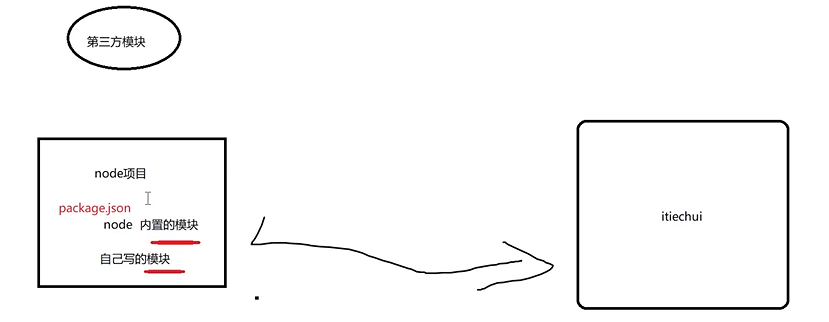

# 前言

node.js -> webpack -> vue, react

node.js相当于服务器环境，负责解析js代码，实现了java等后端语言的功能。

把js运行在后台,以前只能运行在浏览器,执行网络请求;

这样就可以调用系统api,访问本地文件;

## 中文文档

[使用 Node.js 需要了解多少 JavaScript (kik.cn)](http://kik.cn/learn/how-much-javascript-do-you-need-to-know-to-use-nodejs)


# npm

--save 将依赖包名称添加到 package.json 文件 dependencies 下 --save-dev 则添加到 package.json 文件 devDependencies 下

--save 是你发布之后还依赖的东西 

--save-dev 是你开发时候依赖的东西

**前提**：本地安装，--location = ‘project’；



```c++
"dependencies": {
	"css-loader": "~2.1.0",
    "es6-promise": "^2.0.0",
}
```

`@`：指定版本；`*`：最新版本；`^`：保证大版本即`2.0.0`的`2`；`~`：保证二级版本，即`2.1.0`：的`2.1`。

# node+ES模块化规范

在package.json中添加 `"type":"module"`；

导出导入 export import

# node+commonjs规格

```javascript
module.exports
require
```

