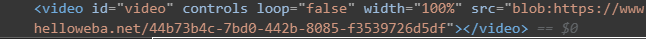
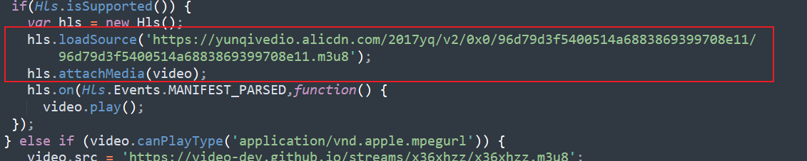
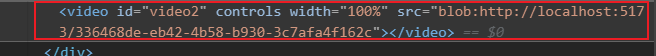
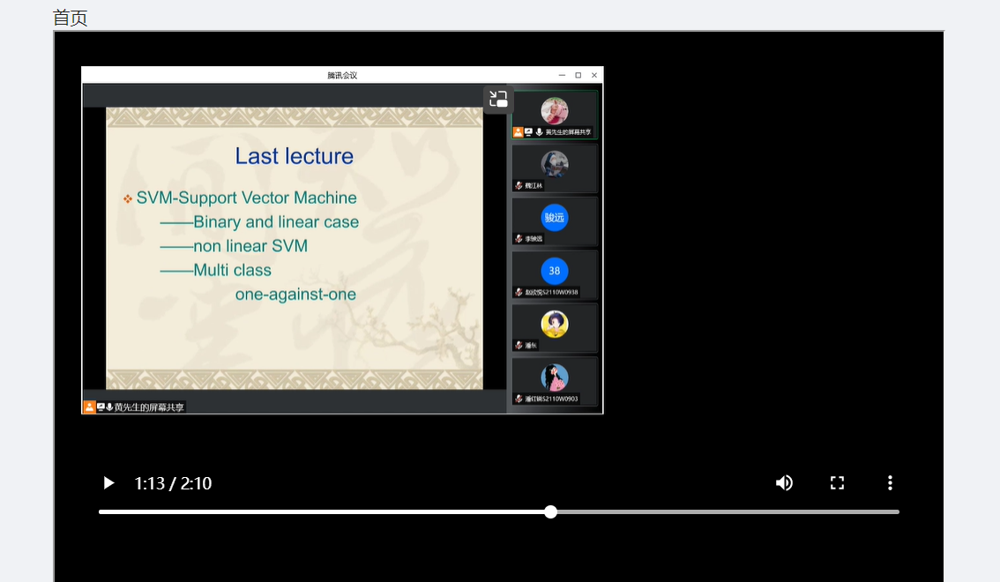

最近在前后端项目分离的场景下，在实现一个HLS协议视频播放功能时遇到了问题。

首先说明场景：

前端url：http://localhost:5173/

后端url：http://localhost:5000/

网上的资料不多，比较有好的文章如下：

[了解m3u8(hls)视频格式及如何在原生video标签上播放m3u8或flv媒体流 - 掘金 (juejin.cn)](https://juejin.cn/post/7146947008015089672)，这个博客同时给出了一个DEMO地址，对我问题的解决帮助很大。

[使用ffmpeg把mp4与m3u8相互转换的操作_音视频开发老舅的博客-CSDN博客_ffmpeg mp4转m3u8](https://blog.csdn.net/m0_60259116/article/details/125301521)，这篇文章说明了如何创建m3u8视频。

在最开始，根据网上找到的资料，我尝试在前端项目中使用如下方式加载m3u8视频流：

```tsx
<div ref={(c) => { playerRef.current = c }} style={{ width: '100%', height: '600px', backgroundColor: 'black' }}>
   <video id="video" controls loop="false" width="100%"></video>
</div>

useEffect(() => {
    playerRef.current!.focus()
    var video = document.getElementById('video');
        if (Hls.isSupported()) {
            var hls = new Hls();
            hls.loadSource('/app/public/vod/demo/index.m3u8');
            hls.attachMedia(video);
            hls.on(Hls.Events.MANIFEST_PARSED, function () {
                video.play();
            });
        } 
}, [])
```

:zap:**注意**在前端项目中我配置了跨域处理，`/app/public/vod/demo/index.m3u8`将被转发到后端服务器，并且能够成功请求到该资源，但是不能继续请求`ts`文件。

我最开始觉得是我的m3u8资源有问题，于是使用[了解m3u8(hls)视频格式及如何在原生video标签上播放m3u8或flv媒体流 - 掘金 (juejin.cn)](https://juejin.cn/post/7146947008015089672)给出的链接进行尝试，也就是这个过程让我发现了问题。

在上述博客中，video的渲染结果是：



代码：



当我将`loadSource`代码添加到我自己的项目中时，渲染结果与他不一致：



思考之后，我发现在上述文章的案例中，演示站点和资源站点属于同一个域`yunqivedio.alicdn.com`。在我们的前端项目中，它也尝试在自己的域名下寻找该资源。

那么我得出的结论是，如果想要使用HLS协议播放视频，资源必须在自身域下。

因此我想到的解决方案是，有服务器提供一个html资源，前端通过`ifram`展示界面。

具体实现：

- 定义接口`/app/api/vod:id`

id参数在本演示中并没有作用，返回的视频是指定的

**注意**，我们需要指定response的类型。

```

const Router = require('koa-router')
const fs = require('fs')
const { Http2ServerResponse } = require('http2')

const router = new Router({
    prefix: '/api/player'
})

router.get('/vod/:id', (ctx) => {
    console.log(ctx.params.id)
    ctx.type = 'text/html'
    let html = `<!DOCTYPE html>
    <html lang="en">
    
    <head>
        <meta charset="UTF-8">
        <meta http-equiv="X-UA-Compatible" content="IE=edge">
        <meta name="viewport" content="width=device-width, initial-scale=1">
        <script src="https://cdnjs.cloudflare.com/ajax/libs/hls.js/1.2.5/hls.min.js"></script>
    </head>
    
    <body>
    
        <div class="container" style="width: 96%; margin: 30px auto">
            <video id="video" controls loop="false" width="100%"></video>
        </div>
    
        <script>
            var video = document.getElementById('video');
            if (Hls.isSupported()) {
                var hls = new Hls();
                hls.loadSource('http://localhost:5000/vod/demo/index.m3u8');
                hls.attachMedia(video);
                hls.on(Hls.Events.MANIFEST_PARSED, function () {
                    video.play();
                });
            } 
        </script>
    </body>
    
    </html>`
    ctx.body = html
})


module.exports = router
```

- 前端项目

```ts
<div ref={(c) => { playerRef.current = c }} style={{ width: '100%', height: '600px', backgroundColor: 'black' }}>
  <iframe src={`/app/api/player/vod/${videoID}`} style={{ width: '100%', height: '100%' }} scrolling='no'></iframe>
</div>
```

成功！

