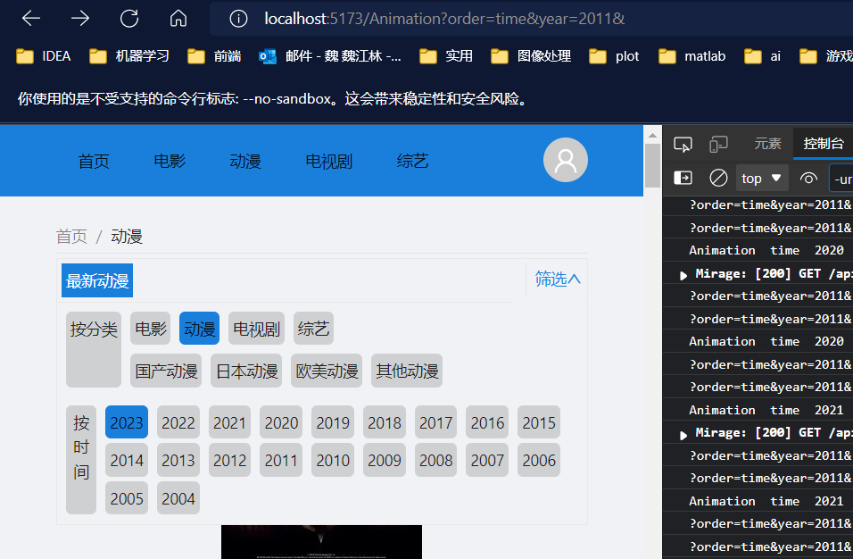
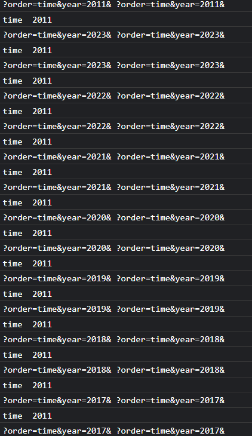

在影片类别首页，我们可以进行一些搜索：



其中类别是作为路由params传递的，而时间是作为search参数传递。

我们希望通过路由进行跳转，这样就会产生记录；

当时间改变时，会使用`navigate`进行路由跳转，但是这并不会触发页面重新渲染，

即重新执行：

```
useEffect(() => {
        getVideos({
            topCategory: encodeURI(topCategory),
            subCategory: subCategory ? encodeURI(subCategory) : '',
            limit: 6 * 6,
        }).then((res) => {
            setVideos(res.data.list)
            setLoadingVideos(false)
        }).catch((err) => {

        })
    }, [topCategory, subCategory, order, region, year])
```

**这段代码并不会执行；**

点击时间的响应事件是：

```
const handleSearch = (params:
        {
            top: string
            sub: string
            order: string
            year: number
            region: string
        }
    ) => {
        const { top, sub, order, year, region } = params
        const withSearch = order ? true : year ? true : region ? true : false
        const to = `/${top}${sub ? `/${sub}` : ''}` +
            `${withSearch ? '?' + `${order ? 'order=' + order + '&' : ''}${year ? 'year=' + year + '&' : ''}${region ? 'region=' + region + '&' : ''}` : ''}`
        navigate(to)
    }
```

看一下函数：

```
export default function CategoryIndex() {
    const { Header, Content, Footer } = Layout
    const { topCategory, subCategory } = useLoaderData()
    const navigate = useNavigate()
    const location = useLocation()
    const searchParams = new URLSearchParams(window.location.search.slice(1))
    const [order, setOrder] = useState(searchParams.get('order') ? searchParams.get('order') : 'time')
    const [region, setRegion] = useState(searchParams.get('region') ? searchParams.get('region') : '')
    const [year, setYear] = useState(searchParams.get('year') ? searchParams.get('year') : '')
    console.log(window.location.search, location.search)
```

当路由变化时，确实会重新执行这些代码（第一行），但是year，order，region的state没有发生改变（第二行），



**猜测：**

由于组件没有卸载，组件的状态不会丢失，因此`useState`不会生效，因此`order`,`region`,`year`还是以前的状态。

根据官网的解释，确实是这样的：

[使用 State Hook – React (docschina.org)](https://react.docschina.org/docs/hooks-state.html)

> 注意
>
> 你可能想知道：为什么叫 `useState` 而不叫 `createState`?
>
> “Create” 可能不是很准确，因为 state 只在组件首次渲染的时候被创建。在下一次重新渲染时，`useState` 返回给我们当前的 state。否则它就不是 “state”了！这也是 Hook 的名字*总是*以 `use` 开头的一个原因。我们将在后面的 [Hook 规则](https://react.docschina.org/docs/hooks-rules.html)中了解原因。

**解决方案**

使用`useSearchParams`Hook,

```
const order = searchParams.get('order') ? searchParams.get('order') : ''
const region = searchParams.get('region') ? searchParams.get('region') : ''
const year = searchParams.get('year') ? searchParams.get('year') : ''
```

为什么可以呢，因为这是`react0router-dom`的状态，他是会随着路由链接发生改变的；而我们之前在组件上定义的状态，并不能根据路由链接的变化，自身状态发生改变。