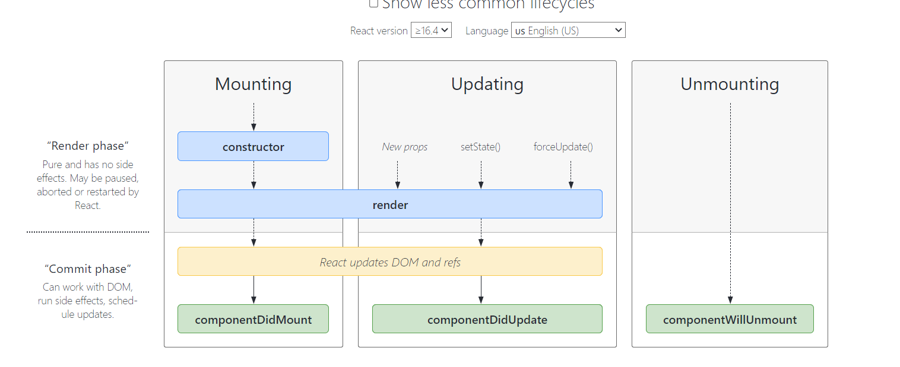
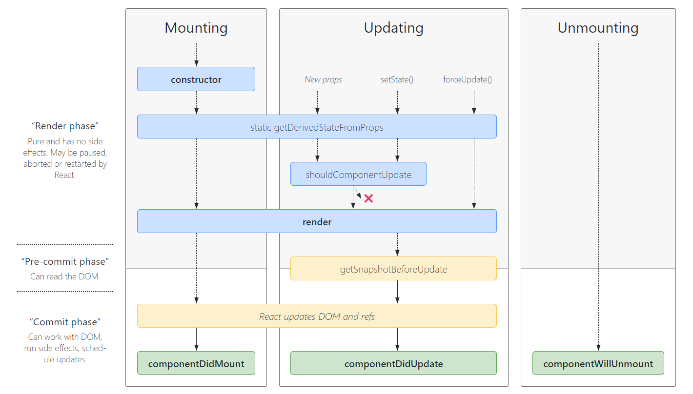

## 派生 state 的常见 bug

名词[“受控”](https://zh-hans.reactjs.org/docs/forms.html#controlled-components)和[“非受控”](https://zh-hans.reactjs.org/docs/uncontrolled-components.html)通常用来指代表单的 inputs，但是也可以用来描述数据频繁更新的组件。用 props 传入数据的话，组件可以被认为是**受控**（因为组件被父级传入的 props 控制）。数据只保存在组件内部的 state 的话，是**非受控**组件（因为外部没办法直接控制 state）。组件的生命周期

每个组件都包含 “生命周期方法”，你可以重写这些方法，以便于在运行过程中特定的阶段执行这些方法。**你可以使用此[生命周期图谱](https://projects.wojtekmaj.pl/react-lifecycle-methods-diagram/)作为速查表**。在下述列表中，常用的生命周期方法会被加粗。其余生命周期函数的使用则相对罕见。

#### 挂载

当组件实例被创建并插入 DOM 中时，其生命周期调用顺序如下：

- [**`constructor()`**](https://zh-hans.reactjs.org/docs/react-component.html#constructor)
- [`static getDerivedStateFromProps()`](https://zh-hans.reactjs.org/docs/react-component.html#static-getderivedstatefromprops)
- [**`render()`**](https://zh-hans.reactjs.org/docs/react-component.html#render)
- [**`componentDidMount()`**](https://zh-hans.reactjs.org/docs/react-component.html#componentdidmount)

#### 更新

当组件的 props 或 state 发生变化时会触发更新。组件更新的生命周期调用顺序如下：

- [`static getDerivedStateFromProps()`](https://zh-hans.reactjs.org/docs/react-component.html#static-getderivedstatefromprops)
- [`shouldComponentUpdate()`](https://zh-hans.reactjs.org/docs/react-component.html#shouldcomponentupdate)
- [**`render()`**](https://zh-hans.reactjs.org/docs/react-component.html#render)
- [`getSnapshotBeforeUpdate()`](https://zh-hans.reactjs.org/docs/react-component.html#getsnapshotbeforeupdate)
- [**`componentDidUpdate()`**](https://zh-hans.reactjs.org/docs/react-component.html#componentdidupdate)

#### 卸载

当组件从 DOM 中移除时会调用如下方法：

- [**`componentWillUnmount()`**](https://zh-hans.reactjs.org/docs/react-component.html#componentwillunmount)

#### 错误处理

当渲染过程，生命周期，或子组件的构造函数中抛出错误时，会调用如下方法：

- [`static getDerivedStateFromError()`](https://zh-hans.reactjs.org/docs/react-component.html#static-getderivedstatefromerror)
- [`componentDidCatch()`](https://zh-hans.reactjs.org/docs/react-component.html#componentdidcatch)






### 常用生命周期钩子

[React.Component – React (reactjs.org)](https://zh-hans.reactjs.org/docs/react-component.html#componentdidmount)

```
componentDidMount()

componentDidUpdate()

componentWillUnmount()
```

不常用钩子

```
shouldComponentUpdate(nextProps, nextState)

static getDerivedStateFromProps(props, state)

getSnapshotBeforeUpdate(prevProps, prevState)
```

# 过时的生命周期钩子

[React.Component – React (reactjs.org)](https://zh-hans.reactjs.org/docs/react-component.html#unsafe_componentwillreceiveprops)

[异步渲染之更新 – React Blog (reactjs.org)](https://zh-hans.reactjs.org/blog/2018/03/27/update-on-async-rendering.html)

一年多来，React 团队一直致力于实现异步渲染。上个月，在 JSConf 冰岛的演讲中，[Dan 展示了异步渲染带来的新可能性](https://zh-hans.reactjs.org/blog/2018/03/01/sneak-peek-beyond-react-16.html)。现在，我们希望与你分享我们在使用这些功能时学到的一些经验教训，以及一些帮助你在组件启动时准备异步渲染的方法。

我们得到最重要的经验是，过时的组件生命周期往往会带来不安全的编码实践，具体函数如下：

- `componentWillMount`
- `componentWillReceiveProps`
- `componentWillUpdate`

这些生命周期方法经常被误解和滥用；此外，我们预计，在异步渲染中，它们潜在的误用问题可能更大。我们将在即将发布的版本中为这些生命周期添加 “UNSAFE_” 前缀。（这里的 “unsafe” 不是指安全性，而是表示使用这些生命周期的代码在 React 的未来版本中更有可能出现 bug，尤其是在启用异步渲染之后。）

### `UNSAFE_componentWillMount()`

```
UNSAFE_componentWillMount()
```

> 注意
>
> 此生命周期之前名为 `componentWillMount`。该名称将继续使用至 React 17。可以使用 [`rename-unsafe-lifecycles` codemod](https://github.com/reactjs/react-codemod#rename-unsafe-lifecycles) 自动更新你的组件。

`UNSAFE_componentWillMount()` 在挂载之前被调用。它在 `render()` 之前调用，因此在此方法中同步调用 `setState()` 不会触发额外渲染。通常，我们建议使用 `constructor()` 来初始化 state。

避免在此方法中引入任何副作用或订阅。如遇此种情况，请改用 `componentDidMount()`。

此方法是**服务端渲染唯一会调用的生命周期函数**。

### `UNSAFE_componentWillReceiveProps()`

```
UNSAFE_componentWillReceiveProps(nextProps)
```

> 注意
>
> 此生命周期之前名为 `componentWillReceiveProps`。该名称将继续使用至 React 17。可以使用 [`rename-unsafe-lifecycles` codemod](https://github.com/reactjs/react-codemod#rename-unsafe-lifecycles) 自动更新你的组件。

> 注意:
>
> 使用此生命周期方法通常会出现 **bug 和不一致性**：
>
> 如果你需要执行副作用（例如，数据提取或动画）以响应 props 中的更改，请改用 componentDidUpdate 生命周期。
> 如果你使用 componentWillReceiveProps 仅在 prop 更改时重新计算某些数据，请使用 memoization helper 代替。
> 如果你使用 componentWillReceiveProps 是为了在 prop 更改时“重置”某些 state，请考虑使组件完全受控或使用 key 使组件完全不受控 代替。
> 对于其他使用场景，请遵循此博客文章中有关派生状态的建议。

在[挂载](https://zh-hans.reactjs.org/docs/react-component.html#mounting)过程中，React 不会针对初始 props 调用 `UNSAFE_componentWillReceiveProps()`。组件只会在组件的 props 更新时调用此方法。调用 `this.setState()` 通常不会触发 `UNSAFE_componentWillReceiveProps()`。

### `UNSAFE_componentWillUpdate()`

```
UNSAFE_componentWillUpdate(nextProps, nextState)
```

> 注意
>
> 此生命周期之前名为 `componentWillUpdate`。该名称将继续使用至 React 17。可以使用 [`rename-unsafe-lifecycles` codemod](https://github.com/reactjs/react-codemod#rename-unsafe-lifecycles) 自动更新你的组件。

# 新生命周期

### `static getDerivedStateFromProps()`

[你可能不需要使用派生 state – React Blog (reactjs.org)](https://zh-hans.reactjs.org/blog/2018/06/07/you-probably-dont-need-derived-state.html)

```
static getDerivedStateFromProps(props, state)
```

`getDerivedStateFromProps` 会在**调用 render 方法之前调用**，并且在初始挂载及后续更新时都会被调用。它应**返回一个对象来更新 state**，如果返回 `null` 则不更新任何内容。

此方法适用于[罕见的用例](https://zh-hans.reactjs.org/blog/2018/06/07/you-probably-dont-need-derived-state.html#when-to-use-derived-state)，即 **state 的值在任何时候都取决于 props**。例如，实现 `<Transition>` 组件可能很方便，该组件会比较当前组件与下一组件，以决定针对哪些组件进行转场动画。

```
static getDerivedStateFromProps(props, state){
	return probs
}
```

派生状态会导致代码冗余，并使组件难以维护。 [确保你已熟悉这些简单的替代方案：](https://zh-hans.reactjs.org/blog/2018/06/07/you-probably-dont-need-derived-state.html)

- 如果你需要**执行副作用**（例如，数据提取或动画）以响应 props 中的更改，请改用 [`componentDidUpdate`](https://zh-hans.reactjs.org/docs/react-component.html#componentdidupdate)。
- 如果只想在 **prop 更改时重新计算某些数据**，[请使用 memoization helper 代替](https://zh-hans.reactjs.org/blog/2018/06/07/you-probably-dont-need-derived-state.html#what-about-memoization)。
- 如果你想**在 prop 更改时“重置”某些 state**，请考虑使组件[完全受控](https://zh-hans.reactjs.org/blog/2018/06/07/you-probably-dont-need-derived-state.html#recommendation-fully-controlled-component)或[使用 `key` 使组件完全不受控](https://zh-hans.reactjs.org/blog/2018/06/07/you-probably-dont-need-derived-state.html#recommendation-fully-uncontrolled-component-with-a-key) 代替。

此方法无权访问组件实例。如果你需要，可以通过提取组件 props 的纯函数及 class 之外的状态，在`getDerivedStateFromProps()`和其他 class 方法之间重用代码。

请注意，不管原因是什么，都会在*每次*渲染前触发此方法。这与 `UNSAFE_componentWillReceiveProps` 形成对比，后者仅在父组件重新渲染时触发，而不是在内部调用 `setState` 时。

------

#### 派生 state 的常见 bug

名词[“受控”](https://zh-hans.reactjs.org/docs/forms.html#controlled-components)和[“非受控”](https://zh-hans.reactjs.org/docs/uncontrolled-components.html)通常用来指代表单的 inputs，但是也可以用来描述数据频繁更新的组件。用 props 传入数据的话，组件可以被认为是**受控**（因为组件被父级传入的 props 控制）。数据只保存在组件内部的 state 的话，是**非受控**组件（因为外部没办法直接控制 state）。

### `getSnapshotBeforeUpdate()`

```
getSnapshotBeforeUpdate(prevProps, prevState)
```

`getSnapshotBeforeUpdate()` 在最近一次渲染输出（提交到 DOM 节点）之前调用。它使得组件能在**发生更改之前从 DOM 中捕获一些信息（例如，滚动位置）**。此生命周期方法的任何返回值将作为参数传递给 `componentDidUpdate()`。

此用法并不常见，但它可能出现在 UI 处理中，如需要以特殊方式处理滚动位置的聊天线程等。

应返回 snapshot 的值（或 `null`）。

例如：

```javascript
class ScrollingList extends React.Component {
  constructor(props) {
    super(props);
    this.listRef = React.createRef();
  }

  getSnapshotBeforeUpdate(prevProps, prevState) {
    // 我们是否在 list 中添加新的 items ？
    // 捕获滚动位置以便我们稍后调整滚动位置。
    if (prevProps.list.length < this.props.list.length) {
      const list = this.listRef.current;
      return list.scrollHeight - list.scrollTop;
    }
    return null;
  }

  componentDidUpdate(prevProps, prevState, snapshot) {
    // 如果我们 snapshot 有值，说明我们刚刚添加了新的 items，
    // 调整滚动位置使得这些新 items 不会将旧的 items 推出视图。
    //（这里的 snapshot 是 getSnapshotBeforeUpdate 的返回值）
    if (snapshot !== null) {
      const list = this.listRef.current;
      list.scrollTop = list.scrollHeight - snapshot;
    }
  }

  render() {
    return (
      <div ref={this.listRef}>{/* ...contents... */}</div>
    );
  }
}
```

在上述示例中，重点是从 `getSnapshotBeforeUpdate` 读取 `scrollHeight` 属性，因为 “render” 阶段生命周期（如 `render`）和 “commit” 阶段生命周期（如 `getSnapshotBeforeUpdate` 和 `componentDidUpdate`）之间可能存在延迟.

#### Element.scrollHeight

**`Element.scrollHeight`** 这个只读属性是一个元素内容高度的度量，包括由于溢出导致的视图中不可见内容。


`scrollHeight` 的值等于该元素在不使用滚动条的情况下为了适应视口中所用内容所需的最小高度。没有垂直滚动条的情况下，scrollHeight 值与元素视图填充所有内容所需要的最小值[`clientHeight`](https://developer.mozilla.org/zh-CN/docs/Web/API/Element/clientHeight)相同。包括元素的 padding，但不包括元素的 border 和 margin。`scrollHeight` 也包括 [`::before`](https://developer.mozilla.org/zh-CN/docs/Web/CSS/::before) 和 [`::after`](https://developer.mozilla.org/zh-CN/docs/Web/CSS/::after)这样的伪元素。 如果元素的内容不需要垂直滚动条就可以容纳，则其 `scrollHeight` 等于{{domref("Element.clientHeight", "clientHeight")}}

#### Element.scrollTop

**`Element.scrollTop`** 属性可以获取或设置一个元素的内容垂直滚动的像素数。

一个元素的 `scrollTop` 值是这个元素的**内容顶部**（卷起来的）到它的视口可见内容（的顶部）的距离的度量。当一个元素的内容没有产生垂直方向的滚动条，那么它的 `scrollTop` 值为`0`。
