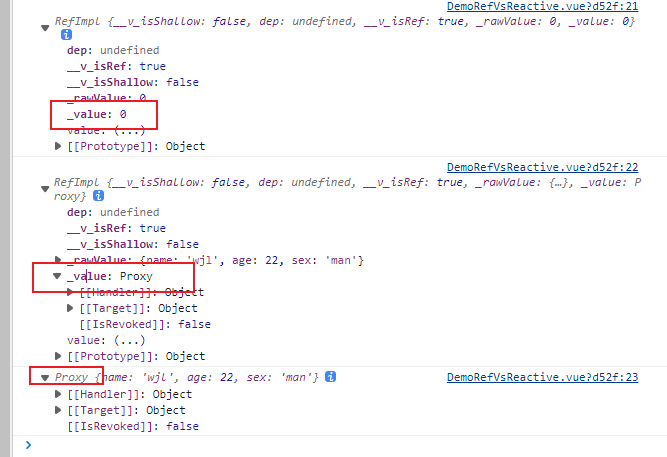

## ref

[响应式 API：核心 | Vue.js (vuejs.org)](https://cn.vuejs.org/api/reactivity-core.html#ref)

接受一个内部值，返回一个响应式的、可更改的 ref 对象，此对象只有一个指向其内部值的属性 `.value`。

### 类型

```
function ref<T>(value: T): Ref<UnwrapRef<T>>

interface Ref<T> {
  value: T
}
```

### **详细信息**

- ref 对象是可更改的，也就是说你可以为 `.value` 赋予新的值。它也是响应式的，即所有对 `.value` 的操作都将被追踪，并且写操作会触发与之相关的副作用。

- 如果将一个**对象**赋值给 ref，那么这个对象将通过 [reactive()](https://cn.vuejs.org/api/reactivity-core.html#reactive) 转为具有深层次响应式的对象。这也意味着如果对象中包含了嵌套的 ref，它们将被深层地解包。

- 若要避免这种深层次的转换，请使用 [`shallowRef()`](https://cn.vuejs.org/api/reactivity-advanced.html#shallowref) 来替代。

### 示例

```
const count = ref(0)
console.log(count.value) // 0

count.value++
console.log(count.value) // 1

```

### 对象类型

```
<template>
    <div>

    </div>
</template>

<script setup>
    import {ref, reactive, onMounted} from 'vue'
    let demoCount = 0
    let demoObj = {
        name : 'wjl',
        age: 22,
        sex: 'man',
    }

    const refDemoCount =  ref(demoCount)
    const refDemoObj = ref(demoObj)
    const reactiveDemoObj = reactive(demoObj)

    onMounted(()=>{
        console.log(refDemoCount)
        console.log(refDemoObj)
        console.log(reactiveDemoObj)
    })
</script>
```

ref得到的对象类型是`RefImpl`。



## reactive()

[响应式 API：核心 | Vue.js (vuejs.org)](https://cn.vuejs.org/api/reactivity-core.html#reactive)

返回一个对象的响应式代理。

### 类型

```
function reactive<T extends object>(target: T): UnwrapNestedRefs<T>
```

### **详细信息**

- 响应式转换是“深层”的：它会影响到所有嵌套的属性。一个响应式对象也将深层地解包任何 [ref](https://cn.vuejs.org/api/reactivity-core.html#ref) 属性，同时保持响应性。

- 值得注意的是，当访问到某个响应式数组或 `Map` 这样的原生集合类型中的 ref 元素时，不会执行 ref 的解包。

- 若要避免深层响应式转换，只想保留对这个对象顶层次访问的响应性，请使用 [shallowReactive()](https://cn.vuejs.org/api/reactivity-advanced.html#shallowreactive) 作替代。

- 返回的对象以及其中嵌套的对象都会通过 [ES Proxy](https://developer.mozilla.org/en-US/docs/Web/JavaScript/Reference/Global_Objects/Proxy) 包裹，因此**不等于**源对象，建议只使用响应式代理，避免使用原始对象。

### 示例

```
const obj = reactive({ count: 0 })
obj.count++

const count = ref(1)
const obj = reactive({ count })

// ref 会被解包
console.log(obj.count === count.value) // true

// 会更新 `obj.count`
count.value++
console.log(count.value) // 2
console.log(obj.count) // 2

// 也会更新 `count` ref
obj.count++
console.log(obj.count) // 3
console.log(count.value) // 3

```

注意当访问到某个响应式数组或 `Map` 这样的原生集合类型中的 ref 元素时，**不会**执行 ref 的解包：

```
const books = reactive([ref('Vue 3 Guide')])
// 这里需要 .value
console.log(books[0].value)

const map = reactive(new Map([['count', ref(0)]]))
// 这里需要 .value
console.log(map.get('count').value)
```

将一个 [ref](https://cn.vuejs.org/api/reactivity-core.html#ref) 赋值给为一个 `reactive` 属性时，该 ref 会被自动解包：

```
const count = ref(1)
const obj = reactive({})

obj.count = count

console.log(obj.count) // 1
console.log(obj.count === count.value) // true
```

## 解包

所谓自动解包，就是把值解除掉代理，去掉副作用，暴露真值/原始值。


## 总结

js的数据类型可以分为两类：值类型和引用类型；ref的首要目标是值类型，值类型身上没有属性和方法，我们只需要关注值自身的变化，因此不需要使用Proxy捕获属性的改变，因为我们改变的是变量本身，即对于count变量来说，count+=1并不是count身上的属性发生变化，我们是直接设置count  = count + 1；

对应到源码中，也是直接替换，但为了让vue指定值发送变化，我们需要借助RefImpl对象，他会通知相关组件进行更新。

```
newVal = this.__v_isShallow ? newVal : toRaw(newVal);
```

```javascript
class RefImpl {
    constructor(value, __v_isShallow) {
        this.__v_isShallow = __v_isShallow;
        this.dep = undefined;
        this.__v_isRef = true;
        this._rawValue = __v_isShallow ? value : toRaw(value);
        this._value = __v_isShallow ? value : toReactive(value);
    }
    get value() {
        trackRefValue(this);
        return this._value;
    }
    set value(newVal) {
        newVal = this.__v_isShallow ? newVal : toRaw(newVal);
        if (hasChanged(newVal, this._rawValue)) {
            this._rawValue = newVal;
            this._value = this.__v_isShallow ? newVal : toReactive(newVal);
            triggerRefValue(this, newVal);
        }
    }
}
```

而Proxy的作用就是捕获对象身上属性发生的变化，而不是替换。