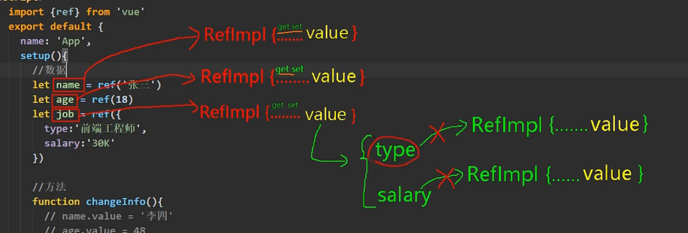
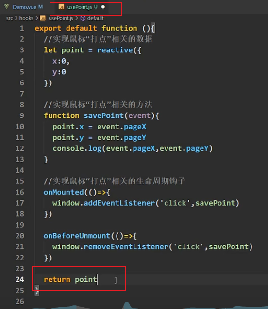
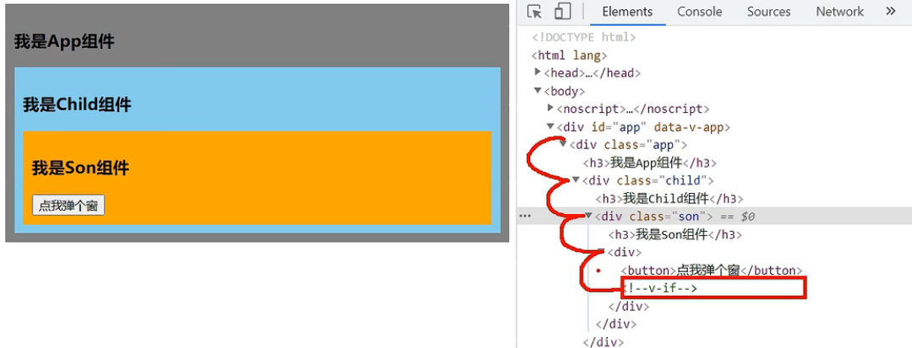
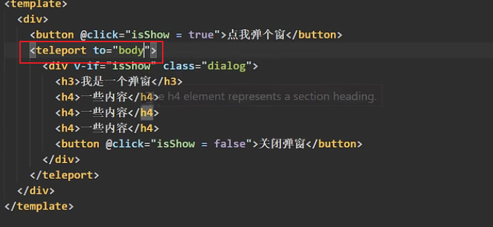
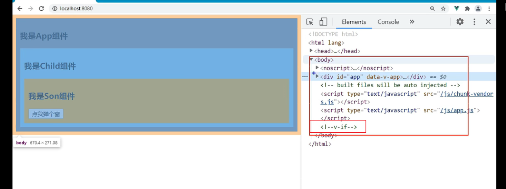

# 传值

[Props | Vue.js (vuejs.org)](https://cn.vuejs.org/guide/components/props.html#one-way-data-flow)

**选项式**：

```
// 使用 <script setup>
defineProps({
  title: String,
  likes: Number
})
```

**组合式：**

```
// 非 <script setup>
export default {
  props: {
    title: String,
    likes: Number
  }
}
```

校验选项中的 `type` 可以是下列这些原生构造函数：

- `String`
- `Number`
- `Boolean`
- `Array`
- `Object`
- `Date`
- `Function`
- `Symbol`


## 值的修改-单向数据流

所有的 props 都遵循着**单向绑定**原则，props 因父组件的更新而变化，自然地将新的状态**向下流往子组件**，而不会逆向传递。**这避免了子组件意外修改父组件的状态的情况**，不然应用的数据流将很容易变得混乱而难以理解。

另外，每次父组件更新后，所有的子组件中的 props 都会被更新到最新值，这意味着你**不应该**在子组件中去更改一个 prop。若你这么做了，Vue 会在控制台上向你抛出警告：

```
const props = defineProps(['foo'])

// ❌ 警告！prop 是只读的！
props.foo = 'bar'
```

导致你想要更改一个 prop 的需求通常来源于以下两种场景：

1. **prop 被用于传入初始值；而子组件想在之后将其作为一个局部数据属性**。在这种情况下，最好是新定义一个局部数据属性，从 props 上获取初始值即可：

```
const props = defineProps(['initialCounter'])

// 计数器只是将 props.initialCounter 作为初始值
// 像下面这样做就使 prop 和后续更新无关了
const counter = ref(props.initialCounter)
```

2. **需要对传入的 prop 值做进一步的转换**。在这种情况中，最好是基于该 prop 值定义一个计算属性：

```
const props = defineProps(['size'])

// 该 prop 变更时计算属性也会自动更新
const normalizedSize = computed(() => props.size.trim().toLowerCase())
```


# 响应式

[响应式原理对比](./vue3对比vue2.md)

## ref函数

**定义一个响应式数据（对象，基本类型）**

基于Object.defineProperty();



基本数据类型 -> RefImpl **(ref，defineProperty)**

**对象类型 -> Proxy (reacive，Proxy)**

和响应式对象的属性类似，ref 的 `.value` 属性也是响应式的。同时，当值为对象类型时，会用 `reactive()` 自动转换它的 `.value`。


## reactive函数

**定义对象类型响应式数据**

响应式对象其实是 [JavaScript Proxy](https://developer.mozilla.org/en-US/docs/Web/JavaScript/Reference/Global_Objects/Proxy)，其行为表现与一般对象相似。不同之处在于 Vue 能够跟踪对响应式对象属性的访问与更改操作。如果你对这其中的细节感到好奇，我们在 [深入响应式系统](https://cn.vuejs.org/guide/extras/reactivity-in-depth.html) 一章中会进行解释，但我们推荐你先读完这里的主要指南。

`reactive()` 的种种限制归根结底是因为 JavaScript 没有可以作用于**所有值类型**的 “引用” 机制。为此，Vue 提供了一个 [`ref()`](https://cn.vuejs.org/api/reactivity-core.html#ref) 方法来允许我们创建可以使用任何值类型的响应式 **ref**：

### 深层响应性

在 Vue 中，状态都是默认深层响应式的。这意味着即使在更改深层次的对象或数组，你的改动也能被检测到。

# setup的两个注意点

- setup执行的时机
  - 在beforeCreate之前执行一次，this是undefined。
- setup的参数
  - props：值为对象，包含：组件外部传递过来，且组件内部声明接收了的属性。
  - context：上下文对象
    - attrs: 值为对象，包含：组件外部传递过来，但没有在props配置中声明的属性, 相当于 `this.$attrs`。
    - slots: 收到的插槽内容, 相当于 `this.$slots`。
    - emit: 分发自定义事件的函数, 相当于 `this.$emit`。

# hooks

js文件命名规范：`useXXXX.js`

- 什么是hook？—— 本质是一个函数，把setup函数中使用的Composition API进行了封装。
- 类似于vue2.x中的mixin。
- 自定义hook的优势: 复用代码, 让setup中的逻辑更清楚易懂。



# toRef

```
// 创建
person = Ref({
	name: 'wjl',
	age: 13,
	son: {
			name: 'kky'
	}
})

//模板使用
{{person.age}}

// 简化
const pName = toRef(person, "name");
{{pName}}
const sName = toRef(person.son, "name");

// all第一层
const x = toRefs(person)
```

# shallowReactive & shallowRef

基本类型二者一直。

`shallowReactive`只考虑对象第一层；

`shallowRef`只监听.value替换。

- shallowReactive：只处理对象最外层属性的响应式（浅响应式）。
- shallowRef：只处理基本数据类型的响应式, 不进行对象的响应式处理。
- 什么时候使用?
  - 如果有一个对象数据，结构比较深, 但变化时只是外层属性变化 ===> shallowReactive。
  - 如果有一个对象数据，后续功能不会修改该对象中的属性，而是生新的对象来替换 ===> shallowRef

```
    <main class="demo-content order-1">
      <component :is="demoContent" />
    </main>
    
const demoContent = shallowRef(DefaultDemoContent);

  demoContent.value = defineAsyncComponent(() =>
    // 这是如何实现的
    import(`./${category}/${name}`)
  );
```


# provide 与 inject

- 作用：实现**祖与后代组件间**通信

- 套路：父组件有一个 `provide` 选项来提供数据，后代组件有一个 `inject` 选项来开始使用这些数据

- 具体写法：

  1. 祖组件中：

     ```
     setup(){
         ......
         let car = reactive({name:'奔驰',price:'40万'})
         provide('car',car)
         ......
     }
     ```

  2. 后代组件中：

     ```
     setup(props,context){
         ......
         const car = inject('car')
         return {car}
         ......
     }
     ```

# teleport组件



不好控制弹出位置，难以让弹出在窗口中间。





**参考body写定位，支持querySelectorAPI。**

