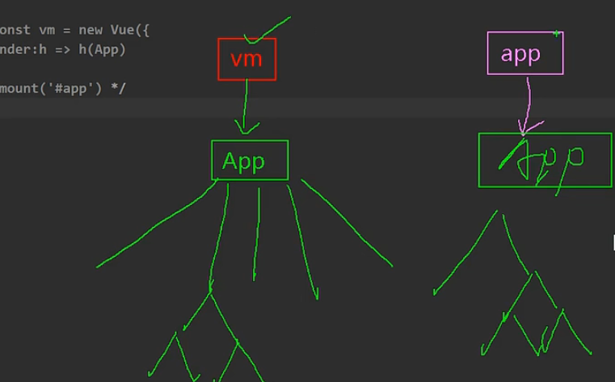
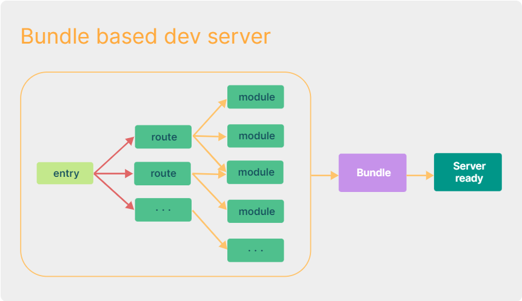
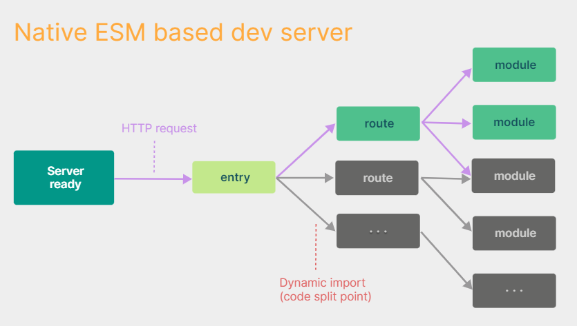

# 编码对比

## main.js



app相比vm更轻；

## 模板 template

不需要有根标签。

## script块的 setup函数

setup函数的返回值：

- 对象，对象中的属性方法在该组件中能访问（重点）
- 渲染函数，自定义渲染内容（了解）

```javascript
export default {
	setup(){
		var name = '123';
		function test() {
			console.log('test');
		}
		return {
			name,
			test
		}
		
		// 渲染函数
		// 模板中的内容将失效
		// import {h} from 'vue';
		// return () => return h('h1', 'test')
	}
}
```

## script setup块

相当于setup函数中的内容。


# 源码升级


# 新的特性


# TypeScript

**等待填坑**


# vite VS webpack

|  |  |
| ------------------------------------------------------------ | ------------------------------------------------------------ |

