# 子组件给父组件传值

- 父组件**传递**子组件一个函数类型probs

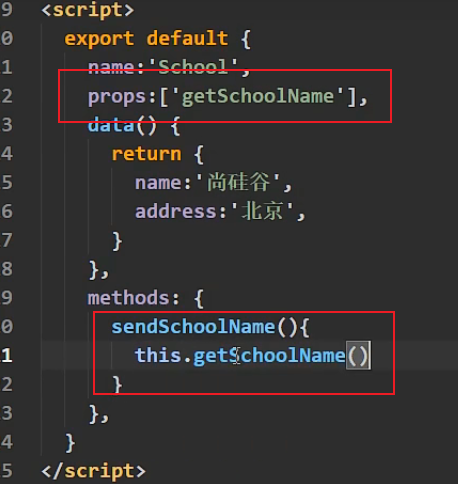

- 自定义事件

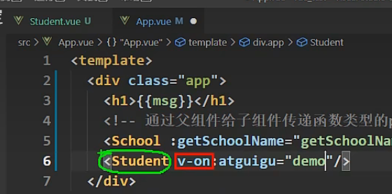

在App中给Student VueComponent绑定事件。

在Student 组件中触发事件：

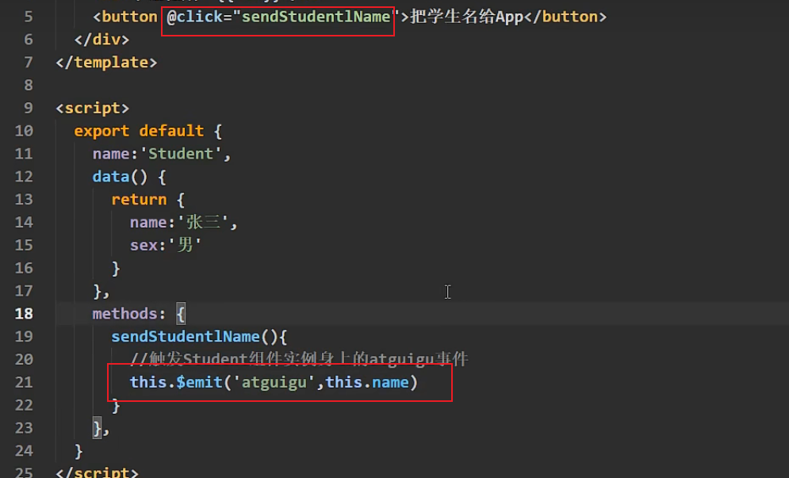

**在App中配置**

事件名称：atguigu

事件对应的函数：demo

**在子组件中配置**

触发条件：click

事件对应函数：sendStudentName

- 动态绑定自定义事件

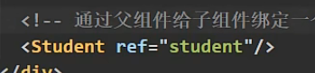

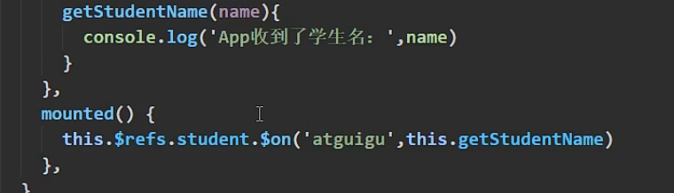

使用事件修饰符，atguigu只会触发一次

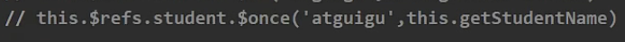

接收多个参数

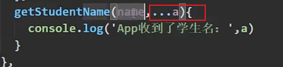

# 解绑自定义事件

**在子组件中解绑**

- 一个自定义事件

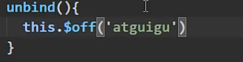

- 多个自定义事件

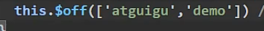

# 全局事件总线

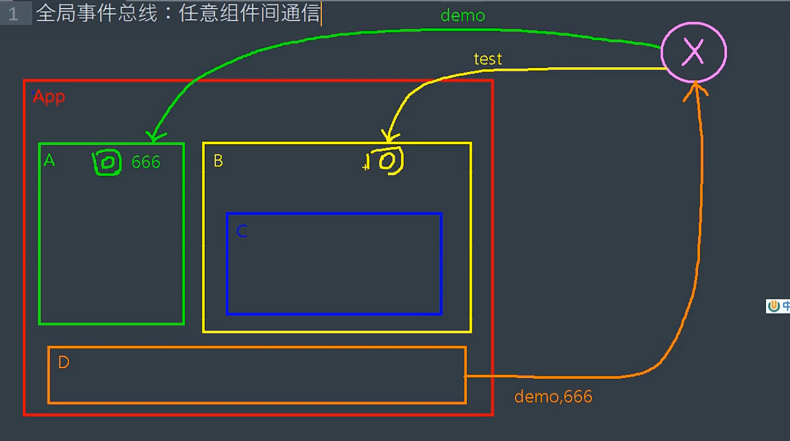

给第三方**X**绑定事件，回调函数留在组件内部，其他组件触发**X**上的事件，并传递数据。

**这不是新的API，而是编程方法。**

**X**：1）所有组件能方法；2）能调用`$on`, `$off`, `$emit`方法；

## Vue2 安装

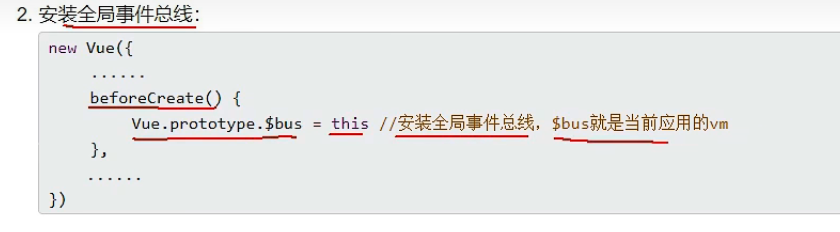

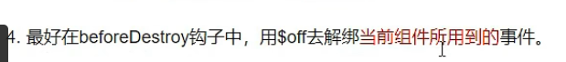

## 使用

**父组件**

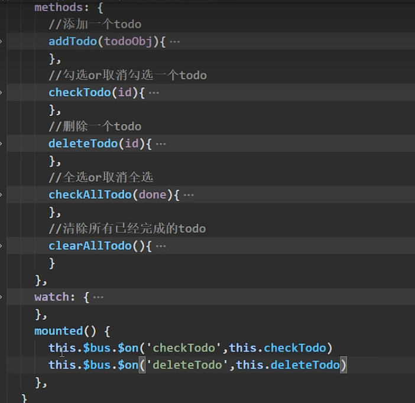

**子组件**

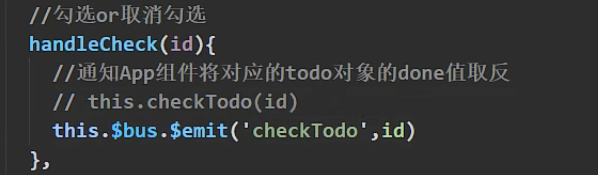

# 第三方库

`pubsub-js`