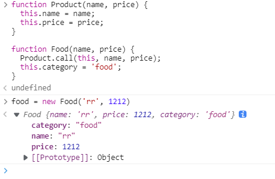

# 对象拷贝

## ES6

```
const person = {name: 'tom', age:12}
const cPerson = {...person}
```

## 递归

```javascript
const person = {
    name: 'tom', age: 12, son: [
        { name: 'a' }, { name: 'b' }, 123
    ], walk: () => {
        console.log('走路')
    }
}


function getType(any) {
    return Object.prototype.toString.call(any).slice(8, -1);
}


// person instanceof Object: true
// person.walk instanceof Object: true
// person.walk instanceof Function: true
function deepCopy(any) {
    if (any.constructor === Array) {
        let arr = any.map((item) => deepCopy(item))
        return arr
    } else if (getType(any) ===  'Object') {
        let o = {}
        for (let key in any) {
            o[key] = deepCopy(any[key])
        }
        return o
    } else if (getType(any) === 'Function') { // 拷贝函数
        return new Function('return ' + any.toString())
    }
    return any
}

let cPerson = deepCopy(person)
console.log(cPerson);
cPerson.son[0].name = '测试'
console.log(cPerson)
console.log(person)

person.walk()
console.log(')))')
// 不添加call(this)不会输出
cPerson.walk()
```

# JSON.parse / JSON.stringify()

```
const obja = {name: 'tom'}
const objb = JSON.parse(JSON.stringfy(obja))
```

## lodash库的cloneDeep()

## Object.assign

无法进行深拷贝


# 判断类型的方法

[(86条消息) Object.prototype.toString.call()的原理_韩振方的博客-CSDN博客_object.prototype.tostring.call原理](https://blog.csdn.net/fang_my/article/details/125355015)

```javascript
person.toString()
// '[object Object]'
```


## call 、bind和 apply

```javascript
function Product(name, price) {
  this.name = name;
  this.price = price;
}

function Food(name, price) {
  Product.call(this, name, price);
  this.category = 'food';
}
```



**Product上的属性被挂载到Food上**

[手动继承](./js面试题.md)

## 总结

- apply和call基本类似，他们的区别只是传入的参数不同。
- apply传入的参数是包含多个参数的数组
- call传入的参数是若干个参数列表
- bind方法会创建一个新的函数，当被调用的时候，将其this关键字设置为提供的值，我们必须手动去调用