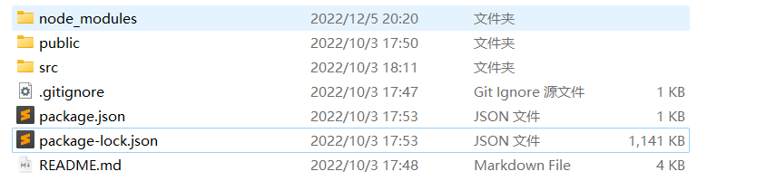
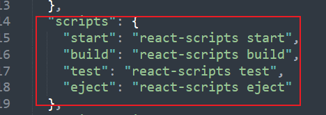
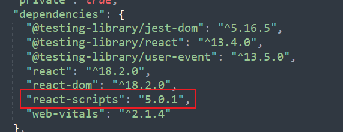
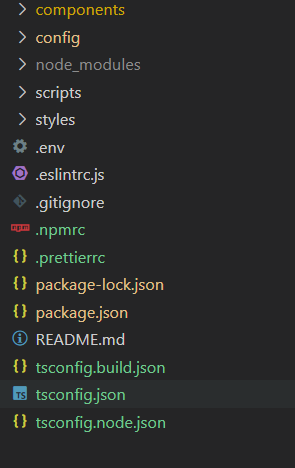

# 1.创建项目

可以选用不同的脚手架创建项目，但是创建的项目一般是面向前端应用的，我们需要重新组织目录，这也意味着我们要修改脚手架的配置文件。

（也许存在为组件库开发的项目创建命令，待发现...）

## 1.1初始化脚手架

```
npx create-react-app myapp --typescript
```

 注意使用 node 为较高版本 >10.15.0

[使用create-react-app 构建react应用(react-scripts) - 一路向北√ - 博客园 (cnblogs.com)](https://www.cnblogs.com/it-Ren/p/13458930.html#:~:text=react-scripts 是一个生成的项目所需要的开发依赖 一般我们开始创建react web应用程序的时候%2C要自己通过,npm 或者 yarn 安装项目的全部依赖，再写webpack.config.js%2C一系列复杂的配置%2C搭建好开发环境后写src源代码。)

[facebook/create-react-app at v5.0.0 (github.com)](https://github.com/facebook/create-react-app/tree/v5.0.0)

得到的项目结构如下：



生成的项目非常简洁，这是因为该脚手架将打包相关的操作（例如`webpack.config.js`）集成到专门的包中了，可以从`package.json`文件中验证这一点：





## 1.2 释放webpack配置文件

对于普通web应用开发来说，`react-scripts`是非常方便的，它帮我们配置好了：

> React, JSX, ES6, and Flow syntax support.
> Language extras beyond ES6 like the object spread operator.
> Import CSS and image files directly from JavaScript.
> Autoprefixed CSS, so you don’t need -webkit or other prefixes.
> A build script to bundle JS, CSS, and images for production, with sourcemaps.
> A dev server that lints for common errors.

但是对于组件库开发，类似启动webpackDevServer的功能对我们来说是不必要的，在最基础的情况下，我们只需要build js代码。

同时，参考`antd`和`elment-ui`，我们可能需要配置多个命令，不单单只是启动一个web server，对前端应用进行`build`。

[react项目关于webpack配置修改 - 掘金 (juejin.cn)](https://juejin.cn/post/6974572885763424270)介绍了三种释放配置文件的方法，本文选择`npm run eject`进行释放，这个命令是由`react-scripts`提供的。运行该命令后，在项目中，我们得到了两个新目录：`config`和`scripts`，`config`内包含`webpack`配置所需的文件，`scripts`包含`start`，`build`和`test`脚本。

## 1.4 添加ts、eslint配置，重新组件项目结构

`ts`和`eslint`的配置参考：

https://github.com/ant-design/ant-design

我们将项目结构修改为：



`webpack`的路径配置在`config/path.js`中给出，我们进行必要的修改，主要是将目录`src`修改为`components`，对于纯组件库开发来说，不需要`public`目录，但为了在开发过程中检查组件效果，这个功能还是必要的。

这意味着，在开发过程和组件发布过程，项目的入口文件是不同的。开发过程，相当于开发一个只展示组件的前端应用；组件发布过程，项目的入口文件只需要包含组件的导出声明。

# 参考资料

[如何快速构建React组件库 - 知乎 (zhihu.com)](https://zhuanlan.zhihu.com/p/196758730)