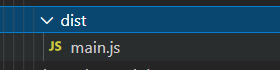

转自 [(71条消息) webpack和脚手架_哲子君的博客-CSDN博客_脚手架和webpack](https://blog.csdn.net/zhzijun/article/details/114681796)

## webpack

###　以前的问题

- 文件依赖关系错综复杂

- 静态文件请求效率低

- 模块化支持不友好

- 浏览器对高级JS特性兼容性不好

webpack是近期最火的一款模块加载器兼打包工具，它能把各种资源，例如JS（含JSX）、coffee、样式（含less/sass）、图片等都作为模块来使用和处理。

webpack可以解决当前web开发中所面临的各种困境(我们主要开发的就是web程序，而浏览器对高级语法的支持不是很好，所以需要工具进行**语法转换**)

webpack 提供了友好的模块化 支持，以及代码压缩混淆、处理 js 兼容问题、性能优化等强大功能，从而让程序员将工作中心放到具体的功能实现上，提升开发效率和项目的可维护性

我们可以直接使用 require(XXX) 的形式来引入各模块，即使它们可能需要经过编译（比如JSX和sass），但我们无须在上面花费太多心思，因为 webpack 有着各种健全的加载器（loader）在默默处理这些事情

webpack的官网是 https://www.webpackjs.com/ ，文档地址是https://webpack.docschina.org/concepts/

###　简单介绍

在webpack中，一个css甚至一个字体都成为模块，彼此存在依赖关系，webpack就是处理模块间依赖关系的，并将它们进行打包。

各种文件格式通过特定的加载器loader编译后，最终统一生成为.js,.css,.png,.jpg等静态资源。

但是归根到底他就是有个.js的配置文件，一个构架好或者差都表现在这个配置文件中。

除了 webpack，尤大还开发了 Vite，未来可期，毕竟是官方工具

webpack的四个核心概念：
入口(entry)、输出(output)、加载器（loader）、插件(plugins)

entry 指示 webpack 应该使用哪个模块，来作为构建其内部依赖图的开始,可以是单入口也可以是多入口

output 用来配置编译后的文件存储位置和文件名,只能有一个出口

output中有path选项用来存放打包后文件的输出目录，必填
filename用于指定输出文件的名称
publicePath指定文件引用的目录
loader 对模块源代码进行转换 (webpack 本身只能处理Js模块),通常写在 rules 里

```javascript
module:{
    rules:[
        {test:/\.css/,use:['style-loader','css-loader'] } //css的配置
    ]
}
```

在module对象的rules属性中可以指定一系列的loader，每一个loader都必须包括test，use两个选项。

上面代码的意思是：webpack编译过程中遇到require()或import语句导入一个后缀为.css的文件时，它将先通过css-loader转换，再通过style-loader转换，然后打包。

test 属性，用于标识出应该被对应的 loader 进行转换的某个或某些文件。
use 属性，表示进行转换时，应该使用哪个 loader。可以是字符串或者数组，数组从后面开始编译。
Plugins：可以用来解决loader无法实现的其他事。外置插件要先npm安装，然后导入插件用require()

extract-text-webpack-plugin插件可以把散落在各地的css提取出来，并合成一个文件

```javascript
//导入插件
var ExtractTextPlugin=require('extract-text-webpack-plugin');
var config={
    plugins:[
        //重命名提取后的css
 	 	new ExtractTextPlugin('main.css')
    ]
};
```

webpack的优点如下：
webpack 遵循commonJS 的形式，但对 AMD/CMD 的支持也很全面，方便旧项目进行代码迁移。

能被模块化的不仅仅是 JS ，所有的静态资源，例如css，图片等都能模块化，即以require的方式引入。

开发便捷，能替代部分 grunt/gulp 的工作，比如打包、压缩混淆、图片转base64等。

安装和配置
通过一个隔行变色案例讲解

### 步骤

初始化项目 npm init -y
跟目录下新建 src 目录，作为代码文件目录

- src 下新建 index.html和index.js
  index.html 中编写 html 代码

```html
<ul>
        <li>10</li>
        <li>20</li>
        <li>30</li>
        <li>40</li>
        <li>50</li>
        <li>60</li>
        <li>70</li>
        <li>80</li>
        <li>90</li>
        <li>100</li>
    </ul>
```

- 安装 jquery 插件

`npm i jquery`

- 编写 index.js

```javascript
import $ from 'jquery'
$(function(){
    $('li:odd').css('background-color','red')
    $('li:even').css('background-color','blue')
})
```

上面使用了 ES6 模块化的语法，如果在 index.html 中直接引入 index.js，并运行，会提示浏览器无法识别 import 等 ES6 的新特性，所以需要安装 webpack

### 安装 webpack

https://webpack.docschina.org/guides/getting-started/

```
npm install webpack webpack-cli --save-dev
```

– save-dev 也可以写作 -D，表示是开发依赖，也就是开发阶段需要用到这个包，但项目上线运行后不需要

webpack 配置

根目录下新建 webpack.config.js

```javascript
module.exports={
    mode:'development' // 开发模式
}
```

或者

```javascript
module.exports = {
  mode: 'production' //上线
};
```


或者从 CLI 参数中传递：

```
webpack --mode=production
```

**development 和 production的区别：**

| **选项**    | **描述**                                                     | **区别**                                     |
| ----------- | ------------------------------------------------------------ | -------------------------------------------- |
| development | 会将 `process.env.NODE_ENV` 的值设为 `development`。启用 `NamedChunksPlugin` 和 `NamedModulesPlugin`。 | 开发者模式，容量大，但是代码清晰，加载速度慢 |
| production  | 会将 `process.env.NODE_ENV`的值设为 `production`。启用 `FlagDependencyUsagePlugin`, `FlagIncludedChunksPlugin`, `ModuleConcatenationPlugin`, `NoEmitOnErrorsPlugin`, `OccurrenceOrderPlugin`, `SideEffectsFlagPlugin` 和 `UglifyJsPlugin`. | 上线模式，容量小，代码压缩在一起，加载速度快 |

> 记住，只设置 `NODE_ENV`，则不会自动设置 `mode`。

### 配置启动命令

打开 package.json ，在 scripts 属性中加入如下代码

```
"dev":"webpack"
```


### 打包

在终端运行如下命令

```
npm run dev
```

成功后会在跟目录创建 dist 目录，并生成一个 main.js 文件



### 运行

在 index.html 中，引入 main.js，再次运行 index.html 即可成功

打包入口和出口文件
入口文件

就是项目或程序被请求的时候，第一个被访问到的文件，此文件再找相对应的模块进行处理

在当前项目中，index.html 是入口文件，因为我们请求的就是 index.html

但是对于 webpack 来说，打包的入口文件是 index.js，因为 index.js 中引入了其他程序需要的模块，并编写了相应的逻辑代码

出口文件

打包之后的文件目录以及名称

webpack 有一些默认配置

- 入口文件：src/index.js
- 出口文件：/dist/bundle.js
重新配置入口文件和出口文件

下面的代码想更改入口文件和出口文件

```javascript
const path = require('path')
module.exports = {
    mode:'development', //配置打包模式为 开发模式
    entry:path.join(__dirname,'src','index.js'), //入口文件，从哪个文件开始打包
    output:{
        path:path.join(__dirname,'dist'), //出口文件路径
        filename:"bundle.js" // 出口文件名称，也就是打包之后的文件名称
    },
}

const path = require('path')
module.exports = {
    mode:'development',
    entry:path.resolve(__dirname,'src','index.js'), //入口文件
    output:{
        path:path.resolve(__dirname,'dist'),
        filename:'bundle.js'
    }
}

```

**`join` 和 `resolve` 都是路径拼接的方法**

运行 `npm run dev` 命令查看打包结果

说明

- 建议输出文件名称使用 bundle.js，而且注意修改 index.html 中的引入文件为 bundle.js

### 自动打包
由于我们每次修改都需要重新运行一下 npm run dev，如果修改了很多枚举的麻烦，但是如果只是改革颜色，就要重新运行一下这是一个很麻烦的事情，所以这个时候我们就需要自动打包工具

不需要修改代码后重新运行 npm run dev 命令

https://webpack.docschina.org/guides/development/#using-webpack-dev-server

webpack-dev-server github 地址

https://github.com/webpack/webpack-dev-server
#### 安装
```
npm install --save-dev webpack-dev-server
```


修改 pacjkage.json 中的启动命令

```
"dev":"webpack serve --open"
```


说明：在 v5 中使用上面的 `webpacl serve` 命令

但是在v5之前版本中使用 `webpack-dev-server` 命令

运行

```
npm run dev
```

会使用 webpack-dev-server 进行打包，成功后，会自动打开浏览器，地址为 localhost:8080


## Vue脚手架

CLI：command line interface

[(71条消息) VueCLI和Vite_桑桑和阿战的博客-CSDN博客_vite和vuecli](https://blog.csdn.net/qq_51612558/article/details/123836862)

en: [Home | Vue CLI (vuejs.org)](https://cli.vuejs.org/zh/)

ch: [Vite | 下一代的前端工具链 (vitejs.dev)](https://cn.vitejs.dev/)

[工具链 | Vue.js (vuejs.org)](https://cn.vuejs.org/guide/scaling-up/tooling.html)

Vue3不推荐使用脚手架开发

### vue cli

- 初次安装

```
npm install -g @vue/cli
```

- 创建项目

```
vue create  [project name]
```

- 启动服务器

```
cd project name
npm run server
```


### vue vite

