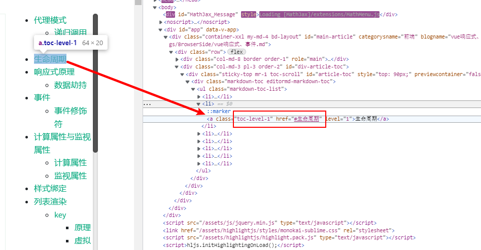

Vue router4中有两种路由历史模式：**Hash模式**和**HTML5**模式。

创建方法见[不同的历史模式 | Vue Router (vuejs.org)](https://router.vuejs.org/zh/guide/essentials/history-mode.html)；

Hash模式通过在路径中添加`#`，导致该请求不会发送到服务器，但这导致了原本依靠该特性的 **锚点定位** 失效了。

HTML5模式下请求会发送到服务器，因此我们需要对服务端进行配置，一是**接收请求并处理**，二是在路由路径下配置静态html文件，路由时直接返回该静态资源，本方案中为了避免创建额外的html文件，仍然使用了Hash模式。


## 背景

markdown文档中的标题与标题目录的超链接跳转。

使用`editormd.js`自动生成了md文档的目录，目录添加href属性与文档进行链接，



## 方案

为`<a>`标签添加点击事件，在事件中拦截原始事件的触发，并调用element.scrollIntoView()，让页面定位到指定的标题。

### 页面渲染

```javascript
let md2html = new Promise(function (resolve, reject) {
        editor.markdownToHTML("article-body", {
          markdown: mdcontent,
          tocContainer: "#article-toc",
          tocDropown: true,
          tex: true, // 默认不解析
        });
        resolve();
      });
      md2h
```

### 事件绑定

```javascript
md2html.then(() => {
        let titleElments = document.querySelectorAll(".reference-link");
        let tocContainer = document.querySelector(".markdown-toc-list");
        let liElements = tocContainer.getElementsByTagName("li");
        for (let i=0; i < liElements.length; i++) {
          let el = liElements[i].firstChild;
          el.addEventListener("click", function (event) {
            event.preventDefault();
            titleElments[i].scrollIntoView({
              behavior: 'smooth'
            });
          });
        }
      });
```

`.reference-link`和`.markdown-toc-list`分别是`editormd.js`生成的内容元素和标题元素的类，获取到这两个容器，然后进行事件绑定。

