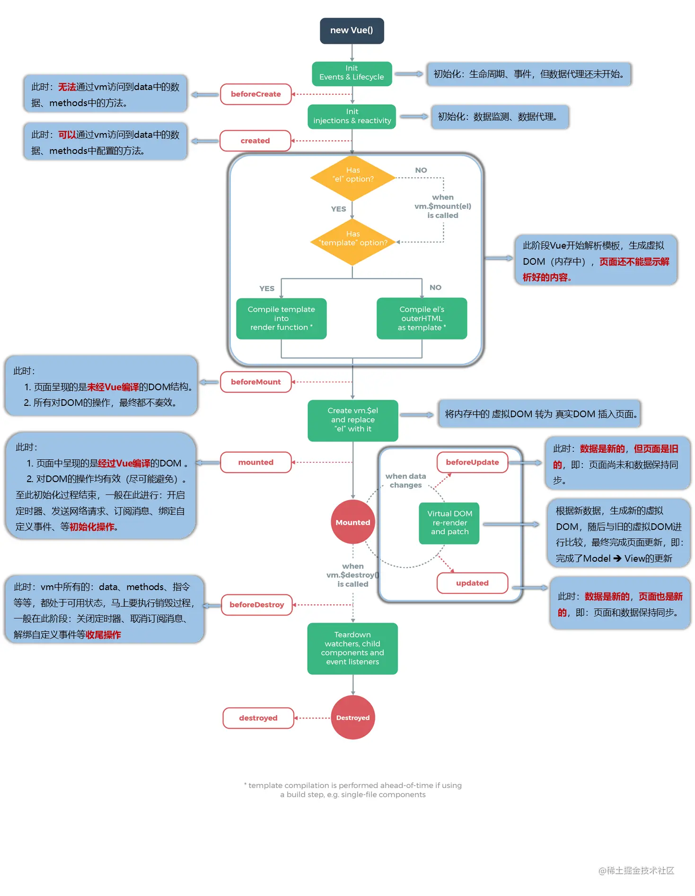
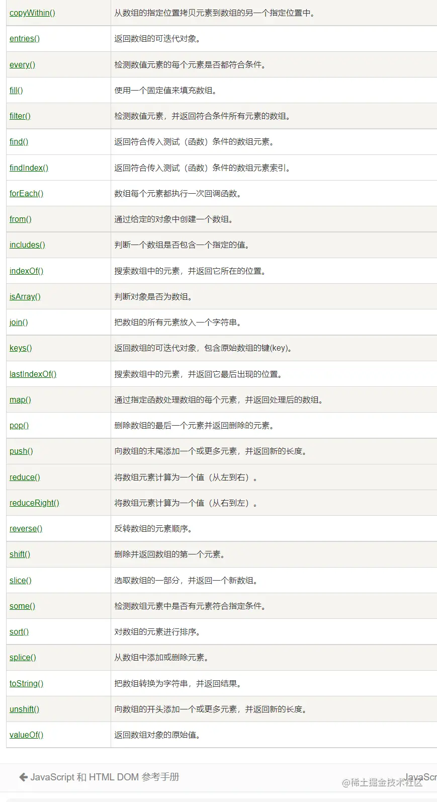

[HTML知识点](./HTML知识点.md)

[JS面试题](./js面试题.md)

[浏览器网络](./浏览器网络面试题.md)

[React面试题](./react面试题.md)

[Vue面试](./vue面试.md)

# [前端常见面试题（56道） - 掘金 (juejin.cn)](https://juejin.cn/post/7056400571967733774)

## 1、什么是 MVVM、mvc 模型？

MVC模型主要针对后端， 其中最核心的是Controller，负责进行业务逻辑处理。Model表示数据操作层，负责与数据库的交互。View则是前端视图界面。

MVVM是针对前端的模型——Model-View-ViewModel，模型-视图-控制器，他是一种双向数据绑定模式，用来建立数据与视图的联系。数据变化可以引起视图变化，视图变化也可以引起数据变化。

## 2、vue 双向数据绑定的原理？

VUE2中采用数据劫持加发布-订阅的方式实现双向绑定，数据劫持通过`Object.defineProperty`实现，通过创建访问器属性，实现对获取属性和修改属性的操作。在获取属性时，给目标对象添加订阅，修改时进行消息发布。达到双向绑定的目标([vue响应式](./vue.md))。

但是这种方法无法很好检测数组的变化，例如数组的添加和删除元素操作。为了实现对数组的箭头，vue2重写了数组的`push`，`pop`，`shift`等可以使自身发生变化的方法。

而在VUE3中，数据双向绑定通过新的代理对象实现，代理与原数据是两个对象，但是通过代理我们可以访问到原对象，并监听对原对象的操作[代理与反射](./8.3-9JS高级程序设计.md)。

代理为什么可以监听数组？[(112条消息) proxy的理解及proxy为什么可以监听数组？_四毛真小气的博客-CSDN博客_proxy监听数组](https://blog.csdn.net/weixin_43574780/article/details/108042951)

数组的下标访问也会触发`get`捕获器。

push，unshif等操作也会触发`get`和`set`。这些操作的底层需要执行这些函数。

```
const arr = [
    'wjl',
    {
        name: 'wjl',
        age: 13
    },
    [1, '2', 3]
]
const arrProxy = new Proxy(arr, {
    get: (taget, p, reciver)=>{
        console.log('get')
        return Reflect.get(taget, p, reciver)
    }
})
console.log(arrProxy[0])
console.log(arrProxy[1].name)
//get
//wjl
//get
//wjl

arrProxy.push('hello world')
arrProxy.unshift(0)
//get
//set
//get
//set
//get
//set
//set
//set
```


## 3、vue 的生命周期有哪些？

 vue 实例从创建到销毁的过程就是生命周期。 也就是从**开始创建、初始化数据、编译模板、挂在 dom -> 渲染、更新 -> 渲染、准备销毁、销毁**等一系列过程 vue 的声明周期常见的主要分为**4 大阶段 8 大钩子函数** 另外三个生命周期函数不常用 **keep-alive** 主要用于保留组件状态或避免重新渲染。 **activated**只有在 keep-alive 组件激活时调用。 **deactivated**只有在 keep-alive 组件停用时调用。 **errorCapured** 当捕获一个来自子孙组件的错误时被调用。此钩子会收到三个参数：错误对象、发生错 误的组件实例以及一个包含错误来源信息的字符串。此钩子可以返回 false 以阻止该错误继续向上传 播。

一、创建前 / 后 在`beforeCreate`生命周期函数执行的时候，data 和 method 还没有初始化 在`created `生命周期函数执行的时候， data 和 method 已经初始化完成

二、渲染前/后 在`beforeMount` 生命周期函数执行的时候，已经编译好了模版字符串、但还没有真正渲染到页面中去 在`mounted `生命周期函数执行的时候，已经渲染完，可以看到页面

三、数据更新前/后 在`beforeUpdate`生命周期函数执行的时候，已经可以拿到最新的数据，但还没渲染到视图中去。 在`updated`生命周期函数执行的时候，已经把更新后的数据渲染到视图中去了。

四、销毁前/后 在`beforeDestroy `生命周期函数执行的时候，实例进入准备销毁的阶段、此时 data 、methods 、指令 等还是可用状态 在`destroyed`生命周期函数执行的时候，实例已经完成销毁、此时 data 、methods 、指令等都不可用

## 4、v-if 和 v-show 有什么区别？

`v-if` 是“真正”的条件渲染，因为它会确保在切换过程中条件块内的事件监听器和子组件适当地被销毁和重建， 操作的实际上是 dom 元素的创建或销毁。

`v-show` 就简单得多——不管初始条件是什么，元素总是会被渲染，并且只是简单地基于 CSS 进行切换， 它操作的是`display:none/block`属性。

一般来说， v-if 有更高的切换开销，而 v-show 有更高的初始渲染开销。因此，如果需要非常**频繁地切换**，则使用` v-show` 较好； 如果在运行时条件很少改变，则使用 v-if 较好。

## 5、async await 是什么？它有哪些作用？

**async await** 是**es7**里面的新语法、它的作用就是 async 用于申明一个 function 是异步的，而 await 用 于等待一个异步方法执行完成。它可以很好的替代**promise 中的 then**

async 函数返回一个 Promise 对象，可以使用 **then** 方法添加回调函数。当函数执行的时候，一旦遇 到 `await `就会先返回， 等到异步操作完成，再接着执行函数体内后面的语句。

## 6、常用的数组方法有哪些？

**concat()** 方法用于合并两个或多个数组。此方法不会更改现有数组，而是返回一个新数组。

**find()** 方法**返回数组中满足提供的测试函数的第一个元素的值**。否则返回 undefined 。

**findIndex()** 方法返回数组中满足提供的**测试函数**的**第一个元素的索引**。否则返回-1。

**includes()** 方法用来**判断一个数组是否包含一个指定的值**，根据情况，如果包含则返回 true， 否则返回 false。

**indexOf()** 方法返回在数组中可以**找到一个给定元素的第一个索引**，如果**不存在，则返回-1**。 （通常用它判断数组中有没有这个元素）

**join()** 方法将一个数组（或一个类数组对象）的所有元素**连接成一个字符串并返回这个字符串**。 如果数组只有一个项目，那么将返回该项目而不使用分隔符。

**pop()** 方法从数组中**删除最后一个元素**，并返回该元素的值。此方法更改数组的长度。

**push()** 方法将**一个或多个元素添加到数组的末尾**，并返回该数组的新长度。

**shift()** 方法从数组中**删除第一个元素**，并返回该元素的值。此方法更改数组的长度。

**unshift()** 方法将**一个或多个元素添加到数组的开头**，并返回该数组的新长度(该方法修改原有数组)。

**splice()** 方法通过删除或替换现有元素或者原地添加新的元素来修改数组,并以数组形式返回被修改的内 容。**此方法会改变原数组**。 由被删除的元素组成的一个数组。如果只删除了一个元素，则返回只包含一个元素的数组。如果没有删 除元素，则返回空数组。

**slice()** 方法同上，但不会改变原数组

**reverse()** 方法将数组中元素的位置颠倒，并返回该数组。该方法会改变原数组。

**sort()** 方法用原地算法对数组的元素进行排序，并返回数组。默认排序顺序是在将元素转换为字 符串，然后比较它们的 UTF-16 代码单元值序列时构建的



## 7、数组有哪几种循环方式？分别有什么作用？

**every()** 方法测试一个数组内的所有元素是否都能通过某个指定函数的测试。它返回一个布尔 值。

**filter()** 方法**创建一个新数组**, 其包含通过所提供函数实现的测试的所有元素。 **注意：**  filter() 不会对空数组进行检测。 **注意：**  filter() 不会改变原始数组。

**forEach()** 方法对数组的**每个元素执行一次**提供的函数。

**some()** 方法测试**是否至少有一个元素可以通过被提供的函数方法**。该方法返回一个 Boolean 类型 的值。

## 8、常用的字符串方法有哪些？

**charAt()** 方法从一个字符串中返回指定的字符。

**concat()** 方法将一个或多个字符串与原字符串连接合并，形成一个新的字符串并返回。

**includes()** 方法用于判断一个字符串是否包含在另一个字符串中，根据情况返回 true 或 false。

**indexOf()** 方法返回调用它的 String 对象中第一次出现的指定值的索引，从 fromIndex 处进行搜 索。如果未找到该值，则返回 -1。 **match()** 方法检索返回一个字符串匹配正则表达式的的结果。

**padStart()** 方法用另一个字符串填充当前字符串(重复，如果需要的话)，以便产生的字符串达到给定的 长度。填充从当前字符串的开始(左侧)应用的。 (常用于时间补 0)

**replace()** 方法返回一个由替换值（ replacement ）替换一些或所有匹配的模式（ pattern ）后的新 字符串。模式可以是一个字符串或者一个[正则表达式](https://link.juejin.cn?target=https%3A%2F%2Fdeveloper.mozilla.org%2Fzh-CN%2Fdocs%2FWeb%2FJavaScript%2FReference%2FGlobal_Objects%2FRegExp)，替换值可以是一个字符串或者一个每次匹配都要 调用的回调函数。 原字符串不会改变。 slice() 方法提取某个字符串的一部分，并返回一个新的字符串，且不会改动原字符串。

**split()** 方法使用指定的分隔符字符串将一个 [String](https://link.juejin.cn?target=https%3A%2F%2Fdeveloper.mozilla.org%2Fzh-CN%2Fdocs%2FWeb%2FJavaScript%2FReference%2FGlobal_Objects%2FString) 对象分割成字符串数组，以将字符串分隔为 子字符串，以确定每个拆分的位置。 **substr()** 方法返回一个字符串中从指定位置开始到指定字符数的字符。 trim() 方法会从一个字符串的两端删除空白字符。在这个上下文中的空白字符是所有的空白字符 (space, tab, no-break space 等) 以及所有行终止符字符（如 LF，CR）。

## 9、什么是原型链？

每一个实例对象上有一个**proto 属性**，指向的**构造函数的原型对象**，构造函数的原型 对象也是一个对象， 也有 proto 属性，这样一层一层往上找的过程就形成了**原型链**。

## 10、什么是闭包？手写一个闭包函数？ 闭包有哪些优缺点？

**闭包**（closure）指有权访问另一个函数作用域中变量的函数。简单理解就是 ，一个**作用 域可以访问另外一个函数内部的局部变量**。

```js
function fn() {
  var num = 10
  function fun() {
    console.log(num)
  }
  return fun
}
var f = fn()
f()
复制代码
```

**作用：** 延长变量作用域、在函数的外部可以访问函数内部的局部变量，**容易造成内层泄露**，因为闭包中 的局部变量**永远不会被回收**

## 11、常见的继承有哪些？

### 一、原型链继承

**特点：**  1、实例可继承的属性有：实例的构造函数的属性，父类构造函数属性，父类原型的属性。（新 实例不会继承父类实例的属性！

**缺点：**  1、新实例无法向父类构造函数传参。

2、继承单一。

3、所有新实例都会共享父类实例的属性。（原型上的属性是共享的，一个实例修改了原型属 性，另一个实例的原 型属性也会被修改！）

### 二、借用构造函数继承

**重点：**  用 **.call()和.apply()** 将父类构造函数引入子类函数（在子类函数中做了父类函数的自执行（复 制））

**特点：**  1、只继承了父类构造函数的属性，没有继承父类原型的属性。

2、解决了原型链继承缺点 1、2、3。

3、可以继承多个构造函数属性（call 多个）。

4、在子实例中可向父实例传参。

**缺点：**  1、只能继承父类构造函数的属性。

2、无法实现构造函数的复用。（每次用每次都要重新调用）

3、每个新实例都有父类构造函数的副本，臃肿。

### 三、组合继承（组合原型链继承和借用构造函数继承）（常用）

**重点：** 结合了两种模式的优点，传参和复用

**特点：**  1、可以继承父类原型上的属性，可以传参，可复用。

2、每个新实例引入的构造函数属性是私有的。

**缺点：** 调用了两次父类构造函数（耗内存），子类的构造函数会代替原型上的那个父类构造函 数。

### 四、原型式继承

**重点：** 用一个函数包装一个对象，然后返回这个函数的调用，这个函数就变成了个可以随意增添属性的 实例或对象。object.create()就是这个原理。

**特点：** 类似于复制一个对象，用函数来包装。

**缺点：** 1、所有实例都会继承原型上的属性。 2、无法实现复用。（新实例属性都是后面添加的）

### 五、class 类实现继承

通过 extends 和 super 实现继承

### 六、寄生式继承

**重点：** 就是给原型式继承外面套了个壳子。

**优点：** 没有创建自定义类型，因为只是套了个壳子返回对象（这个），这个函数顺理成章就成 了创建的新对象。

**缺点：** 没用到原型，无法复用。

## 12、后台管理系统中的权限管理是怎么实现的？

**登录：** 当用户填写完账号和密码后向服务端验证是否正确，验证通过之后，服务端会返回一个 token，

拿到 token 之后（我会将这个 token 存贮到 cookie 中，保证刷新页面后能记住用户登录状态），前端会 根据 token 再去拉取一个 user_info 的接口来获取用户的详细信息（如用户权限，用户名等等信息）。

**权限验证：** 通过 token 获取用户对应的 权限，动态根据用户的 权限算出其对应有权限的路由，通过 router.addRoutes 动态挂载这些路由。

**具体思路：**

登录成功后，服务端会返回一个 **token**（该 token 的是一个能唯一标示用户身份的一个 key），之后我 们将 token 存储在本地 cookie 之中，这样下次打开页面或者刷新页面的时候能记住用户的登录状态，不 用再去登录页面重新登录了。

ps:为了保证安全性，我司现在后台所有 token 有效期(Expires/Max-Age)都是 Session，就是当浏览器关 闭了就丢失了。重新打开游览器都需要重新登录验证，后端也会在每周固定一个时间点重新刷新 token，让后台用户全部重新登录一次，确保后台用户不会因为电脑遗失或者其它原因被人随意使用账 号。

用户登录成功之后，我们会在全局钩子 router.beforeEach 中拦截路由，判断是否已获得 token，在 获得 token 之后我们就要去获取用户的基本信息了 页面会先从 cookie 中查看是否存有 token，没有，就走一遍上一部分的流程重新登录，如果有 token, 就会把这个 token 返给后端去拉取 user_info，保证用户信息是最新的。 当然如果是做了单点登录得功 能的话，用户信息存储在本地也是可以的。当你一台电脑登录时，另一台会被提下线，所以总会重新登 录获取最新的内容。

先说一说我权限控制的主体思路，前端会有一份路由表，它表示了每一个路由可访问的权限。当用户登 录之后，通过 **token** 获取用户的 **role** ，动态根据用户的 role 算出其对应有权限的路由，再通过 **router.addRoutes** 动态挂载路由。但这些控制都只是页面级的，说白了前端再怎么做权限控制都不是 绝对安全的，后端的权限验证是逃不掉的。

我司现在就是前端来控制页面级的权限，不同权限的用户显示不同的侧边栏和限制其所能进入的页面(也 做了少许按钮级别的权限控制)，后端则会验证每一个涉及请求的操作，验证其是否有该操作的权限，每 一个后台的请求不管是 get 还是 post 都会让前端在请求 header 里面携带用户的 token，后端会根据 该 token 来验证用户是否有权限执行该操作。若没有权限则抛出一个对应的状态码，前端检测到该状 态码，做出相对应的操作。 使用 vuex 管理路由表，根据 vuex 中可访问的路由渲染侧边栏组件。

**具体实现：**

创建 vue 实例的时候将**vue-router**挂载，但这个时候 vue-router 挂载一些登录或者不用权限的公用的页 面。

当用户登录后，获取用**role**，将 role 和路由表每个页面的需要的权限作比较，生成最终用户可访问的路 由表。

调用**router.addRoutes**(store.getters.addRouters)添加用户可访问的路由。

使用**vuex**管理路由表，根据 vuex 中可访问的路由渲染侧边栏组件。

## 14、es6 有哪些新特性？

ES6 是 2015 年推出的一个新的版本、这个版本相对于 ES5 的语法做了很多的优化、例如：新增了**let、 const**

**let 和 const**具有块级作用域，**不存在变量提升的问题**。新增了**箭头函数**，简化了定义函数的写法，

同时 可以**巧用箭头函数的 this**、（注意箭头函数本身没有 this,它的 this 取决于外部的环境），

新增了**promise** 解决了回调地域的问题，新增了模块化、利用 import 、export 来实现导入、导出。

新增了**结构赋值**， ES6 允许按照一定模式，从数组和对象中提取值，对变量进行赋值，这被称为解构 （Destructuring）。

新增了**class 类**的概念，它类似于对象。

## 15、v-for 循环为什么一定要绑定 key ?

**页面上的标签都对应具体的虚拟 dom 对象(虚拟 dom 就是 js 对象),** 循环中 ,如果没有唯一 key , 页面上删除 一条标签, 由于并不知道删除的是那一条! 所以要把全部虚拟 dom 重新渲染, 如果知道 key 为 x 标签被删除 掉, 只需要把渲染的 dom 为 x 的标签去掉即可!

## 16、组件中的 data 为什么要定义成一个函数而不是一个对象？

**每个组件都是 Vue 的实例**。组件共享 data 属性，当 data 的值是同一个引用类型的值时，改变其中一 个会影响其他

## 17、常见的盒子垂直居中的方法有哪些请举例 3 种？

**1. 利用子绝父相定位的方式来实现**

```css
#container {
  width: 500px;
  height: 500px;
  position: relative;
}
#center {
  width: 100px;
  hight: 100px;
  position: absolute;
  top: 50%;
  left: 50%;
  margin-top: -50px;
  margin-left: -50px;
}
复制代码
```

**2. 利用 Css3 的 transform，可以轻松的在未知元素的高宽的情况下实现元素的垂直居中。**

```css
#container {
  position: relative;
}
#center {
  position: absolute;
  top: 50%;
  left: 50%;
  transform: translate(-50%, -50%);
}
复制代码
```

**3. flex**

```css
#container {
  display: flex;
  justify-content: center;
  align-items: center;
}
#center {
}
复制代码
```

## 18、平时都是用什么实现跨域的？

**jsonp:** 利用 标签没有跨域限制的漏洞，网页可以得到从其他来源动态产生的 JSON 数据。JSONP 请求一 定需要对方的服务器做支持才可以。

JSONP 优点是简单兼容性好，可用于解决主流浏览器的跨域数据访问的问题。缺点是仅支持 get 方法具 有局限性,不安全可能会遭受 XSS 攻击。

声明一个回调函数，其函数名(如 show)当做参数值，要传递给跨域请求数据的服务器，函数形参为要获 取目标数据(服务器返回的 data)。 创建一个 `<script>` 标签，把那个跨域的 API 数据接口地址，赋值给 script 的 src,还要在这个地址中向服 务器传递该函数名（可以通过问号传参:?callback=show）。

服务器接收到请求后，需要进行特殊的处理：把传递进来的函数名和它需要给你的数据拼接成一个字符 串,例如：传递进去的函数名是 show，它准备好的数据是 show('我不爱你') 。

最后服务器把准备的数据通过 HTTP 协议返回给客户端，客户端再调用执行之前声明的回调函数 （show），对返回的数据进行操作。

**CORS：跨域资源共享（CORS）是一种机制**；当一个资源访问到另外一个资源(这个资源放在 不同的域名或者不同的协议或者端口)，资源就会发起一个跨域的 HTTP 请求需要浏览器和服务器同时支持；

1.整个 CORS 通信，都是浏览器自动完成。浏览器发现了 AJAX 请求跨源，就会自动添加一些附加的头 信息，有时还会多出一次附加的请求，但用户不会有感觉；

2.实现 CORS 的关键是服务器，只要服务器实现了 CORS 接口，就可以跨源通信

3.服务器对于不同的请求，处理方式不一样； 有简单请求和非简单请求

## 19、cookie 、localstorage 、 sessionstrorage 之间有什么区别？

- 与服务器交互：
  - cookie 是网站为了标示用户身份而储存在用户本地终端上的数据（通常经过加密）
  - cookie 始终会在同源 http 请求头中携带（即使不需要），在浏览器和服务器间来回传递
  - sessionStorage 和 localStorage 不会自动把数据发给服务器，仅在本地保存
- 存储大小：
- cookie 数据根据不同浏览器限制，大小一般不能超过 4k
- sessionStorage 和 localStorage 虽然也有存储大小的限制，但比 cookie 大得多，可以达到 5M 或更大
- 有期时间：
  - localStorage 存储持久数据，浏览器关闭后数据不丢失除非主动删除数据
  - sessionStorage 数据在当前浏览器窗口关闭后自动删除
  - cookie 设置的 cookie 过期时间之前一直有效，与浏览器是否关闭无关

## 20、this 的指向有哪些？

1、普通函数中的 this 指向 window

2、定时器中的 this 指向 window，这意味着即使在对象内部创建定时器，回调使用函数的化，this指针不会指向对象，可以使用箭头函数改变指向。

3、箭头函数没有 this,它的 this 指向取决于外部环境、

4、事件中的 this 指向事件的调用者

5、 构造函数中 this 和原型对象中的 this,都是指向构造函数 new 出来实例对象

6、类 class 中的 this 指向由 constructor 构造器 new 出来的实例对象

7、自调用函数中的 this 指向 window

## 21、什么是递归，递归有哪些优点或缺点？

**递归：** 如果一个函数在内部可以调用其本身，那么这个函数就是递归函数。简单理解:函 数内部自己调用自己, 这个函数就是递归函数

**优点：** 结构清晰、可读性强

**缺点：** 效率低、调用栈可能会溢出，其实每一次函数调用会在内存栈中分配空间，而每个进程的栈的容 量是有限的，当调用的层次太多时，就会超出栈的容量，从而导致栈溢出。->性能

## 22、谈谈你平时都用了哪些方法进行性能优化？

**减少 http 请求次数、打包压缩上线代码、使用懒加载、使用雪碧图、动态渲染组件、CDN 加载包。**

## 23、vue 实例是挂载到那个标签上的？

vue 实例最后会挂载在**body 标签**里面，所以我们在 vue 中是获取不了 body 标签的，如果要使用 body 标 签的话需要用**原生的方式获取**

## 24、什么是深拷贝、什么是浅拷贝？

**浅拷贝：** 创建一个新对象，这个对象有着原始对象属性值的一份精确拷贝。如果属性是基本类型，拷贝 的就是基本类型的值，如果属性是引用类型，拷贝的就是内存地址 ，所以如果其中一个对象改变了这个 地址，就会影响到另一个对象。

**深拷贝：** 会拷贝所有的属性，并拷贝属性指向的动态分配的内存。当对象和它所引用的对象一起拷贝时即 发生深拷贝。 **深拷贝相比于浅拷贝速度较慢并且花销较大**。拷贝前后两个对象互不影响。

## 25、js 的执行机制是怎么样的？

**js 是一个单线程、异步、非阻塞 I/O 模型、 event loop 事件循环的执行机制**

所有任务可以分成两种，一种是**同步任务（synchronous）**，另一种是**异步任务（asynchronous）**。

同步任务指的是，在主线程上排队执行的任务，只有前一个任务执行完毕，才能执行后一个任务。异步 任务指的是，不进入主线程、而进入"任务队列"（task queue）的任务，只有"任务队列"通知主线程， 某个异步任务可以执行了，该任务才会进入主线程执行。

## 26、请写至少三种数组去重的方法？（原生 js）

```js
//利用filter
function unique(arr) {
  return arr.filter(function (item, index, arr) {
    //当前元素，在原始数组中的第一个索引==当前索引值，否则返回当前元素
    return arr.indexOf(item, 0) === index
  })
}
var arr = [
  1,
  1,
  'true',
  'true',
  true,
  true,
  15,
  15,
  false,
  false,
  undefined,
  undefined,
  null,
  null,
  NaN,
  NaN,
  'NaN',
  0,
  0,
  'a',
  'a',
  {},
  {}
]
console.log(unique(arr))
复制代码
//利用ES6 Set去重（ES6中最常用）
function unique(arr) {
  return Array.from(new Set(arr))
}
var arr = [
  1,
  1,
  'true',
  'true',
  true,
  true,
  15,
  15,
  false,
  false,
  undefined,
  undefined,
  null,
  null,
  NaN,
  NaN,
  'NaN',
  0,
  0,
  'a',
  'a',
  {},
  {}
]
console.log(unique(arr))
//[1, "true", true, 15, false, undefined, null, NaN, "NaN", 0, "a", {}, {}]
复制代码
//利用for嵌套for，然后splice去重（ES5中最常用）
function unique(arr) {
  for (var i = 0; i < arr.length; i++) {
    for (var j = i + 1; j < arr.length; j++) {
      if (arr[i] == arr[j]) {
        //第一个等同于第二个，splice方法删除第二个
        arr.splice(j, 1)
        j--
      }
    }
  }
  return arr
}
var arr = [
  1,
  1,
  'true',
  'true',
  true,
  true,
  15,
  15,
  false,
  false,
  undefined,
  undefined,
  null,
  null,
  NaN,
  NaN,
  'NaN',
  0,
  0,
  'a',
  'a',
  {},
  {}
]
console.log(unique(arr))
//[1, "true", 15, false, undefined, NaN, NaN, "NaN", "a", {…}, {…}]
//NaN和{}没有去重，两个null直接消失了
复制代码
```

## 27、请写出至少两种常见的数组排序的方法（原生 js）

```js
//快速排序
function quickSort(elements) {
  if (elements.length <= 1) {
    return elements
  }
  var pivotIndex = Math.floor(elements.length / 2)
  var pivot = elements.splice(pivotIndex, 1)[0]
  var left = []
  var right = []
  for (var i = 0; i < elements.length; i++) {
    if (elements[i] < pivot) {
      left.push(elements[i])
    } else {
      right.push(elements[i])
    }
  }
  return quickSort(left).concat([pivot], quickSort(right))
  //concat()方法用于连接两个或者多个数组；该方法不会改变现有的数组，而仅仅会返回被连接数组的一个副本。
}
var elements = [3, 5, 6, 8, 2, 4, 7, 9, 1, 10]
document.write(quickSort(elements))
复制代码
//插入排序
function sort(elements) {
  // 假设第0个元素是一个有序数列，第1个以后的是无序数列，
  // 所以从第1个元素开始将无序数列的元素插入到有序数列中去
  for (var i = 1; i <= elements.length; i++) {
    // 升序
    if (elements[i] < elements[i - 1]) {
      // 取出无序数列中的第i个作为被插入元素
      var guard = elements[i]
      //记住有序数列的最后一个位置，并且将有序数列的位置扩大一个
      var j = i - 1
      elements[i] = elements[j]
      // 比大小;找到被插入元素所在位置
      while (j >= 0 && guard < elements[j]) {
        elements[j + 1] = elements[j]
        j--
      }
      elements[j + 1] = guard //插入
    }
  }
}
var elements = [3, 5, 6, 8, 2, 4, 7, 9, 1, 10]
document.write('没调用之前：' + elements)
document.write('<br>')
sort(elements)
document.write('被调用之后：' + elements)
复制代码
//冒泡排序
function sort(elements) {
  for (var i = 0; i < elements.length - 1; i++) {
    for (var j = 0; j < elements.length - 1 - i; j++) {
      if (elements[j] > elements[j + 1]) {
        var swap = elements[j]
        elements[j] = elements[j + 1]
        elements[j + 1] = swap
      }
    }
  }
}
var elements = [3, 5, 6, 8, 2, 4, 7, 9, 1, 10]
console.log('before' + elements)
sort(elements)
console.log('after' + elements)
复制代码
```

## 28、知道 lodash 吗？它有哪些常见的 API ？

[官网](https://link.juejin.cn?target=https%3A%2F%2Fwww.lodashjs.com%2F)

Lodash 是一个一致性、模块化、高性能的 JavaScript 实用工具库。 _.cloneDeep 深度拷贝 _.reject 根据条件去除某个元素。 _.drop(array, [n=1] ) 作用：将 array 中的前 n 个元素去掉，然后返回剩余的部分.

## 29、http 的请求方式有哪些？

get、post、put、delete 等

## 30、平时都是用那些工具进行打包的？babel 是什么？

**WebPack 是一个模块打包工具**，你可以使用 WebPack 管理你的模块依赖，并编绎输出模块们所需的静 态文件。它能够很好地管理、打包 Web 开发中所用到的 HTML、Javascript、CSS 以及各种静态文件（图 片、字体等），让开发过程更加高效。对于不同类型的资源，webpack 有对应的模块加载器。

**webpack** 模块打包器会分析模块间的依赖关系，最后 生成了优化且合并后的静态资源 **babel**可以帮助我们转换一些当前浏览器不支持的语法，它会把这些语法转换为低版本的语法以便浏览 器识别。

## 31、谈谈 set 、 map 是什么？

**set** 是 es6 提供的一种新的数据结构，它类似于数组，但是成员的值都是唯一的。

**map** 是 es6 提供的一种新的数据结构,它类似于对象，也是键值对的集合，但是键的范围不仅限于字符 串，各种类型的值都可以当做键。也就是说，Object 结构提供了“字符串—值”的对应，Map 结构提供 了“值—值”的对应，是一种更完善的 Hash 结构实现。如果你需要“键值对”的数据结构，Map 比 Object 更合适。

## 32、清除浮动的方法有哪些？

为什么要清除浮动，因为浮动的盒子脱离标准流，如果父盒子没有设置高度的话，下面的盒子就会撑上 来。

1.额外标签法（在最后一个浮动标签后，新加一个标签，给其设置 clear：both；）（不推荐）

2.父级添加 overflow 属性（父元素添加 overflow:hidden）（不推荐）

**3.使用 after 伪元素清除浮动（推荐使用）**

```css
.clearfix:after{/*伪元素是行内元素 正常浏览器清除浮动方法*/
  content: "";
  display: block;
  height: 0;
  clear:both;
  visibility: hidden;
}
.clearfix{
  *zoom: 1;/*ie6清除浮动的方式 *号只有IE6-IE7执行，其他浏览器不执行*/
｝
复制代码
```

**4.使用 before 和 after 双伪元素清除浮动**

```css
.clearfix:after,
.clearfix:before {
  content: '';
  display: table;
}
.clearfix:after {
  clear: both;
}
.clearfix {
  *zoom: 1;
}
复制代码
```

## 33、常见的布局方法有哪些？他们的优缺点是什么？

**页面布局常用的方法有浮动、定位、flex、grid 网格布局、栅格系统布局**

**浮动：**  优点：兼容性好。 缺点：浮动会脱离标准文档流，因此要清除浮动。我们解决好这个问题即可。

**绝对定位** 优点：快捷。 缺点：导致子元素也脱离了标准文档流，可实用性差。

**flex 布局**（CSS3 中出现的） 优点：解决上面两个方法的不足，flex 布局比较完美。移动端基本用 flex 布局。

**网格布局（grid）** CSS3 中引入的布局，很好用。代码量简化了很多。

利用网格布局实现的一个左右 300px 中间自适应的布局

```html
<!DOCTYPE html>
<html lang="en">
  <head>
    <meta charset="UTF-8" />
    <title>Document</title>
    <style>
      html * {
        padding: 0;
        margin: 0;
      }
      /* 重要：设置容器为网格布局，宽度为100% */
      .layout.grid .left-center-right {
        display: grid;
        width: 100%;
        grid-template-rows: 100px;
        grid-template-columns: 300px auto 300px; /* 重要：设置网格为三列，
	并设置每列的宽度。即可。*/
      }
      .layout.grid .left {
        background: red;
      }
      .layout.grid .center {
        background: green;
      }
      .layout.grid .right {
        background: blue;
      }
    </style>
  </head>
  <body>
    <section class="layout grid">
      <article class="left-center-right">
        <div class="left">我是 left</div>
        <div class="center">
          <h1>网格布局解决方案</h1>
          我是 center
        </div>
        <div class="right">我是 right</div>
      </article>
    </section>
  </body>
</html>
复制代码
```

**栅格系统布局** 优点：可以适用于多端设备

## 34、图片懒加载是怎么实现的？

就是我们先设置图片的 data-set 属性（当然也可以是其他任意的，只要不会发送 http 请求就行了，作用 就是为了存取值）值为其图片路径，由于不是 src，所以不会发送 http 请求。

然后我们计算出页面 scrollTop 的高度和浏览器的高度之和， 如果图片距离页面顶端的坐标 Y（相对于整个页面，而不是浏览 器窗口）小于前两者之和，就说明图片就要显示出来了（合适的时机，当然也可以是其他情况），

这时 候我们再将 data-set 属性替换为 src 属性即可。

## 35、vue 中 computed 和 watch 的区别是什么？

`computed`计算属性就是为了简化 template 里面模版字符串的计算复杂度、防止模版太过冗余。

它具有 缓存特性 computed 用来监控自己定义的变量，该变量不在 data 里面声明，直接在 computed 里面定义，然后就 可以在页面上进行双向数据绑定展示出结果或者用作其他处理；

`watch`主要用于**监控 vue 实例的变化**，它监控的变量当然必须在 data 里面声明才可以，它可以监控一个 变量，也可以是一个对象，一般用于监控路由、input 输入框的值特殊处理等等，它比较适合的场景是 一个数据影响多个数据，它不具有缓存性

- watch：监测的是属性值， 只要属性值发生变化，其都会触发执行回调函数来执行一系列操作。
- computed：监测的是依赖值，依赖值不变的情况下其会直接读取缓存进行复用，变化的情况下才 会重新计算。

除此之外，有点很重要的区别是：**计算属性不能执行异步任务，计算属性必须同步执行**。也就是说计算 属性不能向服务器请求或者执行异步任务。如果遇到异步任务，就交给侦听属性。**watch 也可以检测 computed 属性。**

## 36、vue 中是怎么实现父向子、子向父、兄弟之间的传值的？

**父向子传值主要通过的是 props 属性来传值，props 只读**

```html
<!DOCTYPE html>
<html lang="en">
  <head>
    <meta charset="UTF-8" />
    <meta name="viewport" content="width=device-width, initial-scale=1.0" />
    <meta http-equiv="X-UA-Compatible" content="ie=edge" />
    <title>父组件向子组件传值--props</title>
    <script src="./js/vue.min.js"></script>
  </head>
  <body>
    <div id="app">
      <menu-item title="来自父组件的值"></menu-item>
      <!-- 在子组件身上绑定自定义属性来接收父组件data中的数据 -->
      <menu-item :tit="title"></menu-item>
    </div>
    <script>
      Vue.component('menu-item', {
        props: ['tit'], //props用来接收父组件传过来的值
        //在props中使用驼峰形式，模版中要改为使用短横线拼接 props里面的值只读，不能修改
        //props是单向数据流
        data() {
          return {}
        },
        template: '<div>{{tit}}</div>'
      })
      var vm = new Vue({
        el: '#app',
        data: {
          title: '我是父组件中的数据'
        },
        methods: {}
      })
    </script>
  </body>
</html>
复制代码
```

**子向父传值 $emit**

```html
<!DOCTYPE html>
<html lang="en">
  <head>
    <meta charset="UTF-8" />
    <title>Document</title>
  </head>
  <body>
    <div id="app">
      <!-- 父组件 -->
      <div :style='{fontSize:fontSize+"px"}'>{{pmsg}}</div>
      <!-- 子组件 -->
      <menu-item :parr="parr" @aas="blune"></menu-item>
    </div>
    <script type="text/javascript" src="js/vue.js"></script>
    <script type="text/javascript">
      /*
      子组件向父组件传值-基本用法
      props传递数据原则：单向数据流
      */
      Vue.component('menu-item', {
        props: ['parr'],
        data() {
          return {
            msg1: '这是子组件传递过来的值'
          }
        },
        template: `
          <div>
          <ul>
          <li v-for="(item,index) in parr" :key="index">{{item}}</li>
          </ul>
          <button @click='dd'>扩大父组件中字体大小</button>
          </div>
        `,
        methods: {
          dd() {
            this.$emit('aas', this.msg1)
          }
        }
      })
      //$emit
      var vm = new Vue({
        el: '#app',
        data: {
          pmsg: '父组件中内容',
          parr: ['apple', 'orange', 'banana'],
          fontSize: 10
        },
        methods: {
          blune(message) {
            this.fontSize += 5
            console.log(message)
          }
        }
      })
    </script>
  </body>
</html>
复制代码
```

**兄弟组件传值 事件总线**

```html
<!DOCTYPE html>
<html lang="en">
  <head>
    <meta charset="UTF-8" />
    <meta name="viewport" content="width=device-width, initial-scale=1.0" />
    <meta http-equiv="X-UA-Compatible" content="ie=edge" />
    <title>Document</title>
    <script src="./js/vue.min.js"></script>
  </head>
  <body>
    <div id="app">
      <brother></brother>
      <sister></sister>
    </div>
    <script>
      var enveBus = new Vue()
      Vue.component('brother', {
        data() {
          return {
            kk: ''
          }
        },
        methods: {
          dd() {
            enveBus.$emit('bTs', '这是哥哥给妹妹的爱')
          }
        },
        template: `
          <div>
          <button @click='dd'>这是一个哥哥组件---{{kk}}</button>
          </div>
        `,
        mounted() {
          enveBus.$on('asd', (result) => {
            this.kk = result
          })
        }
      })
      Vue.component('sister', {
        data() {
          return {
            sis: ''
          }
        },
        template: `
          <div>
          <button @click="cc">这是一个妹妹组件---{{sis}}</button>
          </div>
        `,
        mounted() {
          enveBus.$on('bTs', (message) => {
            this.sis = message
          })
        },
        methods: {
          cc() {
            enveBus.$emit('asd', '这是妹妹对哥哥的爱')
          }
        }
      })
      var vm = new Vue({
        el: '#app',
        data: {},
        methods: {}
      })
    </script>
  </body>
</html>
复制代码
```

## 37、什么 vuex ,谈谈你对它的理解？

1. 首先 vuex 的出现是为了解决 web 组件化开发的过程中，各组件之间传值的复杂和混乱的问题
2. 将我们在多个组件中需要共享的数据放到 store 中，
3. 要获取或格式化数据需要使用 getters，
4. 改变 store 中的数据，使用 mutation，但是只能包含同步的操作，在具体组件里面调用的方式 this.$store.commit('xxxx')
5. Action 也是改变 store 中的数据，不过是提交的 mutation，并且可以包含异步操作， 在组件中的调 用方式 this.$store.dispatch('xxx') ； 在 actions 里面使用的 commit('调用 mutation')

## 38、数据类型的判断有哪些方法？他们的优缺点及区别是什么？

然后判断数据类型的方法一般可以通过：**typeof、instanceof、constructor、toString**四种常用方法

| 不同类型的优缺点 | typeof                          | instanceof                            | constructor                                     | Object.prototype.toString.call         |
| ---------------- | ------------------------------- | ------------------------------------- | ----------------------------------------------- | -------------------------------------- |
| 优点             | 使用简单                        | 能检测出引用 类型                     | 基本能检测所有 的类型（除了 null 和 undefined） | constructor 易被 修改，也不能跨 iframe |
| 缺点             | 只能检测 出基本类 型（出 null） | 不能检测出基 本类型，且不 能跨 iframe | constructor 易被 修改，也不能跨 iframe          | IE6 下，undefined 和 null 均为 Object  |

## 39、知道 symbol 吗？

**ES6 引入新的原始数据类型 Symbol，表示独一无二的值**

## 40、请描述一下 ES6 中的 class 类?

es6 中的 class 可以把它看成是 es5 中构造函数的语法糖，它简化了构造函数的写法， 类的共有属性放到 constructor 里面

1. 通过 class 关键字创建类, 类名我们还是习惯性定义首字母大写
2. 类里面有个 constructor 函数,可以接受传递过来的参数,同时返回实例对象
3. constructor 函数 只要 new 生成实例时,就会自动调用这个函数, 如果我们不写这个函数,类也会自 动生成这个函数
4. 多个函数方法之间不需要添加逗号分隔
5. 生成实例 new 不能省略
6. 语法规范, 创建类 类名后面不要加小括号,生成实例 类名后面加小括号, 构造函数不需要加 function
   1. 继承中,如果实例化子类输出一个方法,先看子类有没有这个方法,如果有就先执行子类的
   2. 继承中,如果子类里面没有,就去查找父类有没有这个方法,如果有,就执行父类的这个方法(就近 原则)
   3. 如果子类想要继承父类的方法,同时在自己内部扩展自己的方法,利用 super 调用 父类的构造函 数,super 必须在子类 this 之前调用
7. 时刻注意 this 的指向问题,类里面的共有的属性和方法一定要加 this 使用.
   1. constructor 中的 this 指向的是 new 出来的实例对象
   2. 自定义的方法,一般也指向的 new 出来的实例对象
   3. 绑定事件之后 this 指向的就是触发事件的事件源
   4. 在 ES6 中类没有变量提升，所以必须先定义类，才能通过类实例化对象

## 41、谈谈盒子模型？

在**标准盒子模型**中，**width 和 height 指的是内容区域**的宽度和高度。

增加内边距、边框和外边距不会 影响内容区域的尺寸，但是会增加元素框的总尺寸。

**IE 盒子模型**中，**width 和 height 指的是内容区域+border+padding**的宽度和高度。

## 42、promise 是什么？它有哪些作用？

> Promise 是异步编程的一种解决方案.简单说就是一个容器，里面保存着某个未来才会结束的事件 （通常是一个异步操作）的结果。从语法上说，Promise 是一个对象，可以从改对象获取异步操 作的消息。 它可以解决回调地狱的问题，也就是异步深层嵌套问题 .catch() 获取异常信息 .finally() 成功与否都会执行（不是正式标准）
>
> ```js
> /*
> 1. Promise基本使用
> 我们使用new来构建一个Promise Promise的构造函数接收一个参数，是函数，并
> 且传入两个参数： resolve，reject， 分别表示异步操作执行成功后的回调函数
> 和异步操作执行失败后的回调函数
> */
> var p = new Promise(function (resolve, reject) {
>   //2. 这里用于实现异步任务 setTimeout
>   setTimeout(function () {
>     var flag = false
>     if (flag) {
>       //3. 正常情况
>       resolve('hello')
>     } else {
>       //4. 异常情况
>       reject('出错了')
>     }
>   }, 100)
> })
> // 5 Promise实例生成以后，可以用then方法指定resolved状态和reject状态的回调函
> 数
> // 在then方法中，你也可以直接return数据而不是Promise对象，在后面的then中就可以
> 接收到数据了
> p.then(
>   function (data) {
>     console.log(data)
>   },
>   function (info) {
>     console.log(info)
>   }
> )
> 复制代码
> ```

## 43、vue-cli 2.0 和 3.0 有什么区别？

3.0 把配置 webpack 的文件隐藏了，如果需要配置它需要创建一个 vue.config.js 文件，3.0 是 2018.10 月 出来的

## 44、箭头函数有哪些特征，请简单描述一下它？

**箭头函数没有自己的 this**，this 指向定义箭头函数时所处的**外部执行环境的 this**

即使调用**call/apply/bind**也无法改变箭头函数的 this 箭头函数本身没有名字 **箭头函数不能 new，会报错**

箭头函数没有 arguments，在箭头函数内访问这个变量访问的是外部执行环境的 arguments **箭头函数没有 prototype**

## 45、移动端有哪些常见的问题，都是怎么解决的？

**点击事件 300MS 延迟问题 解决方案：下载 fastclick 的包**

**H5 页面窗口自动调整到设备宽度，并禁止用户缩放页面**

```html
<meta name="viewport" content="width=device-width,initial-scale=1.0,minimumscale=1.0,maximum-scale=1.0,user-scalable=no"
复制代码
```

**忽略 Android 平台中对邮箱地址的识别**

```html
<meta name="format-detection" content="email=no" />
复制代码
```

**当网站添加到主屏幕快速启动方式，可隐藏地址栏，仅针对 ios 的 safari**

```html
<!-- ios7.0版本以后，safari上已看不到效果 -->
<meta name="apple-mobile-web-app-capable" content="yes" />
复制代码
```

## 46、post 和 get 请求有哪些区别？

GET：一般用于信息获取，使用 URL 传递参数，对所发送信息的数量也有限制，一般在 2000 个字符

POST：一般用于修改服务器上的资源，对所发送的信息没有限制。

GET 方式需要使用 Request.QueryString 来取得变量的值，而 POST 方式通过 Request.Form 来获取变量 的值，也就是说 Get 是通过地址栏来传值，而 Post 是通过提交表单来传值。

然而，在以下情况中，请使用 POST 请求： 无法使用缓存文件（更新服务器上的文件或数据库） 向服务器发送大量数据（POST 没有数据量限制） 发送包含未知字符的用户输入时，POST 比 GET 更稳定也更可靠

## 47、什么是同源策略？

**所谓同源策略是浏览器的一种安全机制，来限制不同源的网站不能通信。同源就是域名、协议、端口一 致。**

## 48、http 状态码分别代表什么意思？

1xx 表示 HTTP 请求已经接受，继续处理请求

2xx 表示 HTTP 请求已经处理完成(200)

3xx 表示把请求访 问的 URL 重定向到其他目录(304 资源没有发生变化，会重定向到本地资源)

4xx 表示客户端出现错误 (403 禁止访问、404 资源不存在)

5xx 表示服务端出现错误

## 49、BFC 是什么？

BFC（块级格式化上下文），一个创建了新的 BFC 的盒子是独立布局的，盒子内元素的布局不会影响盒 子外面的元素。在同一个 BFC 中的两个相邻的盒子在垂直方向发生 margin 重叠的问题。

BFC 是值浏览器中创建了一个独立的渲染区域，该区域内所有元素的布局不会影响到区域外元素的布 局，这个渲染区域只对块级元素起作用

## 50、token 是什么？（加密）

**1. token 也可以称做令牌，一般由 uid+time+sign(签名)+[固定参数] 组成**

```css
uid: 用户唯一身份标识
time: 当前时间的时间戳
sign: 签名, 使用 hash/encrypt 压缩成定长的十六进制字符串，以防止第三方恶意拼接
固定参数(可选): 将一些常用的固定参数加入到 token 中是为了避免重复查库
复制代码
```

**2. token 在客户端一般存放于 localStorage，cookie，或 sessionStorage 中。在服务器一般存于数据 库中**

**3. token 的认证流程**

```css
用户登录，成功后服务器返回Token给客户端。
客户端收到数据后保存在客户端
客户端再次访问服务器，将token放入headers中 或者每次的请求 参数中
服务器端采用filter过滤器校验。校验成功则返回请求数据，校验失败则返回错误码
复制代码
```

**4. token 可以抵抗 csrf，cookie+session 不行**

5.session 时有状态的，一般存于服务器内存或硬盘中，当服务器采用分布式或集群时，session 就会 面对负载均衡问题。负载均衡多服务器的情况，不好确认当前用户是否登录，因为多服务器不共享 session

1. 客户端登陆传递信息给服务端，服务端收到后把用户信息加密（token）传给客户端，客户端将 token 存放于 localStroage 等容器中。客户端每次访问都传递 token，服务端解密 token，就知道这 个用户是谁了。通过 cpu 加解密，服务端就不需要存储 session 占用存储空间，就很好的解决负载 均衡多服务器的问题了。这个方法叫做 JWT(Json Web Token)

## 51、js 的数据类型有哪些？

js 的数据类型分为**基本数据类型**（string、number、boolean、null、undefined、symbol）和**复杂数据类型**

**基本数据类型**的特点：直接存储在栈中的数据

**复杂数据类型**的特点：存储的是该对象在栈中引用，真实的数据存放在堆内存里

## 52、一个页面从输入 URL 到页面加载显示完成，这个过程中都发生了什么？

01.浏览器查找域名对应的 IP 地址(DNS 查询：浏览器缓存->系统缓存->路由器缓存->ISP DNS 缓存->根 域名服务器)

02.浏览器向 Web 服务器发送一个 HTTP 请求（TCP 三次握手）

03.服务器 301 重定向（从 [example.com](https://link.juejin.cn?target=http%3A%2F%2Fexample.com) 重定向到 [www.example.com）](https://link.juejin.cn?target=http%3A%2F%2Fwww.example.com%EF%BC%89)

04.浏览器跟踪重定向地址，请求另一个带 www 的网址

05.服务器处理请求（通过路由读取资源）

06.服务器返回一个 HTTP 响应（报头中把 Content-type 设置为 'text/html'）

07.浏览器进 DOM 树构建

08.浏览器发送请求获取嵌在 HTML 中的资源（如图片、音频、视频、CSS、JS 等）

09.浏览器显示完成页面

10.浏览器发送异步请求

## 53、安全问题 ：CSRF 和 XSS 攻击？

`CSRF （ Cross-site request forgery ）`：**跨站请求伪造**。

**方法一、Token 验证：（用的最多）**

1. 服务器发送给客户端一个 token ；
2. 客户端提交的表单中带着这个 token 。
3. 如果这个 token 不合法，那么服务器拒绝这个请求。

**方法二：隐藏令牌：**

把 `token `隐藏在 `http `的 `head `头中。

方法二和方法一有点像，本质上没有太大区别，只是使用方式上有区别。

**方法三、Referer 验证：**

`Referer `指的是页面请求来源。意思是，只接受本站的请求，服务器才做响应； 如果不是，就拦截 ` XSS（Cross Site Scripting）`：跨域脚本攻击。

**1.编码：** 对用户输入的数据进行 HTML Entity 编码。 如上图所示，把字符转换成 转义字符。 Encode 的作用是将 $var`等一些字符进行转化，使得浏览器在最终输出结果上是一样的

> 若不进行任何处理，则浏览器会执行 `alert` 的 js 操作，实现 XSS 注入。进行编码处理之后，L 在浏览 器中的显示结果就是 `<script>alert(1)</script>` ，实现了将 `$var 作为纯文本进行输出，且 不引起 J avaScript 的执行。

**2.过滤：** 移除用户输入的和事件相关的属性。如 onerror 可以自动触发攻击，还有 onclick 等。（总而言是，过滤掉一些不安全的内容） 移除用户输入的 Style 节点、 Script 节点、 Iframe 节点。（尤其是 Script 节点，它可是支持跨域的呀，一定要移除）。 **3.校正：** 避免直接对 HTML Entity 进行解码。 使用 DOM Parse 转换，校正不配对的 DOM 标签。

**备注：** 我们应该去了解一下 DOM Parse 这个概念，它的作用是把文本解析成 DOM 结构。 比较常用的做法是，通过第一步的编码转成文本，然后第三步转成 DOM 对象，然后经过第二步的过滤。

## 54、CSRF 和 XSS 的区别

区别一：

- CSRF ：需要用户先登录网站 A ，获取 cookie
- XSS ：不需要登录。

区别二：（原理的区别）

- CSRF ：是利用网站 A 本身的漏洞，去请求网站 A 的 api 。
- XSS ：是向网站 A 注入 JS 代码，然后执行 JS 里的代码，篡改网站 A 的内容。

## 55、cookie 和 session 的区别

1、cookie 数据存放在客户的浏览器上，session 数据放在服务器上。

2、cookie 不是很安全，别人可以分析存放在本地的 COOKIE 并进行 COOKIE 欺骗

考虑到安全应当使用 session。

3、session 会在一定时间内保存在服务器上。当访问增多，会比较占用你服务器的性能

考虑到减轻服务器性能方面，应当使用 COOKIE。

4、单个 cookie 保存的数据不能超过 4K，很多浏览器都限制一个站点最多保存 20 个 cookie。

5、所以个人建议：

将登陆信息等重要信息存放为 SESSION ;其他信息如果需要保留，可以放在 COOKIE 中

## 56、call、apply、bind 三者的异同

**共同点 : 都可以改变 this 指向;**

**不同点:** **call 和 apply** 会调用函数, 并且改变函数内部 this 指向. **call 和 apply**传递的参数不一样,call 传递参数使用逗号隔开,apply 使用数组传递 bind 不会调用函数, 可以改变函 数内部 this 指向. 应用场景

1. call 经常做继承.
2. apply 经常跟数组有关系. 比如借助于数学对象实现数组最大值最小值
3. bind 不调用函数,但是还想改变 this 指向. 比如改变定时器内部的 this 指向


> 作者：MC猴
> 链接：https://juejin.cn/post/7056400571967733774
> 来源：稀土掘金
> 著作权归作者所有。商业转载请联系作者获得授权，非商业转载请注明出处。