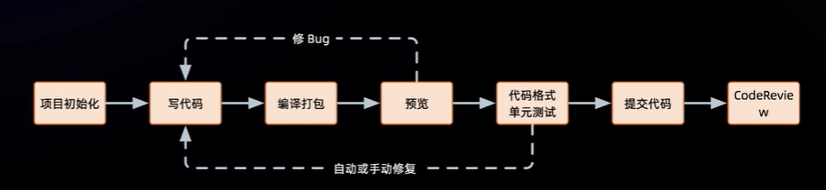
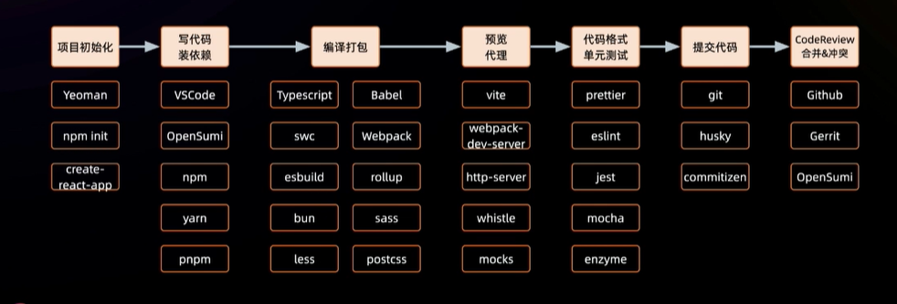
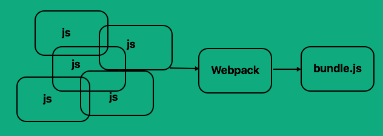
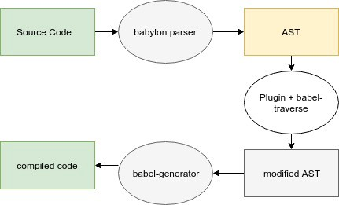
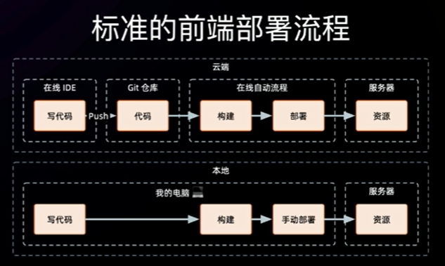

# 本地研发工具






# Webpack基本原理



## js

处理js文件之间的依赖关系，并将他们打包成一个文件。

*index.js*

```javascript
var multiply = require('./multiply');
var sum = require('./sum');
var totalMultiply = multiply(5, 3);
var totalSum = sum(5, 3);
console.log('Product of 5 and 3 = ' + totalMultiply);
console.log('Sum of 5 and 3 = ' + totalSum);
```

*multiply.js*

```javascript
var sum = require('./sum');
var multiply = function (a, b) {
    var total = 0;
    for (var i = 0; i < b; i++) {
        total = sum(a, total);
    }
    return total;
};
module.exports = multiply;
```

*sum.js*

```javascript
var sum = function (a, b) {
    return a + b;
};
module.exports = sum;
```

打包：

```javascript
var path = require('path');
module.exports = {
  entry: './src/index.js',    
  output: {
    path: path.resolve(__dirname, './dist/''),
    filename: 'bundle.js'
  }
}
```

*bundle.js*

```
// the webpack bootstrap
(function (modules) {
    // The module cache
    var installedModules = {};
    // The require function
    function __webpack_require__(moduleId) {
        // Check if module is in cache
        // Create a new module (and put it into the cache)
        // Execute the module function
        // Flag the module as loaded
        // Return the exports of the module
    }


    // expose the modules object (__webpack_modules__)
    // expose the module cache
    // Load entry module and return exports
    return __webpack_require__(0);
})
/************************************************************************/
([
    // index.js - our application logic
    /* 0 */
    function (module, exports, __webpack_require__) {
        var multiply = __webpack_require__(1);
        var sum = __webpack_require__(2);
        var totalMultiply = multiply(5, 3);
        var totalSum = sum(5, 3);
        console.log('Product of 5 and 3 = ' + totalMultiply);
        console.log('Sum of 5 and 3 = ' + totalSum);
    },
    // multiply.js
    /* 1 */
    function (module, exports, __webpack_require__) {
        var sum = __webpack_require__(2);
        var multiply = function (a, b) {
            var total = 0;
            for (var i = 0; i < b; i++) {
                total = sum(a, total);
            }
            return total;
        };
        module.exports = multiply;
    },
    // sum.js
    /* 2 */
    function (module, exports) {
        var sum = function (a, b) {
            return a + b;
        };
        module.exports = sum;
    }
]);
```

从这里你可以看到Webpack将我们的每个文件包装成一个模块并传递。它们作为模块数组进入Webpack引导程序。对于每个模块，它将它们添加到Webpack中，执行它们，并使它们对其他模块可用。它执行webpack_require_(0)，它查看的是index.js的模块数组。结果是我们开始的输出，但更容易的依赖管理和更少的web流量!

## js+css

我们需要将这个CSS拉入到应用程序中。当然，我们可以简单地在**html中添加一个链接标签**，但如果我们导入它，然后使用Webpack来处理它，我们将从Webpack所提供的功能中受益。在代码中导入CSS的另一个好处是，我们(开发人员)可以看到CSS和它的用法之间的关联在哪里。值得注意的是，CSS的作用域并不局限于它所导入的模块(它仍然是全局的)，但从开发人员的角度来看，这种关系更加清晰。

当在js中使用了css样式文件；

```javascript
import multiply from './multiply';
import sum from './sum';

// import the CSS we want to use here
import './math_output.css';

const totalMultiply = multiply(5, 3);
const totalSum = sum(5, 3);

// create the body
const body = document.createElement("body");
document.documentElement.appendChild(body);

// calculate the product and add it to a span
const multiplyResultsSpan = document.createElement('span');
multiplyResultsSpan.appendChild(document.createTextNode(`Product of 5 and 3 = ${totalMultiply}`));

// calculate the sum and add it to a span
const sumResultSpan = document.createElement('span');
sumResultSpan.appendChild(document.createTextNode(`Sum of 5 and 3 = ${totalSum}`));

// add the results to the page
document.body.appendChild(multiplyResultsSpan);
document.body.appendChild(sumResultSpan);
```

**需要两个额外的加载器处理css**：

- `css-loader`: Knows how to process CSS imports - **takes the imported CSS** and **loads** the file contents
- `style-loader`: Takes CSS data(from imports) and adds them to the HTML document

**配置文件**

```javascript
const path = require('path');
module.exports = {
    entry: './src/index.js',
    output: {
        path: path.resolve(__dirname, './dist/'),
        filename: 'bundle.js'
    },
    module: {
        loaders: [
            {
                test: /\.js$/,
                loader: 'babel-loader',
                exclude: /node_modules/,
                query: {
                    presets: ['es2015']
                }
            },
            {
                test: /\.css$/,
                loaders: ['style-loader', 'css-loader']
            }
        ]
    }
};
```

- `test`: as before, we need to tell the Loaders that we only **want it to process CSS files** - this regex will only process .css files
- `loaders`: the loaders to use. Note that this time it's plural as we're supplying an array of Loaders. Also note that Webpack processes Loaders from **right to left**, so the results of `css-loader` (the file contents) are passed to `style-loader` (adding the styles to the HTML document)

## 只提取css，并将他们合并到一个文件中

需要用到**ExtractTextPlugin**插件：

```javascript
const path = require('path');
const ExtractTextPlugin = require('extract-text-webpack-plugin');
module.exports = {
    entry: './src/index.js',
    output: {
        path: path.resolve(__dirname, './dist/'),
        filename: 'bundle.js'
    },
    module: {
        loaders: [
            {
                test: /\.js$/,
                loader: 'babel-loader',
                exclude: /node_modules/,
                query: {
                    presets: ['es2015']
                }
            },
            {
                test: /\.css$/,
                loader: ExtractTextPlugin.extract('css-loader')
            }
        ]
    },
    plugins: [
        new ExtractTextPlugin('style.css')
    ]
};
```

```javascript
{
    test: /\.css$/,
    loader: ExtractTextPlugin.extract('css-loader')
}
```

这告诉Webpack将结果从css加载器传递给ExtractTextPlugin。在底部我们配置插件:

```javascript
plugins: [
    new ExtractTextPlugin('style.css')
]
```

这样做的目的是告诉插件，对于传递给它的所有数据，将其保存到一个名为style.css的文件中。这可能看起来不是马上就有用，但是就像以前有许多独立的JavaScript文件一样，假设我们有许多CSS文件。通过上述操作，我们可以将多个独立的CSS文件合并到一个文件中，减少加载时所需的web调用数量。

Looking at **dist/style.css** we can see:

```css
span {
    border: 5px solid brown;
    display:block;
}
```

Which of course is the content of our CSS. To make use of this we need to modify our **index.html** to import this CSS:

```html
<html>
  <head>
    <link rel="stylesheet" href="dist/style.css"/>
    <script src="./dist/bundle.js""></script>
  </head>
</html>
```

The output will be the same as before.

## 图片处理

让我们向应用程序中添加一些图像——并让Webpack(以及一个合适的加载器)为我们处理它们。让我们添加两个新的图像到我们的项目，一个小的和一个大的-一个用于求和，一个用于乘法，只是为我们的输出添加一点颜色。

In order to process these images we’re going to make use of two Loaders:

- `image-webpack-loader`: will try to **automatically compress large images** for us
- `url-loader`: will **inline** the results from `image-webpack-loader` if the results are small, and **include the image** in the output directory if they are large

创建一个导入图片的模块`image_util.js`:

```javascript
const addImageToPage = (imageSrc) => {
    const image = document.createElement('img');
    image.src = imageSrc;
    image.style.height = '100px';
    image.style.width = '100px';
    document.body.appendChild(image);
};
export default addImageToPage;
```

在`index.js`导入该模块并添加图片：

```javascript
import multiply from './multiply';
import sum from './sum';

// import our image utility
import addImageToPage from './image_util';

// import the images we want to use
import multiplyImg from '../images/multiply.png';
import sumImg from '../images/sum.png';

// import the CSS we want to use here
import './math_output.css';

const totalMultiply = multiply(5, 3);
const totalSum = sum(5, 3);

// create the body
const body = document.createElement("body");
document.documentElement.appendChild(body);

// calculate the product and add it to a span
const multiplyResultsSpan = document.createElement('span');
multiplyResultsSpan.appendChild(document.createTextNode(`Product of 5 and 3 = ${totalMultiply}`));

// calculate the sum and add it to a span
const sumResultSpan = document.createElement('span');
sumResultSpan.appendChild(document.createTextNode(`Sum of 5 and 3 = ${totalSum}`));

// add the results to the page
addImageToPage(multiplyImg);
document.body.appendChild(multiplyResultsSpan);
addImageToPage(sumImg);
document.body.appendChild(sumResultSpan);
```

**配置：**

```javascript
const path = require('path');
const ExtractTextPlugin = require('extract-text-webpack-plugin');
module.exports = {
    entry: './src/index.js',
    output: {
        path: path.resolve(__dirname, './dist/'),
        filename: 'bundle.js',
        publicPath: 'dist/'
    },
    module: {
        loaders: [
            {
                test: /\.js$/,
                loader: 'babel-loader',
                exclude: /node_modules/,
                query: {
                    presets: ['es2015']
                }
            },
            {
                test: /\.css$/,
                loader: ExtractTextPlugin.extract('css-loader')
            },
            {
                test: /\.png$/,
                loaders: [
                    'url-loader?limit=5000',
                    'image-webpack-loader'
                ]
            }
        ]
    },
    plugins: [
        new ExtractTextPlugin('style.css')
    ]
};
```

- `output.publicPath`Allows the url-loader to know what prefix to add for files that will be saved to disk. For example, a resulting img.src would be img.src='dist/output_file.png'

静态资源路径

- `test`: as before, we need to tell the Loaders that we only want it to process image files - this regex will only process .png files. We can make this more complicated by adding support for other image formats, for our purposes this simple regex will do
- `loaders`: our loaders to use - remember that Webpack processes Loaders from **right to left**, so the results of `image-webpack-loader` will be passed to `url-loader`

If we now run Webpack we will see something like the following:

```
38ba485a2e2306d9ad96d479e36d2e7b.png
bundle.js
style.css
```

If we open **38ba485a2e2306d9ad96d479e36d2e7b.png** we should find that it is our large image — multiply.png. The smaller image, sum.png, has been inlined in bundle.js as follows:

```
module.exports = "data:image/png;base64,iVBORw0KGgoAAAANSUhEUgAAAoAAAAHgCAMAAAACDyzWAAAC6FBMVEUAuv8AgL...."
```

Which would be equivalent to having:

```
img.src="data:image/png;base64,iVBORw0KGgoAAAANSUhEUgAAAoAAAAHgCAMAAAACDyzWAAAC6FBMVEUAuv8AgL...'
```

# Babel基本原理

**功能：**

Babel 是一个工具链，主要用于将采用 ECMAScript 2015+ 语法编写的代码转换为向后兼容的 JavaScript 语法，以便能够运行在当前和旧版本的浏览器或其他环境中。下面列出的是 Babel 能为你做的事情：

- 语法转换
- 通过 Polyfill 方式在目标环境中添加缺失的特性 （通过引入第三方 polyfill 模块，例如 [core-js](https://github.com/zloirock/core-js)）
- 源码转换（codemods）
- 更多参考资料！（请查看这些 [视频](https://www.babeljs.cn/videos.html) 以获得启发）

## 流程

- ## Stage 1: Parsing

- ## Stage 2 : Transformation

- ## Stage 3 : Code Generation

由于 Babel 假定你的代码将在 ES5 环境中执行，因此使用的都是 ES5 函数。如果你所使用的运行环境 对 ES5 的支持有限或不支持，例如低版本的 IE，那么就需要使用 [@babel/polyfill](https://www.babeljs.cn/docs/babel-polyfill) 来满足需求。



## presets

Babel 的预设（preset）可以被看作是一组 Babel 插件和/或 [`options`](https://www.babeljs.cn/docs/options) 配置的可共享模块。

- [@babel/preset-env](https://www.babeljs.cn/docs/babel-preset-env) for compiling ES2015+ syntax
- [@babel/preset-typescript](https://www.babeljs.cn/docs/babel-preset-typescript) for [TypeScript](https://www.typescriptlang.org/)
- [@babel/preset-react](https://www.babeljs.cn/docs/babel-preset-react) for [React](https://reactjs.org/)
- [@babel/preset-flow](https://www.babeljs.cn/docs/babel-preset-flow) for [Flow](https://flow.org/)

