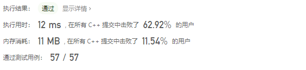
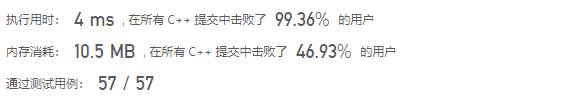
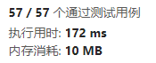

# 引言

最近在做LeetCode两数之和这题时为了把算法的时间复杂度从 $O(n^2)$降至$O(n)$，使用了哈希表。但是发现使用map或unordered_map，运行时间相差比较大，因此学习了哈希表的相关实现以及区别。

> 给定一个整数数组 nums 和一个整数目标值 target，请你在该数组中找出 和为目标值 target  的那 两个 整数，并返回它们的数组下标。
>
> 你可以假设每种输入只会对应一个答案。但是，数组中同一个元素在答案里不能重复出现。
>
> 你可以按任意顺序返回答案。
>
> 来源：力扣（LeetCode）
> 链接：https://leetcode.cn/problems/two-sum

```
class Solution {
public:
    vector<int> twoSum(vector<int>& nums, int target) {
        map<int, int> m;
        for (int i = 0; i < nums.size(); i++) {
            if (m.find(target - nums[i]) != m.end()) {
                return { i, m.at(target - nums[i]) };
            }
            else {
                m[nums[i]] = i;
            }
        }
        return { -1, -1 };
    }
};
```

**map**



**unordered_map**



**无优化**

```
class Solution {
public:
    vector<int> twoSum(vector<int>& nums, int target) {
        for (int i = 0; i< nums.size(); i++){
            int left = target - nums[i];
            for (int j=i+1; j< nums.size(); j++){
                if (nums[j] == left)
                    return {i, j};
            }
        }
        return {-1, -1};
    }
};
```

