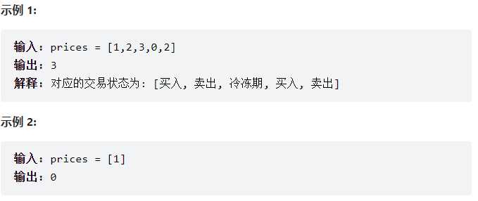
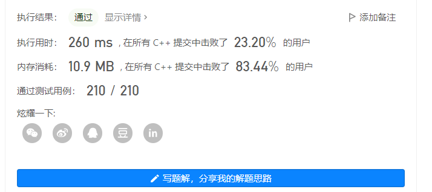

------


[309. 最佳买卖股票时机含冷冻期 - 力扣（LeetCode）](https://leetcode.cn/problems/best-time-to-buy-and-sell-stock-with-cooldown/)

# 题目描述：

给定一个整数数组`prices`，其中第 `prices[i]` 表示第 `i` 天的股票价格 。

设计一个算法计算出最大利润。在满足以下约束条件下，你可以尽可能地完成更多的交易（多次买卖一支股票）:

- 卖出股票后，你无法在第二天买入股票 (即冷冻期为 1 天)。

**注意：**你不能同时参与多笔交易（你必须在再次购买前出售掉之前的股票）。

# 解题思路：



根据示例，只在卖出时计算收益，即不会有负收益。

当我们处于第`i`天，我们可以选择卖出和买入：

- 若要卖出，则选择在之前哪一天买入能产生最大收益；
- 若要买入，则今天的最大收益是之前卖出股票的最大收益（不包括前一天）；

那么我们得到以下状态转移方程：

$sell[i] = max(buy[j] + prices[i] - prices[j]),i>0,j\in[0,i-1]$

$buy[i]=max(sell[j]),i>0,j\in[0,i-2]$

初始状态`sell[0]=0,buy[0]=0`;

`sell[i]`表示在第`i`天卖出股票的最大收益（之前已经买入了股票）；

`buy[i]`表示在第`i`天买入股票的最大收益（即之前卖出股票的最大收益）；

因此，有以下代码（C++）：

```c++
#define max(a,b) a>b?a:b 
#define MIN 0x80000000
class Solution {
public:
    int maxProfit(vector<int>& prices) {
        int n = prices.size();
        vector<int> sell(n);
        vector<int> buy(n);
        int ans = 0;
        for(int i=1; i<n; i++){
            for (int j=0; j<i; j++){
                sell[i] = max(sell[i], buy[j] + prices[i]-prices[j]);
                if(i-j > 1){
                    buy[i] = max(buy[i], sell[j]);
                }
            }
            ans = max(ans, sell[i]);
        }
        return ans;
    }
};
```

