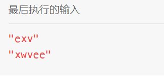

[791. 自定义字符串排序 - 力扣（Leetcode）](https://leetcode.cn/problems/custom-sort-string/description/)

## 题目

给定两个字符串 `order` 和 `s` 。`order` 的所有字母都是 **唯一** 的，并且以前按照一些自定义的顺序排序。

对 `s` 的字符进行置换，使其与排序的 `order` 相匹配。更具体地说，如果在 `order` 中的字符 `x` 出现字符 `y` 之前，那么在排列后的字符串中， `x` 也应该出现在 `y` 之前。

返回 *满足这个性质的 `s` 的任意一种排列* 。

**示例 1:**

```
输入: order = "cba", s = "abcd"
输出: "cbad"
解释: 
“a”、“b”、“c”是按顺序出现的，所以“a”、“b”、“c”的顺序应该是“c”、“b”、“a”。
因为“d”不是按顺序出现的，所以它可以在返回的字符串中的任何位置。“dcba”、“cdba”、“cbda”也是有效的输出。
```

**示例 2:**

```
输入: order = "cbafg", s = "abcd"
输出: "cbad"
```

## 分析

这题比较简单，进行权重排序即可。

### 注意的点

- 要为所有字母添加权重

用例：



当没有给w添加权重时，错误输出：

```javascript
xweev
```

代码的处理是，如果遇到没有权重的字符，则返回0；`w`没有权重，比较时则认为`w` == `e`，`w` == `x`，因此`x`的位置出错。

我们要让这些没有权重的字母放在最前或最后（只要比较时不是相等，都可以） 