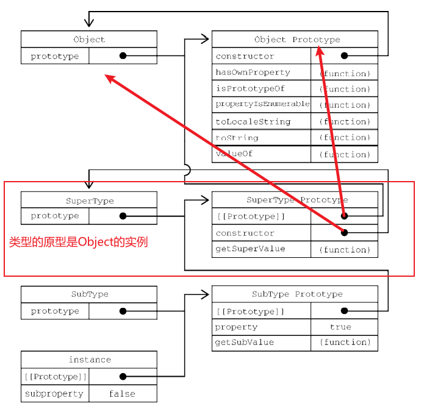

# Cap 8对象、类和面向对象编程

## 8.3 继承

很多面向对象语言都支持两种继承：接口继承和实现继承。 **前者只继承方法签名**，后者继承实际的方法。接口继承在 ECMAScript 中是不可能的，因为函数没有签名。实现继承是 ECMAScript 唯一支持的继承方式，而这主要是通过原型链实现的。

### 8.3.1 原型链

ECMA-262 把原型链定义为 ECMAScript 的主要继承方式。其基本思想就是通过原型继承多个引用 类型的属性和方法。重温一下构造函数、原型和实例的关系：每个构造函数都有一个原型对象，原型有 一个属性指回构造函数，而实例有一个内部指针指向原型。**如果原型是另一个类型的实例呢**？那就意味 着这个原型本身有一个内部指针指向另一个原型，相应地另一个原型也有一个指针指向另一个构造函 数。

如果原型是另一个类的实例，那么它的[[prototype]]指向这个类的构造函数原型。

1. 默认原型

   

2. 原型与继承关系

   原型与实例的关系可以通过两种方式来确定。第一种方式是使用 instanceof 操作符，如果**一个实例的原型链中出现过相应的构造函数**，则 instanceof 返回 true。

   第二种方法，调用原型上的`isPrototypeOf()`方法，该方法接收一个实例对象，如果原型在这个实例对象的原型链上，返回true。

3. 子类增加或重写方法

   子类有时候需要覆盖父类的方法，或者增加父类没有的方法。为此，这些方法必须在**原型赋值之后 再添加到原型上**。

   因为原型是父类的实例（而这个实例的原型是父类构造函数的原型，因此继承了父类原型上的方法），所以在原型上增加的方法不会影响原有的原型

4. 原型链的问题

   - 由于子类构造**函数的原型**是父类的实例，因此父类中的属性也在这个原型上，一般来说我们希望原型上只有方法，因为属性被所以实例所共享。
   - 子类型在实例化时不能给父类传参。子类和父类的联系是通过原型建立的（子类构造函数原型=父类实例），而子类的原型绑定在构造函数上，因此如果我们想给父类构造函数传参，只能在进行原型绑定时进行，这样会影响所有该子类的对象。

### 8.3.2 盗用构造函数

为了继承时导致的属性共享的问题，出现了“盗用构造函数”（constructor stealing）的技术（这种技术有时也称作“对象伪装”或“经典继承”）。

思路：在子类构造函数中，调用父类构造函数。

```
function SuperType() { 
 this.colors = ["red", "blue", "green"]; 
} 
function SubType() { 
 // 继承 SuperType 
 SuperType.call(this);   // look here
} 
```

这相当于新的 **子类**对象上运行了父类构造函数函数中的所有初始化代码。结果就是每个实例都会有自己的 colors 属性。

这种模式下我们可以自定义对父类参数的初始化，但是我们也只能继承构造函数中的方法。

**问题：**

- 函数不能重用，因为必须在构造函数中定义方法。子类也不能访问父类原型上定义的方法，因此所有类型只能使用构造函数模 式。因此盗用构造函数模式不能单独使用。

> 引用[js中call()和apply()方法的区别和用法详解 - 简书 (jianshu.com)](https://www.jianshu.com/p/625c35d84a80)

`call`和`apply`可以用来**重新定义函数的执行环境**，也就是`this`的指向；`call`和`apply`都是为了改变某个函数运行时的`context`，即上下文而存在的，换句话说，就是为了改变函数体内部`this`的指向。

`call()`调用一个对象的方法，**用另一个对象替换当前对象**，可以继承另外一个对象的属性，它的语法是：

```
Function.call(obj, param1, param2, ..., paramn);
```

- `obj`：这个对象将代替`Function`类里`this`对象
- `params`：一串参数列表

**说明**：`call`方法可以用来代替另一个对象调用一个方法，`call`方法可以将一个函数的对象上下文从初始的上下文改变为`obj`指定的新对象，如果没有提供`obj`参数，那么Global对象被用于`obj`。

#### aplly和call的	不同点

`apply()`和`call()`方法一样，只是参数列表不同。

从定义中也可以看出来，`call()`和`apply()`的不同点就是**接收参数的方式不同**。

- **apply()方法**接收两个参数，一个是函数运行的作用域（`this`），另一个是**参数数组**。
- **call()方法**不一定接受两个参数，第一个参数也是函数运行的作用域（`this`），但是传递给函数的参数必须列举出来。

### 8.3.3 组合继承

也称为**经典伪继承**，本质是 盗用构造函数+原型链继承。

通过盗用构造函数，在子类上添加了父类的属性，之后再进行原型继承，将子类构造函数的原型设置为父类实例。但是由于在实例化子类对象时，父类属性会被添加在子类上，覆盖原型上的属性，因此这些属性也不会在所有子类实例上共享。

### 8.3.4 原型继承

用于对象之间共享属性。

```
function object(o) { 
 function F() {} 
 F.prototype = o; 
 return new F(); 
} 
```

将对象`o`上面的属性都浅复制给一个新的对象并返回，

ECMAScript 5 通过增加 Object.create()方法将原型式继承的概念规范化了。

```
let person = { 
 name: "Nicholas", 
 friends: ["Shelby", "Court", "Van"] 
}; 
let anotherPerson = Object.create(person); 
anotherPerson.name = "Greg"; 
anotherPerson.friends.push("Rob"); 
let yetAnotherPerson = Object.create(person); 
yetAnotherPerson.name = "Linda"; 
yetAnotherPerson.friends.push("Barbie"); 
console.log(person.friends); // "Shelby,Court,Van,Rob,Barbie" 
```

原型式继承非常适合不需要单独创建构造函数，但仍然需要在**对象间共享信息**的场合。

属性中包含的引用值始终会在相关对象间共享，跟使用原型模式是一样的。

### 8.3.5 寄生式继承

与**原型式继承**比较接近的一种继承方式是**寄生式继承**（parasitic inheritance），

```
function createAnother(original){ 
 let clone = object(original); // 通过调用函数创建一个新对象， 原型继承
 clone.sayHi = function() { // 以某种方式增强这个对象
 console.log("hi"); 
 }; 
 return clone; // 返回这个对象
}
```

通过寄生式继承给对象添加函数会导致函数难以重用，与构造函数模式类似。

没新建一个对象，就要重复执行一次这段代码给对象添加方法。

### 8.3.6 寄生式组合继承

传统组合继承：

- 构造函数内执行父类构造函数，将父类属性添加到子类实例上；
- 将构造函数的原型设为父类实例。

如上所述，父类构造函数被执行了两次。


**实例化子类对象**：


父类的属性有两组。

为什么有这个问题？

子类的原型是父类的实例，拥有：1.构造函数内定义的属性和方法；2.原型上的属性和方法。

子类的构造函数执行了父类构造函数，拥有：父类构造函数内定义的属性和方法。

问题出在原型，我们只需要原型上的属性和方法。

寄生式组合继承通过 **盗用构造函数原型** 解决这个问题。

```
function inheritPrototype(subType, superType) { 
 let prototype = object(superType.prototype); // 创建对象
 prototype.constructor = subType; // 增强对象 
 subType.prototype = prototype; // 赋值对象
} 
```

这样在重定义子类的原型时，就摆脱了父类构造函数。

寄生式组合继承可以算是**引用类型继承**的**最佳模式**。

## 8.4 类

前几节的内容：何只使用 ECMAScript 5 的特性来模拟类的行为（继承）。

各种策略都有自己的问题，也有相应的妥协。正因为如此，实现继承的代码也显得非常冗长和混乱。

为解决这些问题，ECMAScript 6 新引入的 class 关键字具有正式定义类的能力。类（class）是 ECMAScript 中新的**基础性语法糖结构**，因此刚开始接触时可能会不太习惯。虽然 ECMAScript 6 类表面 上看起来可以支持正式的面向对象编程，**但实际上它背后使用的仍然是原型和构造函数的概念**。

### 8.4.1 类定义

`class`关键字

```
// 类声明
class Person {} 
// 类表达式
const Animal = class {}; 
```

函数声明受函数作用域限制，类的定义受块作用域限制

### 8.4.2类的构造函数

如果构造函数返回对象，则`new`操作得到的是构造函数的返回值，反则返回`new`操作符创建的新对象。（一旦使用`new`，就会在内存中创建一个新对象，构造函数内的`this`就是它的引用）。

ECMAScript 中没有正式的类这个类型。从各方面来看，ECMAScript 类就是一种特殊函数。声明一 个类之后，通过 typeof 操作符检测类标识符，表明它是一个函数：

```
class Person {} 
console.log(Person); // class Person {} 
console.log(typeof Person); // function
```

```
class Person{} 
console.log(Person.prototype); // { constructor: f() } 
console.log(Person === Person.prototype.constructor); // true
```

### 8.4.3 实例、原型和类成员

**普通类方法**

类中的方法（不是构造函数内的方法）会添加到函数原型上，被所有对象共享。

属性应该是属于每个实例的，因此不允许在类中定义属性。

**静态类方法**

普通方法定义来类原型上，静态方法定义在类本生上（类是函数，函数是对象，对象上面可以有属性和方法，原型就是函数上的一个属性）。

静态方法的`this`指针指向类，因为是通过类调用该函数。

同时，由于静态方法不在原型上，实例也无法访问该方法。

静态类方法非常适合作为实例工厂：

```
class Person { 
 constructor(age) { 
 this.age_ = age; 
 } 
 sayAge() { 
 console.log(this.age_); 
 } 
 static create() { 
 // 使用随机年龄创建并返回一个 Person 实例
 return new Person(Math.floor(Math.random()*100)); 
 } 
} 
console.log(Person.create()); // Person { age_: ... } 
```

所有的函数数据类型都天生带有一个Prototype(原型)属性，这个属性的值是一个对象，浏览器默认给其开一个堆内存。

在浏览器给prototype开辟的堆内存中，有一个自带的属性constructor,这个属性存储的值就是当前函数的本身。

每一个对象都有一个__proto__属性，这个属性指向当前实例所属类的prototype，（如果不能确定它是谁的实例，那都是Object的实例）

原型查找是基于`__proto__`的，因此如果方法定义在原型上，不能查找到，只能通过`Person.prototype.create()`调用。

**非函数原型和类成员**

虽然类定义并不显式支持在原型或类上添加**成员数据**，但在类定义外部，可以手动添加：

```
class Person { 
 sayName() { 
 console.log(`${Person.greeting} ${this.name}`); 
 } 
} 
// 在类上定义数据成员
Person.greeting = 'My name is';   //静态成员
// 在原型上定义数据成员
Person.prototype.name = 'Jake'; 
let p = new Person(); 
p.sayName(); // My name is Jake
```

> **注意** 类定义中之所以没有显式支持添加数据成员，是因为在**共享目标（原型和类）**上添 加可变（可修改）数据成员是一种反模式。一般来说，对象实例应该独自拥有通过 this 引用的数据。

### 8.4.4 继承

1. **继承基础**

   ES6 类支持单继承。使用 extends 关键字，就可以继承任何拥有[[Construct]]和原型的对象。 很大程度上，这意味着不仅可以继承一个类，也可以继承普通的构造函数（保持向后兼容）：

   ```
   class Vehicle {} 
   // 继承类
   class Bus extends Vehicle {} 
   let b = new Bus(); 
   console.log(b instanceof Bus); // true 
   console.log(b instanceof Vehicle); // true 
   function Person() {} 
   // 继承普通构造函数
   class Engineer extends Person {} 
   let e = new Engineer(); 
   console.log(e instanceof Engineer); // true 
   console.log(e instanceof Person); // true 
   ```

2. **构造函数、HomeObject和super**

   派生类的方法可以通过 super 关键字**引用它们的原型**。在类构造函数中使用 super 可以调用父类构造函数。如果有`super()`执行，则不能在执行`super()`之前使用`this`指针。

   ```
   class Vehicle { 
    constructor() { 
    this.hasEngine = true; 
    } 
   } 
   class Bus extends Vehicle { 
    constructor() { 
    // 不要在调用 super()之前引用 this，否则会抛出 ReferenceError 
    super(); // 相当于 super.constructor() 
    console.log(this instanceof Vehicle); // true 
    console.log(this); // Bus { hasEngine: true } 
    } 
   } 
   new Bus();
   ```

   > **注意** ES6 给**类构造函数**和**静态方法**添加了内部特性[[HomeObject]]，这个特性是一个 指针，指向**定义该方法的对象**（类）。这个指针是自动赋值的，而且只能在 JavaScript 引擎内部访问。super 始终会定义为[[HomeObject]]的原型（如果存在继承，类的原型为父类原型浅拷贝（组合继承））。

   在使用 super 时要注意几个问题：

   - super 只能在派生类构造函数和静态方法中使用。

   - 不能单独引用 super 关键字，要么用它调用构造函数，要么用它引用静态方法

   - 调用 super()会调用父类构造函数，并将返回的实例赋值给 this。

   - super()的行为如同调用构造函数，如果需要给父类构造函数传参，则需要手动传入。

   -  如果没有定义类构造函数，在实例化派生类时会调用 super()，而且会传入所有传给派生类的 参数。

   - 在类构造函数中，不能在调用 super()之前引用 this。

   - 如果在派生类中显式定义了构造函数，则要么必须在其中调用 super()，要么必须在其中返回 一个对象。

     ```
     class Vehicle {} 
     class Car extends Vehicle {} 
     class Bus extends Vehicle { 
      constructor() { 
      super(); 
      } 
     } 
     class Van extends Vehicle { 
      constructor() { 
      return {}; 
      } 
     } 
     ```

3. **抽象基类**

   ECMAScript本来不支持抽象基类，抽象基类是不应该被实例化的，通过`new.target`我们可以阻止抽象类的实例化，实现相似的目标。

   ```
   // 抽象基类 
   class Vehicle { 
    constructor() { 
    console.log(new.target); 
    if (new.target === Vehicle) { 
    throw new Error('Vehicle cannot be directly instantiated'); 
    } 
    } 
   } 
   // 派生类
   class Bus extends Vehicle {} 
   new Bus(); // class Bus {} 
   new Vehicle(); // class Vehicle {} 
   // Error: Vehicle cannot be directly instantiated 
   ```

   虽然实例化Bus时，会默认通过`super()`自动执行父类的构造函数，但是`new.target`是Bus，因此Bus会被实例化。

   

   另外，通过在抽象基类构造函数中进行检查，**可以要求派生类必须定义某个方法**。因为原型方法在调用类构造函数之前就已经存在了，所以可以通过 this 关键字来检查相应的方法：

   ```
   // 抽象基类
   class Vehicle { 
    constructor() { 
    if (new.target === Vehicle) { 
    throw new Error('Vehicle cannot be directly instantiated'); 
    } 
    if (!this.foo) { 
    throw new Error('Inheriting class must define foo()'); 
    } 
    console.log('success!'); 
    } 
   } 
   ```

4. 继承内置类型

   ES6 类为继承内置引用类型提供了顺畅的机制，开发者可以方便地扩展内置类型：

   ```
   class SuperArray extends Array { 
    shuffle() { 
    // 洗牌算法
    for (let i = this.length - 1; i > 0; i--) { 
    const j = Math.floor(Math.random() * (i + 1)); 
    [this[i], this[j]] = [this[j], this[i]]; 
    } 
    } 
   } 
   let a = new SuperArray(1, 2, 3, 4, 5); 
   console.log(a instanceof Array); // true 
   console.log(a instanceof SuperArray); // true 
   ```

5. 类混入

   `mixin`（混入）是指把不同**类**的行为集中在一起，即多类继承。

   混入类定义方式：

   ```
   let FooMixin = (Superclass) => class extends Superclass { 
    foo() { 
    console.log('foo'); 
    } 
   }; 
   ```

   通过继承，返回一个类定义，在原始类的基础上，添加方法。

## 8.5 小结

类声明：

- 工程模式是封装了创建对象的过程，创建一个对象后给他添加属性和方法，然后返回这个对象。在构造函数模式出现后很少使用。
- 构造函数内的方法无法重用，一旦创建对象，就要为对象添加这些方法。
- 原型模式。解决了成员共享的问题。通过构造函数添加属性，通过原型添加方法。

继承：

原型链的问题是所有继承的属性和方法都会在对象实例间共享。盗用构造函数模式通过在子类构造函数中调 用父类构造函数，可以避免这个问题，在子类对象上重新定义了属性，覆盖了原型上的属性。

# Cap.9 代理与反射

[Proxy和Reflect深入分析](./Proxy和Reflect深入分析.md)

ECMAScript 6 新增的代理和反射为开发者提供了**拦截**并向基本操作嵌入**额外行为**的能力 

> **注意** 在 ES6 之前，ECMAScript 中并没有类似代理的特性。由于代理是一种新的基础性 语言能力，很多转译程序都不能把代理行为转换为之前的 ECMAScript 代码，因为代理的 行为实际上是无可替代的。为此，代理和反射只在百分之百支持它们的平台上有用。可以 检测代理是否存在，不存在则提供后备代码。不过这会导致代码冗余，因此并不推荐。

## 9.1 代理基础

### 9.1.1 创建空代理

代理是使用 **Proxy** 构造函数创建的。这个构造函数接收两个参数：**目标对象**和**处理程序对象**。

```
const target = { 
 id: 'target' 
}; 
const handler = {}; 
const proxy = new Proxy(target, handler);
```

### 9.1.2 定义捕获器

使用代理的主要目的是可以定义**捕获器（trap）**。捕获器就是在处理程序对象中定义的“基本操作的 拦截器”。

### 9.1.3 捕获器参数和反射 API 

**处理程序对象**（handler）中所有可以捕获的方法都有对应的反射（Reflect）API 方法。Reflect就是为此而生的。

```
const handler = { 
 get: Reflect.get 
}; 
```

捕获器的参数列表：`trapTarget, property, receiver`，反射API也接收这些方法，这意味我们可以获取到原始对象和属性名称。

### 9.1.4 捕获器不变式

根据 ECMAScript 规范，每个 捕获的方法都知道目标对象上下文、捕获函数签名，而捕获处理程序的行为必须遵循“捕获器不变式” （trap invariant）。捕获器不变式因方法不同而异，但通常都会**防止捕获器定义出现过于反常的行为**。

比如，如果目标对象有一个不可配置且不可写的数据属性，那么在捕获器返回一个与该属性不同的 值时，会抛出 TypeError，因为返回的这个值得属性与原本属性不同。

### 9.1.5 可撤销的代理

Proxy 也暴露了 revocable()方法，这个方法支持撤销代理对象与目标对象的关联。这个方法除了返回代理对象，还返回了撤销代理的方法：

```
const { proxy, revoke } = Proxy.revocable(target, handler); 
```

### 9.1.6 使用反射API

反射API的使用并不限于代理中。

大多数反射 API 方法在 Object 类型上有对应的方法。

与Object上方法的不同之处在于，Object 上的方法会抛出异常，而反射方法执行成功返回true，否则返回false（这称为状态标记）。

以下反射方法都会提供状态标记：

```
Reflect.defineProperty() 

Reflect.preventExtensions() 

Reflect.setPrototypeOf() 

Reflect.set()

Reflect.deleteProperty()
```

这让我们程序变得可控，例如我们可以使用`set`代替传统的`=`操作符，

**一种比较少见的情况：**

当我们向通过`apply`调用函数`myFunc`时，一般写成：

```
myFunc.apply()
```

这句话的目的是执行`myFunc`函数，但是要指定`myFunc`函数内的`this`指针。

但是`myFunc`可能定义了`apply`方法，导致无法正确指向。

那么我们需要写成：

```
Function.prototype.apply.call(myFunc, thisVal, argumentList); 
```

[如何理解Function.prototype.apply.call(fn, obj, args) - 简书 (jianshu.com)](https://www.jianshu.com/p/660417322aaf)

我们都单独见过以下两种情况

> 第一种
>  fn.apply(obj, args)
>  fn代表一个函数对象；
>  obj代表函数调用过程中，内部的this所指向的对象；
>  args是一个数组或者类数组， 代表在函数调用时传递给函数的参数；

> 第二种
>  fn.call(obj, arg1, arg2, ……)
>  fn代表一个函数对象；
>  obj代表函数调用过程中，内部的this所指向的对象；
>  arg1, arg2, ……， 是一个一个独立的参数， 代表在函数调用时一一对应的传递给函数的参数；

```
Function.prototype.apply.call(myFunc, thisVal, argumentList); 
```

这行代码的目的是在myFunc函数中将this指向更改为`thisVal`，参数为`argumentList`；

只有`Function`原型上的`apply`和`call`方法才能保证是没有经过重写的（在我们没有重写定义的情况下，一般我们也不会重新定义这个方法），才能保证发挥正确的作用——改变this指向。

`Function.prototype.apply.call()`方法代表改变`apply`方法内部的`this`指向，将其改为`myFunc`，这就相当于调用了`myFunc.apply`方法（`apply`的`this`被`call`改变了）；而`apply`的函数体是不变的（作用是改变`myFunc`函数内的`this`指向），因此`myFunc`函数内的指针被改为`thisVal`。

这个复杂的逻辑可以使用反射简便地达成：

```
Reflect.apply(myFunc, thisVal, argumentsList);
```

### 9.1.7 代理另一个代理

```
const target = { 
 foo: 'bar' 
}; 
const firstProxy = new Proxy(target, { 
 get() { 
 console.log('first proxy'); 
 return Reflect.get(...arguments); 
 } 
}); 
const secondProxy = new Proxy(firstProxy, { 
 get() { 
 console.log('second proxy'); 
 return Reflect.get(...arguments); 
 } 
}); 
console.log(secondProxy.foo); 
// second proxy 
// first proxy 
// bar
```

### 9.1.8 代理的问题与不足

- **代理中的this**

  在之前介绍`weakMap`时介绍了用它来实现私有变量，以下是简单的实现：

  ```
  const wm = new WeakMap(); 
  class User { 
   constructor(userId) { 
   wm.set(this, userId); 
   } 
   set id(userId) { 
   wm.set(this, userId); 
   } 
   get id() { 
   return wm.get(this); 
   } 
  } 
  ```

  可以看到上述代码中，需要通过`this`指针获取属性，但是通过代理访问时，`this`指向的是代理对象。

  解决办法，不代理对象，对类进行代理，得到代理类。通过代理类实例化对象，这样通过代理类调用构造函数时，构造函数内的`this`指向代理对象实例：

  ```
  const UserClassProxy = new Proxy(User, {}); 
  const proxyUser = new UserClassProxy(456); 
  console.log(proxyUser.id); 
  ```

- **代理与内部槽位**

  一个典型的例子就是 Date 类型。根据 ECMAScript 规范，Date 类型方法的执行依赖 this （Date实例）值上的 **内部槽位[[NumberDate]]**。代理对象上不存在这个内部槽位，而且这个内部槽位的值也不能通过普通 的 get()和 set()操作访问到。

## 9.2 代理捕获器与反射方法

只要在**代理上调用**，所有捕获器都会拦截它们对应的反射 API 操作。总共13个基本操作

### 9.2.1 get()

拦截的操作：

- proxy.property

- proxy[property]

- Object.create(proxy)[property]

  **注意这里没有赋值操作**

- Reflect.get(proxy, property, receiver)

  **注意这里的目标对象是proxy**

只有通过代理proxy调用的属性，才会被拦截。

### 9.2.2 set()

 拦截的操作:

-  proxy.property = value

- proxy[property] = value

- Object.create(proxy)[property] = value

- Reflect.set(proxy, property, value, receiver)

### 9.2.3 has()

### 9.2.4 defineProperty()

### 9.2.5 getOwnPropertyDescriptor()

### 9.2.6 deleteProperty()

### 9.2.7 ownKeys()

### 9.2.8 getPrototypeOf()

### 9.2.9 setPrototypeOf()

### 9.2.10 isExtensible()

### 9.2.11 preventExtensions()

### 9.2.12 apply()

### 9.2.13 construct()

## 9.3 代理模式

### 9.3.1 属性跟踪访问

get时

### 9.3.2 隐藏属性

get时

### 9.3.3 属性验证

set时

### 9.3.4 函数与构造函数验证

apply 和 construct。

### 9.3.5 数据绑定与可观察对象

可以将被代理的类绑定到一个全局实例集合，让所有创建的实例都被添加到这个集合中

## 9.4 小结

尽管不支持向后兼容，但它开辟出了 一片前所未有的 JavaScript 元编程及抽象的新天地。

在这个捕获器处理程序中，可以修改任 何基本操作的行为，当然前提是遵从捕获器不变式。
