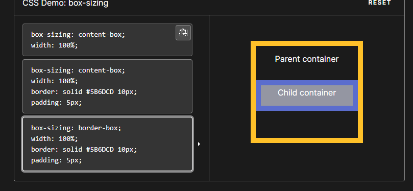

# 盒的类型

## 基本类型

block、inline

块级元素和内联元素。

1. block和inline这两个概念是简略的说法，完整确切的说应该是 block-level elements (块级元素) 和 inline elements (内联元素)。block元素通常被现实为独立的一块，会单独换一行；inline元素则前后不会产生换行，一系列inline元素都在一行内显示，直到该行排满。

## inline-block

- display:block

  1. block元素会**独占一行**，多个block元素会各自新起一行。默认情况下，block元素宽度自动填满其父元素宽度。

  1. block元素可以设置width,height属性。块级元素即使设置了宽度,仍然是独占一行。

  1. block元素可以设置margin和padding属性。

- display:inline

  1. inline元素**不会独占一行**，多个相邻的行内元素会排列在同一行里，直到一行排列不下，才会新换一行，其宽度随元素的内容而变化。

  2. inline元素设置**width,height属性无效**。
  3. inline元素的margin和padding属性，水平方向的padding-left, padding-right, margin-left, margin-right都产生**边距效果**；但竖直方向的padding-top, padding-bottom, margin-top, margin-bottom不会产生边距效果。

  

- display:inline-block

  1. 简单来说就是将**对象呈现为inline对象**，但是**对象的内容作为block对象呈现**。之后的内联对象会被排列在同一行内。比如我们可以给一个link（a元素）inline-block属性值，使**其既具有block的宽度高度特性**又具有inline的同行特性。

     允许我们对内联元素设置框和高。

     

## inline-table

让table也能与其他元素同处一行。

## list-item类型

list-item类型会被添加列表的标记。

## none类型

不会显示。

# 对于盒中容纳不下内容的显示

## overflow属性

- scroll

  盒中会出现固定的滚动条，不管内容超过没有。

- auto

  只有在超出时，才会出现滚动条。

- visible

  与不使用overflow属性一样。**超出盒子的内容也会显示。**

- hidden

  隐藏超出的内容。

- text-overflow属性

  当文字超出时，显示`...`符号。只有在水平上超出有效。**意味着不能换行**。

# 阴影

## 对盒本身

`box-shadow`

## 对盒子里面的内容

# 指定针对元素宽度盒高度的计算方法

## box-sizing属性

指定width盒height属性是否包括元素内部的空白区域，以及边框。

[box-sizing - CSS（层叠样式表） | MDN (mozilla.org)](https://developer.mozilla.org/zh-CN/docs/Web/CSS/box-sizing)

在 [CSS 盒子模型](https://developer.mozilla.org/zh-CN/docs/Web/CSS/CSS_Box_Model/Introduction_to_the_CSS_box_model)的默认定义里，你对一个元素所设置的 [`width`](https://developer.mozilla.org/zh-CN/docs/Web/CSS/width) 与 [`height`](https://developer.mozilla.org/zh-CN/docs/Web/CSS/height) 只会应用到这个元素的**内容区**。如果这个元素有任何的 [`border`](https://developer.mozilla.org/zh-CN/docs/Web/CSS/border) 或 [`padding`](https://developer.mozilla.org/zh-CN/docs/Web/CSS/padding) ，绘制到屏幕上时的盒子宽度和高度会加上设置的边框和内边距值。这意味着当你调整一个元素的宽度和高度时需要时刻注意到这个元素的边框和内边距。当我们实现响应式布局时，这个特点尤其烦人。

这里将宽高设置为`content`box，即只包括内容区的宽高，padding和边框额外计算，因此超出了父级元素的宽度。

这意味着指整个盒子的宽度。

## padding-box

只包括padding，不包括边框。

## 为什么要使用box-sizing

控制元素的真实大小，使多个元素在一行内显示。

