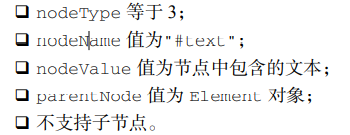
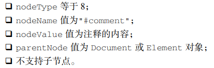
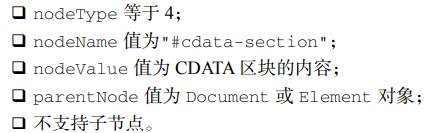
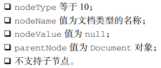
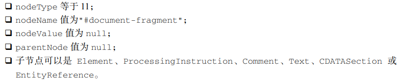
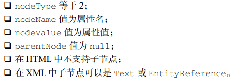
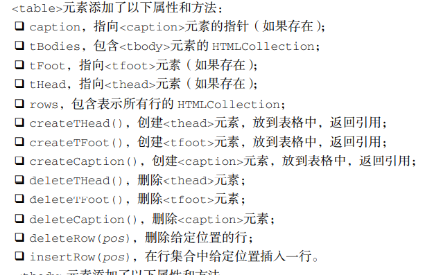

# Cap.14 DOM

文档对象模型（DOM，Document Object Model）是 HTML 和 XML 文档的**编程接口**。

## 14.1 节点层级

DOM 中总共有 **12 种节点类型**，这些 类型都继承一种基本类型。

### 14.1.1 Node类型

Node 接口 在 **JavaScript**中被实现为 **Node 类型**，在除 IE之外的所有浏览器中都可以直接访问这个类型。在 JavaScript 中，**所有节点类型**都继承 Node 类型，因此所有类型都共享相同的基本属性和方法。

每个节点都有 **nodeType** 属性，表示该节点的类型。节点类型由定义在 Node 类型上的 12 个数值 常量表示：

所有节点的关系指针（parent，firstChild）都是只读的。

但是有专门的API用来操纵节点：

- appendChild，返回新添加的节点。可以把已经存在的节点添加到其他节点的字节点；
- insertBefore；
- removeChild；

### 14.1.2 Document类型

Document 类型是 **JavaScript** 中表示**文档节点**的类型。

在浏览器中，文档对象 **document** 是 HTMLDocument 的实例（HTMLDocument 继承 Document），表示整个 HTML 页面。document 是 window 对象的属性，因此是一个全局对象。

**documentElement** 属 性，始终指向 HTML 页面中的元素。

### 14.1.3 Element类型

除了Document 类型，Element 类型就是Web开发中最常用的类型了。**Element 表示XML或HTML 元素**，对外暴露出访问元素标签名、子节点和属性的能力。Element 类型的节点具有以下特征：

 nodeType 等于 1； 

 nodeName 值为元素的标签名，div，span； 

 nodeValue 值为 null； 

 parentNode 值为 Document 或 Element 对象； 

 子节点可以是 Element、Text、Comment、ProcessingInstruction、CDATASection、 EntityReference 类型。

### 14.1.4 Text类型

Text 节点由 Text 类型表示，包含按字面解释的纯文本，也可能包含转义后的 HTML 字符，但不 含 HTML 代码。Text 类型的节点具有以下特征：



### 14.1.5 Comment类型

DOM 中的注释通过 Comment 类型表示。Comment 类型的节点具有以下特征：



### 14.1.6 CDATASection类型

CDATASection 类型表示 XML 中特有的 CDATA 区块。CDATASection 类型继承 Text 类型，因 此拥有包括 splitText()在内的所有字符串操作方法。CDATASection 类型的节点具有以下特征：



### 14.1.7 DocumentType 类型

DocumentType 类型的节点包含文档的文档类型（doctype）信息，具有以下特征：



对于支持这 个类型的浏览器，DocumentType 对象保存在 document.doctype 属性中。

### 14.1.8 DocumentFragment 类型

在所有节点类型中，DocumentFragment 类型是唯一一个在**标记中没有对应表示的类型**。DOM 将 文档片段定义为“轻量级”文档，能够包含和操作节点，却没有完整文档那样额外的消耗。 DocumentFragment 节点具有以下特征：



文档片段从 Node 类型继承了所有文档类型具备的可以执行 DOM 操作的方法。如果**文档中的一个 节点**被**添加到一个文档片段**，则该节点会从文档树中移除，不会再被浏览器渲染。

### 14.1.9 Attr 类型

元素数据在 DOM 中通过 Attr 类型表示。Attr 类型构造函数和原型在所有浏览器中都可以直接访 问。技术上讲**，属性**是存在于**元素 attributes 属性中**的节点。Attr 节点具有以下特征：



属性节点尽管是节点，**却不被认为是 DOM 文档树的一部分**。Attr 节点很少直接被引用，通常开 发者更喜欢使用 getAttribute()、removeAttribute()和 setAttribute()方法操作属性。

## 14.2 DOM编程

### 14.2.1 动态脚本

动态脚本是指在网页最初始加载时不存在，之后通过DOM导入的脚本：

```
let script = document.createElement("script"); 
script.src = "foo.js"; 
document.body.appendChild(script); 
```

### 14.2.2 动态样式

```
let link = document.createElement("link"); 
link.rel = "stylesheet"; 
link.type = "text/css"; 
link.href = "styles.css"; 
let head = document.getElementsByTagName("head")[0]; 
head.appendChild(link); 
```

需要把`<link>`元素添加到head，而不是body，这样才能保证所有浏览器都能正常运行。

另一种方式是通过`style`标签嵌入css样式：

```
let style = document.createElement("style"); 
style.type = "text/css"; 
style.appendChild(document.createTextNode("body{background-color:red}")); 
let head = document.getElementsByTagName("head")[0]; 
head.appendChild(style); 
```

### 14.2.3 操作表格

由于通过DOM元素操作表格过于复杂，因此HTML给table，tbody和tr元素添加了一些属性和方法；



。。。

### 14.2.4 使用NodeList

注意NodeList是实时的即可。

## 14.3 MutationObserver 接口

不久前添加到 DOM 规范中的 MutationObserver 接口，可以在 DOM 被修改时异步执行回调。使 用 MutationObserver 可以观察整个文档、DOM 树的一部分，或某个元素。此外还可以观察元素属性、子节点、文本，或者前三者任意组合的变化。

> **注意** 新引进 MutationObserver 接口是为了取代废弃的 MutationEvent。

### 14.3.1 基本用法

Mutation实例在创建时就需要传入回调函数，意味着每个实例是基于某个指定事件的。

**observe**方法：

为了让MutationObserver 实例与DOM元素关联起来，需要使用observe方法，传入两个参数，一个是观察的节点，另一个是配置对象：

```
const config = { attributes: true, childList: true, subtree: true };
```

标识什么属性发送变化时，调用回调函数：

```
 // 选择需要观察变动的节点
const targetNode = document.getElementById('some-id');

// 观察器的配置（需要观察什么变动）
const config = { attributes: true, childList: true, subtree: true };

// 当观察到变动时执行的回调函数
const callback = function(mutationsList, observer) {
    // Use traditional 'for loops' for IE 11
    for(let mutation of mutationsList) {
        if (mutation.type === 'childList') {
            console.log('A child node has been added or removed.');
        }
        else if (mutation.type === 'attributes') {
            console.log('The ' + mutation.attributeName + ' attribute was modified.');
        }
    }
};

// 创建一个观察器实例并传入回调函数
const observer = new MutationObserver(callback);

// 以上述配置开始观察目标节点
observer.observe(targetNode, config);

// 之后，可停止观察
observer.disconnect();
```

**回调**：

上述代码回调函数中的mutationsList是MutationRecord 实例的数组。MutationRecord 实例包含的信息包括发 生了什么变化，以及 DOM 的哪一部分受到了影响。

# Cap.15 DOM扩展

## 15.3 HTML5

HTML5 代表着与以前的 HTML 截然不同的方向。**在所有以前的 HTML 规范中，从未出现过描述 JavaScript 接口的情形**，HTML 就是一个纯标记语言。JavaScript 绑定的事，一概交给 DOM 规范去定义。 然而，HTML5 规范却包含了与标记相关的大量 JavaScript API 定义。其中有的 API 与 DOM 重合， 定义了浏览器应该提供的 DOM 扩展。

### 15.3.1 CSS扩展

`getElementsByClassName`暴露在document对象上，允许我们通过css类名选择元素；

`classList`属性在Element元素上，不同类名用空格风格，通过赋值可以动态改变元素的类。

### 15.3.2 焦点管理

### 15.3.3 HTMLDocument扩展

检查加载状态和渲染模式：readState和compatMode；

head属性，指向head元素。

### 15.3.4 字符集属性

### 15.3.5 自定义数据类型

使用`data-`作为前缀，告诉浏览器这是与渲染无关的属性，也不包含元素的语义信息。元素的`data-`属性可以在元素的dataset属性访问。

### 15.3.6 插入标记

在以前，需要使用DOM提供的API创建节点，以及添加节点。如果添加的节点很多，这种方式非常麻烦。

`innerHTML`允许我们直接使用字符串进行插入。赋给 innerHTML 属性的值会被解析为 DOM 子树，并替代元素之前的所有节点。

### 15.3.7 scrollIntoView()

DOM 规范中没有涉及的一个问题是如何滚动页面中的某个区域。为填充这方面的缺失，不同浏览 器实现了不同的控制滚动的方式。在所有这些专有方法中，HTML5 选择了标准化 scrollIntoView()。

BOM中有`scrollTo`方法，但是只能指定坐标。

