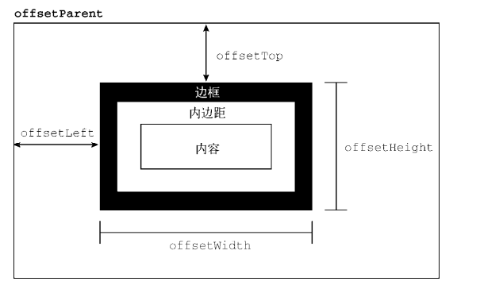
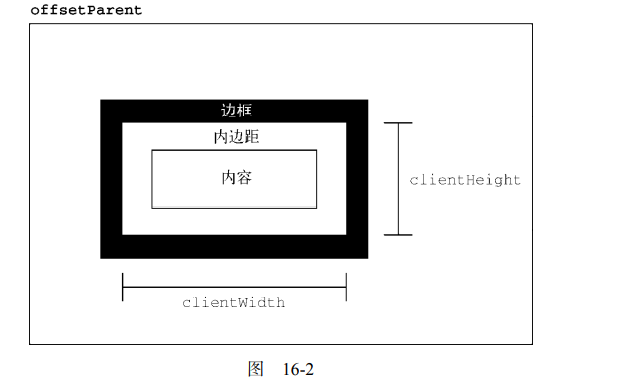

# Cap.16 DOM2和DOM3扩展

伪元素样式：

DOM2 Style在`document.defaultView`上增加了`getComputedStyle()` 方法。

这个方法接收两个参数：要取得计算样式的元素和**伪元素字符串（如":after"）**。如果不需要查 询伪元素，则第二个参数可以传 null。

```
let myDiv = document.getElementById("myDiv"); 
let computedStyle = document.defaultView.getComputedStyle(myDiv, null); 
console.log(computedStyle.backgroundColor); // "red" 
console.log(computedStyle.width); // "100px" 
console.log(computedStyle.height); // "200px" 
console.log(computedStyle.border); // "1px solid black"（在某些浏览器中)
```

**计算样式是只读的。**不能修改 getComputedStyle() 方法返回的对象。

## 操作样式表

CSSStyleSheet 类型表示 CSS 样式表，包括使用`<link>`元素和通过`<style>`元素定义的样式表。

## 元素尺寸

### 偏移尺寸

偏移尺寸（offset dimensions），包含元素在屏幕上占用的所有视觉空间。

偏移尺寸是基于父元素的。




要确定一个元素在页面中的偏移量，可以把它的 offsetLeft 和 offsetTop 属性分别与 offsetParent 的相同属性相加，一直加到根元素。

```
function getElementLeft(element) {
    let actualLeft = element.offsetLeft;
    let current = element.offsetParent;
    while (current !== null) {
        actualLeft += current.offsetLeft;
        current = current.offsetParent;
    }
    return actualLeft;
}
function getElementTop(element) {
    let actualTop = element.offsetTop;
    let current = element.offsetParent;
    while (current !== null) {
        actualTop += current.offsetTop;
        current = current.offsetParent;
    }
    return actualTop;
} 
```

### 客户端尺寸

元素的客户端尺寸（client dimensions）包含元素内容及其内边距所占用的空间。客户端尺寸只有两 个相关属性：clientWidth 和 clientHeight。



### 滚动尺寸

