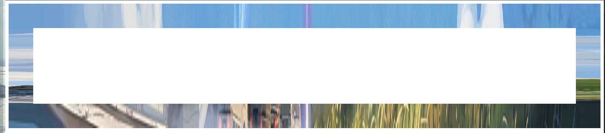
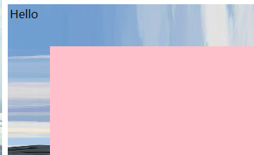
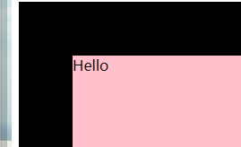
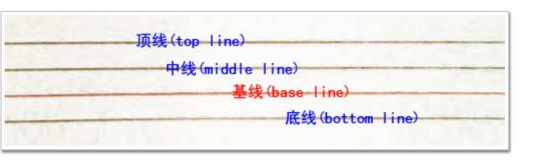
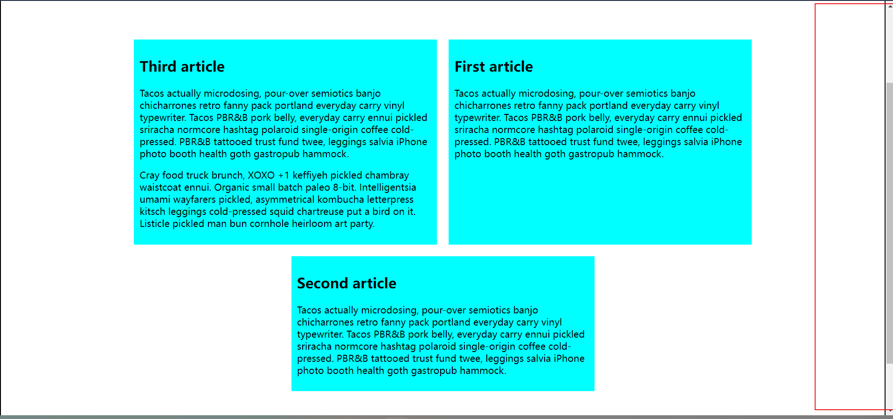
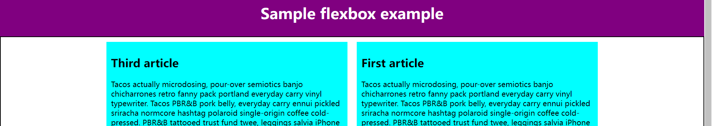
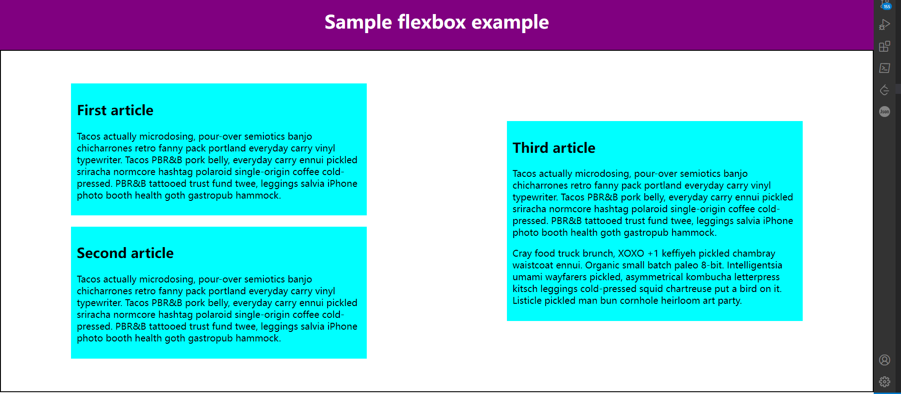
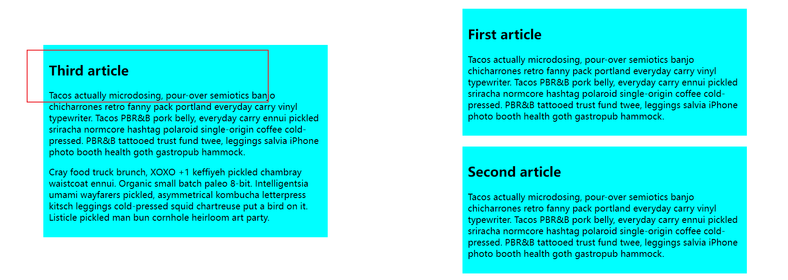
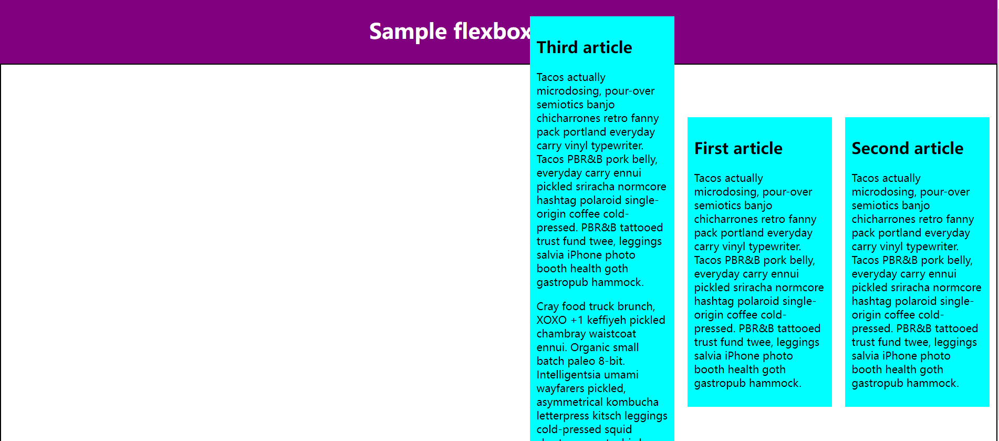
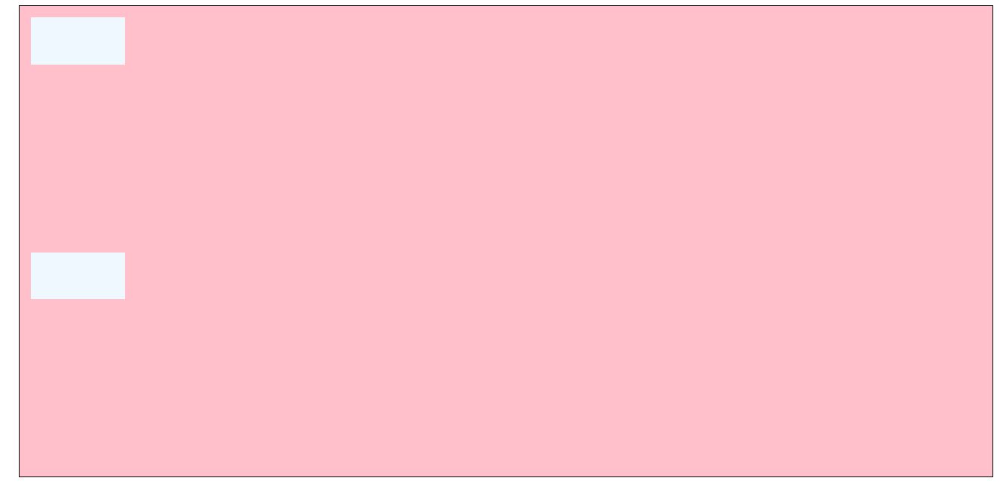

# CSS盒模型

[盒模型](./CSS3盒相关样式.md)

## border-image



```html
div{
            height: 300px;
            margin: 0 auto;
            border-style: solid;
            border-image: url(./5922778fc038f.jpg) 10 10 10 10  / 60px;
        }
```

`60px`指的是边框宽度。

`10 10 10 10`是切分图片的参数。

使用`border-image`后，`div`内部的元素会出现在`border`上。



普通边框：



# HTML知识点

引用自：[2022高频前端面试题——HTML篇 - 掘金 (juejin.cn)](https://juejin.cn/post/7095899257072254989)

## DOCTYPE

`Doctype`是**HTML5**的文档声明，通过它可以告诉浏览器，使用哪一个HTML版本标准解析文档。

## src和href的区别

当浏览器解析到src元素时，会暂定其他资源的下载，直到将该资源加载、编译、执行完毕。这也是为什么将js脚本放在底部。

href指超链接，浏览器解析到该属性时会并行下载资源。

## 前端页面三层结构

结构层（各种标签，HTML语义形成的），表示层（css），行为层（js）。

## img的alt和title属性

- alt：全称`alternate`，切换的意思，如果无法显示图像，浏览器将显示alt指定的内容
- title：当鼠标移动到元素上时显示title的内容

一般当鼠标滑动到元素身上的时候显示`title`，而`alt`是img标签特有的属性，**是图片内容的等价描述**，用于图片无法加载时显示，这样用户还能看到关于丢失了什么东西的一些信息，相对来说比较友好。

## 行列元素和块级元素

**使用行内元素需要注意的是**：

- 行内元素设置宽度`width`无效

- 行内元素设置`height`无效，但是可以通过`line-height`来设置

  由于行内元素的框高是自适应的，因此无法指定高度。而line-height定义的是每一行的高度。

- 设置`margin`只有左右有效，上下无效

- 设置`padding`只有左右有效，上下无效

[line-height 与 height 的区别 - 远征i - 博客园 (cnblogs.com)](https://www.cnblogs.com/expedition/p/11294002.html)

line-height是行高的意思，它决定了**元素中文本内容的高度**，height则是定义**元素自身的高度**。

“行高”顾名思意指一行文字的高度。具体来说是指**两行文字间基线之间的距离**。



文字中心在基线上，因此如果想让块内文字居中，可以设置行高为父元素高度（100%）。

## label的作用

`label`元素不会向用户呈现任何特殊效果，但是，它为鼠标用户改进了可用性，当我们在label元素内点击文本时就会触发此控件。也就是说，当用户选择该标签时，浏览器就会自动将焦点转到和标签相关的表单控件上。最常用label的地方就是表单中的性别单选框了，当点击文字时也能够自动聚焦绑定的表单控件。

```html
<form>
     <label for="male">男</label>  //点击label，焦点转移到input上
     <input type="radio" name="sex" id="male">
     <label for="female">女</label>
     <input type="radio" name="sex" id="female">
</form>
```

## HTML5新增了哪些新特性？移除了哪些元素？

HTML5主要是关于图像、位置、存储、多任务等功能的增加：

- 语义化标签，如：article、footer、header、nav等
- 视频video、音频audio
- 画布canvas
- 表单控件，calendar、date、time、email
- 地理
- 本地离线存储，localStorage长期存储数据，浏览器关闭后数据不丢失，sessionStorage的数据在浏览器关闭后自动删除
- 拖拽释放

移除的元素：

- 纯表现的元素：`basefont、font、s、strike、tt、u、big、center`
- 对可选用性产生负面影响的元素：`frame、frameset、noframes`

## 如何实现在一张图片上的某个区域做到点击事件

`map`和`area`标签。map标签用于声明图像地图作用域，area标签在map标签内部。

## a元素除了用于导航外，还有什么作用？

href属性中的url可以是浏览器支持的任何协议，所以a标签可以用来手机拨号`<a href="tel:110">110</a>`，也可以用来发送短信`<a href="sms:110">110</a>`，还有邮件等等。

当然，a元素最常见的就是用来做*锚点*和 *下载文件*。下载的原理在于a标签所对应的资源浏览器无法解析，于是浏览器会选择将其下载下来。

## 你知道SEO中的TDK吗？

SEO指的是搜索引擎优化，TDK其实就是`title`、`description`、`keywords`这三个标签，title表示标题标签，description是描述标签，keywords是关键词标签

# 浮动元素

[float - CSS: Cascading Style Sheets | MDN (mozilla.org)](https://developer.mozilla.org/en-US/docs/Web/CSS/float)

`float` CSS 属性指定一个元素应沿其容器的左侧或右侧放置，允许文本和内联元素环绕它。该元素从网页的正常流动（文档流）中移除，尽管仍然保持部分的流动性（与[绝对定位](https://developer.mozilla.org/zh-CN/docs/Web/CSS/position#absolute_positioning)相反）。

由于 `float` 意味着使用块布局，它在某些情况下会修改 [`display`](https://developer.mozilla.org/zh-CN/docs/Web/CSS/display) 值的计算值（同时指定display和float，display的值可能发生改变）。

浮动元素虽然脱离了文档流，但他们不会挡住其他内容。

## 清除浮动

[清除浮动的四种方式及其原理理解 - 掘金 (juejin.cn)](https://juejin.cn/post/6844903504545316877)

浮动可以形成环绕的效果。

为什么要清除浮动，浮动元素可能造成父级元素高度塌陷，也可能会影响到外部元素。因此有清除内部浮动和外部浮动。

清除内部浮动，对于浮动元素所占的父级元素而言：

- clear属性，禁止某个方向上有浮动元素的存在，可在父级元素的最后添加一个没有内容的块级元素（真实或伪元素），并指定clear属性，最为保险；
- 设置为BFC，可以清除内部浮动和外部浮动；

# BFC

[面试官：请说说什么是BFC？大白话讲清楚 - 掘金 (juejin.cn)](https://juejin.cn/post/6950082193632788493)

[块格式化上下文 - Web 开发者指南 | MDN (mozilla.org)](https://developer.mozilla.org/zh-CN/docs/Web/Guide/CSS/Block_formatting_context)

块级元素并不是BFC，inline-block元素是BFC。

### 特点

BFC会计算浮动元素的高度，BFC内部不会影响外部。

格式化上下文影响布局，通常，我们为了**定位**和清除浮动创建新的 BFC，而不是更改布局，因为它将：

- 包含内部浮动[块格式化上下文 - Web 开发者指南 | MDN (mozilla.org)](https://developer.mozilla.org/zh-CN/docs/Web/Guide/CSS/Block_formatting_context#包含内部浮动)
- 排除外部浮动[块格式化上下文 - Web 开发者指南 | MDN (mozilla.org)](https://developer.mozilla.org/zh-CN/docs/Web/Guide/CSS/Block_formatting_context#排除外部浮动)
- 阻止 [外边距重叠](https://developer.mozilla.org/zh-CN/docs/Web/CSS/CSS_Box_Model/Mastering_margin_collapsing)

### 创建BFC

- overflow

使用 `overflow` 创建新的 BFC，是因为 `overflow` 属性会告**诉浏览器应该怎样处理溢出的内容**。如果使用它仅仅为了创建 BFC，你可能会遇到不希望出现的滚动条或阴影，需要注意。另外，对于后续的开发者，可能不清楚当时为什么使用 `overflow`，所以最好添加一些注释来解释为什么这样做。

### 排除外部浮动

排除外部浮动利用的BFC特性是：正常文档流中建立的 BFC 不得与元素本身所在的块格式化上下文中的任何浮动的外边距重叠。

> 请注意，flexbox [Flexbox| MDN (mozilla.org)](https://developer.mozilla.org/en-US/docs/Learn/CSS/CSS_layout/Flexbox)是在现代 CSS 中实现多列布局的更有效的方法。

# CSS3中的变形处理

## transform

[transform - CSS（层叠样式表） | MDN (mozilla.org)](https://developer.mozilla.org/zh-CN/docs/Web/CSS/transform#语法)

- 缩放，scale
- 倾斜，skew
- 移动，translate
- ...

## 变形的基准点

使用transform对文字或图像进行变形时，是以元素的中心为基准点进行的（因此不需要top，left属性）。使用`transform-origin`改变基准点。

## [`transform-function`](https://developer.mozilla.org/zh-CN/docs/Web/CSS/transform-function)

### translate

> **百分比以自身为基准** , 当只有一个参数时，默认为沿x轴移动的距离。

# CSS3中的动画

CSS3中的功能分为`transitions`和`animation`功能。

`transitions`进行属性变换；

`animation`通过关键帧进行变换，可以实现更复杂的效果。

## transition

[transition - CSS（层叠样式表） | MDN (mozilla.org)](https://developer.mozilla.org/zh-CN/docs/Web/CSS/transition)

**`transition`** [CSS](https://developer.mozilla.org/zh-CN/docs/Web/CSS) 属性是 [`transition-property`](https://developer.mozilla.org/zh-CN/docs/Web/CSS/transition-property)、[`transition-duration`](https://developer.mozilla.org/zh-CN/docs/Web/CSS/transition-duration)、[`transition-timing-function`](https://developer.mozilla.org/zh-CN/docs/Web/CSS/transition-timing-function) 和 [`transition-delay`](https://developer.mozilla.org/zh-CN/docs/Web/CSS/transition-delay) 的一个[简写属性 (en-US)](https://developer.mozilla.org/en-US/docs/Web/CSS/Shorthand_properties)。

- `property`: 指定平滑过渡的属性；
- `duration`：指定过度时间；
- `timing-function`：使用什么方法进行平滑过渡。（总时间不变，但可以有块有慢）

`transition`定义的是属性发生改变时的持续时间。它本身并不关心属性如何变化。

```html
    <style>
        .box {
            border-style: solid;
            border-width: 1px;
            display: block;
            width: 100px;
            height: 100px;
            background-color: #0000FF;
            -webkit-transition: width 2s, height 2s,
                background-color 2s, -webkit-transform 2s;
            transition: width 2s, height 2s, background-color 2s, transform 2s;
        }

        .box:hover {
            background-color: #FFCCCC;
            width: 200px;
            height: 200px;
            -webkit-transform: rotate(180deg);
            transform: rotate(180deg);
        }
    </style>
```

这里当鼠标移动到元素上时，`width`,`height`,`transform`等属性都发生了变化。当我们移出`height: 200px`时，高度不会触发动画。

## animation

[animation - CSS（层叠样式表） | MDN (mozilla.org)](https://developer.mozilla.org/zh-CN/docs/Web/CSS/animation)

`animation`也是通过指定属性变化实现动画；

`tansition`只能指定属性的开始和结束，然后在两个属性之间进行平滑过渡，因此不能实现复杂的动画效果；

`animation`通过定义关键帧，在每个帧中定义属性的值，实现更加复杂的动画。

[CSS](https://developer.mozilla.org/zh-CN/docs/Web/CSS) **animation** 属性是 [`animation-name`](https://developer.mozilla.org/zh-CN/docs/Web/CSS/animation-name)，[`animation-duration`](https://developer.mozilla.org/zh-CN/docs/Web/CSS/animation-duration), [`animation-timing-function`](https://developer.mozilla.org/zh-CN/docs/Web/CSS/animation-timing-function)，[`animation-delay`](https://developer.mozilla.org/zh-CN/docs/Web/CSS/animation-delay)，[`animation-iteration-count`](https://developer.mozilla.org/zh-CN/docs/Web/CSS/animation-iteration-count)，[`animation-direction`](https://developer.mozilla.org/zh-CN/docs/Web/CSS/animation-direction)，[`animation-fill-mode`](https://developer.mozilla.org/zh-CN/docs/Web/CSS/animation-fill-mode) 和 [`animation-play-state`](https://developer.mozilla.org/zh-CN/docs/Web/CSS/animation-play-state) 属性的一个简写属性形式。

### 定义动画

```html
animation = 
  <single-animation>#  

<single-animation> = 
  <time>                              ||
  <easing-function>                   ||
  <time>                              ||
  <single-animation-iteration-count>  ||
  <single-animation-direction>        ||
  <single-animation-fill-mode>        ||
  <single-animation-play-state>       ||
  [ none | <keyframes-name> ]   
```

```
@keyframes move_eye {
            from {
                margin-left: -20%;
            }

            to {
                margin-left: 100%;
            }
        }
```

可以使用百分比定义关键帧。

## timing-function

[animation-timing-function - CSS（层叠样式表） | MDN (mozilla.org)](https://developer.mozilla.org/zh-CN/docs/Web/CSS/animation-timing-function)

对于关键帧动画来说，`timing function `作用于**一个关键帧周期**而非整个动画周期，即从关键帧开始开始，到关键帧结束结束。这意味着使用`ease-in`的话，每一帧的变化都是最开始比较慢，之后变快。

# Flex布局

[Flexbox - Learn web development | MDN (mozilla.org)](https://developer.mozilla.org/en-US/docs/Learn/CSS/CSS_layout/Flexbox)

外层容器（display属性为flex）称为flex容器，子元素称为flex item。

主轴`main axis`是flex容器的排列方向，可以为`row`或`column`，那么另一个就是`corss axis`。使用`flex-direction`指定排列方向。在`flex-wrap`属性不为`wrap`时，会一直在这个方向上排列子元素。[Flexbox - Learn web development | MDN (mozilla.org)](https://developer.mozilla.org/en-US/docs/Learn/CSS/CSS_layout/Flexbox#wrapping)

## 控制每个flex item所占空间

[:nth-of-type - CSS（层叠样式表） | MDN (mozilla.org)](https://developer.mozilla.org/zh-CN/docs/Web/CSS/:nth-of-type)

- `felx：1`：表示flex item所占空间的比例。也可以指定最小值(`flex:2 200px`)。

`justify-cotent`描述了元素在主轴上的分布方式，告诉浏览器如何分配顺着弹性容器主轴 (或者网格行轴) 的元素之间及其周围的空间（分配元素之间的空间）；

`align-items`描述了元素在交叉轴上的对齐方式（元素自身）；

`justify-items`属性被忽略[justify-items - CSS（层叠样式表） | MDN (mozilla.org)](https://developer.mozilla.org/zh-CN/docs/Web/CSS/justify-items)；

`align-content`属性对单行弹性盒子模型无效[align-content - CSS（层叠样式表） | MDN (mozilla.org)](https://developer.mozilla.org/zh-CN/docs/Web/CSS/align-content)，该属性设置了浏览器如何沿着[弹性盒子布局](https://developer.mozilla.org/zh-CN/docs/Web/CSS/CSS_Flexible_Box_Layout)的纵轴和[网格布局](https://developer.mozilla.org/zh-CN/docs/Web/CSS/CSS_Grid_Layout)的主轴在内容项之间和周围分配空间（也是空间，content表示空间，item表示元素自身，将外层容器的高度设置为900px，大于内容高度，同时align-content属性设置为`center`，在交叉轴上居中了（看右侧滑块位置）：

[A Pen by fantasy955 (codepen.io)](https://codepen.io/fantasy995/pen/dyKawob)



不设置的话元素被拉伸（strech）：



## 水平和垂直方向对齐

- align-items

  [`align-items`](https://developer.mozilla.org/en-US/docs/Web/CSS/align-items) controls where the flex items sit on the cross axis. 默认值是`strech`，将在`cross-axis`上拉伸，以填满父级元素。

  值为`center`时，在`cross-axis`上居中。

  值为`flex-start`或`flex-end`，与`cross-axis`上第一个或最后一个对齐。

  针对某个特定的item，可以使用`align-self`属性覆盖所处flex容器定义的`align-items`属性。

- justify-content

  `justify-content` controls where the flex items sit on the main axis.

flex布局，`flex-direction: column; flex-wrap: wrap; jusctify-content: center; align-items: center`, flex item的宽度为500px；

在`main-axis`上发生了换行，另起了一列。在`cross-axis`上居中（水平居中，因为方向是column）；

`justify-content`控制在`main-axis`上居中（垂直居中）：



## 排序

[Flexbox - Learn web development | MDN (mozilla.org)](https://developer.mozilla.org/en-US/docs/Learn/CSS/CSS_layout/Flexbox#ordering_flex_items)

`order`属性。默认值是0。

- order值越大，越排在后面。

  将最后一个item的order设为-1.

  

# position属性

[position - CSS（层叠样式表） | MDN (mozilla.org)](https://developer.mozilla.org/zh-CN/docs/Web/CSS/position)

CSS **`position`** 属性用于指定一个元素在文档中的定位方式。[`top`](https://developer.mozilla.org/zh-CN/docs/Web/CSS/top)，[`right`](https://developer.mozilla.org/zh-CN/docs/Web/CSS/right)，[`bottom`](https://developer.mozilla.org/zh-CN/docs/Web/CSS/bottom) 和 [`left`](https://developer.mozilla.org/zh-CN/docs/Web/CSS/left) 属性则决定了该元素的最终位置。

- relative

- absolute

  元素会被移出正常文档流，并不为元素预留空间，通过指定元素相对于**最近的非 static 定位祖先元素的偏移**，来确定元素位置。绝对定位的元素可以设置外边距（margins），且不会与其他边距合并。

  可以将父元素设置为`relative`。

# flex布局和grid布局

[一文搞懂grid布局 和 flex 布局及其区别 - 掘金 (juejin.cn)](https://juejin.cn/post/6940627375537258527)

[flex布局](./flex布局.md),[grid布局](./grid布局.md)

## align-content属性

align-content属性定义了flex item在交叉轴上的对齐方式。

如果`flex-direction`的值为`row`的话，交叉轴就是纵轴，由于高度比较难观察，因此将方向设为`column`进行演示：

这里flex cantainer的高度设定为600px，因此发生了换行（产生了三列）。

`align-content: flex-end`： 



## grid布局

[grid-template - CSS（层叠样式表） | MDN (mozilla.org)](https://developer.mozilla.org/zh-CN/docs/Web/CSS/grid-template)

在不指定`grid-tempate`属性时，容器默认是一行一列：



```html
<div class="grid-cantainer">
  <div class='item-1'></div>
  <div class='item-1'></div>
</div>
```

```css
.grid-cantainer {
  display: grid;
  background-color: pink;
  border: 1px solid;
  margin: 12px;
  width: auto;
  height: 500px;
}

.item-1 {
  width: 100px;
  height: 50px;
  margin: 12px;
  background-color: aliceblue;
}
```

当只有一个元素时，为了让它水平垂直居中，我们可以使用和`flex`布局一样的方式`justify-content`, `align-items`。

### fr关键字

`fr`属性指定某一列所占可用空间的比例。

### minmax(函数)

指定某一利用的最小和最大宽度（最小使用绝对值，最大使用比例）。

### 固定列宽，不限制列数

`grid-template-columns: repeat(auto-fit, 200px);`

