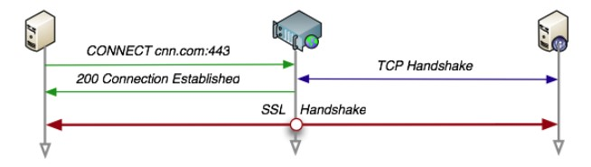
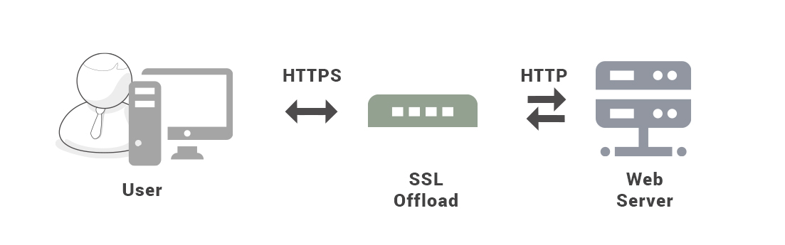
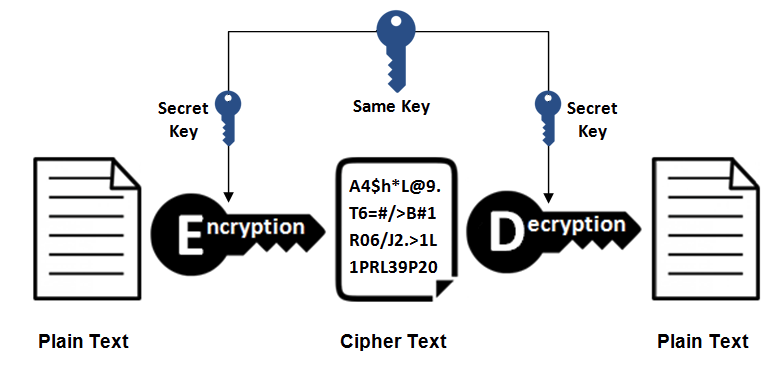
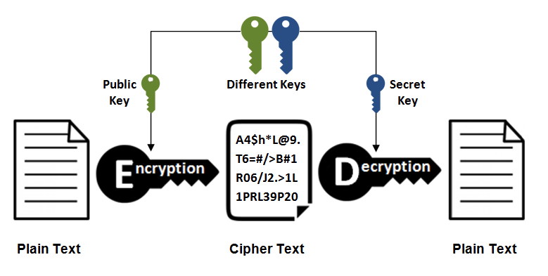
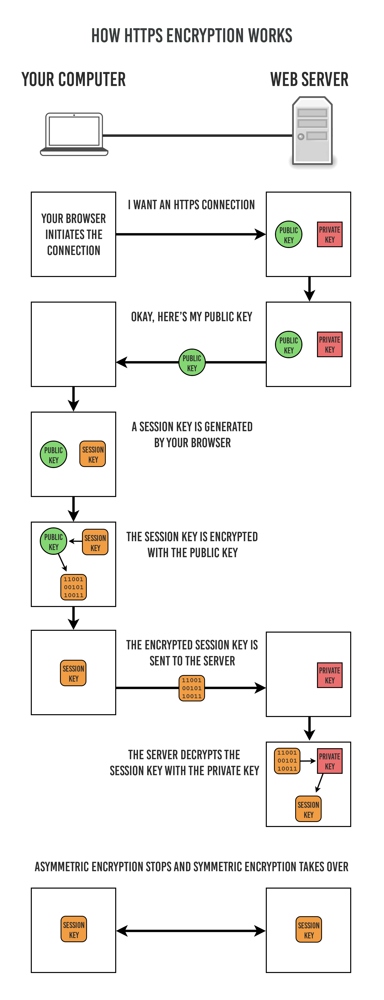
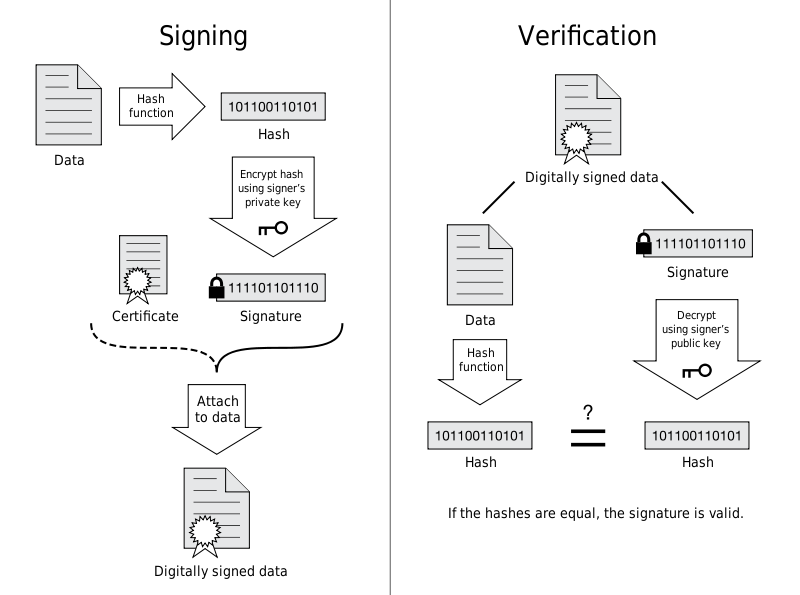

# 基本概念

## 1. 报文格式

客户端发送一个**请求报文**给服务器，服务器根据请求报文中的信息进行处理，并将处理结果放入**响应报文**中返回给客户端。

### 1.1 请求报文
第一行是包含了请求方法、URL、协议版本；
接下来的多行都是请求**首部 Header**，每个首部都有一个首部名称，以及对应的值。
一个**空行**用来分隔首部和内容主体 Body
最后是请求的**内容主体**

（Get请求也可以添加body，只是可能会被浏览器丢弃）

```
GET http://www.example.com/ HTTP/1.1
Accept: text/html,application/xhtml+xml,application/xml;q=0.9,image/webp,image/apng,*/*;q=0.8,application/signed-exchange;v=b3;q=0.9
Accept-Encoding: gzip, deflate
Accept-Language: zh-CN,zh;q=0.9,en;q=0.8
Cache-Control: max-age=0
Host: www.example.com
If-Modified-Since: Thu, 17 Oct 2019 07:18:26 GMT
If-None-Match: "3147526947+gzip"
Proxy-Connection: keep-alive
Upgrade-Insecure-Requests: 1
User-Agent: Mozilla/5.0 xxx

param1=1&param2=2
```

### 1.2 响应报文
第一行包含协议版本、状态码以及描述，最常见的是 200 OK 表示请求成功了
接下来多行也是**首部内容**
一个**空行**分隔首部和内容主体
最后是响应的**内容主体**

```
HTTP/1.1 200 OK
Age: 529651
Cache-Control: max-age=604800
Connection: keep-alive
Content-Encoding: gzip
Content-Length: 648
Content-Type: text/html; charset=UTF-8
Date: Mon, 02 Nov 2020 17:53:39 GMT
Etag: "3147526947+ident+gzip"
Expires: Mon, 09 Nov 2020 17:53:39 GMT
Keep-Alive: timeout=4
Last-Modified: Thu, 17 Oct 2019 07:18:26 GMT
Proxy-Connection: keep-alive
Server: ECS (sjc/16DF)
Vary: Accept-Encoding
X-Cache: HIT

<!doctype html>
<html>
<head>
    <title>Example Domain</title>
	// 省略... 
</body>
</html>
```

## 2.URL

HTTP 使用 URL（ Uniform Resource Locator，统一资源定位符）来定位资源，它是 URI（Uniform Resource Identifier，统一资源标识符）的子集，URL 在 URI 的基础上增加了定位能力。URI 除了包含 URL，还包含 URN（Uniform Resource Name，统一资源名称），它只是用来定义一个资源的名称，并不具备定位该资源的能力。例如 urn:isbn:0451450523 用来定义一个书籍名称，但是却没有表示怎么找到这本书。


# HTTP方法

客户端发送的 请求报文 第一行为请求行，包含了方法字段。

**1.GET**

获取资源

当前网络请求中，绝大部分使用的是 GET 方法。

**2.HEAD**

获取报文首部

和 GET 方法类似，但是不返回报文实体主体部分。

主要用于确认 URL 的有效性以及资源更新的日期时间等。

**3.POST**

传输实体主体

POST 主要用来传输数据，而 GET 主要用来获取资源。

**4.PUT**

上传文件

由于自身不带验证机制，任何人都可以上传文件，因此存在安全性问题，一般不使用该方法。

```
PUT /new.html HTTP/1.1
Host: example.com
Content-type: text/html
Content-length: 16

<p>New File</p>
```

**5.PATCH**

对资源进行部分修改

PUT 也可以用于修改资源，但是只能完全替代原始资源，PATCH 允许部分修改。

```
PATCH /file.txt HTTP/1.1
Host: www.example.com
Content-Type: application/example
If-Match: "e0023aa4e"
Content-Length: 100

[description of changes]
```

**6.DELETE**

删除文件

与 PUT 功能相反，并且同样不带验证机制。

```
DELETE /file.html HTTP/1.1
```

**7.OPTIONS**

查询支持的方法

查询指定的 URL 能够支持的方法。

会返回 Allow: GET, POST, HEAD, OPTIONS 这样的内容。

**8.CONNECT**

要求在与代理服务器通信时建立隧道

使用 SSL（Secure Sockets Layer，安全套接层）和 TLS（Transport Layer Security，传输层安全）协议把通信内容加密后经网络隧道传输。

```
CONNECT www.example.com:443 HTTP/1.1
```



**9.TRACE**

追踪路径

服务器会将通信路径返回给客户端。

发送请求时，在 Max-Forwards 首部字段中填入数值，每经过一个服务器就会减 1，当数值为 0 时就停止传输。

通常不会使用 TRACE，并且它容易受到 XST 攻击（Cross-Site Tracing，跨站追踪）。

# HTTP状态码

服务器返回的 响应报文 中第一行为状态行，包含了状态码以及原因短语，用来告知客户端请求的结果。

| 状态码 | 类别                                 | 含义                       |
| ------ | ------------------------------------ | -------------------------- |
| 1XX    | Informational（信息性状态码）        | 接收的请求正在处理         |
| 2XX    | Success（成功状态码）                | 请求正常处理完毕           |
| 3XX    | Redirection（重定向状态码）          | 需要进行附加操作以完成请求 |
| 4XX    | Client Error（**客户端**错误状态码） | 服务器无法处理请求         |
| 5XX    | Server Error（**服务器**错误状态码） | 服务器处理请求出错         |

**1XX 信息**
100 Continue ：表明到目前为止都很正常，客户端可以继续发送请求或者忽略这个响应。

**2XX** 成功
200 OK

204 No Content ：请求已经成功处理，但是返回的响应报文不包含实体的主体部分。一般在只需要从客户端往服务器发送信息，而不需要返回数据时使用。

206 Partial Content ：表示客户端进行了范围请求，响应报文包含由 Content-Range 指定范围的实体内容。

**3XX** 重定向
301 Moved Permanently ：永久性重定向

302 Found ：临时性重定向

303 See Other ：和 302 有着相同的功能，但是 **303 明确要求**客户端应该采用 GET 方法获取资源。

> 注：虽然 HTTP 协议规定 301、302 状态下重定向时不允许把 POST 方法改成 GET 方法，但是大多数浏览器都会在 301、302 和 303 状态下的重定向把 POST 方法改成 GET 方法。

304 Not Modified ：如果请求报文首部包含一些条件，例如：If-Match，If-Modified-Since，If-None-Match，If-Range，If-Unmodified-Since，如果不满足条件，则服务器会返回 304 状态码。

307 Temporary Redirect ：临时重定向，与 302 的含义类似，但是 307 要求浏览器不会把重定向请求的 POST 方法改成 GET 方法。

**4XX** 客户端错误
400 Bad Request ：请求报文中存在语法错误。

401 Unauthorized ：该状态码表示发送的请求需要有认证信息（BASIC 认证、DIGEST 认证）。如果之前已进行过一次请求，则表示用户认证失败。

403 Forbidden ：请求被拒绝。

404 Not Found

**5XX 服务器错误**
500 Internal Server Error ：服务器正在执行请求时发生错误。

503 Service Unavailable ：服务器暂时处于超负载或正在进行停机维护，现在无法处理请求。

# HTTP首部

有 4 种类型的首部字段：**通用**首部字段、**请求**首部字段、**响应**首部字段和**实体**首部字段。		

## 1.通用首部字段

| **首部字段名**    | **说明**                                   |
| ----------------- | ------------------------------------------ |
| Cache-Control     | 控制缓存的行为                             |
| Connection        | 控制不再转发给代理的首部字段、管理持久连接 |
| Date              | 创建报文的日期时间                         |
| Pragma            | 报文指令                                   |
| Trailer           | 报文末端的首部一览                         |
| Transfer-Encoding | 指定报文主体的传输编码方式                 |
| Upgrade           | 升级为其他协议                             |
| Via               | 代理服务器的相关信息                       |
| Warning           | 错误通知                                   |

## 2.请求首部字段

| **首部字段名**      | **说明**                             |
| ------------------- | ------------------------------------ |
| Accept              | User-Agent                           |
| Accept-Charset      | 优先的字符集                         |
| Accept-Encoding     | 优先的内容编码                       |
| Accept-Language     | 优先的语言（自然语言）               |
| Authorization       | Web 认证信息                         |
| Expect              | 期待服务器的特定行为                 |
| From                | 用户的电子邮箱地址                   |
| Host                | 请求资源所在服务器                   |
| If-Match            | 比较实体标记（ETag）                 |
| If-Modified-Since   | 比较资源的更新时间                   |
| If-None-Match       | 比较实体标记（与 If-Match 相反）     |
| If-Range            | 资源未更新时发送实体 Byte 的范围请求 |
| If-Unmodified-Since | 资源未更新时发送实体 Byte 的范围请求 |
| Max-Forwards        | 最大传输逐跳数                       |
| Proxy-Authorization | 代理服务器要求客户端的认证信息       |
| Range               | 实体的**字节范围**请求               |
| Referer             | 对请求中 URI 的原始获取方            |
| TE                  | 传输编码的优先级                     |
| User-Agent          | HTTP 客户端程序的信息                |

## 3.响应首部字段

| **首部字段名**     | **说明**                     |
| ------------------ | ---------------------------- |
| Accept-Ranges      | 是否接受字节范围请求         |
| Age                | 推算资源创建经过时间         |
| ETag               | 资源的匹配信息               |
| Location           | 令客户端重定向至指定 URI     |
| Proxy-Authenticate | 代理服务器对客户端的认证信息 |
| Retry-After        | 对再次发起请求的时机要求     |
| Server             | HTTP 服务器的安装信息        |
| Vary               | 代理服务器缓存的管理信息     |
| WWW-Authenticate   | 服务器对客户端的认证信息     |

## 4. 实体首部字段

| **首部字段名**   | **说明**               |
| ---------------- | ---------------------- |
| Allow            | 资源可支持的 HTTP 方法 |
| Content-Encoding | 实体主体适用的编码方式 |
| Content-Language | 实体主体的自然语言     |
| Content-Length   | 实体主体的大小         |
| Content-Location | 替代对应资源的 URI     |
| Content-MD5      | 实体主体的报文摘要     |
| Content-Range    | 实体主体的位置范围     |
| Content-Type     | 实体主体的媒体类型     |
| Expires          | 实体主体过期的日期时间 |
| Last-Modified    | 资源的最后修改日期时间 |

# Cookies

HTTP 协议是无状态的，主要是为了让 HTTP 协议尽可能简单，使得它能够处理大量事务。HTTP/1.1 引入 Cookie 来保存状态信息。

Cookie 是服务器发送到用户浏览器并保存在本地的一小块数据，它会在浏览器之后向同一服务器再次发起请求时被携带上，用于告知服务端两个请求是否来自同一浏览器。由于之后每次请求都会需要携带 Cookie 数据，因此会带来额外的性能开销（尤其是在移动环境下）。

Cookie 曾一度用于客户端数据的存储，因为当时并没有其它合适的存储办法而作为唯一的存储手段，但现在随着现代浏览器开始支持各种各样的存储方式，Cookie 渐渐被淘汰。新的浏览器 API 已经允许开发者直接将数据存储到本地，如使用 Web storage API（本地存储和会话存储）或 IndexedDB。

## 1.用途

- 会话状态管理（如用户登录状态购物车、游戏分数或其它需要记录的信息）
- 个性化设置（如用户自定义设置、主题等）
- 浏览器行为跟踪（如跟踪分析用户行为等）

## 2.创建过程

**服务器**发送的响应报文包含 **Set-Cookie** 首部字段，客户端得到响应报文后把 Cookie 内容保存到浏览器中。

```
HTTP/1.0 200 OK
Content-type: text/html
Set-Cookie: yummy_cookie=choco
Set-Cookie: tasty_cookie=strawberry

[page content]
```

**客户端**之后对同一个服务器**发送请求时**，会从浏览器中取出 Cookie 信息并通过 Cookie 请求首部字段发送给服务器。

```
GET /sample_page.html HTTP/1.1
Host: www.example.org
Cookie: yummy_cookie=choco; tasty_cookie=strawberry
```

## 3.分类

会话期 Cookie：浏览器关闭之后它会被自动删除，也就是说它仅在会话期内有效。
持久性 Cookie：指定过期时间（Expires）或有效期（max-age）之后就成为了持久性的 Cookie。

```
Set-Cookie: id=a3fWa; Expires=Wed, 21 Oct 2015 07:28:00 GMT;
```

## 4.作用域

**Domain** 标识指定了哪些主机可以接受 Cookie。如果不指定，默认为当前文档的主机（不包含子域名）。如果指定了 Domain，**则一般包含子域名。例如，如果设置 Domain=mozilla.org，则 Cookie 也包含在子域名中（如 developer.mozilla.org）。**

**Path** 标识指定了**主机下的哪些路径**可以接受 Cookie（该 URL 路径必须存在于请求 URL 中）。以字符 %x2F ("/") 作为路径分隔符，子路径也会被匹配。例如，设置 Path=/docs，则以下地址都会匹配：

```
/docs
/docs/Web/
/docs/Web/HTTP
```

## 5.JavaScript创建Cookie

浏览器通过 `document.cookie` 属性可创建新的 Cookie，也可通过该属性访问**非 HttpOnly 标记**的 Cookie。

```
document.cookie = "yummy_cookie=choco";
document.cookie = "tasty_cookie=strawberry";
console.log(document.cookie);
```

## 6.HttpOnly

标记为 HttpOnly 的 Cookie 不能被 JavaScript 脚本调用。跨站脚本攻击 (XSS) 常常使用 JavaScript 的 document.cookie API 窃取用户的 Cookie 信息，因此使用 HttpOnly 标记可以在一定程度上避免 XSS 攻击。

```
Set-Cookie: id=a3fWa; Expires=Wed, 21 Oct 2015 07:28:00 GMT; Secure; HttpOnly
```

## 7.Secure

标记为 Secure 的 Cookie 只能通过被 HTTPS 协议加密过的请求发送给服务端。但即便设置了 Secure 标记，敏感信息也不应该通过 Cookie 传输，因为 Cookie 有其固有的不安全性，Secure 标记也无法提供确实的安全保障。

## 8.Session

除了可以将用户信息通过 **Cookie** **存储在用户浏览器中**，也可以利用 **Session 存储在服务器端**，存储在服务器端的信息更加安全。

Session 可以存储在服务器上的文件、数据库或者内存中。也可以将 Session 存储在 Redis 这种内存型数据库中，效率会更高。

使用 Session 维护用户登录状态的过程如下：

用户进行登录时，用户提交包含用户名和密码的表单，放入 HTTP 请求报文中；
服务器验证该用户名和密码，如果正确则把用户信息存储到 Redis 中，它在 Redis 中的 Key 称为 Session ID；
服务器返回的响应报文的 **Set-Cookie 首部字段包含了这个 Session ID**，客户端收到响应报文之后将该 Cookie 值存入浏览器中；
客户端之后对同一个服务器进行请求时会包含该 Cookie 值，服务器收到之后提取出 Session ID，从 Redis 中取出用户信息，继续之前的业务操作。
应该注意 Session ID 的安全性问题，不能让它被恶意攻击者轻易获取，那么就不能产生一个容易被猜到的 Session ID 值。此外，还需要经常重新生成 Session ID。在对安全性要求极高的场景下，例如转账等操作，除了使用 Session 管理用户状态之外，还需要对用户进行重新验证，比如重新输入密码，或者使用短信验证码等方式。

## 9.浏览器禁用Cookie

此时无法使用 Cookie 来保存用户信息，只能使用 Session。除此之外，不能再将 Session ID 存放到 Cookie 中，而是使用 URL 重写技术，将 Session ID 作为 URL 的参数进行传递。

## 10.Cookie与Session的选择

Cookie 只能存储 ASCII 码字符串，而 Session 则可以存储任何类型的数据，因此在考虑数据复杂性时首选 Session；
Cookie 存储在浏览器中，容易被恶意查看。如果非要将一些隐私数据存在 Cookie 中，可以将 Cookie 值进行加密，然后在服务器进行解密；
对于大型网站，如果用户所有的信息都存储在 Session 中，那么开销是非常大的，因此不建议将所有的用户信息都存储到 Session 中。

## 参考资料

Cookie 只能存储 ASCII 码字符串，而 Session 则可以存储任何类型的数据，因此在考虑数据复杂性时首选 Session；
Cookie 存储在浏览器中，容易被恶意查看。如果非要将一些隐私数据存在 Cookie 中，可以将 Cookie 值进行加密，然后在服务器进行解密；
对于大型网站，如果用户所有的信息都存储在 Session 中，那么开销是非常大的，因此不建议将所有的用户信息都存储到 Session 中。

- [Cookie 与 Session 的区别](https://juejin.im/entry/5766c29d6be3ff006a31b84e#comment)
- [COOKIE 和 SESSION 有什么区别](https://www.zhihu.com/question/19786827)
- [Cookie/Session 的机制与安全](https://harttle.land/2015/08/10/cookie-session.html)

# 缓存

## 1.优点

- 缓解服务器压力；
- 降低客户端获取资源的延迟：缓存通常位于内存中，读取缓存的速度更快。并且缓存服务器在地理位置上也有可能比源服务器来得近，例如浏览器缓存。

## 2.实现方法

- 让代理服务器进行缓存；
- 让客户端浏览器进行缓存。

## 3.Cache-Control

HTTP/1.1 通过 **Cache-Control** 首部字段来控制缓存。

### 3.1 禁止进行缓存

no-store 指令规定不能对请求或响应的任何一部分进行缓存。

```
Cache-Control: no-store
```

### 3.2 强制确认缓存

no-cache 指令规定缓存服务器需要先向源服务器验证缓存资源的有效性，只有当缓存资源有效时才能使用该缓存对客户端的请求进行响应。

```
Cache-Control: no-cache
```

### 3.3 私有缓存和公共缓存

private 指令规定了将资源作为私有缓存，只能被单独用户使用，一般存储在用户浏览器中。

```
Cache-Control: private
```

### 3.4 缓存过期机制

max-age 指令出现在请求报文，并且缓存资源的缓存时间小于该指令指定的时间，那么就能接受该缓存。

max-age 指令出现在响应报文，表示缓存资源在缓存服务器中保存的时间。

```
Cache-Control: max-age=31536000
```

Expires 首部字段也可以用于告知**缓存服务器**该资源什么时候会过期。

```
Expires: Wed, 04 Jul 2012 08:26:05 GMT
```

- 在 HTTP/1.1 中，会优先处理 max-age 指令；
- 在 HTTP/1.0 中，max-age 指令会被忽略掉。

# HTTPS

## 1.概念

HTTP 有以下安全性问题：

使用明文进行通信，内容可能会被窃听；
不验证通信方的身份，通信方的身份有可能遭遇伪装；
无法证明报文的完整性，报文有可能遭篡改。
HTTPS 并不是新协议，而是让 HTTP 先和 SSL（Secure Sockets Layer）通信，再由 SSL 和 TCP 通信，也就是说 **HTTPS 使用了隧道进行通信**。

通过使用 SSL，HTTPS 具有了加密（防窃听）、认证（防伪装）和完整性保护（防篡改）。



## 2.加密

对称密钥加密（Symmetric-Key Encryption，加密解密使用同一密钥）：



非对称密钥加密（Public-Key Encryption，加密解密密钥不同）：



为了保证传输效率，HTTP使用混合加密：

内容使用对称加密方式，而对称加密使用的密码使用非对称加密方式进行加密传输。



## 3.认证

通过使用 证书 来对通信方进行认证。

数字证书认证机构（CA，Certificate Authority）是客户端与服务器双方都可信赖的第三方机构。

服务器的运营人员向 CA 提出公开密钥的申请，CA 在判明提出申请者的身份之后，会对已申请的公开密钥做数字签名，然后分配这个**已签名的公开密钥**，并将该公开密钥放入公开密钥证书后绑定在一起。

进行 HTTPS 通信时，服务器会把证书发送给客户端。客户端取得其中的公开密钥之后，先使用数字签名进行验证，如果验证通过，就可以开始通信了。



# HTTP2.0

http2.0优势：

1. 采用二进制格式传输数据, 1.1是文本格式
2. 对消息头采用Hpack进行压缩传输，能够节省消息头占用的网络流量，1.1每次请求，都会携带大量冗余的头信息，浪费了很多宽带资源
3. 异步连接多路复用
4. Server Push，服务器端能够更快的把资源推送到客户端
5. 保持与HTTP 1.1语义的向后兼容性也是该版本的一个关键

## 多路复用

**HTTP连接的寿命通常都很短**。这样做的好处是，可以极大的减轻服务端的压力。一般而言，一个站点能支撑的最大并发连接数也是有限的，

面对这么多客户端浏览器，不可能长期维持所有连接。每个客户端取得自己所需的内容后，即关闭连接，更加合理。

多路复用代替原来的序列和阻塞机制，所有就是请求的都是通过一个 TCP 连接并发完成。同时也很好的解决了浏览器限制同一个域名下的请求数量的问题。

从 Http/0.9 到 Http/2 要发送多个请求，从**多个 Tcp 连接=>keep-alive=>管道化=>多路复用**不断的减少多次创建Tcp 等等带来的性能损耗。

多路复用是在HTTP是短连接的前提下的，如果连接没有关闭，则继续使用目前的TCP连接进行数据发送。

## keep-alive属性

通常一个网页可能会有很多组成部分，除了文本内容，还会有诸如：js、css、图片等静态资源，有时还会异步发起AJAX请求。

只有所有的资源都加载完毕后，我们看到网页完整的内容。然而，一个网页中，可能引入了几十个js、css文件，上百张图片，

如果每请求一个资源，就创建一个连接，然后关闭，代价实在太大了。

基于此背景，我们希望**连接**能够在**短时间**内得到复用，在加载同一个网页中的内容时，尽量的复用连接，这就是HTTP协议中keep-alive属性的作用。

- HTTP 1.0	 中默认是关闭的，需要在http头加入"Connection: Keep-Alive"，才能启用Keep-Alive；
- HTTP 1.1 中默认启用Keep-Alive，如果加入"Connection: close "，才关闭。

# 参考资料

- [Http系列(二) Http2中的多路复用 - 掘金 (juejin.cn)](https://juejin.cn/post/6844903935648497678)
- [(140条消息) 关于TCP全双工模式的解释_忙碌了一天的白师傅的博客-CSDN博客_tcp全双工](https://blog.csdn.net/qq_44663029/article/details/120524798)
- [Http——Keep-Alive机制 - 曹伟雄 - 博客园 (cnblogs.com)](https://www.cnblogs.com/caoweixiong/p/14720254.html#:~:text= 在HTTP协议中，Keep-Alive属性保持连接的时间长短是由服务端决定的，通常配置都是在几十秒左右。 maxKeepAliveRequests：,一个连接上，最多可以发起多少次请求，默认100，超过这个次数后会关闭。 keepAliveTimeout： 底层socket连接最多保持多长时间，默认60秒，超过这个时间连接会被关闭。)