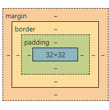
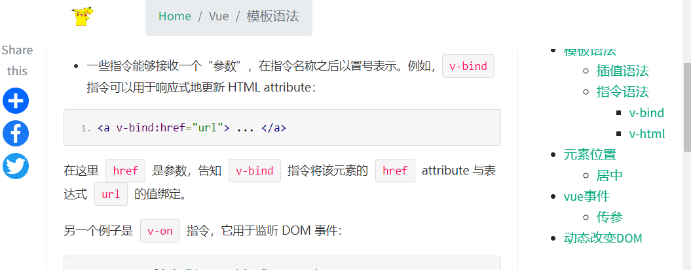
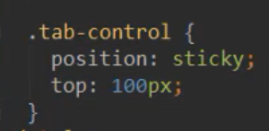
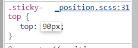
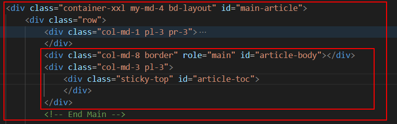
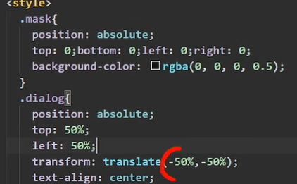

# padding margin

margin是外边距，即盒子与盒子之间的距离；而padding是内边距，是盒子的边（border）与盒子内部元素的距离。margin是用来隔开元素与元素的间距；padding是用来隔开元素与内容的间隔。margin使元素与元素互不相干；padding让内容（文字）与（包裹）元素之间有一段“呼吸距离”。



# 鼠标悬停

- 悬停变小手

```
.class {
		cursor: pointer;
	}
```

# rem px em转换

**1**. `px是固定的像素`，一旦设置了就无法因为适应页面大小而改变。

**2**. `em`和`rem`相对于`px`更具有灵活性，他们是相对长度单位，意思是长度不是定死了的，更适用于响应式布局**rem是相对于根元素**，这样就意味着，我们只需要在根元素确定一个参考值，这个参考值设置为多少，完全可以根据自己的需求来定。

**3**.`em`是相对于其**父元素**来设置字体大小的，一般都是以<body>的“font-size”为基准。这样就会存在一个问题，进行任何元素设置，都有可能需要知道他父元素的大小。而rem是相对于**根元素**<html>，这样就意味着，我们只需依赖根元素来计算的方式，就是先给予html元素一个font-size，然后我们所有的rem就根据这个font-size来计算。

例如:

```
html{ font-size:16px;}
```

那么我们这里的1rem就应该这么来计算：1x16=16px=1rem；浏览器默认为16px可能造成rem计算上的麻烦和多位小数，所以，我们也可以进行这种方式的初始化根元素：

```
html{
   font-size=62.5% //这里就是10/16x100%=62.5% 也就是默认10px的字号
}
```

# 固定元素位置

让右侧目录向下滑动时固定在右侧



`position:sticky`属性，





固定其距离顶部的距离，

DOM结构：



父节点与文章DIV处于同一级，有相同的顶部。

# 属性选择器

```css
[v-cloak] {
	display: none;
}
```

# 遮罩层+居中



# 布局设计

- IMG标签自适应

  ```css
  width: 100%;
  height: 100%;
  object-fit: cover;
  ```

- span行居中
  `span`标签是`inline`元素，默认不能设置高度。
  

  
