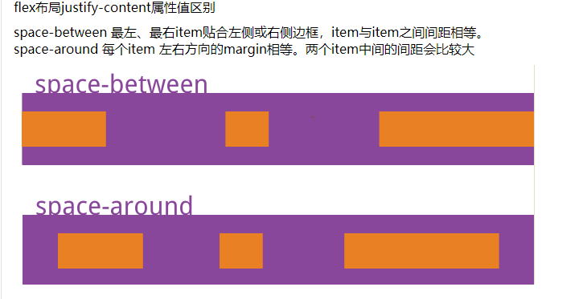
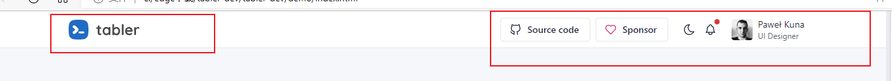

# 介绍

[【前端】如何利用 flex 实现前端弹性布局_哔哩哔哩_bilibili](https://www.bilibili.com/video/BV18V4y1W7gg?spm_id_from=333.1007.top_right_bar_window_history.content.click)

## justify-content

**横向中**，cell在父组件中如何布局。

- space-between, space-around

## align-content

**纵向中**，cell在父组件中如何布局。

## justify-items

横向中，cell中的内容与cell总空间的关系。

## align-items

纵向中，cell中的内容与cell总空间的关系。

- center
- strech 会把div高度拉伸

## 总结

`justify`横向，`align`纵向；`content`控制cell，`item`控制item在cell中的排列方式。

对子元素使用`justifySelf`和`alignSelf`相当于只对该子元素生效的`justify-item`和`align-item`。

# 效果

## 两个div块位于顶部的两端

这里分为了两个部分，只需要将他们共同的父级元素设为flex布局，将对齐方式设为between，
